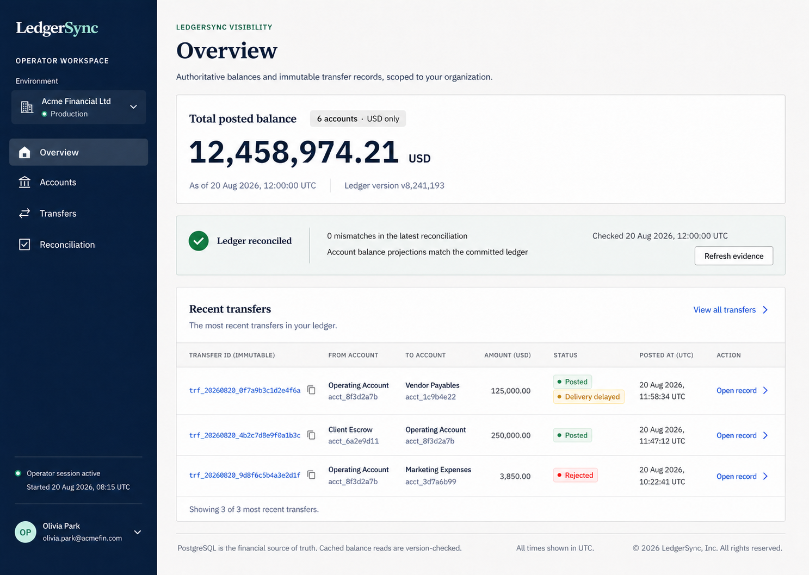
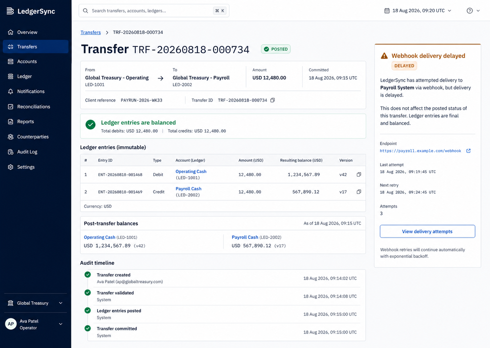

# LedgerSync Design Brief

**Product:** LedgerSync API-first, closed-loop ledger platform

**Primary interface:** Web-based operator console, supported by partner API documentation and API-first workflows

**Primary users:** Partner engineers integrating the API; finance and operations teams investigating accounts, transfers, reconciliation, and delivery issues

**Scope:** Production pilot for 2–3 design partners. One jurisdiction, one currency, internal same-currency transfers only.

**Design stance:** LedgerSync is not a consumer wallet and should not look like one. It is a calm, high-trust operational product whose interface helps people verify facts, trace decisions, and recover safely under pressure.

---

## 0. The design decision

LedgerSync should feel like a well-kept operations room: restrained, precise, legible, and quietly confident. A person opening it during a support escalation should be able to answer four questions immediately:

1. What happened?
2. Is the financial record complete and balanced?
3. What is the authoritative balance now?
4. What is the next safe action?

This brief intentionally replaces the present prototype’s generic card grid, bright blue primary action, exposed consistency jargon, and raw RYEW token. Those elements are useful for a learning demo, but they make a financial operations product feel experimental and expose implementation details users should never need to interpret.

The UI must make the permanent record prominent, make state unmistakable, and keep actions that could affect access or account status deliberate. It should never imply that a cached display, an asynchronous notification, or a dashboard visual is more authoritative than the committed ledger record.

---

## 0.1 Canonical visual target — operator overview

The selected overview direction is now the canonical implementation reference for **every application page and subpage**. Its shell, spacing, typography, document surfaces, status treatments, table density, and responsive transformations must remain consistent across Overview, Accounts, Account detail, Transfers, Transfer detail, and Reconciliation.

### Decisions locked by the canonical overview

1. **Persistent deep-navy operator rail:** 280 px on desktop, with tenant/environment context above a four-item investigation navigation and verified operator context at the bottom.
2. **Financial-document canvas:** a pale cool canvas supports crisp white documents, hairline dividers, square 3 px corners, and essentially no elevation. Components group evidence; they do not float as decorative cards.
3. **Editorial hierarchy:** page titles use a restrained old-style serif; statement balances use a bold tabular sans; navigation and explanations use a compact sans; identifiers, timestamps, versions, and aligned table amounts use mono.
4. **Navy structure, evidence green:** navy anchors navigation and the main information hierarchy; green is reserved for the `Sync` brand accent and verified/posted evidence. Amber remains attention, red remains confirmed rejection/error, and every state includes text and iconography.
5. **Exact-money alignment:** prominent totals and table amounts use tabular numerals, stable currency formatting, and right alignment. Every live amount includes an authoritative timestamp or an unavailable state.
6. **One shared status grammar:** `Posted`, `Delivery delayed`, `Rejected`, `Unavailable`, and `Pending evidence` use the same chip, icon, wording, and color rules everywhere.
7. **Responsive continuity:** the rail becomes a compact labelled top navigation on small screens; evidence keeps document order; tables scroll within their region; no financial context is hidden merely to fit the viewport.
8. **Signed-out truthfulness:** local unauthenticated mode renders only the login layer and no financial evidence. A newly authenticated local operator begins with an empty ledger; the interface never invents balances, reconciliation results, or transfer outcomes.

## 0.2 Supporting visual target — high-fidelity transfer detail

The earlier transfer-detail direction remains a supporting evidence-layout reference. It does not override the canonical overview shell or tokens above.

### Decisions now locked by the selected direction

1. **Document-like evidence layout:** a dark 248 px navigation rail frames a pale cool-gray canvas with white, lightly bordered evidence surfaces. The layout avoids a dashboard full of floating cards.
2. **Transfer fact hierarchy:** breadcrumb → transfer title/ID → `Posted` status → source-to-destination route, exact amount, and committed time. These facts appear before secondary metadata.
3. **Balanced ledger as the proof point:** a restrained green invariant band says “Ledger entries are balanced,” followed immediately by the two-row immutable debit/credit table. Users do not need to infer correctness from a total alone.
4. **Status separation:** `Posted` is deep green and remains visibly distinct from `Webhook delivery delayed` in amber. The delivery panel explicitly says the delay does not affect the posted financial record.
5. **Evidence, not controls, dominates:** the page has no oversized financial action. The delivery panel’s only prominent action is the safe, secondary `View delivery attempts` action.
6. **Precision typography:** identifiers, monetary columns, and balance versions use the monospace evidence treatment; account names and explanatory copy remain in the primary human-readable sans serif.
7. **Contained density:** transfer summary, balanced proof, ledger entries, post-transfer balances, and audit timeline are visible in one desktop viewport wherever typical data allows. Details that would make the page noisy move to drawers or linked views.

### Implementation guardrails from the visual reference

- Retain the exact semantics shown: a posted transfer remains posted even when delivery is delayed.
- Keep the ledger table to one grouped document surface with subtle dividers; do not nest each ledger entry in a separate card.
- Do not copy incidental generated labels or example values as product requirements. The source defines hierarchy, spatial composition, status treatment, and visual language; the PRD and API contract define real data/permissions/actions.
- The reference is desktop-first at 1440 × 1024. The responsive rules in Section 9 govern its tablet and mobile transformations.

---

# 1. Design principles

## Principle 1 — Evidence before decoration

Every important visual element must help a user verify a financial fact, locate context, or choose a safe next action. Transfer IDs, posting pairs, timestamps, account status, balance version, and reconciliation results are first-class interface content—not buried technical metadata.

**Why:** LedgerSync earns trust when a support operator can explain a number without switching tools or asking engineering to run a query. A polished but opaque dashboard is actively harmful in this domain.

**Rules:**

- Show the current posted balance, currency, and `as of` timestamp together.
- Show a transfer and its debit/credit ledger entries together on the detail page.
- Show status as text plus color plus icon/shape; never by color alone.
- Use stable identifiers in a copyable, monospace treatment; never truncate the only visible identifier without an accessible full-value affordance.
- Put audit and reconciliation evidence one navigation step away from every financial record.

## Principle 2 — Calm under failure

Failures are normal in distributed financial systems. The UI must make them understandable and recoverable without making the user guess whether money moved.

**Why:** A timeout after a request is sent is the moment trust is won or lost. “Something went wrong” is insufficient; users need plain language, a reference ID, and a safe recovery path.

**Rules:**

- Never call a transfer “failed” merely because the client did not receive a response. Say: “We could not confirm the result yet. Retrying with the same request is safe.”
- Distinguish `Posted`, `Rejected`, `Delivery delayed`, `Temporarily unavailable`, and `Needs investigation`; do not create invented vague states such as “processing” without a genuine business state.
- Keep error messages close to the failed action and retain entered filter/form context.
- Use amber for attention and red only for a confirmed error, blocked action, or high-severity exception.
- Make safe retry the primary recovery action where idempotency guarantees it; never encourage users to submit a fresh duplicate transfer.

## Principle 3 — Deliberate control, immediate orientation

The console should be quick to scan and difficult to misuse. Read tasks should be fast; account state changes, credential changes, and webhook replay must require deliberate confirmation and create visible audit evidence.

**Why:** The most common task is investigation, not transaction creation. Over-prioritizing a “Send money” button would confuse LedgerSync with a consumer wallet and increase operational risk.

**Rules:**

- Default the console to investigation: accounts, transfers, reconciliation, and activity.
- Keep financial transfer creation API-first in the pilot. If an internal dashboard transfer form is enabled for a specific partner, isolate it behind an explicit permission and guarded flow.
- Use progressive disclosure: overview first; expanded evidence second; raw structured details last.
- Confirm high-impact actions with a summary of what changes, why, and who will be recorded as actor.
- Keep global search and tenant/environment context continuously visible on desktop.

---

# 2. Visual direction

## Mood

**Quiet precision, not fintech spectacle.** The product should feel closer to a premium audit workspace, a modern air-traffic console, or a finely designed developer tool than a neobank app. It uses generous whitespace, purposeful grid alignment, strong typography, disciplined color, and data that looks stable rather than animated.

The emotional sequence is:

- **At first glance:** “This is serious and comprehensible.”
- **While working:** “I can find proof quickly.”
- **During an incident:** “The product is telling me what is known, what is not, and what to do next.”

## Reference qualities

Use these qualities as inspiration, not as visual templates to copy:

- **Financial statements:** hierarchy, alignment of numbers, clear period/context labels, restrained use of emphasis.
- **A high-quality developer console:** dense but readable tables, excellent filter states, copyable IDs, explicit environment labels, useful empty states.
- **A safety-critical control room:** clear status tiers, quiet default state, unmistakable exception surfaces, no decorative distraction.
- **Editorial systems:** large, well-spaced page titles; strong readable sans serif; a tiny amount of mono type for immutable facts.

## What to avoid

- Neon gradients, glassmorphism, crypto aesthetics, coin illustrations, faux bank vault imagery, excessive blue-glow effects, and “money flying” animation.
- A rainbow of status colors. Color must communicate a small, stable semantic vocabulary.
- Oversized rounded cards that turn every datum into a separate tile. Dense investigation screens need compact groups and tables.
- A consumer-style bottom navigation as the primary desktop navigation pattern.
- Balance numerals that animate rapidly or count up/down. Financial values should settle immediately and retain their context.
- Hidden status semantics, vague toast-only failures, surprise destructive actions, or raw internal tokens/events exposed to normal users.
- Generic “dashboard widgets” with no relationship to a user’s actual support and reconciliation tasks.

## Illustration and imagery

The operator console needs no decorative photography or hero illustration. Data, diagrams, and clear empty states are more credible than stock imagery. If a public marketing page is later designed, use an abstract but precise visual language—ledger lines, balanced pairs, timestamped records—not cash, cards, or people holding phones.

---

# 3. Design tokens

## 3.1 Color system

The selected palette is built around deep navy, quiet paper, cobalt actions, and one evidence green. This matches the chosen reference and makes the product feel like a controlled financial record rather than a generic SaaS dashboard. All semantic colors must meet WCAG AA contrast for their intended text usage.

| Token | Hex | Usage | Rationale |
|---|---:|---|---|
| `ink-950` | `#0B1E3C` | Main text and highest-emphasis icons | Near-black navy carries authority without pure-black harshness. |
| `ink-800` | `#253652` | Secondary headings and strong supporting text | Maintains a disciplined blue-gray hierarchy. |
| `ink-600` | `#5B6B86` | Body metadata and explanatory copy | Quiet supporting text that remains legible on the pale canvas. |
| `ink-400` | `#65728A` | Disabled and non-essential metadata only | Remains readable at small sizes on the selected canvas. |
| `canvas` | `#F7F8FA` | Application background | A cool paper tone matches the selected reference without glare. |
| `surface` | `#FFFFFF` | Page panels, tables, dialogs | Gives financial evidence a clean “document” surface. |
| `surface-subtle` | `#F2F5F1` | Selected rows, disabled form fields, grouped evidence | Provides grouping without over-carding. |
| `border-subtle` | `#D8DFDA` | Default dividers | Visible enough to structure dense records without adding weight. |
| `border-strong` | `#B9C4BD` | Document outlines and active grouping | Used sparingly for important structural edges. |
| `rail` | `#071A36` | Persistent desktop navigation | The darkest navy brand surface anchors tenant and operator context. |
| `action-700` | `#155EC5` | Primary buttons, links, active controls | Cobalt keeps interactive affordances distinct from financial success. |
| `action-50` | `#EAF2FF` | Selected rows and low-emphasis action backgrounds | Keeps selection quiet and legible. |
| `success-700` | `#087443` | Posted/success text and icons | Deep green supports proof without celebration. |
| `success-50` | `#EAF8F0` | Posted badge/evidence background | Quiet confirmation background. |
| `warning-800` | `#9B6418` | Attention and response-unknown text/icons | Dark amber clearly means attention, not financial failure. |
| `warning-50` | `#FBF2DF` | Delayed/attention background | Used for recoverable operational attention. |
| `danger-700` | `#A1463B` | Rejected/error text and destructive action | A restrained brick red reserved for confirmed negative outcomes. |
| `danger-50` | `#F7E9E7` | Error/rejection background | Keeps error evidence readable rather than visually aggressive. |
| `focus-ring` | `#B27100` | 3 px keyboard focus ring | Dark amber measures 4.00:1 against white documents and 4.34:1 against the navy rail, so the same focus token works across both surfaces. |

### Semantic usage rules

- **Posted:** `success-700` text/icon on `success-50`; label always says “Posted”.
- **Rejected:** `danger-700` text/icon on `danger-50`; label always says “Rejected”.
- **Attention:** `warning-800` text/icon on `warning-50`; label states the reason, e.g. “Webhook delivery delayed”.
- **Unavailable:** `ink-800` text with `surface-subtle`/border and explicit “Temporarily unavailable” copy. Do not use red unless an error is confirmed.
- **Neutral/information:** use ink tones or `info-700`; do not overload blue as success.
- Do not use light semantic background colors as the only visual signal. Pair them with an icon, label, and text explanation.

## 3.2 Typography

### Font choices

- **Display font: Iowan Old Style / Palatino fallback stack.** Use for page titles and major balances only. The editorial form makes balances feel like controlled statement facts, not animated consumer metrics.
- **Primary UI font: Inter/system sans stack.** Its compact shapes and clear numerals suit the selected rail, tables, and dense operational explanations without requiring a network font dependency.
- **Evidence/identifier font: SFMono/Consolas fallback stack.** Use only for transfer IDs, account IDs, event IDs, timestamps, versions, and aligned monetary amounts in tables.
- **Fallback stacks:** `Inter, ui-sans-serif, system-ui, -apple-system, "Segoe UI", sans-serif`; `"Iowan Old Style", "Palatino Linotype", Palatino, Georgia, serif`; `SFMono-Regular, Consolas, "Liberation Mono", monospace`.

Do not use monospace for whole paragraphs or page titles. It is an evidence accent, not the product’s voice.

### Type scale

| Token | Size / line height | Weight | Usage |
|---|---|---:|---|
| `display` | 32 / 40 px | 600 | Page title on desktop; use only once per page |
| `h1` | 24 / 32 px | 600 | Major section title / mobile page title |
| `h2` | 18 / 26 px | 600 | Panel title, detail-section heading |
| `h3` | 15 / 22 px | 600 | Subsection heading, card label when needed |
| `body-lg` | 16 / 24 px | 400 | Introductory text, key explanatory copy |
| `body` | 14 / 20 px | 400 | Default UI text, table row content |
| `body-strong` | 14 / 20 px | 600 | Important table values, emphasized labels |
| `label` | 12 / 16 px | 600, 0.04em tracking | Form labels, data labels, table headers |
| `meta` | 12 / 16 px | 400 | Supporting timestamps and secondary information |
| `mono` | 12–14 / 20 px | 500 | IDs, versions, exact amount columns |
| `amount-xl` | 28 / 34 px | 600 | Account current balance on detail view |
| `amount-lg` | 20 / 26 px | 600 | Transfer amount/detail header |

**Numeral rule:** use tabular figures (`font-variant-numeric: tabular-nums lining-nums`) for amounts, dates, versions, and table columns. Align monetary figures right. This makes it easier to spot a mismatch in a list of values.

## 3.3 Spacing and layout

Use a 4 px base unit. The scale is deliberately compact enough for data work but leaves breathing room around high-importance content.

| Token | Value | Typical use |
|---|---:|---|
| `space-1` | 4 px | Icon-to-label gap, compact inline spacing |
| `space-2` | 8 px | Field-label gap, badge internal padding |
| `space-3` | 12 px | Related form controls, table cell vertical padding |
| `space-4` | 16 px | Standard component gap, card/panel padding on mobile |
| `space-5` | 20 px | Form section gap |
| `space-6` | 24 px | Panel padding, page subsection gap |
| `space-8` | 32 px | Major section separation |
| `space-10` | 40 px | Page title-to-content space |
| `space-12` | 48 px | Large desktop page separation |

**Grid:** desktop uses a persistent 280 px rail and a 1080 px maximum evidence column with fluid outer gutters. Detail pages use an approximately 8/4 main-evidence/context split. Investigation tables may span the full evidence width. Mobile uses a single column with 14–20 px side gutters and a labelled horizontal navigation bar.

## 3.4 Radius, borders, and shadows

| Token | Value | Usage |
|---|---:|---|
| `radius-sm` | 3 px | Buttons, inputs, compact controls and document surfaces |
| `radius-md` | 3 px | Standard panels; do not visually distinguish from small surfaces |
| `radius-lg` | 6 px | Major modal or popover only |
| `radius-pill` | 999 px | Status badges only; never for primary buttons |
| `border-default` | 1 px `border-subtle` | Tables, panels, form controls |
| `shadow-1` | none | Standard application surfaces rely on borders and spacing |
| `shadow-2` | `0 8px 24px rgba(18,46,43,.12)` | Modal/dialog only |

LedgerSync should rely on borders and spacing before shadows. Heavy shadows make operational data feel like a marketing-card collage.

## 3.5 Iconography and motion

- Use Phosphor icons with 16–20 px default size. Regular weight supports navigation and actions; fill weight marks selected navigation and confirmed state. Icons support labels; they do not replace them.
- Use check-in-circle for posted, x-in-circle for rejected, triangle/exclamation for attention, clock for pending delivery, shield for access/audit, and copy icon for IDs.
- Motion is functional only: 120–180 ms opacity/transform transitions for menus, drawers, button state; skeleton shimmer only if it does not distract. Respect `prefers-reduced-motion` by removing shimmer and nonessential movement.
- No animated counters, confetti, spinning money symbols, or persistent pulsing alerts. A new critical reconciliation issue may use a single attention animation on arrival, then remain still.

---

# 4. Screen inventory

## 4.1 Pilot operator console

| Screen / route concept | Purpose | Primary audience | Pilot priority |
|---|---|---|---|
| Sign in | Start SSO/OIDC authentication | All dashboard users | Must have |
| Authentication callback / session recovery | Resolve return path, expired session, access issue | All | Must have |
| Home / Operations overview | Orient user to tenant health, recent activity, exceptions and shortcuts | Operator, tenant admin | Must have |
| Accounts | Search, filter and inspect tenant accounts | Operator, read-only | Must have |
| Account detail | Explain one account’s status, current balance, history and related evidence | Operator, developer | Must have |
| Transfers | Search/filter all transfers and identify exceptions | Operator, developer | Must have |
| Transfer detail | Explain a single transfer, its postings, audit trail and delivery state | Operator, developer | Must have |
| Ledger entry detail (drawer) | Inspect one immutable posting without losing transfer context | Operator, read-only | Must have |
| Reconciliation overview | See latest health, historical runs, and open mismatches | Operator, tenant admin | Must have |
| Reconciliation exception detail | Investigate a mismatch and evidence/ownership status | Operator, tenant admin | Must have |
| Webhooks | Configure and monitor endpoint delivery | Tenant admin, developer | Must have |
| Webhook endpoint detail | View endpoint health, delivery attempts, test/replay controls | Tenant admin, developer | Must have |
| API credentials | Create, rotate, revoke, and inspect scoped partner credentials | Tenant admin, developer | Must have |
| Credential created (one-time reveal) | Safely reveal a new credential exactly once | Tenant admin, developer | Must have |
| Team & access | View/manage dashboard users and roles | Tenant admin | Must have |
| Audit log | Search sensitive actions and access events | Tenant admin, operator | Must have |
| Settings / tenant profile | View environment, tenant metadata, system status and allowed configuration | Tenant admin | Must have |
| Global search results | Cross-link accounts, transfers, reconciliations and audit events | Operator | Should have |
| Forbidden / not found | Explain access boundary without leaking record existence | All | Must have |
| System unavailable / maintenance | Give truthful dependency status and recovery guidance | All | Must have |

## 4.2 API documentation and partner experience

The partner API is the product. Its documentation must be treated as a designed experience even if hosted separately from the dashboard.

| Surface | Purpose | Pilot priority |
|---|---|---|
| API overview | Explain closed-loop scope, environments, credentials, money representation and first successful request | Must have |
| Quickstart | Let an engineer create test accounts, submit one idempotent transfer, verify balance and receive webhook | Must have |
| Transfer reference | Define request/retry/status/error semantics precisely | Must have |
| Balance consistency guide | Explain authoritative reads/minimum version behavior in user-facing language | Must have |
| Webhook guide | Explain signing, duplicate delivery, ordering and replay | Must have |
| Error and recovery guide | Explain timeout, idempotency, rejection, and temporary unavailability | Must have |
| API changelog | Publish versioned, non-surprising contract evolution | Must have |

## 4.3 Explicitly not a pilot screen

- Consumer wallet home, transaction feed, onboarding, profile, payment card, cash-out, bank linking, FX, or a broad “send money” interface.
- Public self-service account creation and billing.
- Simulation/fault controls in production navigation. These belong to local development/authorized non-production diagnostics only.

---

# 5. User flows

## Flow A — Operator signs in and orients to an issue

**Goal:** enter the correct tenant/environment and find the highest-priority operational work without reading a wall of metrics.

1. User opens LedgerSync and sees the sign-in page with product name, one-line trust promise, and “Continue with SSO” action.
2. User authenticates through OIDC provider; on return the console validates session/role.
3. If user belongs to one tenant, land on Operations overview. If multiple tenants are permitted, show a secure tenant chooser with environment badge before any data is loaded.
4. Overview leads with an exception strip: reconciliation mismatch, delivery backlog, or platform availability issue only when present.
5. User uses global search or a high-priority “Review mismatches” / “View recent transfers” action.
6. Every transition retains tenant/environment context in header and accessible page title.

**Success:** within one interaction after login, an operator can start investigating the relevant problem and always knows which tenant/environment they are viewing.

## Flow B — Partner engineer makes a safe transfer through the API

**Goal:** create one exact transfer and recover correctly after a client timeout.

1. Engineer reads API quickstart and confirms sandbox environment/credential.
2. Engineer creates or chooses source/destination accounts in sandbox.
3. Engineer submits `POST /transfers` with an exact amount string, same currency, and a generated `Idempotency-Key`.
4. On `201 Posted`, SDK/response displays transfer ID, committed timestamp, and post-transfer balance/version data.
5. If network response is lost, documentation and SDK surface: “Do not submit a new transfer. Repeat the same request with the same idempotency key.”
6. Replayed response returns the original transfer result. Engineer retrieves transfer detail or balances to verify.
7. `transfer.posted` webhook arrives; engineer validates signature and deduplicates event ID.

**Success:** a partner engineer never needs to infer whether a timeout produced a second transfer.

## Flow C — Operator finds an account and confirms its current balance

**Goal:** answer a support question such as “Why does this customer have this balance?”

1. Operator opens Accounts or uses global search for internal account ID/external reference.
2. System shows matching accounts with status, currency, posted balance, last movement, and type.
3. Operator selects an account; detail header displays account identity, status, `Posted balance`, currency, balance version and `as of` timestamp.
4. Operator scans recent transfer history or filters date/direction/status.
5. Operator opens a relevant transfer, then sees the linked debit/credit postings and audit timeline.
6. If the balance read is temporarily unavailable, preserve account context and display the last known record only if explicitly labeled historical; otherwise display a recovery panel with retry and correlation ID.

**Success:** the user can trace the balance to immutable postings without confusing cache freshness with financial truth.

## Flow D — Operator investigates a transfer inquiry

**Goal:** determine whether a transfer posted, whether it was duplicated, and whether the recipient/system was notified.

1. Operator opens Transfers and enters transfer ID, client reference, account ID, or masked idempotency key in search.
2. Results show status, amount, source/destination, timestamp, and client reference. Status badge is textual and semantic.
3. Operator opens transfer detail. The summary answers “what moved, when, and between which accounts.”
4. The ledger section shows exactly two posting rows, equal and opposite in amount/currency, with a visible “Balanced” invariant label.
5. The audit timeline shows creation, result, replay/conflict attempts if any, and the actor/request ID.
6. Webhook section shows delivery status. If delayed, the transfer remains clearly `Posted`; the delivery issue is distinct.
7. Operator copies safe reference IDs or exports a permitted record to provide support evidence.

**Success:** no one mistakes a webhook delay or client timeout for a failed financial transfer.

## Flow E — Tenant admin rotates an API credential

**Goal:** replace a partner integration credential without causing outage or exposing the secret permanently.

1. Admin opens API credentials and selects active credential.
2. Detail shows name, scopes, environment, last used, expiry, creator, and status—never the raw secret.
3. Admin chooses “Create replacement,” selects scopes/expiry, and confirms the impact statement.
4. System creates a new credential; the secret is shown once in a focused one-time-reveal dialog with copy action and explicit warning that it cannot be viewed again.
5. Admin records it in their approved secret store and confirms “I stored this securely.”
6. Both credentials remain active during configured overlap. Activity panel shows which key is in use.
7. Admin revokes old credential after partner deployment; confirmation asks for a reason and shows potential impact.
8. Each step appears in audit log.

**Success:** rotation is safe, explicit, and auditable without turning the dashboard into a secret vault.

## Flow F — Operator handles a reconciliation mismatch

**Goal:** ensure a mismatch is treated as an incident, not as a number someone can manually edit.

1. System detects mismatch and displays a high-priority exception banner on overview plus alerting outside UI.
2. Operator opens Reconciliation; top summary states run time, scope, mismatch count, and whether financial operations are subject to an incident policy.
3. Operator opens mismatch detail; sees account, materialized posted balance, independently recomputed ledger balance, delta, run/version context, and linked account/transfer evidence.
4. Operator assigns investigation owner and adds an incident reference. This is an audited, non-financial action.
5. UI presents runbook steps and a “Do not edit balance” callout. It may link to a controlled compensating-entry procedure but cannot create a direct correction.
6. After resolution, operator records resolution type, evidence, approver, and linked compensating transfer if applicable.
7. Reconciliation run remains immutable; exception status changes are historical/audited.

**Success:** every mismatch has a visible owner, evidence trail, and safe resolution path.

## Flow G — Developer resolves delayed webhook delivery

**Goal:** understand delivery status and safely replay without duplicating financial movement.

1. Developer opens Webhooks and sees endpoint health, delivery success rate, current failed/delayed count, and last successful delivery.
2. Developer selects endpoint, then a delivery event.
3. Detail separates immutable event content from mutable delivery attempt history.
4. If endpoint is repaired, developer selects “Replay delivery.” Confirmation says this resends the same event ID and recipients must deduplicate it; it does not repeat the transfer.
5. System records replay request, queues delivery from existing outbox event, and shows updated attempt timeline.
6. Failed endpoint/secret replacement paths provide explicit security guidance and audit record.

**Success:** replay is visibly delivery-only and cannot be confused with re-posting a transfer.

## Flow H — Account is frozen for a legitimate operational reason

**Goal:** prevent further movement without changing history.

1. Authorized tenant admin opens account detail and selects “Freeze account.”
2. Confirmation sheet explains that new incoming and outgoing internal transfers will be rejected in the pilot, existing posted records will not change, and a reason is required.
3. User enters reason, confirms account identifier, and submits.
4. UI returns to account detail with `Frozen` status, timestamp, actor, and audit entry visible.
5. Transfer attempts against the account show a clear rejection code/message. No ledger entries are added.
6. Unfreeze, if allowed by policy, follows a similarly audited explicit action; close remains separately constrained.

**Success:** operational containment is clear and never looks like a balance correction.

---

# 6. Per-screen layout

## 6.1 Shared application shell

### Desktop (>= 1200 px)

- **Left navigation rail, 248 px:** LedgerSync wordmark; tenant/environment switcher; primary navigation; bottom user menu/help/status.
- **Top utility bar, 64 px:** global search, date/time context if relevant, current environment badge, notifications/exception count, user menu.
- **Main canvas:** 32 px horizontal padding; max 1440 px centered content; page header remains in document flow rather than sticky unless a table/filter need requires sticky controls.
- **Critical exception strip:** directly below utility bar when relevant. It must not be a permanent red banner when all systems are healthy.

### Primary navigation order

1. Overview
2. Accounts
3. Transfers
4. Reconciliation
5. Webhooks
6. Audit log
7. Settings (role-based)

This order follows the operator’s mental model: orient, find account, investigate movement, verify system integrity, investigate delivery, inspect accountability, configure.

### Global shell components

- Tenant/environment switcher with visual environment label: `Sandbox` in neutral blue, `Production` in dark ink outline plus text; never color alone.
- Global search command input: supports account IDs/references, transfer ID/client reference, audit correlation ID; results grouped by entity type.
- Status center: only alerts requiring user awareness; ordinary success does not create notification noise.
- Breadcrumbs on deep detail pages: e.g. `Transfers / TRF-… / Ledger posting`.

## 6.2 Sign in

**Purpose:** authenticate through company SSO with clarity and no marketing distraction.

**Layout:** centered 420 px panel on `canvas`, left-aligned wordmark inside panel, `h1` “Sign in to LedgerSync,” brief copy “Access your organization’s ledger operations workspace,” SSO button, support/help link, security note “Your organization controls access through single sign-on.”

**Primary action:** `Continue with SSO`.

**Components:** logo lockup, primary button with provider-neutral icon only when provider is known, inline support link, compact environment label when non-production.

**Hierarchy:** product name → reason to sign in → action → support. No password form in pilot, no social sign-in, no decorative illustration.

## 6.3 Authentication callback / session recovery

**Purpose:** resolve authentication state without leaving the user in a blank page.

**Layout:** same shell as sign-in; concise status panel with progress only while redirect is active.

**Primary action:** context-dependent: `Continue`, `Sign in again`, or `Contact your administrator`.

**Components:** status icon, explanatory message, retry button, correlation/support reference if an unexpected failure occurred.

**Copy examples:**

- Expired: “Your session ended to protect this workspace. Sign in again to continue.”
- Not authorized: “You signed in successfully, but you do not have access to this LedgerSync organization.”

## 6.4 Operations overview

**Purpose:** orient a user to operational health and give a credible starting point for investigation.

**Layout:**

1. Page header: `Operations overview`, tenant label, current date/time zone context, no gratuitous greeting.
2. Exception strip only when action is required: reconciliation mismatch, severely aged outbox, degraded dependency, or access/security notice.
3. Four compact metric blocks: posted transfers today, active accounts, reconciliation status, webhook delivery health. Each includes timeframe/as-of label and links to detail—not decorative charts.
4. Main 8-column panel: Recent transfers table with ID, amount, source → destination, status, committed time.
5. Side 4-column panel: “Needs attention” list; latest reconciliation run; quick links to account/transfer search.
6. Bottom full-width panel: “Recent audit activity” or “Integration health” depending on role.

**Primary action:** `Search records`; secondary contextual actions `View reconciliation` and `View all transfers`.

**Components:** exception banner, metric block, compact status badge, data table, empty-state pattern, link button, time/as-of label.

**Design choice:** no large money total hero. Aggregate balances are often misleading without account scope and are not the highest-value operational metric.

## 6.5 Accounts list

**Purpose:** find the right account quickly and identify its current operational state.

**Layout:**

1. Header: `Accounts`, count, small supporting statement “Balances shown are posted values.”
2. Filter bar: search by account ID/external reference; status; account type; currency; created date; reset filters. Keep filters visible rather than hidden behind a generic funnel on desktop.
3. Active filter chips with clear removal.
4. Full-width data table: Account, external reference, type, status, currency, posted balance, last movement, updated/as-of, row action.
5. Sticky table header for long results; right-align monetary values; left-align names/references.
6. Pagination/cursor control and result count in footer.

**Primary action:** `Create account` only for roles/policies that allow it; otherwise no primary button and search becomes the main action.

**Components:** search input, select/filter combobox, status badge, data table, currency amount, relative-plus-absolute time, row menu, skeleton rows.

## 6.6 Create account (sheet or page)

**Purpose:** create an auditable, correctly scoped ledger account without creating money directly.

**Layout:** right-side drawer on desktop, full-screen page on mobile. Fields: account type, display name, external reference, currency fixed to pilot value, permitted metadata. Show immutable/future constraints below form.

**Primary action:** `Create account`.

**Secondary action:** `Cancel`.

**Guardrail copy:** “Creating an account does not create a balance. Opening balances are posted through an auditable ledger transaction.”

**Components:** form field, helper text, inline validation, read-only currency field, confirmation toast with account link.

## 6.7 Account detail

**Purpose:** make a single account’s current state and history explainable at a glance.

**Layout:**

1. Breadcrumbs and account header: display name/external reference, copyable account ID, status badge, account type, currency.
2. Primary evidence band: `Posted balance` in `amount-xl`, currency, `As of [timestamp]`, `Balance version [n]`, and a compact information tooltip explaining posted balance. This band is surface-level, not a giant promotional card.
3. Action group: `Freeze account` / `Unfreeze` / `Close account` only if authorized and valid; secondary `Copy account ID`; no financial “edit balance.”
4. Main 8-column section: Transfer history table with filters (direction, status, date) and row link.
5. Side 4-column section: Account facts, status history, latest reconciliation outcome, related system account context where permitted.
6. Lower full-width section: Ledger history with debit/credit direction, amount, journal ID, transfer ID, occurred time. Offer “View all ledger entries.”
7. Audit timeline in collapsed panel near bottom, expanded on demand.

**Primary action:** contextual account-state action only. The default investigation task has no button competing with balance/history.

**Components:** copyable ID, status badge, amount display, definition list, tabs only if data is sufficiently dense; recommended desktop tabs: `Activity`, `Ledger`, `Audit`. On mobile, use segmented navigation with clear labels.

## 6.8 Transfers list

**Purpose:** locate and triage transfers across the tenant.

**Layout:**

1. Header: `Transfers`, total/result count, plain-language description.
2. Search/filter row: transfer ID, client reference, account, masked idempotency key, status, date range, amount range. Put high-frequency filters in row; move advanced filters to a labeled “More filters” dialog only on narrow screens.
3. Summary chips: `Posted`, `Rejected`, `Webhook delivery delayed` count, not a confusing chart.
4. Data table: status, amount/currency, source, destination, client reference, committed at, transfer ID, delivery indicator.
5. Use status column first; use right-aligned amount; show source → destination in one readable line plus IDs on secondary line.

**Primary action:** none by default. Optional `Create transfer` must appear only for a permitted internal operator role and use the guarded transfer flow; it is never globally dominant.

**Components:** data table, status badge, transfer route cell, amount, filters, saved-view selector (later), empty state.

## 6.9 Transfer detail

**Purpose:** be the definitive human-readable explanation of a transfer.

**Layout:**

1. Breadcrumbs and header: `Transfer TRF-…`, status badge, committed timestamp, copyable ID.
2. Transfer summary surface: source account → destination account, `amount-lg`, currency, client reference, actor/integration, idempotency key masked by default, correlation ID. Label the top status clearly: `Posted` or `Rejected`.
3. If posted, a prominent but restrained invariant line: check icon + “Ledger entries are balanced.” It links to ledger section.
4. Main 8-column content:
   - **Ledger entries:** exactly two rows, journal ID, direction, account, amount, currency, occurred at. Equal and opposite values visually align.
   - **Audit activity:** chronological event timeline; include idempotency replay/mismatch evidence as appropriate.
5. Side 4-column content:
   - **Balances after posting:** source/destination balances, version, as-of time.
   - **Notification delivery:** published/delayed/failed delivery count and link.
   - **Technical references:** request/correlation IDs, schema version, safe copy actions.
6. Rejected state replaces posting section with reason code/explanation and a statement that no ledger entries were created.

**Primary action:** `Copy support summary` (a safe human-readable summary) for investigation. Secondary actions are `View source account`, `View destination account`, and role-gated `Replay webhook delivery` when applicable.

**Components:** transfer route, posting-pair table, invariant chip, audit timeline, masked-value control, copy button, disclosure panel, webhook delivery mini-list.

## 6.10 Ledger entry detail drawer

**Purpose:** inspect a posting precisely without taking the user away from transfer/account context.

**Layout:** title `Ledger entry`, immutable badge, amount/direction, definition list with journal/transfer/account IDs, currency, occurred/created time, posting sequence, audit/source reference. Footer actions: copy IDs, open related transfer/account.

**Primary action:** none. This is evidence, not an editable record.

**Components:** drawer, immutable lock label, definition list, copyable code, relationship links.

## 6.11 Reconciliation overview

**Purpose:** clearly show whether projections agree with ledger records and direct operators to exceptions.

**Layout:**

1. Header: `Reconciliation`, latest run status badge, `Last completed [time]`, coverage details.
2. If clean: compact success panel “All checked accounts agree with their ledger postings.” Avoid a giant green success screen.
3. If mismatch exists: high-priority amber/red exception panel with mismatch count, oldest exception, explicit “Investigation required,” and `View mismatches` primary action.
4. Run history table: run ID, started/completed, account coverage, mismatch count, status, code/schema version, row action.
5. Open exception table beneath or tabbed: account, projection, recomputed ledger value, delta, detected time, owner, investigation state.

**Primary action:** `View mismatches` when any exist; otherwise `View latest run`.

**Components:** health summary, status badge, reconciliation run table, delta amount with sign semantics, owner assignment, runbook link.

## 6.12 Reconciliation exception detail

**Purpose:** guide a controlled investigation and prevent unsafe manual correction.

**Layout:**

1. Header: account/reference, `Mismatch detected`, severity badge, owner and incident link.
2. Comparison panel: `Projection balance` vs `Recomputed ledger balance` with exact delta, currency, version/watermark/time.
3. Evidence tabs/sections: affected account, relevant ledger range, related transfers, latest deployments/migrations, prior exception history.
4. Side panel: investigation checklist and runbook link; status update/assign owner controls; no direct financial mutation.
5. Resolution panel appears only when resolving: resolution category, evidence link, approver, linked compensating journal/transfer if applicable, notes.

**Primary action:** `Assign investigation` if unowned; otherwise `Update investigation`. Never “Fix balance.”

**Components:** comparison card, amount delta, owner picker, incident link, evidence link, resolution form, persistent do-not-edit callout.

## 6.13 Webhooks list and endpoint detail

**Webhooks list layout:** header/actions `Add endpoint`; table columns endpoint name/domain, status, events, last success, failures, secret rotation state, row action. Do not display full URL query tokens or secret data.

**Endpoint detail layout:** header with endpoint status; configuration definition list; delivery health metrics; deliveries table (event ID, transfer, result, attempts, last attempt, next retry); event/delivery drawer; security/rotation section; audit timeline.

**Primary action:** `Add endpoint` on list; `Replay delivery` for a selected delivery after explicit confirmation on detail; `Rotate signing secret` is a separate guarded action.

**Components:** endpoint status badge, domain-safe display, delivery table, replay confirmation dialog, one-time secret reveal, delivery attempt timeline.

## 6.14 API credentials list and one-time credential reveal

**Credentials layout:** header `API credentials`, note “Secrets are shown only once when created.” Table: name, environment, scopes, created by, last used, expiration, status, row menu. Detail drawer includes activity/audit but no raw secret.

**Create/replacement layout:** a short form for name, scopes, environment (read-only if context fixed), expiry. Confirmation summary explicitly lists effects. On creation show a high-contrast monospace secret field, copy button, one-time warning, acknowledge checkbox, and close action only after acknowledgement/copy reminder.

**Primary action:** `Create credential` / `Create replacement`.

**Destructive action:** `Revoke credential`, danger button only in confirmation dialog after typing/pasting credential name or final characters. Explain immediate integration impact.

## 6.15 Team & access

**Purpose:** manage dashboard access without conflating human roles and API credentials.

**Layout:** users table (name, SSO identity/email if allowed, role, last active, status); role explanation side panel; invitations/access-change drawer. Show platform support access separately with time-bound expiry and approval source.

**Primary action:** `Grant access` for tenant admin. Every privilege change requires a role summary, confirmation, and audit event.

## 6.16 Audit log

**Purpose:** let authorized users answer who did what, when, and to which record.

**Layout:** filterable event table: time, actor, action, target, outcome, correlation ID, source/session context. Detail drawer shows sanitized metadata and related entity links. Filters include actor, action type, outcome, target ID, date range, and correlation ID.

**Primary action:** none; search/filter is the main action.

**Design rule:** audit log is readable and stable, but it is not a noisy activity feed. Use dense rows, monospaced IDs, and clear event verbs.

## 6.17 Settings, not-found, forbidden, and system unavailable

- **Settings:** tenant identity, selected environment, currency/jurisdiction information, system account visibility where permitted, retention policy link, integration configuration. Avoid a miscellaneous dumping ground; each setting has a clear owner.
- **Not found:** “This record is unavailable or you do not have access to it.” Offer return to previous list/search. Do not disclose cross-tenant existence.
- **Forbidden:** explain insufficient role/scope and how to request access; include support reference.
- **System unavailable:** show what is unavailable, what is still safe to do, whether transfers may be affected, next retry time if known, and correlation/status reference. Never invent recovery time.

---

# 7. Component library

The library should be built from a small set of highly reliable primitives. Components that display financial facts must accept structured data types—not preformatted strings wherever possible—so formatting, localization and accessibility stay consistent.

## 7.1 Foundations

| Component | Variants | Required states / notes |
|---|---|---|
| App shell | Desktop rail, tablet compact rail, mobile top bar | Tenant/environment always visible; role-aware navigation |
| Page header | Standard, detail, action, exception | Title, breadcrumb, support copy, actions aligned right on desktop / below on mobile |
| Surface / panel | Standard, subtle, critical, inset | Border-first; no shadow by default |
| Stack / inline / grid | Spacing tokens, alignment variants | Foundation layout primitives; no arbitrary magic spacing |
| Divider | Default, strong, labeled | Use to group evidence without card proliferation |
| Icon | 16/20/24 px, semantic/informational | Must pair with label/accessible name when actionable |

## 7.2 Data and financial-evidence components

| Component | Variants | States / behavior |
|---|---|---|
| `MoneyAmount` | XL account balance, LG transfer amount, table, delta | Exact formatting; right alignment in tabular contexts; `aria-label` contains fully spoken amount/currency; no float conversion |
| `BalanceSummary` | Account, transfer side panel, compact | Shows `Posted balance`, amount, currency, version, as-of time; unavailable variant has no deceptive old balance |
| `TransferRoute` | Full, compact table cell, inline | Source → destination with names plus copyable IDs on disclosure; works with long names |
| `StatusBadge` | Posted, rejected, frozen, active, closed, delayed, unavailable, mismatch, healthy | Text + icon + semantic color; compact and full description variants |
| `RecordIdentifier` | Transfer, account, journal, posting, event, correlation | Monospace; copy affordance; truncated display with full accessible text/tooltip; masked mode for idempotency keys |
| `Timestamp` | Absolute, relative+absolute, audit | Time zone explicit where it matters; do not rely on relative time alone for evidence |
| `PostingPair` | Transfer detail, compact summary | Shows debit/credit pair, equality/balance invariant; reveals individual posting detail |
| `DefinitionList` | Standard, dense | For immutable record facts; responsive label/value stacking |
| `AuditTimeline` | Compact, full, filtered | Chronological, outcome-signaled, links to related records; no fake real-time animation |
| `VersionLabel` | Balance, event, schema | Mono number and short explanation tooltip; no internal token display |
| `ReconciliationComparison` | Healthy, mismatch | Exact projection/recomputed/delta values; direct run/evidence links |

## 7.3 Navigation, search, tables, and filtering

| Component | Variants | States / behavior |
|---|---|---|
| Side navigation | Expanded, icon+label compact, mobile drawer | Active page, disabled/no-permission hidden, keyboard roving only if actual composite widget |
| Breadcrumbs | Standard, overflow | Current page not a link; long ID truncation retains full name |
| Global search / command input | Empty, query, loading, results, no results, error | Supports keyboard shortcut `/` or `Ctrl/Cmd+K`; not activated while typing in a form field |
| Filter bar | Inline, advanced drawer, mobile sheet | Active count and removable chips; reset all; filters reflected in URL where safe |
| Data table | Compact, standard, selectable only when a bulk action exists | Sticky header; loading skeleton; sortable columns announce direction; horizontal scroll with pinned context column on mobile |
| Pagination | Cursor next/previous, page size | Explains result range; disables safely while loading |
| Empty state | First use, no match, no permission, no history | Clear cause and one relevant next action; no illustration needed |
| Row action menu | Neutral, destructive confirmation | Keyboard accessible; never hides the only essential action |

## 7.4 Forms and actions

| Component | Variants | States / behavior |
|---|---|---|
| Button | Primary, secondary, tertiary/link, danger, icon | Default, hover, focus, active, loading, disabled. Loading preserves width and labels outcome where possible. |
| Exact money input | API-doc example, internal guarded transfer form only | Text input with currency suffix/prefix context, allowed precision guidance, invalid-format error; never numeric spinner or JS number stepper |
| Text input | Default, leading icon, copyable/read-only | Label always visible; error/help text associated via `aria-describedby` |
| Combobox/select | Searchable, single-select, multi-filter | Keyboard listbox rules; selected state obvious; avoid native select only where complex search is necessary |
| Date range | Presets, custom | Time zone clear; validates start/end; mobile sheet |
| Checkbox/radio | Standard, confirmation | Full visible label; never use as a toggle for irreversible action without explanatory text |
| Toggle | Low-risk preference only | Never use for freeze/revoke/destructive financial behavior |
| Form section | Standard, guarded | Field-level errors first, summary after submit, preserve valid input |
| Confirmation dialog | Freeze, close, revoke, replay, rotate | States impact, immutable record, actor/audit effect, confirm/cancel; focus trap and reversible cancellation |
| One-time secret reveal | Created credential/webhook secret | Mask/reveal/copy, warning, acknowledgement; never show again after dismissed |

## 7.5 Feedback and system status

| Component | Variants | States / behavior |
|---|---|---|
| Inline alert | Info, success, warning, error | Near relevant work; title + explanatory copy + optional action |
| Exception strip | Reconciliation, availability, delivery backlog | Used only for actionable cross-page issue; no permanent alarm fatigue |
| Toast | Success, neutral completion | Confirms low-risk action; never sole place an error is described; user can dismiss |
| Loading skeleton | Table, header, detail, metric | Matches final layout; no misleading placeholder amounts that look real |
| Progress / status panel | Session, async report, known operation | Plain language; avoid indefinite spinners without cancel/retry/next step |
| Offline notice | Dashboard connectivity lost | States browsing may be stale/unavailable; disable mutations; explain reconnection behavior |
| Error summary | Form or page | Lists linked errors, receives focus after failed submit, preserves context |

---

# 8. State design

The UI must state what it knows and what it does not know. “Offline” refers to the browser losing connectivity; it does not mean LedgerSync’s financial records are unavailable or that a transfer failed.

| Key screen | Empty | Loading | Error | Success / healthy | Offline / degraded |
|---|---|---|---|---|---|
| Sign in | N/A | “Connecting to your organization…” during redirect only | Authentication/access explanation with retry/support | Redirect to permitted landing screen | Explain that sign-in requires connection; show retry, no cached-auth claim |
| Operations overview | First-use: “No activity yet” with links to accounts/API quickstart | Skeleton metric blocks/table rows | Page-level alert; preserve any already loaded panels and show retry | No exception strip; quiet reconciliation/webhook health indicators | Availability strip says which data cannot refresh; mark data `Last refreshed`; disable action requiring server |
| Accounts list | “No accounts match these filters” + reset filters; first tenant case links to API/account creation policy | 8–12 skeleton rows, preserve filters | Inline table error with retry; keep filter criteria | Results/count/pagination, no toast needed | Disable create/freeze actions; retain only explicitly historical loaded data labeled with timestamp |
| Account detail | No history: explain account has no posted transfers | Skeleton header/balance/history, no fake balance | Account-specific error with safe return to Accounts | Current posted balance/version and histories visible | Do not show stale balance as current. If a last-known value is retained, label it “Last displayed [time], not refreshed”; hide mutation actions |
| Transfers list | “No transfers match”; clear filters | Skeleton columns/rows | Search/filter error with retry and retained query | Result table, status counts | Disable create; loaded results labeled with last refreshed timestamp |
| Transfer detail | N/A after valid ID; rejected transfer has deliberate no-postings state | Header and posting-pair skeleton | Detail retrieval error with ID/correlation and back action | Posted: balanced pair + audit/delivery. Rejected: reason + “No ledger entries were created.” | If offline before result loads: show cannot confirm status. If transfer response was interrupted, show safe-retry guidance, never infer rejection |
| Guarded transfer form (if enabled) | Defaults blank with exact-format helper | Submit button loading “Posting transfer…”; fields locked but visible | Field error or response-unknown panel. Unknown: “Retry the same transfer safely,” preserve idempotency context | Confirmation surface with transfer ID, exact amount, source/destination, committed balances, view detail | Disable submit when browser is offline before request; if connection drops after submit show unknown-result recovery, not generic failure |
| Reconciliation overview | First run not yet scheduled: status/info with expected time | Run list skeleton; “Checking ledger consistency” only when a run is truly active | Last run failure distinguished from mismatch; link runbook | Healthy summary with last completed time/coverage | Mark result historical; do not imply a new run completed without connection |
| Reconciliation exception detail | No open exceptions / resolved view | Evidence comparison skeleton | Error loading evidence; maintain incident link/owner if already known | Owner, evidence, and audited resolution state | Read-only cached/historical data only, with cannot-update-investigation notice |
| Webhooks | No endpoint configured + `Add endpoint` if authorized | Endpoint/delivery table skeleton | Error distinguishes endpoint config problem vs delivery failure | Healthy endpoint and successful delivery details | Disable replay/add/rotate actions; clearly show delivery state may be outdated |
| API credentials | No credentials + create action for authorized role | Skeleton table | Retrieval/mutation error with clear non-secret support detail | Create/rotate/revoke confirmation, audit link | Disable credential actions; never cache/reveal a one-time secret offline |
| Audit log | No matching activity | Dense row skeleton | Filter retrieval error, preserve criteria | Event list/detail with sanitized metadata | Historical label and disabled pagination if connection unavailable |

## Transfer-specific outcome language

| Situation | Required copy pattern | Prohibited wording |
|---|---|---|
| Posted | “Transfer posted” + ID + committed time + balances | “Sent” if external payment rails are not involved |
| Rejected insufficient funds | “Transfer rejected — insufficient posted balance. No money moved.” | “Transfer failed” without saying no movement occurred |
| Idempotency replay | “This request was already completed. Showing the original transfer.” | “Duplicate transfer” when no duplicate effect occurred |
| Key reused with different request | “This idempotency key belongs to a different transfer request. Use a new key only for a genuinely new transfer.” | “Try again” without explaining risk |
| Response unknown | “We could not confirm the result. Retry the same request with the same idempotency key; this will not create a second transfer.” | “Transfer failed” or “Send again” |
| Webhook delayed | “Transfer posted. Notification delivery is delayed.” | “Transfer pending” |
| Cache/primary unavailable | “Current balance is temporarily unavailable. We will not show an older value as current.” | “Balance is zero” or silently stale number |

---

# 9. Responsive behaviour

LedgerSync is desktop-first because investigation, reconciliation and audit work require tables and multiple evidence sources. Mobile support is still essential for approval, urgent review, and on-call investigation. The mobile experience must simplify layout—not hide financial context or force unsafe actions.

## Breakpoints

| Range | Layout intent |
|---|---|
| Mobile: 320–767 px | Single-column review and urgent actions; navigation in drawer; tables become prioritized cards or horizontally scrollable data regions |
| Tablet: 768–1199 px | Compact rail or top navigation; two-column detail layout where content permits; filters may collapse into a sheet |
| Desktop: >= 1200 px | Persistent navigation rail, full filter bars, dense full-width tables, 8/4 evidence layout |
| Wide desktop: >= 1440 px | Content maxes at 1440 px; add whitespace rather than stretch individual table cells excessively |

## Mobile rules

- Header has menu, product/tenant context, environment badge, and search entry. Tenant/environment must not disappear into a hidden profile menu.
- Use a full-screen search/filter sheet for multi-filter investigation. Persist filters in visible chips once applied.
- Account and transfer detail stack as: identity/status → primary balance/amount → critical exception/delivery → related account links → ledger/evidence → audit. Do not place a huge visual summary before status.
- Data tables retain their semantic table structure where possible inside horizontal scroll with visible scroll affordance and a pinned first column. For high-priority transfer list, use a compact list-card transformation: status, amount, route, time, ID; the user can open detail for full fields.
- Drawers become full-screen modal pages with a clear close/back control and preserved context.
- Destructive/high-impact actions remain available only after adequate confirmation; do not simplify them into a swipe or icon-only action.
- Minimum touch target is 44 × 44 px; row links and copy controls need enough separation to prevent accidental navigation.

## Tablet rules

- Navigation collapses to 72 px icon+tooltip rail or a clearly labeled top menu depending on density.
- Use 6/6 or stacked panels rather than the desktop 8/4 layout when evidence becomes cramped.
- Filters show search + 2–3 priority filters inline; remaining filters move into a labeled sheet with active-count badge.

## Desktop rules

- Tables are preferred for transfer/account/audit/reconciliation lists because comparison is the core task.
- Keep table controls visible when a list scrolls: sticky column header; filter bar remains above table, not permanently sticky unless tested to avoid viewport loss.
- Detail side panels stay visible while the user scans main ledger/audit evidence only if they do not obstruct keyboard/tab sequence; otherwise they sit in normal document order.

## Density preference

Offer a later, user-scoped **comfortable / compact density preference**, but launch with standard density. Density may change row padding and secondary metadata visibility; it must never remove status text, currency, amount precision, account IDs, or audit evidence.

---

# 10. Accessibility requirements

Accessibility is a correctness requirement. In an operational tool, inaccessible status, focus loss, or unreadable tables can cause incorrect financial decisions.

## 10.1 Contrast and visual perception

- Normal text must meet WCAG 2.2 AA minimum 4.5:1 contrast against its background; large text must meet 3:1, but LedgerSync should generally target 4.5:1 even for headings.
- UI component boundaries, focus indicators, and chart/status distinctions must meet 3:1 contrast against adjacent colors.
- `action-700` on white and white on `action-700` must be checked in implementation; semantic dark text colors are used because pale amber/green/red text often fails contrast.
- Every status uses icon + readable label + color. Example: check icon + “Posted,” not only green dot.
- Do not encode debit/credit only by red/green; use explicit `Debit` and `Credit` text, direction icon, and column/row labels.
- Respect high-contrast modes and do not remove browser/system focus indicators.

## 10.2 Focus order and keyboard navigation

### Global order

1. Skip link: “Skip to main content.”
2. Header utility controls: tenant/environment, global search, alerts, user menu.
3. Primary navigation.
4. Page heading and primary page action.
5. Filters and content in visual/document order.
6. Footer/support content.

This order is intentional: users can reach the workspace, context, search, and content predictably. Do not place visually fixed side panels earlier in DOM order if that makes focus jump illogically.

### Required keyboard behavior

- `Tab` / `Shift+Tab` moves through all interactive elements in visible logical order.
- `Enter`/`Space` activates buttons and disclosure controls; links remain links.
- Global search opens with `Ctrl/Cmd+K` and `/` only when focus is not in a text field, textarea, editable grid, or dialog.
- Escape closes search, menus, drawers, dialogs and filter sheets, returning focus to invoking control.
- Dialogs trap focus, announce title/description, prevent background interaction, and restore focus to trigger when closed.
- Data table sorting uses buttons in header cells with `aria-sort`; keyboard users can reach row actions and row links without requiring hover.
- Comboboxes follow established ARIA combobox/listbox keyboard patterns: arrows move options, Enter selects, Escape closes, typed search updates results.
- Copy buttons announce success through a polite live region: “Transfer ID copied.”

## 10.3 ARIA and semantic requirements

| Pattern | Semantic / ARIA requirement |
|---|---|
| Navigation | Use `<nav>` with accessible label; current item uses `aria-current="page"` |
| Main content | One `<main>` per page; one visible `h1`; heading levels do not skip |
| Status badge | Visible status text; icon `aria-hidden="true"` when redundant; add richer visually hidden context only if status is ambiguous |
| Alerts | Page-critical errors use `role="alert"` only when immediate interruption is necessary; routine success uses polite live region or inline text |
| Toast | `role="status"` for noncritical confirmations; errors also remain inline near original task |
| Dialog | `role="dialog"`, `aria-modal="true"`, labelled title, described risk/impact, focus management |
| Drawer | Dialog semantics when modal; otherwise an accessible labelled complementary region and no hidden focus trap |
| Tables | Native `<table>`, `<caption>` or accessible title, `<th scope>`, proper headers; avoid div-grid for financial table data |
| Filter chips | Button label includes filter/value and remove action, e.g. “Remove status: Posted” |
| Inputs | Permanent visible label; helper/error text linked by `aria-describedby`; invalid field has `aria-invalid="true"` |
| Exact money input | Input mode remains text; `aria-describedby` states required format/currency precision; screen-reader output uses currency name, not only symbol |
| Copyable IDs | Expose full value to assistive tech and include copy action name, e.g. “Copy transfer ID TRF-…” |
| Chart/metric | Never make a chart the only source. Give text summary/table equivalent and date/as-of context |
| Loading | Use `aria-busy="true"` on refreshing region; skeleton content is hidden from screen readers |

## 10.4 Forms, errors, and recovery

- Validate on blur only for straightforward format mistakes; do not interrupt an operator while entering an ID or amount.
- On submit, move focus to an error summary only when errors block submission. Summary links to invalid fields.
- Keep valid field values after error; do not wipe transfer/account context.
- For response-unknown transfer state, focus the recovery panel and provide safe retry instructions and reference ID. Do not autofocus a destructive/new-submit button.
- Error copy must name the field or action, explain whether money moved when known, and give one safe next step.

## 10.5 Motion, zoom, and content adaptation

- Honor `prefers-reduced-motion`; suppress shimmer, transitions and attention animation beyond essential state changes.
- Support browser zoom to 200% at 1280 px without loss of information, horizontal clipping of core controls, or forced two-dimensional page scrolling. Data tables may scroll horizontally inside a labelled region only.
- Support text spacing overrides and 320 CSS px viewport without clipped labels or inaccessible actions.
- Do not rely on hover for tooltips, row actions, status details, or copy controls. Keyboard and touch alternatives are required.

## 10.6 Accessibility acceptance checks

- Automated: axe checks on all key screens/states, keyboard-only Playwright/Cypress flows, contrast checks in token storybook/test environment.
- Manual: screen-reader pass using NVDA + Firefox/Chrome on Windows and VoiceOver + Safari where supported; keyboard flow for login, search, table filters, transfer investigation, credential reveal, reconciliation exception, and confirmation dialogs.
- Content: plain-language review of all transfer/error/recovery messages by a non-engineering operations participant.
- Every release involving a new component or status state includes an accessibility review of normal, loading, error, success, and offline states.

---

# 11. Design QA checklist before implementation handoff

## Trust and information hierarchy

- [ ] Each balance shows currency and as-of context.
- [ ] Transfer detail reveals both postings and their balanced relationship without an extra search.
- [ ] Posted transfer, rejected request, delayed webhook, response unknown, and unavailable balance are visually and verbally distinct.
- [ ] No raw RYEW token, cache event ID, or unneeded infrastructure jargon appears in normal operator workflows.
- [ ] No view offers a manual edit/delete route for posted financial records.

## Interaction safety

- [ ] Idempotent retry guidance is present wherever a request outcome may be unknown.
- [ ] Account freeze, credential revoke, secret rotation, and webhook replay have explicit confirmation and audit expectation.
- [ ] Destructive actions are not primary colored by default and cannot be triggered by accidental keyboard shortcut.
- [ ] Environment and tenant are unmistakable before any privileged action.

## System quality

- [ ] Tables remain understandable on mobile/tablet and retain stable record identifiers.
- [ ] Empty/loading/error/offline states are designed for every key screen, not supplied by browser defaults.
- [ ] Tokens, typography, spacing, border, radius and status components are implemented centrally—not recreated screen by screen.
- [ ] Accessibility checks in Section 10 pass before a screen is considered complete.

---

# 12. Recommended design deliverables after this brief

1. Low-fidelity information architecture and user-flow wireframes for Overview, Accounts, Account detail, Transfers, Transfer detail, Reconciliation, and Webhooks.
2. A tokenized component library in Figma or Storybook that includes all states defined above before high-fidelity screens are built.
3. High-fidelity desktop and mobile designs for the core investigation flow: sign-in → transfer search → transfer detail → account detail → reconciliation evidence.
4. A clickable prototype that tests operator comprehension of posted/rejected/delayed/unknown outcomes with a design partner’s operations team.
5. Engineering handoff annotations mapping each component to API fields, authorization requirements, loading/error states, and accessibility behavior.

The first design review should concentrate on one question: can an operator determine, without engineering help, whether a transfer moved money and why the shown balance is trustworthy?
