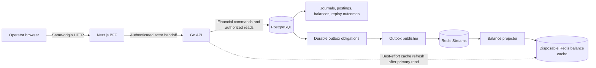
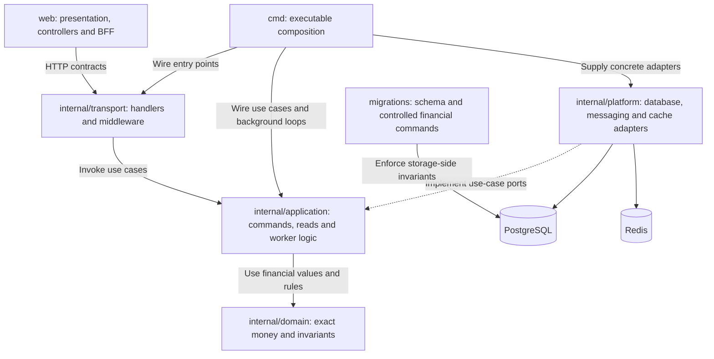
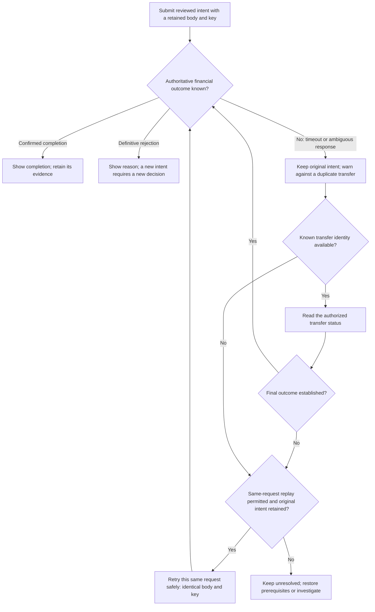
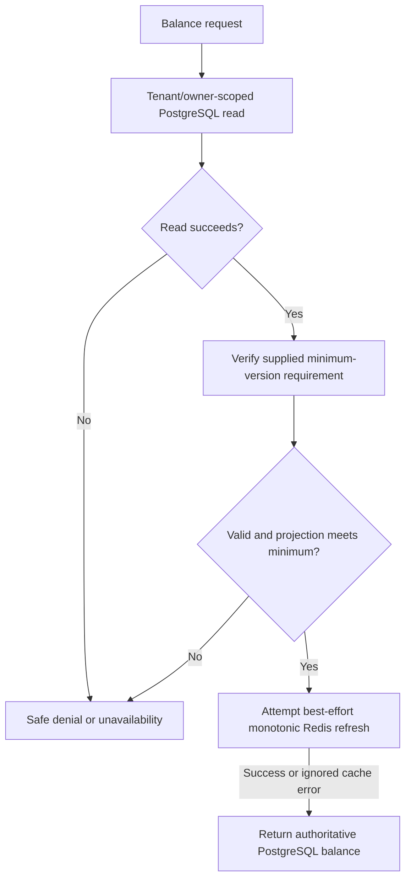
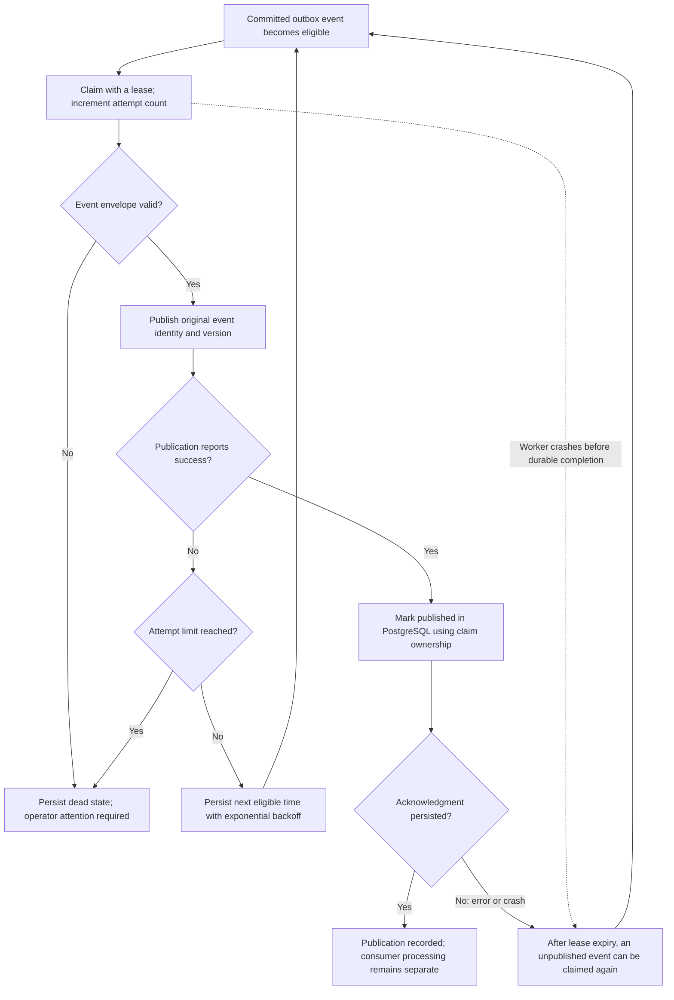
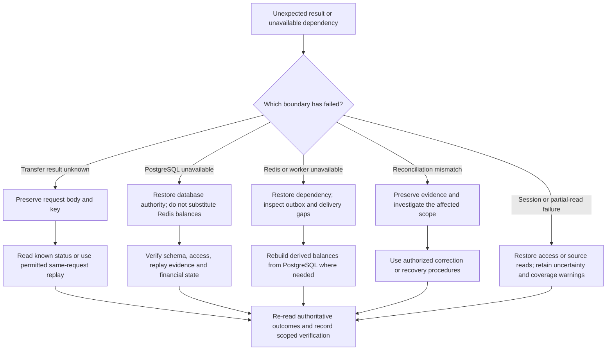
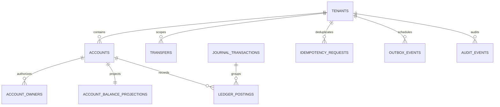

# LedgerSync

### A practical Distributed Systems case study in reliable money movement

**One financial authority. Retry-safe commands. Honest failure states.**

LedgerSync is a closed-loop ledger application for recording internal funding, moving money between authorized accounts, and investigating the resulting evidence. It combines a Next.js operator interface and Backend for Frontend (BFF), a Go API, PostgreSQL, Redis Streams, and background workers.

The central question is a Distributed Systems problem:

> **How can a system move money safely when requests overlap, responses disappear, processes crash, and different components observe changes at different times?**

This README explains the design through that question. It is intended for students, project evaluators, developers, and operators—not only financial-domain specialists.

[Run locally](#run-locally) · [Architecture](#system-architecture) · [Distributed Systems concepts](#distributed-systems-concept-map) · [Failure scenarios](#partial-failure-and-recovery) · [Code reading path](#repository-and-code-reading-path)

---

## Scope and current status

| Included | Not implied |
|---|---|
| Internal same-currency ledger transfers; the local operator workflow uses INR | Bank transfers, card processing, FX, custody, or external settlement |
| Account creation, controlled funding, transfers, reviews, corrections, and reconciliation | Permission to manufacture a balance or bypass independent approval |
| An executable local multi-process system with fault and integration tests | Multi-region availability, a replicated database cluster, or a production SLA |
| A Simple/Expert operator interface with exact values and disclosed evidence | Different authorization rules depending on presentation mode |

**Current implementation work is local-only; publishing documentation does not deploy the application.** The Accounts Register frontend redesign and its qualification are still in progress. Historical release reports describe specific earlier runs; they are not automatic certification of the current working tree. Its completion matrix and verification report remain local drafts, outside this documentation commit. Outstanding visual, real-stack browser, and human-usability gates must not be treated as passed.

Recording funding does **not** initiate an external bank deposit. A saved funding request is not credited money; review and posting remain distinct operations.

## Contents

1. [The problem, with an exact example](#the-problem-with-an-exact-example)
2. [System architecture](#system-architecture)
3. [Distributed Systems concept map](#distributed-systems-concept-map)
4. [Transactions, invariants, and concurrency](#transactions-invariants-and-concurrency)
5. [Idempotency and uncertain outcomes](#idempotency-and-uncertain-outcomes)
6. [Consistency and read-your-writes](#consistency-and-read-your-writes)
7. [Outbox, delivery, and event ordering](#outbox-delivery-and-event-ordering)
8. [Partial failure and recovery](#partial-failure-and-recovery)
9. [Security across process boundaries](#security-across-process-boundaries)
10. [Data model and financial workflows](#data-model-and-financial-workflows)
11. [API boundaries and exact payloads](#api-boundaries-and-exact-payloads)
12. [Scalability and performance trade-offs](#scalability-and-performance-trade-offs)
13. [Run locally](#run-locally)
14. [Testing and safe lab exercises](#testing-and-safe-lab-exercises)
15. [Repository and code reading path](#repository-and-code-reading-path)
16. [Discussion questions and glossary](#discussion-questions-and-glossary)
17. [Documentation and references](#documentation-and-references)

---

## Diagram guide

Read these diagrams in order for an architectural walkthrough, or jump to the failure boundary you are studying. GitHub renders the Mermaid blocks inline; in a plain-text viewer, use the accompanying explanations and tables.

| Diagram | Question it answers |
|---|---|
| [Runtime architecture](#system-architecture) | Which processes communicate, and where does financial truth live? |
| [Code architecture](#code-architecture-and-composition) | How are domain rules, use cases, adapters, and entry points separated? |
| [Financial commit sequence](#the-commit-boundary) | What must commit together before an outcome can be acknowledged? |
| [Uncertain-transfer recovery](#uncertain-transfer-recovery-flow) | What should the caller do when a response disappears? |
| [Read-your-writes flow](#consistency-and-read-your-writes) | How are authorization and minimum balance versions checked? |
| [Outbox delivery lifecycle](#outbox-delivery-lifecycle) | How do leases, retries, and duplicate publication interact? |
| [Incident recovery decisions](#incident-recovery-decision-flow) | Which failures require restoring authority rather than retrying a command? |
| [Conceptual data model](#data-model-and-financial-workflows) | How do accounts, journals, postings, and durable evidence relate? |

## The problem, with an exact example

Suppose two authorized INR accounts contain:

| Account | Before | Movement | After |
|---|---:|---:|---:|
| Operating | INR 100.00 | − INR 12.50 | INR 87.50 |
| Reserve | INR 20.00 | + INR 12.50 | INR 32.50 |
| Combined, same currency | INR 120.00 | INR 0.00 | INR 120.00 |

These are **illustrative values**, not live records. The transfer amount is represented internally as `1250` minor units, not a floating-point number.

A correct implementation must answer more than “did both updates run?”

- What if another transfer tries to spend the same source balance?
- What if the database commits but the HTTP response never reaches the browser?
- What if the worker crashes after publishing an event but before acknowledging it?
- What if version 12 reaches Redis before version 11?
- What if an unauthorized operator guesses the account identifier?
- What if the page can load only some of the workspace records?

LedgerSync addresses these problems at different boundaries. A responsive interface, database transaction, idempotency record, and worker lease solve different problems; none replaces the others.

## System architecture



The arrows distinguish **financial commitment** from **asynchronous propagation**. In the supported worker executable, publisher and projector loops are composed together; the diagram shows their logical responsibilities, not a requirement to deploy each box separately.

| Component | Responsibility | Must not do |
|---|---|---|
| Browser | Enter, review, and display intent and evidence; retain unresolved requests safely | Authorize itself or infer success from a timeout |
| Next.js BFF | Validate the browser boundary, session, CSRF, and API handoff | Expose database credentials or collapse uncertain writes into confirmed failure |
| Go API | Apply domain policy, exact-money validation, and scoped access | Trust presentation mode as a permission |
| PostgreSQL | Commit financial state, authorization records, replay outcomes, and delivery obligations | Depend on Redis to decide whether a transfer posted |
| Redis Streams | Transport derived work asynchronously | Act as the only recoverable ledger history |
| Redis balance cache | Maintain versioned, rebuildable projections | Supply customer-visible financial truth in the current reader |
| Background worker | Claim, publish, retry, project, and report delivery progress | Reverse a committed transfer because delivery failed |

**Important implementation detail:** current customer-visible balance reads come from PostgreSQL. Redis is not a cache-first shortcut for those answers. Older design notes may describe cache acceptance followed by a primary fallback; the [current balance reader](internal/application/accounts/balance.go) is the authority for actual behavior.

### Code architecture and composition

This is a responsibility and composition map, not a generated import graph. The Go packages are modules within the API and worker executables—not independent microservices.



The frontend controls presentation, not permission or financial truth. Application ports separate use cases from infrastructure; controlled SQL also enforces invariants at the commit boundary. This is why changing a register layout must not change transfer arithmetic, access checks, or retry identity.

## Distributed Systems concept map

| Subject concept | LedgerSync mechanism | What to study |
|---|---|---|
| Distributed processes | Browser, BFF, API, database, and worker communicate across boundaries | Independent failures and network uncertainty |
| ACID transactions | One PostgreSQL financial commit | All-or-nothing writes and invariant preservation |
| Concurrency control | Serializable transactions, ordered account locks, tenant policy sequencing | Conflicting transfers and contention |
| Idempotency | Scoped request key plus canonical fingerprint and saved outcome | Safe repeat submission |
| Partial failure | A request can commit without the caller receiving its result | Unknown is not the same as rejected |
| Asynchronous messaging | Transactional outbox and Redis Streams | Durable intent versus eventual delivery |
| At-least-once delivery | Publication can repeat after a crash | Consumer repeat safety |
| Logical ordering | Per-account balance versions and monotonic cache writes | Rejecting older derived state |
| Read-your-writes | Signed minimum-version requirement checked against PostgreSQL | Visibility of a caller's committed changes |
| CQRS-style separation | Command handlers and explicit read models | Different write and query responsibilities |
| Reconciliation | Compare journal-derived balances with projections | Independent checking rather than trusting a cache |
| Compensation | New offsetting financial records | Correcting history without rewriting it |
| Backpressure | Bounded batches, leases, retries, and rate limits | Keeping overload from becoming uncontrolled work |
| Observability | Correlation, outcome, lag, and mismatch evidence | Explaining behavior across processes |

### What this project does not demonstrate

This is not an implementation of Raft, Paxos, Byzantine consensus, a blockchain, multi-leader replication, or cross-database two-phase commit. An immutable journal is also not, by itself, proof that the entire application is event-sourced.

The transfer's debit and credit live inside **one database transaction**, not a saga across independently owned account databases. Funding and correction approval flows are durable business workflows; describing them as distributed commit protocols would be misleading.

### CAP, without the slogan

CAP concerns the relationship between consistency and availability during partitions in a distributed storage system. ACID “consistency,” transaction serializability, and CAP's consistency requirement are not interchangeable terms. See the [Gilbert–Lynch paper](https://groups.csail.mit.edu/tds/papers/Gilbert/Brewer2.pdf).

For this implementation, describe behavior concretely: if PostgreSQL cannot establish authorized financial truth, LedgerSync does not substitute an unverified Redis balance or accept an offline financial write. That choice does not establish a blanket “CP” certification or prove multi-region failover behavior.

## Transactions, invariants, and concurrency

### Financial invariants

For a posted internal transfer of amount `m`, within one currency:

```text
source_after      = source_before − m
destination_after = destination_before + m
total_after       = total_before
total_debits      = total_credits
```

The journal contains a matching debit and credit for the transfer. Customer-account eligibility, sufficient funds, configured transfer limits, and authorization must also hold. Equal totals alone would not prove that the *correct* accounts were used.

Amounts use integer minor units: Go/domain validation and PostgreSQL integer columns enforce bounded values; browser boundaries use decimal strings and exact integer operations. Currency is explicit. Do not combine different currencies or treat customer funds as operating capital.

### The commit boundary

```mermaid
sequenceDiagram
  autonumber
  participant Client as Browser / BFF
  participant API as Go API
  participant DB as PostgreSQL
  participant Worker as Background worker
  Client->>API: Authorized transfer, exact intent, idempotency key
  API->>DB: Acquire tenant policy sequence; begin serializable transaction
  DB->>DB: Resolve scoped key and verify fingerprint
  DB->>DB: Lock accounts in stable order; validate policy and funds
  DB->>DB: Persist financial outcome, journal/postings when posted
  DB->>DB: Persist balance versions, audit, outbox and replay outcome
  DB-->>API: Commit
  API-->>Client: Outcome and consistency metadata
  Worker->>DB: Claim committed outbox work
  Note over Client,Worker: Delivery is separate from financial completion
```

The [Go transfer adapter](internal/platform/db/transfer_repository.go) invokes the [controlled PostgreSQL command](migrations/000036_controlled_financial_commands.up.sql). The database procedure owns the financial operation; the transaction wrapper handles commit and retry boundaries.

An insufficient-funds outcome can be recorded without posting a debit/credit journal. Not every authentication or malformed-input rejection creates a durable financial record.

### Why two simultaneous withdrawals cannot both trust an old balance

With INR 100.00 available, two independent INR 80.00 requests cannot both safely spend the original value. The implementation coordinates conflicting work through:

1. A tenant-scoped policy sequence, acquired before opening the serializable transaction.
2. Account/projection locks acquired in stable account-ID order.
3. Policy and balance checks inside the transaction.
4. Bounded retry of serialization/deadlock failures, with jitter in the transaction retry helper.

Stable ordering reduces avoidable lock cycles; it does not justify removing deadlock handling. Serializable transactions may abort and need a whole-transaction retry. That is expected behavior, not permission to replay individual SQL statements out of context. [PostgreSQL isolation reference](https://www.postgresql.org/docs/16/transaction-iso.html).

**Trade-off:** exact tenant-wide rolling limits currently serialize transfer policy evaluation within that tenant. More API instances do not remove that coordination point. See [the transaction helper](internal/platform/db/postgres.go).

## Idempotency and uncertain outcomes

Idempotency binds a repeat request to its original intent:

```text
identity = tenant + actor + operation + idempotency key
fingerprint = hash(canonical financial intent)
```

The fingerprint binds account identities, currency, and exact amount as well as the relevant caller/operation context.

| Situation | Required behavior |
|---|---|
| New valid key and intent | Attempt the command once within the transaction boundary |
| Same scoped key and same intent, saved final outcome | Return the original result; do not create another movement |
| Same key with changed intent | Reject with an idempotency conflict |
| Matching work still unresolved/in progress | Preserve intent and follow the bounded recovery contract |
| HTTP response lost after possible dispatch | Treat the client outcome as unknown; retain the original body and key |
| Definitively rejected original request | Show the rejection; a genuinely new intent is a separate user decision |

**An idempotency key prevents duplicate effects only within its defined scope and retained replay contract.** It does not make networks deliver exactly once. Creating a new key for every retry defeats the mechanism.

A timeout describes what the caller knows, not necessarily what the database did. The safe sequence is:

1. Keep the original account IDs, amount, currency, and request key.
2. Read the known transfer record when its identity is available.
3. If the recovery contract requires POST replay, resend the *same* body and key.
4. Do not silently turn an uncertain request into a new edited transfer.

The frontend distinguishes **Details → Review → Result**, including an explicit unresolved result. Later read/metadata failures must not erase an already confirmed financial completion.

### Uncertain-transfer recovery flow

This flow describes caller behavior after possible dispatch. It does not classify every HTTP error as a definitive rejection, and a missing read result alone does not prove that no transfer committed.



Replay remains subject to authentication, authorization, and the retained idempotency contract. These arrows describe deliberate recovery actions, not an unbounded automatic retry loop. A later refresh failure must not move a confirmed completion back into the unknown state.

Code: [idempotency application logic](internal/application/idempotency/) · [transfer BFF](web/src/app/api/transfers/route.ts) · [transfer workflows](web/src/features/transfers/).

## Consistency and read-your-writes

A balance version is a per-account logical sequence, not a wall-clock timestamp or a global order of every event in the system.

After a transfer, a signed consistency requirement can bind a tenant/account to a minimum committed version. The token's default lifetime is ten minutes. It contains a version requirement—not money and **not authorization**.



| State | Current behavior |
|---|---|
| PostgreSQL readable and requirement satisfied | Return the PostgreSQL projection |
| Redis missing, stale, unavailable, or forged | Do not use its value as the financial answer |
| Minimum version not met | Report unavailability rather than pretend an old balance is current |
| Invalid, expired, or wrong-account requirement | Reject the invalid requirement |
| PostgreSQL unavailable | No new authoritative balance answer; previously displayed evidence must be labelled historical |

Authorization is established by the scoped database read before evaluating the supplied requirement. This avoids using consistency errors to disclose another account's existence.

Do not describe this as an instantaneous, globally synchronized snapshot across all screens. Account balances, activity pages, and task sources can be fetched at different times. The interface must disclose freshness, partial coverage, and failed reads.

Sources: [balance reader](internal/application/accounts/balance.go), [scoped SQL read](internal/platform/db/balance_repository.go), [signed requirements](internal/application/consistency/token.go).

## Outbox, delivery, and event ordering

### Why the outbox exists

Writing a transfer to PostgreSQL and separately publishing a message creates a dangerous gap: the first operation can succeed while the second fails.

LedgerSync stores the financial outcome and the obligation to publish inside the same PostgreSQL transaction. A worker publishes committed obligations later. This removes the *lost publication intent* gap; it does not create an atomic transaction spanning PostgreSQL and Redis.

### Why publication may repeat

```text
1. Worker claims an outbox row.
2. Worker publishes it.
3. Worker crashes before marking it published in PostgreSQL.
4. The claim expires and the event becomes eligible again.
5. Another delivery attempt publishes the same event identity.
```

This is an **at-least-once delivery design**, not exactly-once delivery. Bounded retries can also end in a dead state requiring operator action; eventual success is not unconditional.

Claims use leases and `FOR UPDATE SKIP LOCKED` to coordinate workers. The worker applies bounded batches and exponential retry backoff. Event failures are recorded separately from committed financial state.

### Outbox delivery lifecycle

The following flow expands the publisher's failure paths. PostgreSQL owns the durable delivery state; publication and its acknowledgment are separate operations.



If publication succeeded but acknowledgment did not, the next attempt may deliver a duplicate. A failed publication response can also be ambiguous. Consumers must preserve repeat safety in either case. Failure to persist retry/dead state is an operational error, not a durable state transition; lease recovery still applies. **No delivery branch rolls back a committed financial transfer.**

### How stale events avoid rolling the cache backward

The cache uses an atomic Lua compare-and-write operation:

| Current cached version | Incoming version | Result |
|---:|---:|---|
| 10 | 11 | Apply 11 |
| 11 | 11 | Ignore repeat |
| 12 | 11 | Ignore older event |

The comparison uses decimal strings to avoid Lua floating-point precision loss for 64-bit versions. Atomic execution keeps the comparison and update together. [Redis scripting reference](https://redis.io/docs/latest/develop/programmability/eval-intro/).

This mechanism protects derived cache ordering; it does not replace authorization, reconciliation, or the PostgreSQL financial boundary. Losing Redis may also lose retained stream history, so reconstruct current balances from PostgreSQL rather than assume the stream is a permanent archive.

Code: [outbox claims](internal/platform/db/outbox_repository.go) · [worker](internal/application/outbox/worker.go) · [Redis Streams](internal/platform/events/redis_streams.go) · [projector](internal/application/projection/balance_projector.go) · [monotonic cache](internal/platform/cache/balance_cache.go).

## Partial failure and recovery

**Safety** means avoiding an invalid financial effect. **Liveness** means valid work can eventually progress when its required dependencies and policy conditions allow it. LedgerSync does not sacrifice the first merely to make a screen look available.

| Failure | Financial truth | Safe recovery |
|---|---|---|
| Invalid input or unauthorized actor | No authorized movement should be created | Correct input or obtain proper access |
| Concurrent requests exceed available funds | The transactional balance/policy checks decide outcomes | Inspect final results, not speculative browser totals |
| Response disappears after commit | A transfer may already be posted | Recover the original request with its original key |
| Worker stops | A committed transfer remains committed | Restore worker health; inspect retained outbox work |
| Worker dies after publication | Duplicate delivery is possible | Repeat-safe consumption and lease recovery |
| Redis loses data | PostgreSQL remains authoritative | Rebuild derived balances; inspect delivery gaps separately |
| Database becomes unavailable | Current financial truth cannot be established | Restore authority; do not invent success or use a new retry identity |
| Session expires | Authorization must be re-established | Sign in with a safe return path; preserve unresolved intent |
| Only some task sources load | The queue is incomplete | Show coverage warnings, not a workspace-wide all-clear |
| Reconciliation finds a mismatch | Evidence needs investigation | Preserve records and follow controlled correction/recovery procedures |

Reconciliation compares journal-derived values with stored projections. It detects discrepancies; a “matched” result is scoped to that run and does not certify bank settlement or every component's health.

Backups and restore drills serve a different purpose. A cache rebuild does not restore a lost ledger. Recovery also needs replay identities, schema compatibility, authorization state, and verification of restored financial evidence.

- [Recovery and operations guide](docs/operations.md)
- [Local runtime and recovery runbook](docs/runbooks/local-runtime-smoke.md)
- [Fault scenarios](tests/fault/toxiproxy-scenarios.md)

### Incident recovery decision flow

This is an operator triage guide, not an automated repair engine. More than one branch can apply during the same incident; recovery actions require authorized runbooks and verification.



A green dependency check is not proof that an uncertain transfer failed, that every delivery completed, or that all account balances reconcile. Close an incident only against its affected evidence and scope.

## Security across process boundaries

| Boundary | Protection |
|---|---|
| Browser → BFF | Same-origin requests, HttpOnly session cookies, CSRF checks on cookie-authenticated mutations |
| Session lifecycle | Opaque, revocable PostgreSQL-backed sessions in the current application; scoped server-side state |
| BFF → Go API | Trusted workload identity and short-lived signed actor handoff |
| API → records | Tenant, actor, role/scope, and account-ownership predicates |
| Financial command → database | Controlled command procedures and database-level invariants/capabilities |
| Shared execution | Authoritative PostgreSQL API limiting; production BFF protection must not silently degrade to local memory |
| Operator controls | Required prerequisites, independent approval where policy requires it, and step-up authentication |
| Errors and telemetry | Bounded public errors and redacted evidence; no secrets in screenshots, logs, or reports |

Simple and Expert views use the same server-enforced permissions. Hiding a navigation item is not access control. A consistency requirement, request ID, or guessed record UUID cannot grant access.

Local-development authentication and in-memory BFF limiting are local conveniences, not deployment instructions. Public exposure requires a separate identity, secrets, network, shared-limiter, recovery, and operational-readiness review.

## Data model and financial workflows



This is a **conceptual subset**, not the complete schema. A rejected transfer does not require a posted journal. See [ordered migrations](migrations/) for the actual tables, constraints, procedures, and relationships.

| Workflow | Important boundary |
|---|---|
| Create account | Identity/category first; exact zero opening balance |
| Add money | Record externally confirmed funding evidence; request, review, and posting remain distinct |
| Transfer | Confirm exact intent; commit or recover the same request |
| Approval | Confirm the right actor, evidence, policy, and any recent-authentication requirement |
| Correction | Create a linked offsetting movement; never edit the original journal |
| Account lifecycle | Freeze/reactivate according to policy; closing requires verified zero balances and explicit confirmation |
| Delivery replay | Approval to replay and actual replay execution remain distinct; delivery is not financial completion |

The journal is immutable financial evidence. The balance projection is a mutable read model updated by controlled commands. The outbox is delivery state. Treating these as interchangeable would destroy the reasoning behind the design.

## API boundaries and exact payloads

Both layers expose a transfer path named `/api/transfers`, but the browser-facing and private request representations differ.

<details>
<summary><strong>Browser → Next.js BFF: integer minor units as text</strong></summary>

```json
{
  "sourceAccountId": "00000000-0000-4000-8000-000000000010",
  "destinationAccountId": "00000000-0000-4000-8000-000000000020",
  "amount": {
    "currency": "INR",
    "minorUnits": "1250"
  }
}
```

These illustrative account IDs are not provisioned records. The mutation requires the real authorized session, CSRF value, and stable `Idempotency-Key`.

</details>

<details>
<summary><strong>BFF → private Go API: canonical decimal text</strong></summary>

```json
{
  "source_account_id": "00000000-0000-4000-8000-000000000010",
  "destination_account_id": "00000000-0000-4000-8000-000000000020",
  "amount": "12.50",
  "currency": "INR"
}
```

The BFF converts strings without floating-point money arithmetic and adds the trusted private identity context. The Go boundary parses and validates the amount into exact minor units.

</details>

Use the [actual mapping](web/src/lib/api/transfers.ts), [API guide](docs/api-guide.md), and [versioned developer artifacts](contracts/) when integrating. Do not copy private workload credentials into a browser.

A `GET` status check and a `POST` replay are different operations. Label them honestly. An HTTP status alone is not a substitute for interpreting the documented financial outcome and metadata state.

## Scalability and performance trade-offs

| Design choice | Benefit | Cost or limit |
|---|---|---|
| One PostgreSQL financial authority | A well-defined atomic commit boundary | Database availability and capacity remain critical |
| Tenant policy sequencing | Exact rolling-limit decisions across API instances | Hot tenants serialize at this coordination point |
| Short transactions and bounded pools | Limits work held in flight | Requires measured pool/timeout sizing |
| Primary-only financial balance reads | Avoids forged or stale cache answers | Redis does not remove these reads from PostgreSQL |
| Batched leased workers | Independent, recoverable background work | More workers can increase duplicate attempts and database pressure |
| Cursor pagination and bounded evidence | Controls response size and browser work | A page is not a complete workspace total |
| Shared rate limiting | Enforces cross-instance request budgets | Adds a shared dependency that must fail safely |
| Append-only financial evidence | Auditable history and reconciliation | Storage, indexes, backups, and retention need planning |

Do not infer linear scalability from adding containers. Measure database lock waits, tenant contention, connection-pool saturation, worker lag, payload sizes, and tail latency.

Historical local measurements and capacity targets belong in the [performance protocol](docs/performance-baseline.md) and [release evidence](docs/release-evidence/), with hardware, workload, duration, dependency state, and source revision. They are not production guarantees.

For planning only, `transfers per second × 86,400` gives daily volume at a sustained rate. It does not prove that the system can sustain that rate. Financial invariants and reconciliation must be checked alongside throughput.

## Run locally

### Prerequisites

- PowerShell and Git for the supported workstation scripts.
- Docker Engine/Desktop running with Compose 2.20 or newer.
- For native Go development, the toolchain declared in [go.mod](go.mod), currently Go 1.26.6.
- For native frontend development, a Node version satisfying [web/package.json](web/package.json): `>=22.12.0` or `>=20.19.0 <21.0.0`.
- Compose pins PostgreSQL 16 and Redis 7.4 image digests in [the supported topology](deploy/compose/docker-compose.yml).

The native Go/Node tools are for developer commands; the container build supplies its own toolchains. Follow checked-in manifests rather than older README minimums.

### Supported workstation path

Run these commands from the repository root:

```powershell
# Read-only checks: Docker, ports, disk, and local configuration.
.\scripts\doctor-local.ps1

# Start the supported local topology.
.\scripts\start-local.ps1

# Inspect health and bounded logs.
.\scripts\status-local.ps1
.\scripts\logs-local.ps1 -Service api -Tail 100 -Since 15m

# Stop without deleting the database/cache volumes.
.\scripts\stop-local.ps1
```

Startup may initialize local runtime configuration according to the runbook. Read its messages and do not publish generated environment files. This README edit does not run these startup commands or modify secrets.

Open **http://127.0.0.1:3000** for the standard local stack. The temporary redesign preview on port 3300 is a separate disposable test environment, not the canonical startup URL.

The root [docker-compose.yml](docker-compose.yml) delegates to the supported deployment topology. Do not start another copy on an occupied port, modify someone else's running stack, or mix source checkouts with unrelated database volumes.

### First operator journey

1. Enter through the existing configured sign-in flow.
2. Create an account and verify its zero opening balance.
3. Record funding evidence; observe requested, reviewed, and posted states separately.
4. Create a second eligible account, review an exact transfer, and confirm.
5. Inspect both account histories and the stored transfer result.
6. Run a balance check and inspect its scope and result.
7. Use Tasks for attention and Expert view for technical evidence.

Do not invent funding merely to make a normal workspace look populated. Use disposable fixtures for demonstrations and test mutations.

**Destructive reset is intentionally separate.** Read the [runtime runbook](docs/runbooks/local-runtime-smoke.md) before any reset or restore. Stopping containers is not the same as deleting volumes.

## Testing and safe lab exercises

### Developer checks

```powershell
go test ./internal/... ./tests/unit ./tests/contract
npm --prefix web test
npm --prefix web run lint
Push-Location web
npx tsc --noEmit
Pop-Location
npm --prefix web run build
npm --prefix web run check:developer-artifacts
npm --prefix web run test:performance
npm --prefix web run test:e2e
npm --prefix web run test:e2e:performance
```

The frontend E2E suite starts its own production-mode server and uses deterministic mocked responses. That is valuable regression evidence, but it is not a real database-backed money-movement test.

Integration/fault tests require explicitly configured **disposable PostgreSQL and Redis**. Once configured according to the harness/runbooks:

```powershell
go test -race -p 1 -count=1 ./tests/integration ./tests/fault
```

Those suites can reset fixtures. Never point them at normal workspace or production data. The race detector also needs the platform's supported compiler/CGO environment; use the documented Linux/container setup where needed. Missing-dependency skips do not count as successful qualification.

Real-browser financial acceptance has additional ownership and mutation guards. Follow the [real-stack harness instructions](web/tests/system/README.md); do not disable its checks or substitute the normal local database.

### Subject lab: predict, inject, observe, explain

| Exercise | Prediction to test | Starting evidence |
|---|---|---|
| Competing transfers from one account | No double spend; final balances remain valid | [Concurrency tests](tests/integration/concurrent_transfers_test.go) |
| Replay one key, then change its amount | Matching replay reuses outcome; changed intent conflicts | [Idempotency tests](tests/integration/idempotency_test.go) |
| Fail inside the financial write boundary | No partially posted journal/balance outcome | [Atomicity tests](tests/integration/transfer_atomicity_test.go) |
| Deliver a newer projection before an older one | Cache version never moves backward | [Projection tests](tests/integration/cache_projection_test.go) |
| Lose Redis or delay derived work | Primary financial reads remain authoritative | [Dependency fault tests](tests/fault/dependency_recovery_test.go) |
| Lose a transfer response, then reload | Original body/key survive; no unsafe duplicate | [Browser command tests](web/tests/e2e/guided-transfer.spec.ts) |
| Attempt cross-account or cross-tenant access | Safe denial without financial disclosure | [Authorization tests](tests/integration/transfer_authorization_test.go) |
| Replay delivery after approval | Execution respects independent authorization boundaries | [Lifecycle/recovery tests](tests/integration/lifecycle_recovery_test.go) |
| Apply retention or restore evidence | Final financial/retry evidence remains protected | [Retention and recovery tests](tests/integration/lifecycle_recovery_test.go) |

For each exercise, record: initial state, injected fault, expected invariant, observed result, cleanup, and the exact test revision. Capture synthetic data only.

### Acceptance is layered

- **Unit tests:** deterministic domain and presentation rules.
- **Integration tests:** real SQL constraints, transaction behavior, authorization, and migrations.
- **Fault tests:** dependency loss, delayed work, and recovery.
- **Browser tests:** navigation, form stages, retained uncertainty, accessibility, and responsive behavior.
- **Visual review:** deliberate screenshot comparison; do not approve changes by blanket replacement.
- **Real-stack smoke tests:** browser through BFF/API to disposable databases, without claiming mocks are real mutations.
- **Human usability sessions:** whether operators understand money, freshness, and uncertainty.

A passing build does not prove all of these gates. The current Accounts Register verification report is a local draft, not published qualification evidence.

## Repository and code reading path

```text
LedgerSync/
├── cmd/                 Executables: API, worker, migrations, reconciliation, recovery tools
├── internal/
│   ├── domain/          Financial values and domain invariants
│   ├── application/     Use cases: transfers, accounts, funding, outbox, reconciliation
│   ├── platform/        PostgreSQL, Redis, identity and observability adapters
│   └── transport/       HTTP contracts, middleware and handlers
├── migrations/          Ordered SQL schema, constraints and controlled commands
├── web/                 Next.js frontend, BFF, UI components and browser tests
├── contracts/           Versioned developer-facing artifacts
├── tests/               Unit, contract, integration and fault qualification
├── deploy/              Container, Compose and environment-specific configuration
├── scripts/             Local lifecycle, verification, backup and recovery scripts
├── docs/                Architecture, decisions, runbooks and dated evidence
└── specs/               Feature specifications and contracts
```

A useful reading sequence:

1. [Exact-money domain](internal/domain/money/) — what values are legal?
2. [Transfer application logic](internal/application/transfers/) — what intent is accepted?
3. [Transfer repository](internal/platform/db/transfer_repository.go) — where is the transaction boundary?
4. [Controlled transfer SQL](migrations/000036_controlled_financial_commands.up.sql) — which invariants are enforced inside PostgreSQL?
5. [Balance reader](internal/application/accounts/balance.go) — what can a caller safely observe?
6. [Outbox worker](internal/application/outbox/worker.go) and [projector](internal/application/projection/balance_projector.go) — how does derived work recover?
7. [Browser transfer feature](web/src/features/transfers/) — how is uncertainty communicated and retained?
8. [Integration tests](tests/integration/) — what adversarial cases prove or challenge the model?

Keep the domain independent. Application logic depends on domain rules; adapters implement application contracts; executables compose them. UI presentation remains separate from financial authority. A change to a table layout should not change money arithmetic or server permissions.

## Discussion questions and glossary

<details>
<summary><strong>Questions for a Distributed Systems presentation or viva</strong></summary>

1. **Why not update PostgreSQL and Redis together in the HTTP handler?**

    Independent writes can disagree after partial failure. The outbox commits the delivery obligation alongside financial state.

2. **Does the system execute everything exactly once?**

    No. Requests and event deliveries can repeat. Scoped replay records protect financial effects; consumers must handle duplicate delivery.

3. **Why keep a version if there is already a timestamp?**

    A timestamp is useful evidence, but a per-account version gives an explicit ordering check for that account's state. It is not a global clock.

4. **Is Redis an availability fallback for balances?**

    Not in the current reader. PostgreSQL supplies the financial answer; returning an unverified cache value would weaken the trust boundary.

5. **Why can an HTTP timeout occur after a successful transfer?**

    Database commit and response delivery are separate events. The caller must recover the original request rather than infer rollback.

6. **Why is serializability not enough on its own?**

    It coordinates committed transactions but does not define valid money, caller permissions, idempotency, or operator recovery.

7. **Why not fix a bad transfer by editing a journal row?**

    That destroys historical evidence. Corrections create linked offsetting records under explicit policy.

8. **What is the main scaling constraint?**

    It depends on the measured workload, but the tenant policy sequence is an explicit coordination point. More application instances do not eliminate it.

9. **Is this a microservice-per-domain architecture?**

    No. The Go API is modular, while the BFF and workers provide separate runtime responsibilities. Many packages are not automatically many independently owned services.

10. **What would change with account databases on different shards?**

     The present single-transaction proof would no longer apply. Cross-shard movement would need a separately designed financial protocol, recovery model, and authorization review.

</details>

| Term | Meaning in this project |
|---|---|
| Ledger | Immutable financial journals and postings |
| Projection | A derived read model; distinguish the transactional PostgreSQL projection from disposable Redis copies |
| Idempotency key | Identity used to recover the same scoped command |
| Fingerprint | Canonical intent hash used to reject conflicting key reuse |
| Outbox | Durable obligations to deliver events after a financial commit |
| Lease | Temporary claim on background work, recoverable after expiry |
| Reconciliation | Comparison of independently derived accounting evidence |
| Compensation | A new controlled movement that offsets an earlier one |
| Unknown outcome | The caller cannot yet prove whether the submitted command completed |
| RYEW | Read-your-writes: a read must satisfy the relevant committed minimum version |
| BFF | Backend for Frontend: the same-origin server boundary serving the browser |
| RPO / RTO | Acceptable data-loss window / time to restore service; both require a defined recovery scope and measured evidence |

## Documentation and references

### Project guides

- [Architecture and trust boundaries](docs/architecture.md)
- [Private API integration](docs/api-guide.md)
- [Operations and recovery](docs/operations.md)
- [Local runtime runbook](docs/runbooks/local-runtime-smoke.md)
- [Performance measurement protocol](docs/performance-baseline.md)
- [Design and product direction](DESIGN.md)
- Accounts Register completion matrix — local draft at `docs/design/planning/accounts-register-completion.md`; not included in this documentation commit.
- Accounts Register verification and limitations — local draft at `docs/design/qa/accounts-register/verification.md`; not included in this documentation commit.
- [Historical release evidence](docs/release-evidence/) — read the revision and scope before citing a result
- [Architectural decision records](docs/adr/) — historical rationale; reconcile older decisions with current implementation

### Primary Distributed Systems references

- [PostgreSQL 16: transaction isolation](https://www.postgresql.org/docs/16/transaction-iso.html)
- [Redis: atomic Lua scripting](https://redis.io/docs/latest/develop/programmability/eval-intro/)
- [Gilbert and Lynch: Brewer's conjecture and the CAP result](https://groups.csail.mit.edu/tds/papers/Gilbert/Brewer2.pdf)

These explain the underlying concepts; the linked source code and tests establish what LedgerSync actually implements.

### Contributing safely

Keep changes scoped and modular. Preserve exact-money contracts, authorization, immutable evidence, and retry identities. Add tests for failure paths, update affected documentation, and distinguish observed behavior from planned work. Never commit credentials, production records, raw environment dumps, or unreviewed financial screenshots.

### License

Licensed under the [Apache License 2.0](LICENSE).
