# LedgerSync

> **Every transfer is exact, explainable, and visible when it matters.**

LedgerSync is an API-first, closed-loop ledger platform for fintech and vertical-SaaS teams building wallets, credits, internal payouts, escrow-like balances, and treasury-like account systems. The pilot deliberately covers **internal, same-currency transfers between LedgerSync ledger accounts**; it is not a bank-rail, card, FX, or custody product.

**Release status:** the engineering core is implemented. A ready-to-use **local-only MVP** is being completed for one Windows workstation at `http://localhost:3000`, with INR demo data and no external deployment. This is separate from the shared production pilot, which remains blocked on physical-device review, signed finance/security/legal decisions, managed OIDC and infrastructure, provider-backed PITR, named operational ownership, and a consenting design partner. See the [two gate registers](docs/pilot/local-mvp-gates.md).

## Contents

- [Why LedgerSync](#why-ledgersync)
- [Numerical scorecard](#numerical-scorecard)
- [Architecture diagrams](#architecture-diagrams)
- [Correctness model](#correctness-model)
- [Read-your-writes model](#readyourwrites-model)
- [Security model](#security-model)
- [API surface](#api-surface)
- [Data model](#data-model)
- [Operations and recovery](#operations-and-recovery)
- [Quick start](#quick-start)
- [Developer and operator guides](#developer-and-operator-guides)
- [Evidence, roadmap, and license](#evidence-roadmap-and-license)

---

## Why LedgerSync

Money systems usually lose trust at their edges: a network retry doubles a debit, a cache answers before its balance projection catches up, or a support operator cannot explain a number. LedgerSync treats those as primary product requirements rather than post-launch engineering work.

| Risk | LedgerSync mechanism | Result |
|---|---|---|
| Floating-point drift | Integer minor units + ISO currency | `1250` is exact; no binary float crosses the financial path |
| Lost response / retry | Idempotency key + canonical request fingerprint | Same request replays one final result; changed intent conflicts |
| Partial write | One short PostgreSQL transaction | Transfer, journal, postings, balance versions, audit, idempotency and outbox commit together |
| Stale cache | PostgreSQL authority; Redis as disposable read cache | Current-enough cache read, authoritative fallback, or truthful unavailability |
| Unexplained balance | Immutable double-entry ledger | One debit and one credit prove each posted internal transfer |
| Cross-account access | Tenant/subject/account predicate in every protected query | Missing and inaccessible accounts get the same safe response |
| Browser/internal boundary leak | Same-origin BFF + HttpOnly session | The browser never calls PostgreSQL, Redis, or internal API ports |

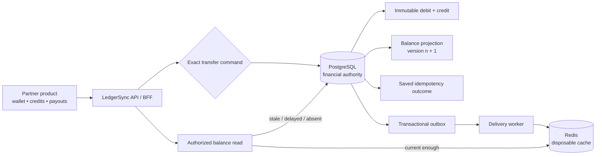

---

## Numerical scorecard

### Pilot targets — not production measurements

The numbers below are deliberate launch constraints. They are **not claims of observed production performance**.

| Dimension | Number | Definition |
|---|---:|---|
| Design partners | **2–3** | Closed production pilot, not self-serve launch |
| Jurisdictions | **1** | Choose and document before pilot |
| Currencies | **1** | Internal same-currency movement only |
| Pilot account scale | **≥ 10,000** | Meaningful pilot completion threshold |
| Initial partner throughput | **≤ 25 TPS** | Enforced lower launch envelope; 50 TPS is measured local service headroom |
| Transfer latency | **p95 < 500 ms** | Healthy-dependency commit outcome target |
| Balance-read latency | **p95 < 200 ms** | Healthy-dependency cache/primary-read target |
| Reconciliation mismatches | **0** | Non-negotiable pilot exit criterion |
| Double-movement retries | **0** | Idempotency safety invariant |
| Restore drills | **≥ 1** | Completed drill required before pilot exit |

### Capacity planning arithmetic

The table converts the TPS target into volume. It is arithmetic for planning; it is **not** a load-test benchmark.

| Sustained rate | Transfers/min | Transfers/hour | Transfers/day |
|---:|---:|---:|---:|
| 10 TPS | 600 | 36,000 | 864,000 |
| 25 TPS | 1,500 | 90,000 | 2,160,000 |
| 50 TPS | 3,000 | 180,000 | 4,320,000 |

At 50 TPS, the v1 model creates a minimum of **100 ledger postings/s** and **100 account-level outbox events/s** (2 each per transfer), before audit, idempotency, index, and projection work.

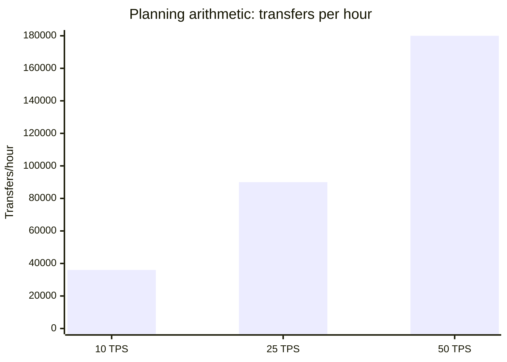

### Reproducible repository evidence

| Evidence | Result | What it proves |
|---|---:|---|
| Phase 3 PostgreSQL transfer suite | **PASS in 2.613 s** | no overdraft, safe replay, conflict rejection, ledger reconciliation |
| Phase 5 PostgreSQL ownership suite | **PASS in 2.513 s** | cross-account reads denied without disclosure |
| BFF security suite | **3 / 3 tests passed** | session tamper/expiry, CSRF, response headers |
| Phase 4 fault cases | **3 scenarios passed** | delayed projection, Redis loss/rebuild, monotonic cache version |
| Ordered migrations | **12** | financial schema through bounded velocity/capacity state |
| Journal postings / posted transfer | **2** | one debit + one credit |
| Account events / transfer | **2** | one outbox event per affected account |
| Consistency requirement lifetime | **10 min** | signed minimum balance version |
| BFF actor assertion lifetime | **≤ 60 s** | server-to-server actor handoff |

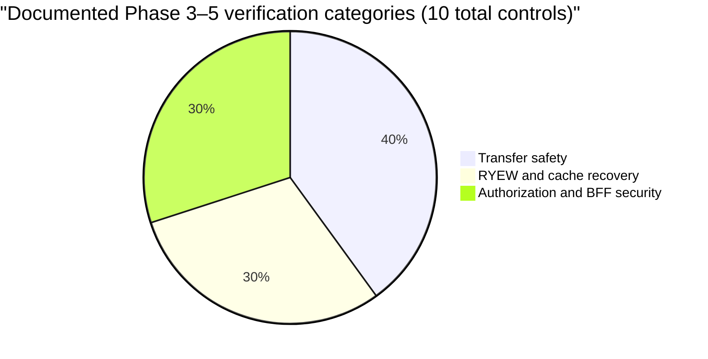

The chart is evidence coverage, not an availability percentage or a production reliability score.

---

## Architecture diagrams

### 1. Transaction commit boundary

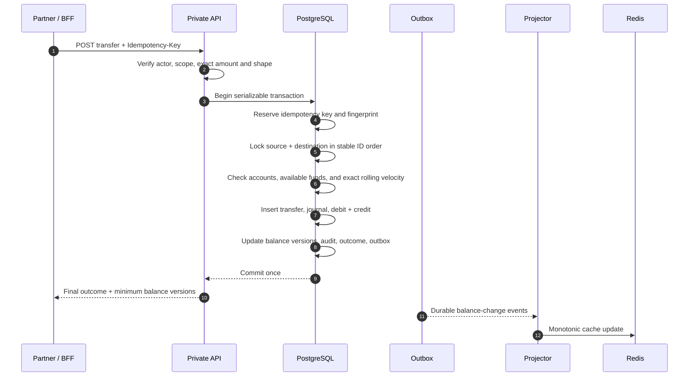

### 2. Financial source-of-truth hierarchy

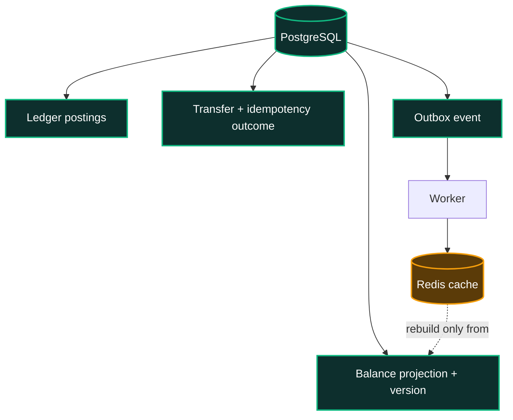

### 3. Read-your-writes decision

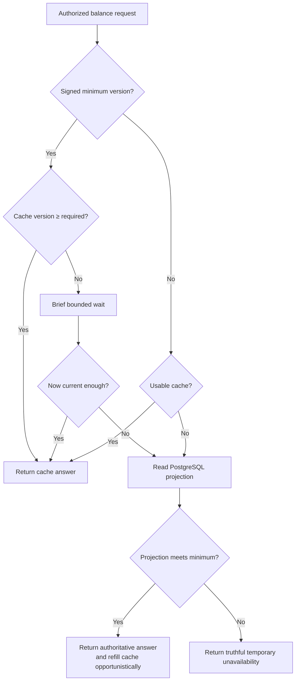

### 4. Failure and retry state machine

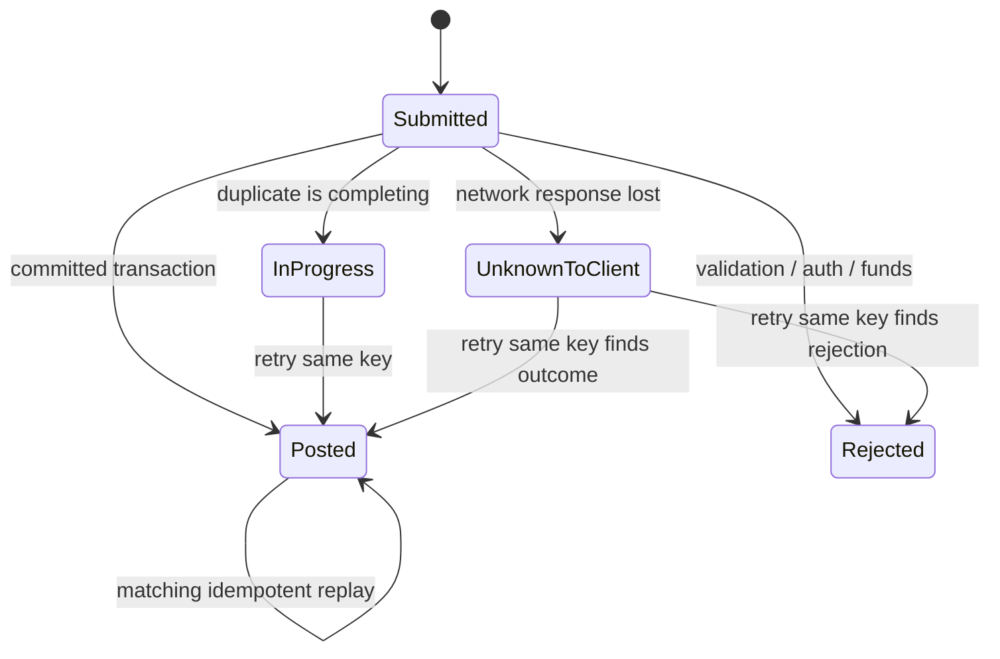

**Do not create a fresh transfer after a lost response. Retry the same idempotency key.**

---

## Correctness model

### Exact money

| Rule | Enforced representation | Example |
|---|---|---|
| Amount | signed integer minor units (`BIGINT`) | `1250` minor units |
| Currency | explicit uppercase ISO code | `INR` for the India pilot |
| Command amount | must be positive | `0`, `-1` rejected |
| v1 currency movement | same currency only | `INR → INR` allowed; `INR → USD` rejected |
| Float use | forbidden on the financial path | JavaScript `Number` does not represent money |

For each posted transfer \(t\) and currency \(c\):

\[
\sum \mathrm{debits}(t,c) = \sum \mathrm{credits}(t,c)
\]

For the v1 two-account transfer:

\[
\mathrm{debit}_{source} = \mathrm{credit}_{destination} = \mathrm{amount}_{minor}
\]

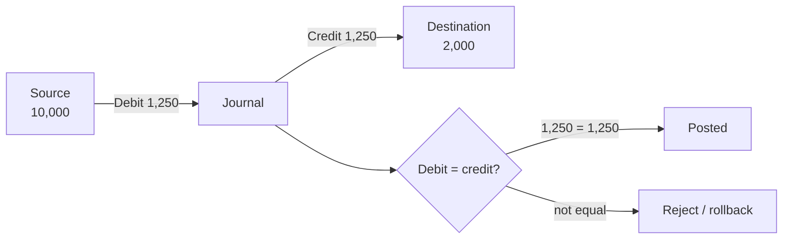

The numbers in this diagram are explanatory. Posted records are append-only; corrections are new compensating entries rather than edits.

### Idempotency truth table

| Tenant + actor + operation + key | Canonical fingerprint | Result |
|---|---|---|
| First submission | New | Reserve and execute exactly once |
| Retry | Same | Replay saved final outcome |
| Key reuse | Different | `idempotency_conflict` |
| Concurrent duplicate | Same, unfinished | bounded `request_in_progress` |

---

## Read-your-writes model

LedgerSync does **not** promise that Redis always answers a balance read. It promises that a post-transfer read either reaches the committed minimum balance version or reports unavailability honestly.

| Property | Rule |
|---|---|
| Financial authority | PostgreSQL projection committed with the transfer |
| Cache | Redis; disposable and rebuildable |
| Freshness proof | signed `(tenant, account, minimum version)` requirement |
| Validity | 10 minutes |
| Cache acceptance | `cached version ≥ required version` |
| Projection delay | bounded wait, then primary fallback |
| Redis loss | PostgreSQL answer and cache refill |
| Prohibited behavior | return an older cache answer as current |

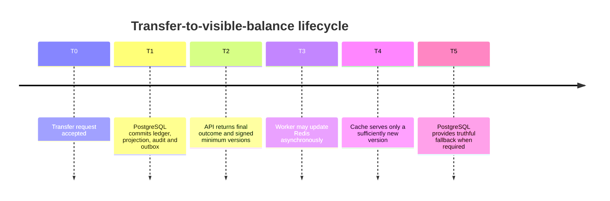

---

## Security model

| Layer | Control | Numeric boundary |
|---|---|---:|
| Browser session | HttpOnly, `Secure` in production, `SameSite=Lax` | 30-minute max-age |
| Browser mutation | same-origin CSRF | required on every cookie-authenticated mutation |
| BFF actor handoff | HMAC-signed actor assertion | ≤ 60 seconds |
| API identity | OIDC issuer/audience/signature/expiry checks | deny invalid claims |
| Authorization | tenant + subject + account predicate in PostgreSQL | one query boundary, not UI logic |
| Scopes | `accounts:read`, `transactions:read`, `transfers:write` | deny by default |
| Errors | safe public envelope | no account-existence disclosure |
| Runtime | private network, capability drop, no-new-privileges | app containers read-only |
| Secret values | independent managed inputs | minimum 32 characters/bytes where configured |

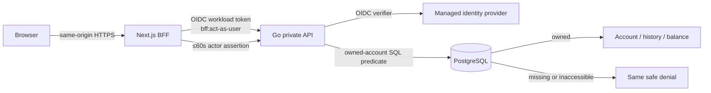

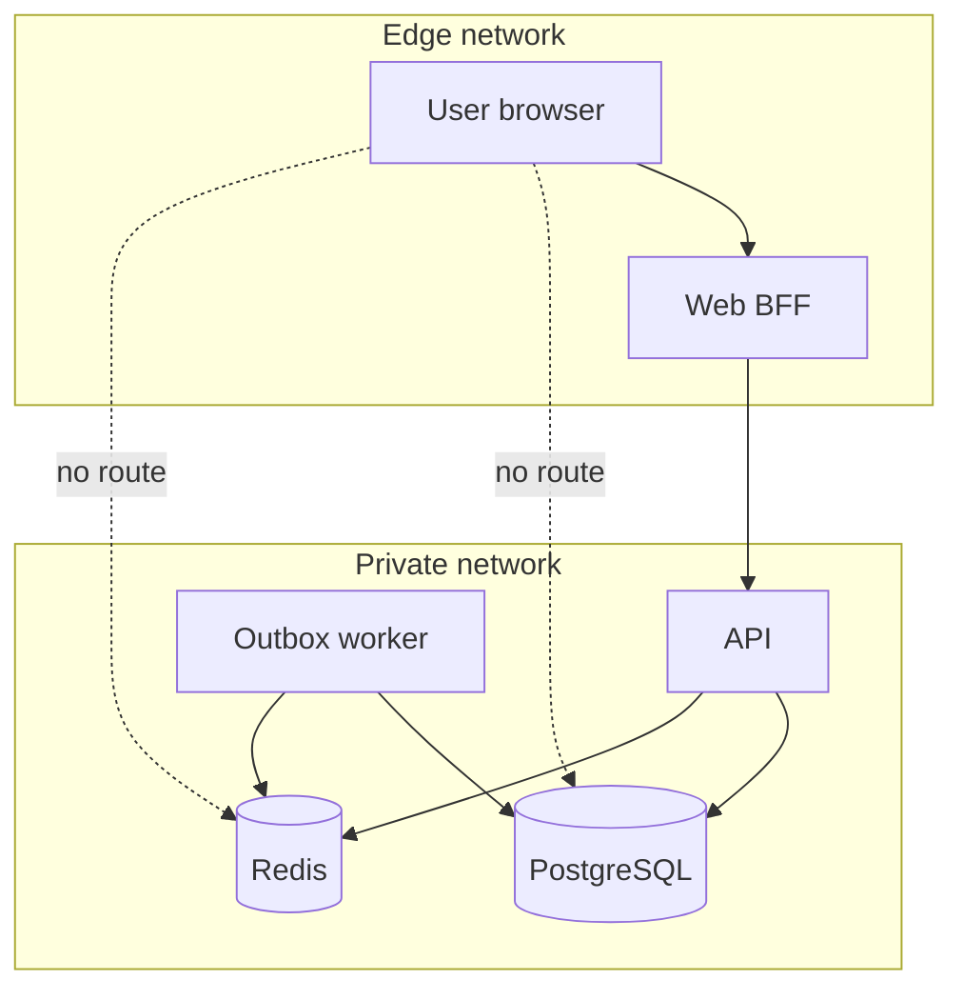

Administrative routes are deny-by-default until a privileged, audited operator surface exists.

---

## API surface

| BFF route | Method | Purpose | Key safety rule |
|---|---|---|---|
| `/api/me/accounts` | `GET` | List caller-owned accounts | ownership query + `accounts:read` |
| `/api/accounts/{id}/balance` | `GET` | Current-enough account balance | ownership + optional minimum version |
| `/api/accounts/{id}/transactions` | `GET` | Cursor-paginated history | ownership + page size **1–100** |
| `/api/transfers` | `POST` | Exact internal transfer | CSRF + idempotency key + exact money |

```json
{
  "sourceAccountId": "00000000-0000-0000-0000-000000000010",
  "destinationAccountId": "00000000-0000-0000-0000-000000000020",
  "amount": { "currency": "INR", "minorUnits": "1250" }
}
```

| Header | Required | Purpose |
|---|---:|---|
| `Idempotency-Key` | transfer only | safe retry and deterministic result |
| `X-CSRF-Token` | browser mutation | same-origin cookie protection |
| `Authorization` | private API | OIDC workload/user boundary |
| `X-LedgerSync-Consistency-Requirement` | optional balance read | minimum committed balance version |

See the [HTTP contract](specs/001-secure-transfer-core/contracts/http-api.md).

---

## Data model

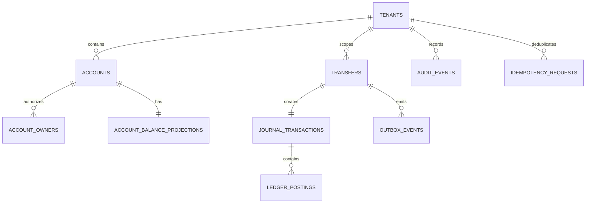

| Entity | Role | Mutability |
|---|---|---|
| `transfers` | customer-visible movement outcome | final after completion |
| `journal_transactions` | accounting group for a posted transfer | immutable |
| `ledger_postings` | debit/credit proof | append-only |
| `account_balance_projections` | authoritative current balance read model | updated with transfer transaction |
| `idempotency_requests` | fingerprint and retry outcome | final saved outcome |
| `outbox_events` | durable delivery intent | leased/retried, never financial authority |
| `audit_events` | sanitized security/operation evidence | append-only |

---

## Operations and recovery

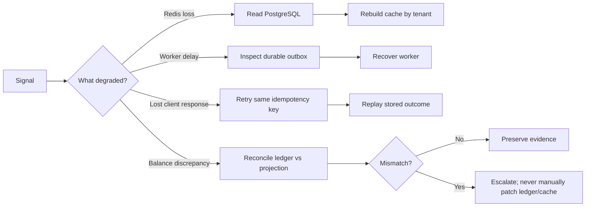

| Recommended operational metric | Formula | Decision use |
|---|---|---|
| Transfer success ratio | posted / all final outcomes | separate expected rejects from system defects |
| Idempotent replay ratio | replays / transfer submissions | identify client retry/network stress |
| Outbox delivery lag | `now - occurred_at` for unpublished event | projection-delay warning |
| RYEW primary fallback ratio | primary fallbacks / balance reads | cache efficiency without losing correctness |
| Unsatisfied minimum versions | requirement errors / balance reads | should be 0 while dependencies are healthy |
| Reconciliation mismatch count | unmatched ledger/projection accounts | release blocking when > 0 |
| Authorization denial rate | denied / protected requests | investigate abuse or broken integrations |

Runbooks: [audit events](docs/runbooks/audit-events.md) · [secret rotation](docs/runbooks/secrets-rotation.md) · [exact money ADR](docs/adr/0001-exact-minor-unit-money.md) · [immutable ledger ADR](docs/adr/0002-immutable-double-entry-ledger.md) · [outbox ADR](docs/adr/0003-transactional-outbox.md) · [RYEW ADR](docs/adr/0004-version-based-ryew.md).

---

## Quick start

The repository-root `docker-compose.yml` is the canonical local entry point and delegates to the supported topology in `deploy/compose/docker-compose.yml`. The archived `docker-compose.legacy-demo.yml` is retained only for historical reference; it is not a supported development, test, or production path.

| Dependency | Minimum |
|---|---:|
| Go | 1.22 |
| Node.js | 20.18 |
| PostgreSQL image | 16 |
| Redis image | 7.4 |
| Docker Engine + Compose | current supported release |

```powershell
# 1. Start or recover the complete supported topology. This preserves existing data.
.\scripts\start-local.ps1

# 2. Open the product.
Start-Process http://localhost:3000

# 3. Inspect or stop it without deleting PostgreSQL/Redis volumes.
.\scripts\status-local.ps1
.\scripts\logs-local.ps1 -Service api -Tail 100 -Since 15m
.\scripts\stop-local.ps1

# 4. Run focused developer verification when changing code.
$env:GOCACHE = "$PWD\.cache\go-build"
go test ./internal/... ./cmd/api ./tests/unit -mod=mod
npm --prefix web run test
npm --prefix web run lint
npm --prefix web run build
```

`start-local.ps1` validates Docker and Compose, waits for PostgreSQL and Redis health, requires migrations and the idempotent demo seed to finish, verifies every long-running service, and tests the real browser/BFF read path before printing “ready.” API startup never mutates the financial schema. The destructive reset command is deliberately separate and refuses to run without the exact confirmation documented in the [local runtime runbook](docs/runbooks/local-runtime-smoke.md).

To rebuild the disposable cache from PostgreSQL projections:

```powershell
go run ./cmd/reconcile --rebuild-cache --tenant-id <tenant-uuid>
```

This command does not create, change, or delete ledger entries.

---

## Developer and operator guides

The repository deliberately separates browser usability from the financial
authority. Read these guides before connecting a design partner or operating a
pilot environment:

- [Architecture and trust boundaries](docs/architecture.md)
- [Private API integration and idempotent transfer contract](docs/api-guide.md)
- [Operator console, incident response, and release ownership](docs/operations.md)
- [Performance measurement protocol](docs/performance-baseline.md)
- [Fault-injection scenarios](tests/fault/toxiproxy-scenarios.md)

---

## Evidence, roadmap, and license

### Evidence

- [Phase 3 — safe transfer core](docs/release-evidence/phase-3-safe-transfer-core.md)
- [Phase 4 — RYEW balance visibility](docs/release-evidence/phase-4-ryew-balance-visibility.md)
- [Phase 5 — account security](docs/release-evidence/phase-5-account-security.md)
- [Full product design brief](DESIGN.md)


### Implementation roadmap

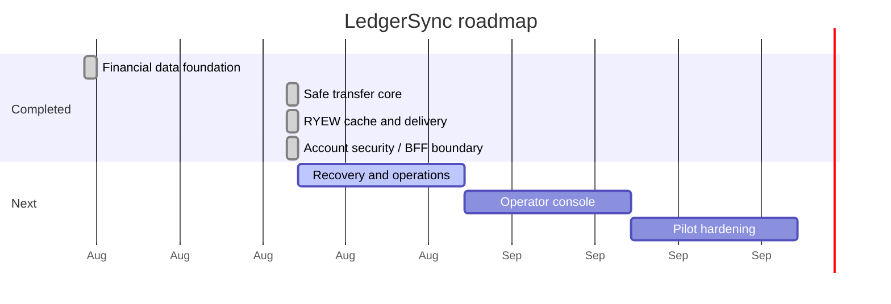

| Included now | Explicitly later |
|---|---|
| exact internal same-currency ledger transfers | bank rails, card payments, FX, custody |
| API, BFF foundation, authorization and RYEW | public self-serve onboarding and end-user wallet UI |
| OIDC token validation, BFF boundary, and authorization-code-with-PKCE callback | provider-specific tenant/role/scope claim mapping approval |
| outbox/cache recovery and reconciliation command | automated restore drills, full telemetry/SLO dashboards |

### License

Licensed under the [Apache License 2.0](LICENSE).
