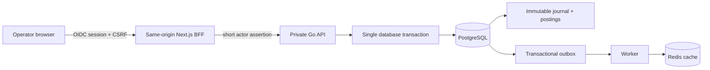

# Architecture and trust boundaries

LedgerSync is a closed-loop ledger service. It persists financial truth in
PostgreSQL and treats Redis as a rebuildable read optimisation, never a source
of truth.

## Non-negotiable boundaries

| Boundary | Rule |
|---|---|
| Browser to BFF | Browser accesses same-origin BFF routes only; session cookie is HttpOnly and mutations require CSRF. |
| BFF to private API | BFF adds a short-lived signed actor assertion and never forwards browser credentials. |
| Financial commit | Transfer, two postings, account versions, audit, idempotency outcome, and outbox rows commit or roll back together. |
| Cache | A cache answer must meet its signed minimum version; otherwise the service uses PostgreSQL or returns temporary unavailability. |
| Correction | Posted journal lines are immutable. Corrections are explicit compensating entries. |

The design does not include bank rails, cards, FX, or custody. A regulated-funds
launch needs a licensed partner and a separate compliance decision.
