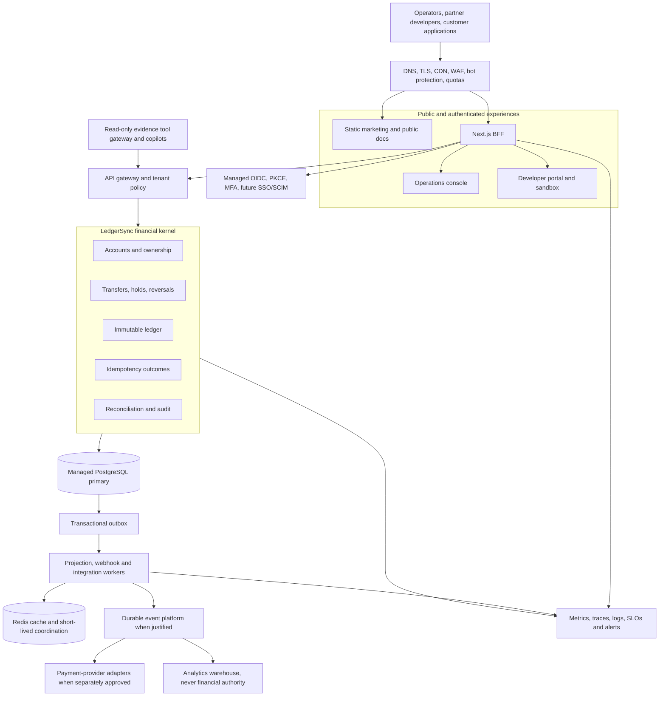
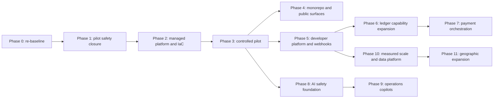

# LedgerSync future-scope implementation plan

> **Historical roadmap:** retained for strategic context. The [master completion plan](ledgersync-master-product-system-and-website-completion-plan.md) and [master delivery register](ledgersync-master-progress.md) are authoritative from 2026-08-28.

**Prepared:** 2026-08-24  
**Status:** implementation-ready strategic plan  
**Planning basis:** current repository, secure-transfer specification, architecture assessment, product roadmap, and pilot-readiness evidence  
**Primary decision:** preserve the financially correct modular core and expand through gated product capabilities; do not introduce global-platform complexity before measured need.

## 1. Outcome this plan is designed to produce

LedgerSync should mature in this order:

1. A trustworthy closed-loop ledger and internal-transfer platform.
2. A controlled design-partner product with reliable operations.
3. A developer platform with webhooks, sandboxing, SDKs, and integration evidence.
4. A richer ledger platform with holds, fees, reversals, limits, and approvals.
5. A payment-orchestration layer using separately reviewed provider adapters.
6. An evidence-based AI operations layer that cannot move money.
7. A geographically scalable financial platform only when demand, regulation, and measured load justify it.

This sequence matters. Website, AI, event platforms, payment rails, and regional
deployment must strengthen the ledger rather than create alternate sources of
financial truth.

## 2. Planning assumptions and decisions still required

### Confirmed from the repository

- The production financial path is a modular Go API plus an outbox worker.
- PostgreSQL owns transfers, immutable postings, authoritative projections,
  idempotency, audit evidence, reconciliation evidence, and the outbox.
- Redis is a versioned, rebuildable cache/event delivery mechanism.
- The Next.js application is a same-origin BFF and operator interface.
- OIDC, PKCE, secure sessions, CSRF protection, actor assertions, authorization,
  exact money, read-your-writes behavior, observability, and recovery evidence
  have implementation foundations.
- The v1 product is same-currency, closed-loop internal movement.

### Business decisions required before a shared pilot

| Decision | Owner | Why it changes implementation |
|---|---|---|
| Jurisdiction and legal entity | Founder/legal | Determines privacy, retention, financial licensing, and contractual boundaries. |
| Initial currency and limits | Product/finance | Determines precision, validation, risk, and pilot exposure. |
| Custody and regulated-funds boundary | Legal/finance | Determines whether LedgerSync is only a ledger or participates in regulated movement. |
| Two or three design partners | Product/sales | Provides real integration workflows and capacity assumptions. |
| Cloud and deployment region | Platform/security | Determines IaC, network, managed database, KMS, and recovery implementation. |
| OIDC provider and enterprise identity model | Security/product | Determines claim mapping, MFA, tenant lifecycle, SSO, and future SCIM. |
| Approved RPO/RTO and availability objective | Product/operations | Determines database/recovery cost and rollout gates. |
| Retention/deletion policy | Legal/privacy | Determines storage lifecycle for ledger, audit, logs, exports, and AI traces. |

Unresolved business decisions are release blockers, not invitations for
engineering assumptions.

## 3. Non-negotiable architectural rules

1. No floating-point value crosses a financial boundary.
2. Posted ledger history is append-only; corrections are compensating entries.
3. One logical request plus one idempotency key creates at most one movement.
4. Transfer, postings, projections, versions, audit, idempotency result, and
   outbox obligation commit in one PostgreSQL transaction.
5. Redis, replicas, analytics stores, search indexes, and AI are never financial authority.
6. Events are at-least-once; consumers are idempotent and version-aware.
7. Every financial object read/write is authorized server-side by tenant,
   actor, scope, and object ownership.
8. The browser communicates only with the same-origin BFF or approved public API.
9. No release bypasses reconciliation, authorization, retry, RYEW, security,
   migration, and restore evidence.
10. AI may inspect authorized evidence but may not initiate, approve, reverse,
    freeze, or correct money movement.

## 4. Target system shape



## 5. Proposed monorepo structure

The repository should move toward this shape only after current in-flight work
is committed and the existing build remains green:

```text
apps/
  operator-console/        # authenticated Next.js BFF and operations UI
  marketing/               # static public website; no financial sessions
  developer-portal/        # sandbox, API clients, webhooks, usage
  ops-copilot/             # later, internal-only AI interface

services/
  ledger-core/             # current Go API; modular financial kernel
  projection-worker/       # current outbox/cache worker
  webhook-worker/          # later, tenant webhook delivery
  payment-orchestrator/    # later and separately approved

packages/
  contracts/               # versioned OpenAPI, event and webhook schemas
  ui/                      # non-financial visual primitives
  financial-formatting/    # exact display/parsing helpers and test vectors
  auth-contracts/          # claims, scopes and actor assertion schemas
  observability/           # metric names and trace conventions
  ai-tool-contracts/       # later, read-only structured evidence tools

infra/
  environments/            # dev, staging, pilot, production IaC composition
  modules/                 # network, database, Redis, secrets, telemetry, edge
  policies/                # WAF, retention, backup and access policy

docs/
  adr/ runbooks/ product/ security/ release-evidence/ plans/
```

The initial migration is mechanical. Do not change public contracts, money
rules, authorization, or runtime behavior while moving directories.

## 6. Phase dependency map



Phases 7, 10, and 11 are conditional programs. They must not start simply
because earlier code is complete.

## Phase 0 — Repository re-baseline and delivery governance

**Purpose:** establish one truthful view of what is complete, in progress,
blocked, obsolete, and release-approved.

### Work

1. Reconcile specification, task tracker, release evidence, ADRs, migrations,
   current branch, CI, and actual runtime paths.
2. Finish or isolate the current in-flight security/rate-limit/reconciliation
   changes before beginning structural moves.
3. Identify production paths and legacy/demo paths. Add unmistakable warnings
   and CI controls that prevent legacy services from entering release images.
4. Establish code owners for financial kernel, identity/security, web/BFF,
   platform/recovery, contracts, and operations.
5. Define change classes:
   - financial invariant or schema change;
   - security/identity change;
   - public contract change;
   - ordinary product/UI change;
   - non-production tooling change.
6. Require appropriate reviewers and evidence for each class.
7. Create a roadmap progress register containing owner, status, dependency,
   evidence link, risk, and rollback state.

### Acceptance and verification

- Clean checkout passes supported build/test commands.
- Every enabled production route has an owning module, contract, and tests.
- Every migration is ordered, compatible, and represented in restore evidence.
- Legacy/demo components are excluded from production CI/deployment.
- No local agent or `SKILL.md` file is tracked.

### Rollback

This phase changes governance and documentation. Runtime changes are separated
into reversible commits. Do not delete legacy material until the replacement
has been operated successfully.

### Business benefit

Reduces wrong-topology deployments, contradictory documentation, and unowned
financial changes.

## Phase 1 — Close pilot financial, identity, and security gaps

**Purpose:** turn the implemented financial core into a complete pilot release candidate.

### Financial and data work

1. Re-run exact-money, concurrency, idempotency, immutable-ledger,
   reconciliation, cache ordering, and RYEW suites against fresh PostgreSQL and Redis.
2. Complete durable delivery-state and reconciliation-evidence migrations.
3. Verify database roles cannot update/delete ledger postings.
4. Define pilot transaction/account limits and enforce them atomically.
5. Verify idempotency retention covers the agreed retry and support window.

### Identity and API work

1. Complete OIDC issuer/audience/claim mapping for the selected provider.
2. Replace pilot static workload credentials with managed workload identity,
   or document a short-lived rotation-controlled exception.
3. Verify all private handlers require workload identity plus actor assertion.
4. Persist replay/rate-limit state in a shared atomic store before multiple API replicas.
5. Complete OpenAPI coverage for account, balance, history, transfer-detail,
   reconciliation, rate-limit, pagination, and stable error envelopes.

### UI work

1. Finish the prepare → review → confirm → final transfer journey.
2. Keep the same idempotency key across an unknown outcome and safe retry.
3. Show financial status separately from notification/webhook delivery status.
4. Display reconciliation claims only from authorized evidence.
5. Complete keyboard, screen-reader, mobile/tablet/desktop, zoom, overflow,
   offline, and error-state tests.

### Security/network work

- Deny internal dependencies from public ingress.
- Enforce production CSP/HSTS, CSRF, body limits, timeouts and identity/IP quotas.
- Verify logs/traces contain no tokens, personal data, raw balances, consistency
  requirements, or unrestricted request bodies.
- Complete threat model and security review for the target pilot topology.

### Exit gate

- Zero duplicate movement, overdraft, RYEW violation, unexplained mismatch,
  cross-tenant access, fictional financial evidence, or production demo-auth path.
- All automated release suites pass from a clean checkout.
- Product, finance, security, and engineering approve the pilot release candidate.

### Rollback

Deploy the prior compatible application image. Never roll back by editing
posted history. Use forward-compatible migrations and compensating entries.

## Phase 2 — Managed platform, infrastructure as code, and recovery

**Purpose:** create a reproducible, private, recoverable environment rather
than treating local Compose as production architecture.

### Platform work

1. Select cloud/region and create separate development, staging, pilot, and
   production accounts/projects.
2. Build reviewed IaC modules for:
   - DNS, certificates, CDN and WAF;
   - private network, subnets, routing and egress controls;
   - managed PostgreSQL HA/PITR;
   - managed Redis;
   - container runtime for web, API and workers;
   - secret manager/KMS and workload identity;
   - OTel collector, metrics, traces, dashboards and alert delivery.
3. Permit public ingress only to edge/BFF and approved partner API routes.
4. Use immutable images, non-root users, minimal capabilities, read-only
   filesystems where compatible, resource limits and health probes.
5. Implement automated promotion from staging to pilot with required evidence.

### Recovery work

1. Enable encrypted PITR and define backup retention.
2. Run an isolated restore into a separate network/account.
3. Apply migrations, run reconciliation, validate authorization and preserve evidence.
4. Verify Redis can be lost and rebuilt without becoming financial truth.
5. Approve RPO/RTO using observed drill results.

### Observability and SLOs

Establish dashboards and alerts for transfer p50/p95/p99, DB lock time, pool
pressure, rejection reasons, replay/conflict rate, outbox age, worker retries,
cache version miss, primary fallback, RYEW violation, reconciliation mismatch,
authorization denial, backup age, restore result and SLO burn.

### Exit gate

- One-command or pipeline-driven staging creation succeeds.
- Target-environment OIDC and alert delivery work.
- Restore/reconciliation meets approved RPO/RTO.
- Public network scan cannot reach API internals, Postgres, Redis, workers or diagnostics.

### Rollback

Use blue/green or revision rollback for stateless components. Infrastructure
changes require plan review and provider-native snapshot/restore safeguards.

## Phase 3 — Controlled design-partner pilot

**Purpose:** validate the product with a deliberately small customer cohort.

### Entry decisions

- Two or three named design partners.
- One approved jurisdiction, legal entity and currency.
- Written product limits, prohibited uses, support model and incident contacts.
- Signed data-processing, retention and security posture.

### Rollout

1. Partner sandbox integration using OpenAPI, retry guidance and test accounts.
2. Internal production-like rehearsal with real alerts and on-call ownership.
3. One-partner limited pilot with account and transfer limits.
4. Daily financial-control review covering reconciliation, RYEW, outbox,
   authorization, errors, latency, capacity and support burden.
5. Add second/third partner only after the observation window has no unresolved stop condition.

### Stop conditions

Immediately pause new movement for unexplained reconciliation mismatch, stale
balance shown as current, unauthorized access, duplicate movement, missing audit
evidence, failed restore proof, uncontrolled backlog, or a legal-scope breach.

### Exit gate

- Real partner workflows complete successfully.
- Zero unexplained financial mismatches and zero unauthorized disclosures.
- Support, finance and engineering can explain every material incident from evidence.
- Capacity and support measurements justify the next investment.

## Phase 4 — Formal monorepo and independent public surfaces

**Purpose:** improve ownership and deployment without changing financial behavior.

### Work

1. Introduce the target monorepo layout mechanically.
2. Move the existing Next.js BFF to `apps/operator-console` with unchanged
   session, CSRF, authorization and contract tests.
3. Create a static `apps/marketing` site with no dashboard cookie, private API
   route, production data, or secret.
4. Create `packages/contracts`, `packages/ui`, and financial-formatting test vectors.
5. Add affected-project builds and independent deployment pipelines.
6. Publish product overview, security posture, architecture, API entry point,
   status/support links and pilot contact flow using sanitized examples only.

### UI/performance requirements

- Static/cacheable public pages with optimized media and accessibility.
- Authenticated financial pages remain dynamic and `no-store` where necessary.
- Shared visuals cannot import financial authority/business rules into the browser.
- Enforce route JavaScript, LCP, INP and CLS budgets.

### Exit gate and rollback

Public site and console deploy independently. Contract tests and E2E journeys
remain unchanged. Roll back the directory migration as one mechanical commit if
build/deployment parity is not proven.

## Phase 5 — Developer platform, sandbox and reliable webhooks

**Purpose:** make LedgerSync adoptable without increasing direct support load.

### Developer platform

- Tenant applications, OAuth clients/API credentials and least-privilege scopes.
- Isolated sandbox tenants with deterministic fixtures.
- Interactive OpenAPI documentation, SDK generation and contract examples.
- Usage, quota and integration-health views.
- Credential rotation/revocation and audited administrator actions.

### Webhook platform

1. Store endpoint configuration and encrypted signing secrets per tenant.
2. Publish only from committed outbox/event data.
3. Sign timestamped payloads and document replay verification.
4. Record delivery attempt, response class, next retry and final dead state.
5. Apply bounded exponential backoff, jitter, endpoint timeout, circuit control,
   tenant concurrency and destination abuse protection.
6. Support authorized manual replay without recreating a financial event.
7. Keep financial completion distinct from webhook-delivery completion.

### Exit gate

- Generated SDK/examples pass contract tests.
- Duplicate webhooks do not duplicate customer effects in reference consumers.
- Secret rotation and endpoint compromise runbooks are exercised.
- Sandbox cannot access production tenants or credentials.

## Phase 6 — Ledger product capability expansion

**Purpose:** add commonly requested financial primitives without weakening the kernel.

Each capability requires its own specification, accounting examples, state
machine, migration, idempotency rules, authorization, reconciliation impact,
API contract, UI, limits, audit, tests and rollback plan.

### Recommended order

1. Holds/reservations and release/expiry.
2. Explicit available, pending and posted balance semantics.
3. Reversals and linked compensating transfers.
4. Fees with designated fee accounts and balanced postings.
5. Tenant/account limits and human approval policies.
6. Bulk transfer submission with per-item idempotency and bounded batches.
7. Multi-currency account support without conversion.

### Do not bundle into this phase

FX, bank settlement, cards, custody, chargebacks and cross-border movement are
distinct regulated/accounting programs.

### Exit gate

Every new state rebuilds from immutable postings, reconciles exactly, remains
safe under retries/concurrency, and is explainable to an operator and customer.

## Phase 7 — Payment orchestration and provider adapters (conditional)

**Start only when:** a licensed/approved partner, legal scope, settlement model,
customer need, operational owner and separate specification exist.

### Architecture

```text
Payment instruction
  -> limits/risk/human approval
  -> ledger hold
  -> payment orchestration
  -> provider adapter
  -> signed provider webhook
  -> settlement reconciliation
  -> final posting or hold release
```

### Work

- Stable provider-neutral payment state machine.
- Isolated adapters for authentication, request mapping, timeout/retry and webhooks.
- Provider idempotency plus LedgerSync idempotency.
- Settlement files/events and provider-to-ledger reconciliation.
- Manual review, exception queues, disputes and operational evidence.
- Regional/legal controls and per-provider circuit breakers.

### Exit gate

Provider outages cannot corrupt the ledger; ambiguous outcomes remain pending
and investigateable; settlement reconciliation has zero unexplained differences.

## Phase 8 — Agentic AI safety foundation

**Purpose:** establish controls before exposing an AI assistant.

### Architecture and tools

Build a separate, read-only evidence gateway with schema-validated tools:

```text
get_transfer_evidence
get_account_balance_evidence
get_ledger_entries
get_idempotency_status
get_delivery_status
get_audit_timeline
get_reconciliation_summary
get_service_health
search_approved_runbooks
```

### Controls

- Backend tenant/account/role authorization for every tool call.
- No direct DB, Redis, shell, cloud-console, secret-store or unrestricted-log access.
- Redaction before model input and output.
- Approved-document retrieval only; live financial facts come from tools.
- Audit user, model/version, prompt policy, tool calls, evidence, output and escalation.
- Rate, token, latency and cost budgets.
- Evals for prompt/document injection, cross-tenant requests, secret/PII
  extraction, fabricated evidence, tool overreach and financial-mutation requests.

### Exit gate

All tools are read-only and authorization-tested. Evidence citations are
traceable. AI-initiated financial mutations remain exactly zero.

## Phase 9 — Internal operations and investigation copilots

**Purpose:** reduce time to understand incidents while keeping humans responsible.

### Capabilities

- Explain whether a transfer is financially complete versus delivery-delayed.
- Assemble ledger, idempotency, outbox, cache, audit and reconciliation timelines.
- Suggest approved runbook steps.
- Draft sanitized incident summaries and escalation cases.
- Explain API errors and integration retry behavior.

Deterministic detectors—not the model—open signals for mismatch, aged outbox,
version regression, rejection spikes, authorization probing and dependency degradation.

### Exit gate

Operators resolve known cases faster, every conclusion cites evidence or states
that evidence is unavailable, false-positive/correction rates are tracked, and
the assistant cannot execute remediation or money movement.

## Phase 10 — Measured scaling and data platform

**Start only from observed triggers.**

| Change | Trigger | Mandatory safety condition |
|---|---|---|
| More API/worker replicas | sustained CPU/latency/backlog pressure | shared limits/replay controls and bounded DB pools |
| PostgreSQL read replica | measured history/report pressure after query/cache tuning | RYEW and financial commands still use primary |
| Partitioning/archival | table/index growth creates measured maintenance/query impact | reconciliation and restore remain provable |
| Kafka/NATS/RabbitMQ | multiple durable consumers, retention/replay, or throughput need | outbox remains commit bridge; idempotent consumers |
| Analytics warehouse | product/finance analytics demand | one-way sanitized feed; never transaction authority |
| Dedicated search | measured support/investigation need | tenant filtering, redaction, rebuildable index |

### Performance program

- Baseline normal, 10x and controlled 100x spike behavior.
- Measure query plans, lock waits, pools, event lag, cache hit/version rate,
  BFF/server rendering, route chunks and third-party dependencies.
- Implement quotas, load shedding, backpressure and graceful degradation before
  adding distributed infrastructure.

### Exit gate

Changes meet an approved SLO/capacity target and demonstrate lower total risk or
cost than tuning the existing system.

## Phase 11 — Geographic and organizational expansion

**Purpose:** serve multiple markets without unsafe active-active financial writes.

### Recommended progression

1. Global CDN/edge for public/static content.
2. Regional BFF/API read presence where privacy and latency require it.
3. One authoritative write region with managed HA and tested regional failover.
4. Regional ledger cells only when necessary; each cell owns a non-overlapping
   account/tenant set.
5. Cross-cell movement uses an explicit settlement protocol and independent
   reconciliation rather than distributed shared-table writes.

### Required programs

- Data residency and retention by jurisdiction.
- Regional incident/on-call ownership.
- Tenant placement and controlled migration.
- Region-aware keys, secrets, logs, backups and audit evidence.
- Localization, currency-policy and support readiness.

### Exit gate

Regional failure tests preserve ownership, idempotency, reconciliation and
recovery evidence. No design assumes distributed exactly-once delivery.

## 7. Cross-cutting implementation standards

### Code and architecture

- Domain modules contain financial rules, not HTTP/database/UI concerns.
- Application modules coordinate use cases through narrow interfaces.
- Platform adapters own PostgreSQL, Redis, identity, events and telemetry.
- Transport modules validate external contracts and map safe errors.
- Avoid generic frameworks that obscure transaction boundaries.

### Database

- Forward-compatible migrations with explicit deployment order.
- Constraints enforce invariant-shaped data where PostgreSQL can do so safely.
- No runtime production DDL or hidden seeds.
- Query plans and indexes are reviewed using realistic tenant/account volumes.
- Financial deletion/retention behavior requires legal and accounting approval.

### Networking

- Default deny between public, application, data, management and observability zones.
- TLS on public and platform-required internal boundaries.
- Restrict workload egress to approved dependencies.
- Every timeout/retry/circuit policy is explicit and tested.

### Security and privacy

- Threat model each new trust boundary and integration.
- Managed keys/secrets, rotation, revocation and access audit.
- Least-privilege service and database roles.
- Sanitized logs/traces/support exports and defined retention.
- Supply-chain gates, pinned artifacts, SBOM and provenance.

### UI and progressive rendering

- Render shell/context early; progressively load large histories and evidence.
- Never replace unknown financial state with a plausible placeholder.
- Preserve exact amount/currency, tenant, status, ID and evidence at every viewport.
- Use one semantic component tree across responsive layouts.
- Accessibility and error recovery are release requirements.

### Testing

- Unit: exact money, state machines, authorization, formatting, redaction.
- Contract: OpenAPI, events, webhooks, actor assertions and generated clients.
- Integration: migrations, locks, idempotency, outbox, cache, reconciliation.
- Fault: lost response, dependency loss, replay, delay, failover and restore.
- E2E: identity, transfer/retry, investigation, responsive and accessibility journeys.
- Performance: normal, 10x, controlled spike, backlog and degraded dependencies.
- Security: cross-tenant denial, abuse limits, secret/PII leakage and supply chain.

## 8. Release, commit, and evidence protocol

Complete one phase or independently releasable phase slice at a time.

1. Confirm the phase entry gate.
2. Write/update tests before financial or authorization behavior.
3. Implement in small, dependency-ordered tasks.
4. Run relevant local suites and CI-equivalent checks.
5. Update contracts, ADRs, runbooks, release evidence and roadmap status.
6. Review the exact diff; never stage unrelated working-tree changes.
7. Commit and push using a clear message such as:

```text
feat(<scope>) : <phase outcome>

- <implemented capability>
- <safety or reliability control>
- <verification and evidence>
```

8. Do not start the next gated phase until the required evidence and business
   approvals exist.

## 9. Priority view

### Now

- Phase 0 repository re-baseline.
- Complete current pilot security, rate-limit and evidence work.
- Decide jurisdiction, currency, cloud, IdP, design partners and RPO/RTO.
- Phase 1 release-candidate closure.
- Phase 2 managed platform and real recovery proof.

### Next

- Phase 3 controlled pilot.
- Phase 4 monorepo/public site after pilot contracts stabilize.
- Phase 5 developer platform, sandbox and webhooks.
- Phase 8 read-only AI safety foundation if operational evidence is mature.

### Later

- Holds, reversals, fees, approvals and bulk operations.
- Payment orchestration with licensed/approved partners.
- AI operations copilots.
- Read replicas, durable event platform and analytics after measured triggers.
- Regional cells after market, residency and availability needs justify them.

### Do not implement yet

- Active-active multi-region ledger writes.
- Large microservice estate, Kubernetes or service mesh for aesthetics.
- GraphQL as the financial command interface.
- Event sourcing as the sole financial truth.
- Autonomous AI financial actions.
- FX, custody, cards or payment rails without separate legal/accounting specifications.

## 10. Success measures

### Financial safety

- Zero duplicate movements from retries.
- Zero concurrency overdrafts.
- Zero unexplained ledger/projection mismatches.
- Zero stale balances represented as current after a completed transfer.
- Every posted movement has balanced, immutable, explainable evidence.

### Reliability and performance

- Approved RPO/RTO met by real restore drills.
- Transfer and balance SLOs met at agreed pilot and growth capacity.
- Bounded outbox/webhook backlog and tested recovery.
- Predictable degraded behavior during Redis, DB, identity and provider failures.

### Security and privacy

- Zero cross-tenant disclosures in automated and manual security testing.
- No production secrets or prohibited financial/PII content in code, logs or traces.
- Every privileged action is least-privilege, time-bounded where appropriate, and audited.

### Product and business

- Two or three design partners integrate and operate successfully.
- At least 95% of representative users complete the primary journey on first attempt.
- Integration time, support burden and incident investigation time decrease.
- New infrastructure is introduced only with a documented trigger and measurable benefit.

### AI

- Every financial conclusion cites authorized evidence or states it is unavailable.
- Cross-tenant and prompt-injection evals pass.
- Human correction and escalation rates are measured.
- AI-initiated financial mutations remain exactly zero.

## 11. Immediate execution sequence

1. Finish and validate the currently modified security/rate-limit/reconciliation files.
2. Re-run the complete repository quality and fault suite.
3. Commit/push that slice independently with release evidence.
4. Complete Phase 0 progress/status reconciliation.
5. Obtain the eight business/platform decisions listed in Section 2.
6. Execute Phase 1 gaps and Phase 2 managed-environment work.
7. Do not begin the live pilot, payment rails, AI copilot or structural monorepo
   migration until their entry gates are satisfied.

## Final recommendation

LedgerSync should protect its current advantage: a small financial core whose
correctness can be explained and proven. The improved plan builds outward in
layers—operations, developer experience, richer ledger primitives, payment
adapters, AI assistance and geographic scale—while preserving one authoritative
ledger and refusing complexity that lacks a customer, regulatory, reliability,
or capacity justification.
