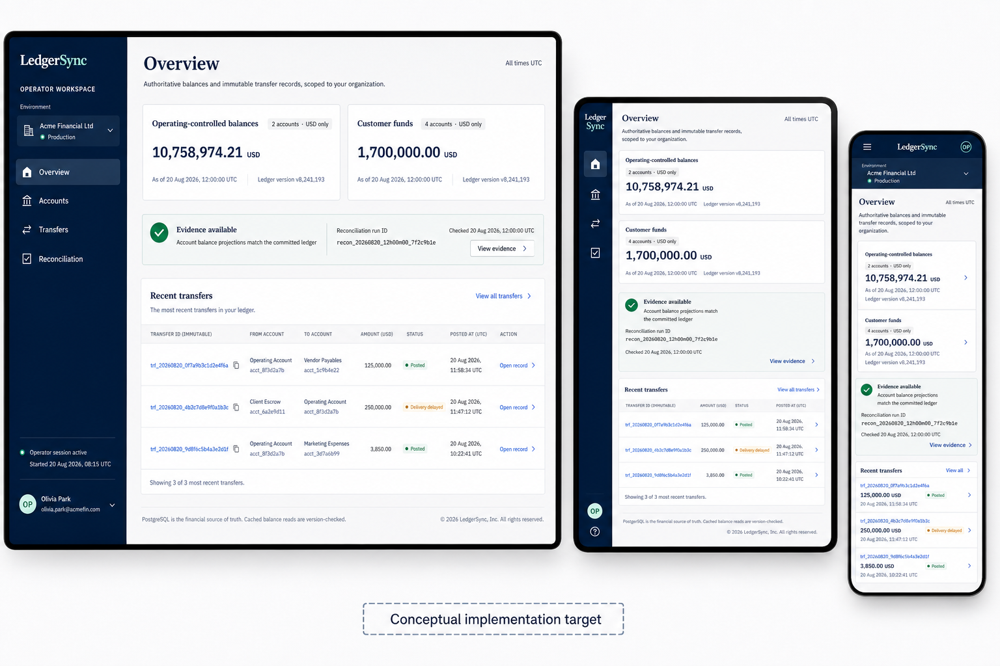
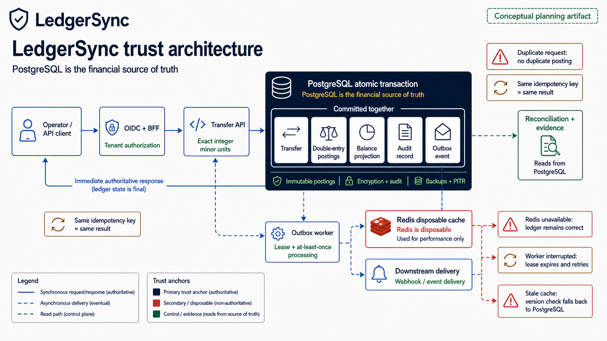
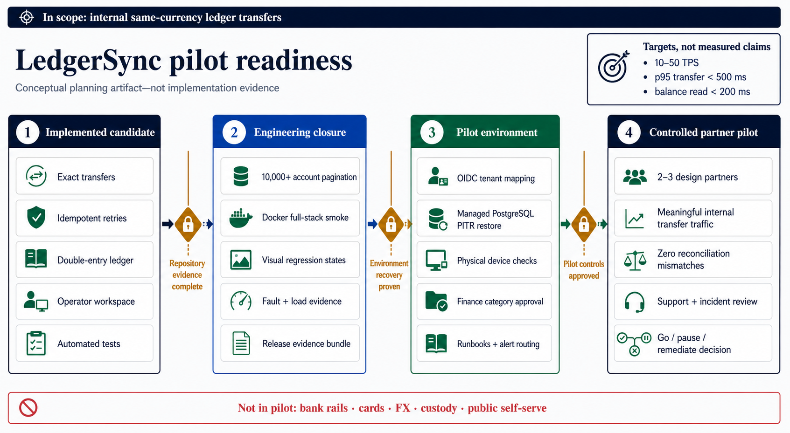

# LedgerSync Implementation Plan

**Document type:** evidence-led implementation, hardening, and controlled-pilot plan  
**Prepared:** 23 August 2026  
**Architecture-audit amendment:** 24 August 2026  
**Product boundary:** API-first, closed-loop, internal same-currency ledger transfers  
**Current stage:** locally implemented prototype with a credible financial core; stop-ship cross-boundary, reconciliation, delivery, security, lifecycle, and scale remediation remains before it may be called an MVP candidate  
**Plan authority:** this document consolidates the PRD direction, `DESIGN.md`, the secure-transfer specification, the existing implementation, release evidence, decision registers, and the generated planning visuals. It does not weaken the LedgerSync Constitution or replace financial-core invariants.

> LedgerSync exists to make every transfer exact, explainable, and visible when it matters. This plan turns the current locally evidenced candidate into a controlled production pilot without pretending that repository tests alone prove provider recovery, regulatory positioning, physical-device usability, or partner operations.

---

## 1. Document Purpose

This plan defines the remaining work required to move LedgerSync from its current implemented local candidate to a production pilot with two or three design partners. It is written for engineering, product, design, finance, security, operations, legal/compliance reviewers, and non-technical stakeholders.

The intended outcome is not a public launch and not a bank-transfer product. The outcome is a controlled, API-first ledger pilot that can demonstrate, with stored evidence, that:

- authorized users see only their tenant-scoped accounts and records;
- an internal same-currency transfer moves an exact integer amount once;
- network retries cannot create a second financial movement;
- every posted transfer has immutable balanced debit and credit postings;
- the initiating client can read a balance at least as current as the completed transfer;
- PostgreSQL remains authoritative when Redis, a worker, a browser, or a notification dependency fails;
- operators can investigate accounts, transfers, delivery, and reconciliation across supported screen sizes;
- backup, restore, reconciliation, incident response, and release controls are demonstrated rather than merely documented;
- scope, custody posture, jurisdiction, currency, operating limits, and accountable decision roles are approved before external traffic.

This is a continuity plan. Already completed work is treated as a foundation to verify and preserve. It is not scheduled for needless rebuilding.

---

## 2. Project Foundation

### Core Vision

LedgerSync is dependable ledger infrastructure for fintech product teams and vertical-SaaS teams building wallets, credits, internal payouts, escrow-like balances, and internal account systems. The API is the primary product. The operator workspace exists to inspect, explain, reconcile, and safely operate that API-backed financial state.

The public promise is: **“Every transfer is exact, explainable, and visible when it matters.”**

### Problem Being Solved

Companies lose trust when a retry duplicates a transfer, a cache displays stale money, an operator cannot explain a balance, or a recovery procedure is discovered only after an incident. Typical dashboard-first products hide these risks behind attractive screens. LedgerSync treats correctness, authorization, auditability, recovery, and truthful visibility as product behavior.

### Target Users

1. **Partner integration engineer** — integrates LedgerSync accounts, transfers, idempotency, balance, history, and evidence APIs into a product.
2. **Finance/operations investigator** — searches an account or transfer, understands posted financial state separately from delivery state, retrieves immutable evidence, and handles reconciliation exceptions.
3. **Security/platform operator** — configures identity, secrets, private networking, observability, backups, restores, and incident response.
4. **Product/risk decision-maker** — approves the pilot boundary, transfer policies, limits, finance terminology, and rollout gates.

### Current Project Stage

The repository is a locally implemented design-partner demonstration candidate, not an externally approved production system. Verified repository evidence records:

- exact-money primitives and immutable double-entry transfer posting;
- persistent idempotency, lost-response replay, conflict handling, and concurrent-debit protection;
- PostgreSQL authority, transactional outbox, version-aware Redis cache, and read-your-writes handling;
- account authorization, OIDC validation foundations, BFF session/CSRF boundaries, audit policy, and secret/network control scaffolding, subject to the Phase 0A/0C defects below;
- telemetry, alerts, reconciliation scaffolding, backup/PITR templates, recovery runbooks, and fault suites, subject to Phase 0B/0D evidence correction;
- responsive account, transfer, and reconciliation operator journeys using production-shaped BFF/API route contracts; critical Playwright fixtures are currently intercepted and are not cross-runtime proof;
- passing Go, web unit/security/semantics, Next.js build, Playwright, static bundle-budget, and Compose configuration checks at the recorded release-evidence checkpoint; those checks do not override the architecture-audit failures.

The 24 August 2026 architecture audit originally found cross-runtime identity, exact-money JSON, reconciliation, delivery, timeout/rate/policy, database-role, audit, retention, OpenAPI, currency, account-directory, Docker, and visual-evidence gaps. T097–T114 and T079–T096 now close those repository-addressable items with contract, database, browser, Linux/Windows visual, real-stack, and release-manifest evidence. The detailed historical findings remain in `docs/reviews/2026-08-24-architecture-assessment.md`.

The remaining gaps are not silently converted into code passes:

- the original concentrated 50 TPS conflict is remediated; the enforced local pilot envelope is 25 TPS with 30 total attempts/second, and a five-minute 50 TPS run provides 2× service headroom;
- physical iOS, Android, tablet, laptop, and desktop evidence remains incomplete;
- finance-approved account aggregation/terminology and security/risk-approved roles, limits, and pause authority remain unsigned;
- managed Cognito, renewable workload identity, private AWS infrastructure, alert routing, provider PITR, and production secret rotation are not deployed;
- legal/custody/retention approval, an operational tabletop, a consenting design partner, live operating evidence, and graduation signatures remain external gates.

### Architecture Audit Correction

The earlier continuity plan correctly avoided a rewrite, but it was too optimistic about the integration layer around the ledger core. The optimal course is **targeted remediation before expansion**: preserve the proven double-entry/idempotency transaction, repair every boundary that can misrepresent or block that truth, and only then resume scale, UI, environment, and partner work.

| Severity | Proven gap | Why it is a release blocker | Required closure phase |
|---|---|---|---|
| Critical | BFF assertion time units and scope/token contract disagree with the Go verifier | A valid signed-in operator may be denied, while ad-hoc static credentials can hide the broken production path | Phase 0A |
| Critical | Financial minor units/versions use JSON numbers in implemented response types | JavaScript rounds values above `Number.MAX_SAFE_INTEGER`, violating the exact-money promise | Phase 0A |
| Critical | Reconciliation uses incomplete comparison coverage and aggregate-only evidence | A missing projection or zero-account run can be reported as matched | Phase 0B |
| High | Delivery is inferred from outbox/cache publication | A rejected transfer or unpublished notification can be labelled delivered without delivery evidence | Phase 0B |
| High | Rate limits, timeouts, transfer/velocity limits, least-privilege DB roles, and comprehensive audit hooks are incomplete | Abuse or dependency failure can become an availability, integrity, or investigation problem | Phase 0C |
| High | OpenAPI, runtime behavior, TypeScript types, license metadata, and cross-runtime tests drift | Integrators can build against a contract the running product does not honor | Phases 0A and 0D |
| High | Retention, partitioning, dead-event replay, and bounded Redis streams are incomplete | Data grows without an operated lifecycle and dead work becomes terminal or opaque | Phase 0D |
| High | One-currency pilot policy is documented but not enforced across all boundaries | Mixed-currency data can produce misleading totals and an invalid pilot claim | Phase 0C |

**Correction rule:** Phase 0A through Phase 0D are mandatory stop-ship phases. They supersede the former instruction to begin account-scale work immediately. Existing Phases 1–9 remain valid but cannot start as pilot-readiness work until the corrective acceptance gates pass.

### Existing Components

| Layer | Existing responsibility | Preserve because |
|---|---|---|
| Go domain/application core | Exact money, accounts, transfer invariants, ledger postings, idempotency, reconciliation | It is the financial correctness boundary. |
| PostgreSQL schema/repositories | Transfers, journals, postings, projections, audits, idempotency, outbox, evidence | It is the source of financial truth. |
| Outbox worker | Leased at-least-once delivery, cache publication, retry/dead-event handling | It decouples delivery without weakening the commit. |
| Redis | Versioned, rebuildable read acceleration | It improves read latency but has no financial authority. |
| Private HTTP API | Authorized typed account, transfer, balance, history, and reconciliation contracts | It keeps domain rules server-side. |
| Next.js BFF/operator workspace | Secure same-origin session boundary and operator investigation UI | It prevents the browser from becoming a financial or identity authority. |
| Observability/recovery assets | Metrics, alerts, dashboards, runbooks, backup/PITR templates, release evidence | They convert failures into controlled operational work. |
| Test suites | Unit, contract, integration, fault, security, accessibility, responsive, performance scaffolding | Financial claims require reproducible evidence. |

### Locked Decisions

These decisions must not change inside this plan:

1. PostgreSQL is the financial source of truth.
2. Money is currency plus integer minor units; no floating-point value crosses a financial path.
3. Every completed transfer produces immutable double-entry postings.
4. Idempotency is enforced persistently on the server; a repeated key and matching request return the same result.
5. Transfer, postings, balance versions, stable response, audit obligation, and outbox record commit or roll back together.
6. Redis is disposable and may never determine financial correctness.
7. The pilot moves value only between LedgerSync accounts in one currency.
8. Production identity uses managed OIDC through the BFF; LedgerSync does not build custom passwords or token lifecycle.
9. The dashboard is an operator tool. API integration remains the primary product surface.
10. Posted financial history is not edited or deleted. Corrections use linked compensating entries.
11. Bank rails, cards, FX, custody, public self-service, and native consumer applications are outside this pilot.
12. The selected UI language remains deep navy, off-white document surfaces, cobalt actions, evidence green, restrained amber/red, editorial titles, compact sans UI, and monospace identifiers.

### Stable Decisions

- A production-blocked deterministic demo session may support local development and demonstration through real contracts.
- Dashboard transfer creation is read-only by default in production and requires explicit tenant policy plus `transfers:write` authority.
- Mobile, tablet, laptop, and desktop use one semantic component tree and shared view models.
- Financial posting status, notification/webhook delivery status, and reconciliation status are separate fields and UI concepts.
- Progressive disclosure follows: overview → record detail → immutable evidence/raw structured context.
- Cursor pagination is required for large account and history collections.
- Healthy-dependency pilot targets are 10–50 TPS, p95 transfer completion below 500 ms, and balance reads below 200 ms. These are targets, not current production claims.

### Confirmed Constraints

- One production jurisdiction and one currency must be selected for the pilot.
- Isolated tenant/VPC-style cloud deployment is the launch posture.
- Regulated funds require a licensed banking/payment partner; otherwise positioning remains non-custodial ledger infrastructure.
- The first production release is a controlled pilot with two or three design partners, not public self-service.
- No new infrastructure complexity such as Kubernetes, service mesh, Kafka, or active-active financial writes is justified without measured need.
- No enabled UI control may remain a placeholder.
- Financial pages must state tenant/environment context and UTC time context.

### Success Criteria

The controlled pilot is successful only when all applicable criteria are evidenced:

- two or three approved design partners are onboarded in controlled sequence;
- at least 10,000 accounts can be listed, searched, filtered, paginated, opened, and returned from without losing context;
- meaningful agreed internal transfer traffic runs within approved limits;
- duplicate retry and lost-response tests show zero duplicate movements;
- reconciliation produces zero unexplained mismatches;
- a provider-backed isolated restore drill is completed and reconciled;
- audit evidence is available for sensitive and financial operations;
- production identity, tenant mapping, secrets, networking, alerts, and incident ownership are configured;
- supported physical device and accessibility checks pass;
- measured production-like latency and throughput meet approved targets or produce an explicit pause/remediation decision;
- known limitations and regulatory positioning are documented accurately.

---

## 3. Final Requirements

### Functional Requirements

| ID | Requirement |
|---|---|
| FR-001 | An authenticated principal can retrieve only accounts authorized for its tenant, subject, role/scope, and object relationship. |
| FR-002 | Account directories support server-side search, filter, stable cursor pagination, and return-to-list state at 10,000+ accounts. |
| FR-003 | Account detail includes currency, exact balance, balance version, authoritative as-of time, status, postings/history, and permitted audit context. |
| FR-004 | An authorized caller can submit an exact same-currency internal transfer with a persistent idempotency key. |
| FR-005 | A repeated matching idempotent request returns the same final result without a second transfer; a changed request with the same key conflicts. |
| FR-006 | A posted transfer atomically creates the transfer outcome, journal, balanced debit/credit postings, balance versions, audit obligation, and outbox events. |
| FR-007 | A transfer response exposes a stable immutable ID, final financial status, exact amount/currency, accounts, timestamps, and consistency requirement. |
| FR-008 | Immediate balance reads satisfy the completed transfer’s minimum version or return truthful temporary unavailability; they never label an older value current. |
| FR-009 | Transfer list/detail separates financial posting status from webhook/notification delivery status. |
| FR-010 | Reconciliation list/detail exposes only authoritative persisted runs and mismatches; missing evidence is shown as unavailable, never inferred as passed. |
| FR-011 | Operator flows support prepare → review → confirm → posted/rejected/unknown outcome; unknown outcomes retain the same idempotency key. |
| FR-012 | Outbox work is leased, retried with backoff, observable, and recoverable after interruption without changing committed ledger postings. |
| FR-013 | Redis cache records are versioned, expire, rebuild from PostgreSQL-derived state, and yield to PostgreSQL when absent, stale, or unavailable. |
| FR-014 | Immutable financial/audit evidence is copyable and reachable by stable object-specific routes. |
| FR-015 | Local demo data is deterministic, stored in PostgreSQL, uses real BFF/API paths, and cannot start under production configuration. |

### Architecture Remediation Requirements

These requirements close mismatches found between the intended architecture and the current implementation. They are additive and do not rename the existing public API.

| ID | Requirement |
|---|---|
| AR-001 | The BFF actor assertion and Go verifier use one documented contract: NumericDate values in Unix seconds; bounded lifetime; required issuer, audience, key identifier, unique assertion ID, tenant, subject, role/scope claims; allowlisted scopes; key rotation; and replay/expiry tests. |
| AR-002 | The BFF authenticates to the private API using a renewable least-privilege workload credential. Static local tokens are demo-only, time-bounded, production-blocked, and never treated as the production identity design. |
| AR-003 | Every minor-unit amount, aggregate, balance, version, and other potentially unsafe integer crosses JSON as a canonical decimal string. Parsing is checked at every Go, OpenAPI, generated/manual TypeScript, BFF, and UI boundary, including signed 64-bit extremes. |
| AR-004 | Reconciliation compares a complete declared scope at a consistent database snapshot/watermark, detects missing and extra projections, refuses a pass for unverified or empty unintended scope, persists each mismatch with expected/observed evidence, and emits immutable audit evidence. |
| AR-005 | Financial posting status, outbox publication status, and actual downstream delivery status are separate persisted concepts. Delivery status derives only from durable delivery-attempt evidence, never from the absence of an outbox row. |
| AR-006 | Public and private HTTP boundaries enforce documented request/body/header limits, bounded server and upstream timeouts, per-principal/tenant rate limits, and stable `429`/timeout error semantics without weakening idempotent retry safety. |
| AR-007 | Transfer amount, daily/rolling velocity, account status, tenant policy, role/scope, and approved destination-credit policy are enforced server-side in the financial transaction path and are covered by concurrency tests. |
| AR-008 | Migration, API, worker, reconciliation, and read-only/support workloads use distinct least-privilege database roles. Ledger, idempotency, audit, and reconciliation evidence are append-only to runtime roles except through narrowly approved procedures. |
| AR-009 | Immutable audit coverage includes transfer decisions, authentication/authorization denials, reconciliation runs/mismatches, privileged configuration or replay actions, secrets/credential lifecycle events where available, and recovery evidence, with redaction and correlation rules. |
| AR-010 | The OpenAPI document describes every supported MVP route and matches runtime methods, request/response schemas, string money/version fields, error envelopes, pagination, `429` behavior, and Apache-2.0 license metadata. Contract checks block drift. |
| AR-011 | The configured pilot currency is enforced for tenant/account creation, transfers, aggregation, reconciliation, API presentation, demo fixtures, and UI formatting. Unsupported or mixed currency is rejected or rendered separately, never silently merged. |
| AR-012 | Outbox, delivery attempts, idempotency, audit, reconciliation, and Redis stream data have approved retention, bounded growth, partition/cleanup strategy, metrics, and safe operational procedures that preserve mandated financial/audit evidence. |
| AR-013 | Dead outbox/delivery work has a reviewed inspect-and-replay workflow with authorization, reason, correlation, deduplication, audit, and no ability to mutate committed financial postings. Worker persistence failures are surfaced and retried or alerted. |
| AR-014 | Tests exercise the actual TypeScript assertion producer and response decoders against the real Go verifier/API and real PostgreSQL/Redis dependencies; fully mocked browser tests cannot serve as the only cross-boundary evidence. |
| AR-015 | Account and history collections are bounded and cursor-paginated, use indexes matching their ordering predicates, and expose explicit load/error/empty states. A failed history fetch must not be rendered as a successful empty history. |

### Non-Functional Requirements

- **Correctness:** zero duplicate movements, zero overdrafts caused by races, balanced postings for every posted transfer, and zero unexplained reconciliation differences.
- **Performance:** prove the agreed 10–50 TPS workload, p95 transfer under 500 ms, and p95 balance read under 200 ms with healthy dependencies in a production-like environment. Record p50/p95/p99, lock waits, pool saturation, worker lag, cache fallback, and error distribution.
- **Scalability:** support 10,000+ accounts and meaningful history through indexed cursor queries; no full-dataset browser load.
- **Availability semantics:** dependency failure produces correct committed state, explicit rejection, or truthful temporary/unknown outcome. It must not produce a false success or stale-current label.
- **Maintainability:** domain invariants remain outside handlers/components; adapters remain narrow; shared UI state, money, status, route, and pagination logic is centralized.
- **Observability:** every request/event has a safe correlation path; financial metrics, outbox age, cache fallback, reconciliation mismatch, backup age, and restore evidence are queryable.
- **Recoverability:** approved RPO/RTO, encrypted backups, isolated restore, application/schema compatibility, cache rebuild, and reconciliation are tested.

### User Experience Requirements

- The visual baseline is the responsive operator concept in Section 5.
- Every screen must remain truthful in populated, loading, empty, error, offline, permission-denied, unknown-outcome, and evidence-mismatch states where applicable.
- Tenant, environment, UTC context, amount/currency, financial state, immutable ID, and evidence provenance remain visible or reachable at every supported size.
- Compact layouts use evidence cards when comparison is not essential; comparison tables remain labeled and keyboard-scrollable when they are essential.
- There is no page-level horizontal overflow at supported widths.
- Controls provide observable outcomes, disabled explanations, focus restoration, and accessible announcements.
- Status is never conveyed by color alone.
- No consumer-wallet theatrics, gradients, glassmorphism, animated balances, decorative charts, or fake analytics are introduced.

### Technical Requirements

- Go domain/application core, PostgreSQL, Next.js BFF/operator workspace, Redis disposable cache, and outbox worker remain the approved stack.
- JSON money boundaries use currency plus integer minor units encoded as strings when required to avoid JavaScript precision loss.
- Public/private API contracts remain versioned and schema-validated.
- Protected queries include tenant/object authorization predicates server-side.
- Financial writes use short reviewed transactions, deterministic lock ordering, database constraints, and tested retry classification.
- List APIs use stable cursors, bounded limits, deterministic ordering, and indexed query paths.
- Containers run non-root, expose only required ports, use health/readiness checks, and keep diagnostics behind a non-default profile.

### Business Requirements

- Product messaging remains ledger infrastructure unless a licensed partner and regulated-funds responsibility model are formally approved.
- Partner contracts state the supported currency, jurisdiction, role model, limits, retention, support, incident, recovery, and known limitations.
- Console transfer writes remain disabled until a partner-specific policy, roles, and limits are approved.
- Pilot rollout is staged: internal demo → production-like synthetic tenant → first limited partner → second/third partner after stable evidence.
- Public self-service and broader money movement require separate product and risk programs.

### Security and Privacy Requirements

- Managed OIDC authorization-code-with-PKCE login terminates at the BFF; browser sessions use secure HttpOnly cookies and mutations require CSRF protection.
- BFF-to-private-API identity assertions are short-lived, signed, audience-bound, and cannot be reused as browser credentials.
- Secrets come from managed configuration and follow rotation/revocation procedures.
- Logs, traces, analytics, and error envelopes exclude secrets, tokens, unnecessary PII, and full financial payloads.
- Input schemas, request sizes, rate limits, timeouts, headers, and safe error mapping are enforced.
- Admin and financial mutations are least-privileged and audit-recorded.
- Security posture is documented as assessed evidence; the product must not claim regulatory compliance without the relevant assessment and approval.

---

## 4. Assumptions and Unknowns

### Confirmed Information

- The pilot is API-first, closed-loop, same-currency, and internal-account only.
- The daily integration user is an engineer; the daily investigation user is finance/operations/support.
- The dashboard is required; a consumer end-user application is not.
- PostgreSQL is authoritative and Redis is disposable.
- The initial pilot targets two or three design partners, 10,000+ accounts, 10–50 TPS, p95 transfer below 500 ms, p95 balance read below 200 ms, and zero reconciliation mismatches.
- Current repository evidence supports a local candidate but not an external-production approval.

### Assumptions Used

1. Superseded on 2026-08-24: finance/product selected INR as the India pilot currency; supported fixtures and launch controls use integer paise.
2. The production position is non-custodial ledger infrastructure unless legal/product explicitly approve a licensed-partner model.
3. Current and previous Chrome/Edge, current Firefox, and current Safari/iOS Safari remain the proposed browser matrix until partner environment data is available.
4. Initial recovery proposals remain RPO at most five minutes and RTO at most sixty minutes until operations approves or changes them.
5. Dashboard transfer creation remains read-only by default and is enabled only for an explicitly approved tenant and role.
6. Existing migrations, contracts, and public APIs remain stable; completion work will extend behavior without renaming public APIs.

### Items Requiring Future Validation

These do not block creation of this plan, but they block the applicable production gate:

- selected jurisdiction and its obligations;
- selected currency and precision policy;
- custody/non-custody statement and licensed partner boundary if applicable;
- approved posted/available/ledger-balance terminology and aggregation categories;
- tenant/role transfer limits and velocity controls;
- named operational, security, finance, support, and incident decision roles;
- selected managed OIDC, secrets, database, backup, and observability providers;
- achieved RPO/RTO and load results in the production-like environment;
- design-partner device/browser mix and evidence-format acceptance.

---

## 5. Visual Direction

All three images are **conceptual planning artifacts**. They guide implementation and validation; they are not screenshots or evidence that every shown state is deployed.

### Generated Visual 1 — Responsive Operator Workspace



**What it represents:** the same LedgerSync overview on desktop, tablet, and mobile. It preserves tenant/environment context, separates operating-controlled and customer-fund balances, shows authoritative reconciliation evidence, and separates posted financial state from delayed delivery.

**Why it was generated:** the existing product direction requires one coherent UI across mobile, tablet, laptop, and desktop. A single responsive composition makes information-retention and navigation changes visible without implying separate applications.

**Requirements addressed:** FR-001–FR-003, FR-009–FR-011, FR-014; truthful states; responsive hierarchy; progressive disclosure; exact tabular values; tenant/environment/UTC context.

**Related implementation:** `ConsoleShell`, shared tokens/primitives, overview/account/transfer/reconciliation view models, responsive table/card patterns, copy/status/evidence components, and device/visual tests.

### Generated Visual 2 — Trust Architecture and Failure Semantics



**What it represents:** the authoritative request path from operator/API client through OIDC/BFF and transfer API into one PostgreSQL transaction, plus asynchronous outbox, Redis, notification, reconciliation, retry, and failure behavior.

**Why it was generated:** LedgerSync’s differentiation is engineering trust. The diagram makes the commit boundary and Redis’s disposable status understandable to both engineers and business reviewers.

**Requirements addressed:** FR-004–FR-008, FR-012–FR-013; locked financial decisions; identity boundary; backups/PITR; recovery and reconciliation controls.

**Related implementation:** transfer service/repository, ledger schema, idempotency repository, consistency token, outbox worker, Redis cache, reconciliation service, BFF assertions, observability, backup/restore runbooks.

### Generated Visual 3 — Controlled Pilot Readiness



**What it represents:** four evidence states—implemented candidate, engineering closure, pilot environment, and controlled partner pilot—with explicit gates between them.

**Why it was generated:** repository completeness, external-environment readiness, and product/legal/finance approval are different kinds of work. The visual prevents a passing local test suite from being mistaken for authorization to handle external traffic.

**Requirements addressed:** 10,000-account readiness, full-stack smoke, visual/device evidence, load/fault evidence, OIDC/PITR, finance approval, runbooks, partner rollout, and pilot exit criteria.

**Related implementation:** Phases 0–9, the release-evidence bundle, gate register, decision register, provider configuration, partner onboarding, operational cadence, and final go/pause/remediate decision.

### Selected or Recommended Direction

The implementation baseline is the **combination of all three visuals**:

- Visual 1 governs the operator experience and responsive information contract.
- Visual 2 governs financial authority, system boundaries, and failure semantics.
- Visual 3 governs sequencing and release claims.

They are complementary, not alternatives. No visual adds bank rails, cards, FX, custody, consumer wallets, or fabricated performance results.

### Visual-to-Requirement Traceability

| Visual element | Requirement/control | Implementation phase | State |
|---|---|---|---|
| Responsive overview, tablet rail, mobile top bar | UX responsive contract | Phases 2–3 | Core implemented; full state/device evidence remaining |
| Account groups and exact balances | FR-002/FR-003 and finance semantics | Phases 1 and 6 | Engineering baseline; production grouping approval pending |
| OIDC/BFF/private-API path | AR-001/AR-002/AR-014 | Phase 0A | Stop-ship contract defect found; cross-runtime proof required |
| Exact amount and version display | AR-003 | Phase 0A | Domain storage is exact; implemented JSON response boundary is unsafe |
| Posted vs delivery-delayed chips | FR-009/AR-005 | Phase 0B, then Phase 3 | UI distinction exists; durable downstream-delivery truth is not implemented |
| Evidence-available reconciliation panel | FR-010/AR-004 | Phase 0B, then Phases 3 and 5 | Partial implementation can false-pass; coverage and mismatch evidence required |
| PostgreSQL atomic transaction | FR-006 | Phase 0A regression gate and Phase 4 | Financial commit core implemented; boundary responses must be corrected without changing it |
| Idempotency retry loop | FR-005/FR-011 | Phases 3–5 | Implemented and fault-tested |
| Redis disposable path | FR-008/FR-013 | Phases 4–5 | Implemented; production-like fault evidence to refresh |
| Limits, rate controls, DB roles and audit | AR-006–AR-009 | Phase 0C | Specified but incompletely wired |
| Retention, replay and full API contract | AR-010/AR-012/AR-013 | Phase 0D | Incomplete; operational evidence required |
| Managed PITR gate | Recoverability requirement | Phase 7 | External environment pending |
| 10,000-account pagination | FR-002 | Phase 1 | Remaining engineering closure |
| Physical device checks | UX/accessibility requirement | Phase 6 | Pending physical evidence |
| Two or three design partners | Business success criterion | Phase 8 | Future controlled rollout |
| 10–50 TPS and latency box | Performance targets | Phase 5 | Targets, not measured production claims |

---

## 6. Proposed Solution

### Solution Overview

Preserve the existing secure-transfer core and complete a gate-driven closure program. The architecture audit rejects both extremes—neither a greenfield rewrite nor a UI-first continuation is justified. Repair the narrow but critical cross-boundary defects first:

1. Freeze and document the current evidence baseline.
2. Repair and prove the TypeScript-BFF-to-Go identity contract and exact-money JSON contract.
3. Replace reconciliation and delivery inference with complete persisted evidence.
4. Wire limits, timeouts, rate controls, database privilege separation, audit coverage, currency policy, retention, and replay operations.
5. Freeze a complete OpenAPI contract and prove it through real cross-runtime tests.
6. Finish account directory/detail scale and navigation correctness.
7. Complete every operator state and visual/device validation surface using the selected design system.
8. Prove the real Docker full-stack migration/seed/API/worker/web path.
9. Rerun safety, fault, load, reconciliation, and recovery evidence in appropriate environments.
10. Close managed identity, secrets, finance terminology, accessibility, operational ownership, and provider-backed PITR gates.
11. Release first to an internal production-like synthetic tenant, then to one limited design partner.
12. Add a second and third partner only after reconciliation, reliability, support, and security evidence remains stable.

### Main Components

- **Public/partner API contract:** accounts, balances, transfers, history, reconciliation/evidence as approved.
- **Operator workspace:** investigation-first responsive console and controlled transfer flow.
- **BFF/security boundary:** OIDC session, CSRF, actor assertion, safe errors, and private-API translation.
- **Financial application core:** authorization, exact transfers, idempotency, balance consistency, history, reconciliation.
- **PostgreSQL financial store:** immutable ledger, projections, outcomes, audit, outbox, evidence.
- **Worker/delivery subsystem:** leases, retry, cache publication, notification delivery, telemetry.
- **Disposable Redis read layer:** versioned cache and streams as a performance/recovery aid only.
- **Operational control plane:** health, telemetry, alerts, backups, restores, reconciliation, runbooks, release evidence.
- **Pilot governance:** decision register, partner limits, incident path, review cadence, go/pause/remediate gates.

### Component Responsibilities

| Component | Owns | Must not own |
|---|---|---|
| Browser/operator UI | Interaction state, accessible rendering, typed input, safe retry guidance | Financial authority, object authorization, ledger calculation, secrets |
| BFF | Session, CSRF, response mapping, private actor assertion | Password storage, independent balance logic, bypassing private API |
| Go API/application | Authorization, validation, transaction orchestration, consistency semantics | UI state, Redis-as-truth, provider-specific presentation |
| PostgreSQL | Durable transfers, journals, postings, projections, outcomes, audits, outbox, reconciliation evidence | Presentation-only state |
| Worker | Lease/retry and downstream publication | Changing committed money |
| Redis | Current-enough cached reads and disposable stream state | Determining final financial state |
| Reconciliation | Compare authoritative projections/postings, persist evidence, alert mismatch | Silently editing balances |
| Operations tooling | Detect, restore, rebuild cache, reconcile, record evidence | Claim success without completed evidence |

### User Flow

**Account investigation**

1. Operator authenticates through managed OIDC and enters a tenant-scoped workspace.
2. Operator searches/filters accounts; the server returns a bounded stable cursor page.
3. Operator opens an account-specific route.
4. The screen shows exact balance, currency, version, as-of time, account status, and paginated postings.
5. Operator follows a posting to its immutable transfer detail, copies evidence, and returns to the preserved account list state.

**Safe transfer**

1. Authorized operator/client selects source and destination LedgerSync accounts of the same currency.
2. Exact amount input is parsed into integer minor units and validated without floating point.
3. Prepare returns a review model and preserves a stable idempotency key.
4. The actor confirms source, destination, amount/currency, environment, tenant, and audit consequence.
5. The API authorizes, reserves idempotency, locks accounts deterministically, validates funds, and commits all financial records together.
6. The client receives posted/rejected/unknown truth. Unknown retains the same key and guides safe lookup/retry.
7. Balance reads carry the minimum committed version; cache is used only if current enough.

**Reconciliation investigation**

1. Operator opens the latest authoritative reconciliation run.
2. Passing is shown only for a completed stored run with zero mismatches.
3. A mismatch links to affected accounts, transfers, postings, timestamps, and run provenance.
4. Movement may be paused according to runbook; evidence is preserved.
5. Corrections, if approved, are compensating entries—not edits.

### System Flow

1. Browser request enters the same-origin BFF.
2. BFF verifies session/CSRF, creates a bounded actor assertion, and calls the private API.
3. API authorizes tenant/object/action, validates exact request data, and invokes an application use case.
4. A short PostgreSQL transaction persists the complete financial outcome.
5. API returns an authoritative stable result and consistency requirement.
6. Worker later claims outbox work, publishes cache/delivery updates, and records retry/dead state.
7. Reads use Redis only when a version satisfies the requirement; otherwise they use PostgreSQL or return truthful unavailability.
8. Telemetry and reconciliation independently verify operational and financial health.

### Data Flow

- Money enters as a string amount plus currency, is converted to validated integer minor units, and remains exact.
- Tenant/actor context enters from verified identity, is mapped by the BFF/API, and is included in authorization and audit decisions.
- Transfer intent is fingerprinted with the idempotency key before financial posting.
- One commit creates all durable outcomes and outbox work.
- Redis receives derived versioned balance information only after commit.
- Reconciliation reads PostgreSQL records and produces persisted evidence.
- Logs/traces receive identifiers and bounded metadata, not secrets or unnecessary financial payloads.

### External Integrations

Current pilot integrations are infrastructure boundaries, not money rails:

- managed OIDC provider;
- managed secret store;
- managed PostgreSQL with encrypted backups and PITR;
- private cloud networking/load balancing;
- metrics/log/trace and alert routing;
- approved webhook endpoint if the partner uses notification delivery.

Exact provider selection remains an external implementation decision. Do not add bank, card, FX, custody, or KYC integrations to this plan.

---

## 7. Technical Architecture

### Frontend Architecture

- Next.js App Router renders the operator workspace and same-origin BFF routes.
- One semantic shell adapts through CSS grid/flex/component queries; JavaScript viewport branching is avoided for core structure.
- Feature modules own account, transfer, reconciliation, and audit presentation; shared console/data/feedback primitives handle repeated states.
- View models distinguish exact amounts, financial status, delivery status, evidence status, permissions, and provenance.
- Route/search state is URL-addressable where appropriate so filters and cursors survive detail navigation and refresh.
- Financial responses are `no-store`; historical offline data is explicitly timestamped and never used to queue transfers.

### Backend Architecture

- Thin HTTP handlers validate/translate and invoke application services.
- Application services coordinate authorization, idempotency, repositories, consistency, audit, and outbox behavior.
- Domain packages own money, account, transfer, ledger, and reconciliation invariants.
- Platform packages implement PostgreSQL, Redis, identity, event, telemetry, and security adapters.
- No React/BFF rule duplicates financial validation as an authority; client checks are usability enhancements only.

### Database Architecture

- PostgreSQL stores accounts/owners, transfers, journals, postings, balance projections/versions, idempotency records, outbox events/leases, audit events, and reconciliation runs/mismatches.
- Database constraints protect allowed currency/unit shapes, balanced postings, immutable ledger permissions, uniqueness, and referential integrity.
- Financial queries use deterministic ordering and reviewed indexes.
- Account and history directories use stable cursor keys and bounded limits; offset pagination is avoided at pilot scale.
- Migrations are forward-reviewed, compatibility-tested, and paired with forward-recovery/rollback procedures appropriate to financial data.

### AI or Machine Learning Architecture

Not applicable. LedgerSync does not require AI to post, reconcile, explain, or recover money. Deterministic evidence remains the authority. AI-generated financial explanations are explicitly excluded from the pilot.

### Infrastructure Architecture

- Cloud-first isolated tenant/VPC posture with private API, worker, PostgreSQL, Redis, and diagnostics.
- Public exposure terminates at the approved BFF/API gateway boundary.
- Containers run non-root with restricted capabilities, health/readiness checks, resource limits, and immutable build artifacts.
- Production configuration uses managed identity, secrets, PostgreSQL/PITR, and alert routing.
- Redis can be recreated; its loss does not define database recovery.

### API Design

- Versioned OpenAPI remains the contract source.
- Stable resource IDs and object-specific list/detail routes are required.
- Money is not a JSON floating-point number.
- Mutations require idempotency and return safe error envelopes with correlation identifiers.
- Cursor pagination includes stable next-cursor semantics and bounded page size.
- Transfer financial and delivery fields are distinct.
- Reconciliation evidence cannot default to passing when absent.
- Public API names are not renamed by this closure plan.

### Authentication and Authorisation

- OIDC authorization code with PKCE creates a BFF session.
- Session cookies are Secure, HttpOnly, SameSite-appropriate, rotated/expired, and protected by CSRF for mutations.
- BFF actor assertions are short-lived, signed, audience-bound, and verified by the private API.
- API authorization includes tenant, subject, role/scope, and object relationship.
- Missing and inaccessible resources return safe non-disclosing responses.
- Demo identity is explicitly non-production, server-controlled, and startup-blocked in production mode.

### Storage

- PostgreSQL is durable financial storage.
- Object/blob storage may hold immutable release evidence or encrypted backup artifacts if the selected provider requires it; it is not a ledger store.
- Browser storage must not contain long-lived tokens, secrets, or authoritative balances.

### Caching

- Redis balance entries include account identity, exact amount/currency, balance version, and expiry.
- Reads compare cached version with the caller’s signed minimum requirement.
- Stale/missing/unavailable cache falls back to PostgreSQL within bounded rules.
- Refill/rebuild is opportunistic and derived from PostgreSQL state.

### Messaging and Background Processing

- PostgreSQL transactional outbox is the durable handoff.
- Workers claim with leases, acknowledge only after downstream success, retry with bounded exponential backoff/jitter, and expose dead-event evidence.
- Downstream delivery is at least once; consumers/webhooks require deduplication semantics.
- Worker/cache/notification failure never rolls back or reclassifies a committed transfer.

### Monitoring and Logging

- OpenTelemetry spans/metrics cover BFF/API, database, cache, outbox, worker, delivery, and reconciliation boundaries.
- Alerts cover error/latency, DB pool/lock health, outbox age/dead events, cache fallback, reconciliation mismatch, backup age, and restore freshness.
- Logs are structured, redacted, correlation-driven, and exclude secrets and unnecessary financial payloads.
- Every alert links to an actionable runbook and named routing path before pilot traffic.

### Deployment Architecture

- Development uses deterministic local configuration, migrations, seed, and Docker Compose.
- CI builds immutable API/worker/web artifacts, validates contracts/migrations/tests/security/budgets, emits SBOM/provenance evidence, and refuses demo production configuration.
- Production-like testing uses the intended managed identity/database/network class and synthetic data.
- Partner production starts with one limited tenant and explicit limits, then expands only through gates.

---

## 8. Data Design

### Main Entities

| Entity | Necessary key fields | Why required |
|---|---|---|
| Tenant | ID, status, environment/policy references | Defines isolation and partner boundary. |
| Principal/owner mapping | tenant ID, subject ID, roles/scopes, account relationship, status | Enables server-side object authorization. |
| Account | ID, tenant ID, currency, category, status, created time | Defines a ledger balance container and its approved semantics. |
| Balance projection | account ID, integer minor units, currency, version, updated time | Provides authoritative current balance and read-your-writes ordering. |
| Transfer | ID, tenant ID, source/destination IDs, amount minor units, currency, financial status, timestamps, idempotency reference | Stores stable transfer outcome and investigation identity. |
| Journal | ID, transfer ID, effective/created time | Groups balanced financial postings. |
| Posting | ID, journal ID, account ID, debit/credit direction, integer minor units, currency, sequence/time | Provides immutable double-entry proof. |
| Idempotency record | tenant/actor scope, key hash/reference, request fingerprint, state, stable outcome, expiry | Prevents duplicate financial intent and supports replay. |
| Outbox event | ID, aggregate/account reference, version, event type, payload reference, lease/retry/dead state, timestamps | Provides durable asynchronous delivery after commit. |
| Audit event | ID, tenant, actor, action, object type/ID, safe metadata, correlation ID, time | Explains sensitive and financial actions without mutating history. |
| Reconciliation run | ID, scope, start/end/status, compared counts/totals, mismatch count, evidence time | Proves when and how financial truth was checked. |
| Reconciliation mismatch | ID, run ID, affected object references, expected/observed values, classification, resolution linkage | Preserves investigation evidence. |
| Delivery attempt | event/notification reference, endpoint reference, attempt state/count, response class, next attempt, timestamps | Separates downstream delivery from financial state. |

Fields are limited to requirements already present in the architecture and operator evidence. Provider-specific fields should be added only after provider selection.

### Entity Relationships

- Tenant has many accounts and principal/account relationships.
- Transfer belongs to one tenant and references one source and one destination account of the same currency.
- Transfer has one journal; journal has at least two postings whose signed sum is zero.
- Each affected account projection advances monotonically when the transfer posts.
- Idempotency record resolves to one stable transfer outcome.
- One financial commit creates outbox events and audit obligations linked to the same correlation/transfer context.
- Reconciliation runs reference compared financial entities and zero or more mismatch records.
- Delivery attempts reference outbox/notification work and do not alter the transfer’s posted state.

### Data Ownership

- PostgreSQL owns financial and audit truth.
- Domain/application services own mutation rules.
- Redis owns no durable truth.
- BFF/browser own only short-lived session and interaction state.
- External identity provider owns authentication credentials and primary identity lifecycle.
- Selected managed backup provider owns backup mechanics; LedgerSync owns restore validation and reconciliation evidence.

### Data Validation

- Validate currency against configured precision and pilot currency.
- Parse amount as a canonical integer-minor-unit value; reject zero/negative/overflow/malformed amounts.
- Reject same source/destination, cross-tenant, cross-currency, inactive/frozen, unauthorized, or insufficient-fund transfers.
- Enforce stable idempotency fingerprint and key scope.
- Enforce posting balance and immutability at database and application layers.
- Validate cursors, page bounds, filter allowlists, timestamps, and identifiers.
- Sanitize audit/delivery metadata and bound untrusted response bodies.

### Data Retention

- Posted ledger, transfer, journal, posting, and required audit evidence are immutable and retained according to approved legal/accounting policy.
- Idempotency retention proposal is at least 30 days; final policy requires product/risk approval and partner contract alignment.
- Logs/traces use minimal retention and redaction appropriate to incident needs; they are not financial records.
- Notification attempt payload retention is minimized and must not retain secrets.
- Deletion requests cannot erase legally/financially required immutable records; privacy handling must distinguish identity metadata from financial evidence.

### Backup and Recovery

- Encrypt backups in transit and at rest; restrict backup/restore permissions.
- Configure continuous archiving/PITR for the selected managed PostgreSQL provider.
- Restore into isolated infrastructure, never over an active database.
- Validate checksum/provider status, schema/application compatibility, tenant/account counts, and critical records.
- Rebuild Redis from PostgreSQL/outbox-derived state.
- Run full reconciliation and record mismatch/zero-mismatch evidence before reopening traffic.
- Record achieved RPO/RTO and deviations. A written runbook without a successful provider-backed drill is not a pass.

---

## 9. Implementation Phases

### Phase 0: Evidence Baseline and Gate Ownership

**Objective:** establish one truthful starting point and prevent engineering, provider, and governance work from being mixed.

**Tasks:**

- capture branch/commit, migrations, contracts, build artifacts, automated test results, current screenshots, known limitations, and current unclosed tasks;
- reconcile `README.md`, decision register, release evidence, task checklist, and this plan;
- classify each remaining item as engineering, external environment, product/finance, security/operations, legal/compliance, or partner rollout;
- assign accountable decision roles before external traffic; do not invent named people in the repository;
- freeze pilot scope and change-control protocol.

**Dependencies:** current repository and existing evidence.  
**Deliverables:** baseline evidence manifest, updated gate register, scope statement, approved execution order.  
**Acceptance criteria:** no item is marked complete without evidence; every external gate has a required decision role and blocking effect; scope exclusions are visible.

**Suggested commit:**

```text
docs(planning) : baseline LedgerSync pilot closure evidence

- reconcile implemented controls, remaining engineering work and external gates
- link visual, test, recovery and decision evidence to one execution baseline
- preserve the closed-loop API-first pilot boundary
```

### Phase 0A: Cross-Boundary Identity and Exact-Money Contract Closure — Stop Ship

**Objective:** make the real browser/BFF/private-API path authenticate reliably and guarantee that exact financial integers remain exact in every supported client.

**Why this precedes all feature work:** the ledger can be internally correct while the product remains unusable or misleading at its boundary. Fixing more screens before proving authentication and numeric fidelity would add coverage around an invalid contract.

**Sub-phase 0A.1 — Freeze and test the current failing contracts**

- record the TypeScript-generated assertion and the Go verifier result as a reproducible failing fixture;
- add a maximum signed-64-bit financial response fixture and prove the current JavaScript numeric parse loses precision;
- inventory every assertion claim, private-API scope, token source, money field, balance/version field, OpenAPI type, BFF decoder, view model, fixture, and log/metric label affected;
- ensure the fixtures contain only synthetic identifiers and values.

**Sub-phase 0A.2 — Normalize actor assertions and workload identity**

- use Unix-second NumericDate values consistently and enforce a short maximum lifetime with clock-skew policy;
- require and validate issuer, audience, subject, tenant, issued-at, expiry, unique assertion ID, key identifier, roles, and allowlisted scopes;
- include `transfers:read` and `reconciliation:read` only where policy grants them; deny unknown scopes rather than forwarding them;
- document signing-key rotation and overlapping current/previous-key verification;
- implement renewable least-privilege workload credentials for production; retain any static token only in a production-blocked local profile;
- add replay handling appropriate to the short assertion lifetime and risk model without storing browser credentials in the API.

**Sub-phase 0A.3 — Make financial JSON lossless**

- serialize minor units, balances, totals, posting values, minimum/current versions, and unsafe counters as canonical base-10 strings;
- parse into checked Go integers at trusted mutation boundaries and `bigint`/validated decimal-string types in TypeScript without converting through `number`;
- update OpenAPI and TypeScript definitions, BFF mappings, UI formatters, fixtures, tests, and documentation together;
- reject exponent notation, decimal points in minor-unit fields, leading/trailing junk, overflow, and non-canonical values according to the approved contract;
- preserve existing endpoint names and financial database representation.

**Sub-phase 0A.4 — Prove the boundary end to end**

- run the actual TypeScript assertion producer against the Go verifier for valid, expired, future, tampered, wrong-audience, wrong-issuer, unknown-key, replayed, and over-scoped cases;
- run real BFF-to-Go reads for accounts, transfers, balances, history, and reconciliation under allowed and denied scopes;
- round-trip zero, currency precision boundaries, `Number.MAX_SAFE_INTEGER`, values immediately above it, and signed-64-bit extremes through Go → JSON → TypeScript → UI formatting;
- verify no financial JSON field is represented by a JavaScript `number` and no telemetry path coerces it to floating point.

**Dependencies:** Phase 0 evidence baseline; existing OIDC/BFF/API implementation; synthetic keys and identities.  
**Deliverables:** versioned assertion contract, workload-token lifecycle design/adapter, lossless financial schema, updated OpenAPI/types, cross-runtime test harness, red/green evidence.  
**Acceptance criteria:** a production-shaped signed-in request reaches each permitted private API; invalid assertions fail closed; a signed-64-bit financial value round-trips exactly; no public API name changes; the core posting/idempotency regression suite remains green.

**Suggested commit:**

```text
fix(auth-money) : close BFF identity and exact JSON boundaries

- normalize actor assertions, scopes, rotation metadata and workload credentials
- serialize every unsafe financial integer as a canonical decimal string
- prove TypeScript BFF contracts against the real Go verifier and API
```

### Phase 0B: Reconciliation and Delivery Truth — Stop Ship

**Objective:** ensure every “matched,” “delivered,” “delayed,” or “failed” claim is derived from complete persisted evidence rather than absence, inference, or an in-memory label.

**Sub-phase 0B.1 — Define reconciliation scope and watermark**

- define the exact tenant/account/journal/posting population for each run and the conditions under which an intentionally empty scope is valid;
- compare inside one repeatable database snapshot or explicit high-watermark so postings and projections cannot move between queries;
- start from the authoritative account population with outer joins so a missing projection is a mismatch, not an omitted account;
- detect extra/orphan projections, missing postings, unbalanced journals, currency disagreement, version disagreement, and total disagreement;
- record application version, schema version, scope, query watermark, start/end time, checked counts, posting counts, and completion/failure reason.

**Sub-phase 0B.2 — Persist mismatch-level evidence**

- create the reconciliation mismatch entity/table and immutable repository path;
- persist affected tenant/account/transfer/journal/posting references, classification, expected and observed exact values, currency/version, safe diagnostic context, and audit correlation;
- expose bounded cursor-paginated run and mismatch APIs without synthesizing missing evidence;
- ensure “passed” requires a completed run, intended scope coverage, zero mismatches, and valid evidence metadata;
- add pause/escalation hooks and compensating-entry linkage, never direct correction of posted history.

**Sub-phase 0B.3 — Model actual downstream delivery**

- distinguish financial transfer, outbox publication, cache projection, notification/webhook delivery, and reconciliation statuses in schema and API;
- create durable delivery-attempt records with endpoint reference, attempt number, outcome class, response class, next attempt, timestamps, and correlation metadata;
- derive delivery status only from those records; a rejected transfer with no event remains “not applicable,” never “delivered”;
- preserve at-least-once semantics and document recipient deduplication expectations;
- make delayed, retrying, delivered, dead, and not-applicable states visible without changing posted money.

**Sub-phase 0B.4 — Corruption and failure proof**

- test missing projection, orphan projection, zero-account unintended scope, unbalanced/missing posting, concurrent posting during a run, aborted run, duplicate run, and application restart;
- test notification timeout, rejection, duplicate, worker crash, outbox publication without downstream delivery, and rejected transfer/no-event;
- prove every result has stored evidence and audit correlation, and that Redis loss cannot change reconciliation or delivery truth.

**Dependencies:** Phase 0A lossless contract; PostgreSQL migrations/repositories; worker/outbox implementation.  
**Deliverables:** consistent reconciliation algorithm, mismatch schema/API/UI model, delivery-attempt schema/state machine, audit records, corruption/fault tests and runbook updates.  
**Acceptance criteria:** incomplete coverage cannot pass; every mismatch is inspectable; delivery is never inferred from outbox absence; all statuses survive restart; financial postings remain immutable.

**Suggested commit:**

```text
fix(evidence) : persist reconciliation and delivery truth

- compare complete ledger scopes at a consistent reconciliation watermark
- store mismatch-level evidence and immutable audit correlations
- derive downstream delivery only from durable attempt records
```

### Phase 0C: Security, Limits, Database Roles, Audit, Currency, and API Contract Closure — Stop Ship

**Objective:** turn documented controls into enforced runtime behavior and make the published contract match the product exactly.

**Sub-phase 0C.1 — Bound requests and dependency waits**

- configure Go server read-header, read, write, idle, maximum-header, body-size, and graceful-shutdown bounds appropriate to transfer safety;
- add abortable BFF upstream timeouts and distinguish timeout-before-known-outcome from confirmed rejection;
- implement tenant/principal/route-aware rate limits with stable `429` envelopes, `Retry-After`, safe metrics, and explicit fail-open/fail-closed choices by endpoint;
- test slow headers/bodies, oversized payloads, pool exhaustion, cancelled clients, and same-key retry after timeout.

**Sub-phase 0C.2 — Enforce financial policy**

- implement configured minimum/maximum transfer amount, per-transfer, rolling velocity, and optional account/tenant daily limits in the trusted transaction path;
- define destination-credit authorization: same-tenant existence is not automatically sufficient unless an approved relationship/policy explicitly permits it;
- lock/read limit state consistently so concurrent requests cannot bypass velocity controls;
- retain read-only-by-default console transfers and audit every policy denial.

**Sub-phase 0C.3 — Separate database authority and broaden audit**

- create distinct migration-owner, API, worker, reconciliation, read-only/support, and break-glass roles with explicit grants and revocation tests;
- prevent runtime update/delete of journals, postings, completed transfer outcomes, audit events, reconciliation evidence, and resolved idempotency outcomes except narrowly documented procedures;
- route authentication/authorization denials, replay/dead-event actions, reconciliation, privileged configuration, and recovery evidence through one append-only audit interface;
- verify logs and audit metadata are useful without secrets, raw credentials, or unnecessary financial payloads.

**Sub-phase 0C.4 — Enforce currency and freeze the contract**

- require one configured pilot currency at startup and tenant provisioning;
- reject unsupported/mixed-currency creation and transfer paths; keep future multi-currency support outside the pilot;
- make overview aggregation currency-aware and never hard-code USD for authoritative data;
- complete OpenAPI for implemented account, balance, transfer, history, and reconciliation routes; align string money/version, pagination, errors, rate limits, authorization, and Apache-2.0 metadata;
- add contract-drift checks to CI.

**Dependencies:** Phases 0A–0B; product/security approval for limits and destination policy.  
**Deliverables:** bounded HTTP configuration, rate/limit middleware, policy enforcement, least-privilege DB migrations, append-only audit coverage, currency configuration, complete OpenAPI and contract checks.  
**Acceptance criteria:** abusive/oversized/slow requests are bounded; concurrent limits cannot be bypassed; runtime roles cannot rewrite evidence; every documented MVP route matches runtime behavior; one-currency policy is enforced rather than assumed.

**Suggested commit:**

```text
fix(platform) : enforce pilot security and contract controls

- wire timeouts, rate limits, transfer policies and destination authorization
- separate database roles and extend append-only audit coverage
- enforce one pilot currency and freeze the complete Apache-2.0 API contract
```

### Phase 0D: Data Lifecycle, Recovery Operations, and Cross-Runtime Evidence — Stop Ship

**Objective:** ensure asynchronous and evidence data remains bounded, recoverable, and operable throughout the pilot while proving the complete real stack rather than isolated implementations.

**Sub-phase 0D.1 — Approve and implement lifecycle policy**

- classify journals/postings/completed transfer outcomes as immutable financial records; classify audit/reconciliation/idempotency/outbox/delivery/cache data by legal and operational retention needs;
- add bounded Redis stream trimming with safety margins and lag monitoring;
- partition or index high-growth PostgreSQL tables where justified by measured volume, and implement batch cleanup/archival for eligible published outbox, expired idempotency, delivery, and transient evidence records;
- make cleanup resumable, rate-limited, observable, tenant-safe, and incapable of deleting unresolved/dead work or required audit evidence;
- test backup/restore compatibility across lifecycle migrations.

**Sub-phase 0D.2 — Add reviewed dead-work recovery**

- provide a privileged inspect → explain → approve → replay flow for dead outbox/delivery records;
- require original event identity, reason, operator, correlation, deduplication guard, audit event, and outcome;
- surface failures when rescheduling, marking dead, or persisting attempts; do not swallow repository errors;
- alert on age, retry count, dead count, replay failures, and consumer lag.

**Sub-phase 0D.3 — Prove real component integration**

- run TypeScript BFF → Go API → PostgreSQL/Redis tests without endpoint interception for critical reads and transfers;
- retain mocked browser tests for deterministic UI-state coverage but label them correctly;
- add real assertions for auth, exact maximum values, rate/timeout behavior, reconciliation corruption, delivery attempts, DB grants, retention jobs, and safe replay;
- publish a machine-readable evidence manifest tying commit, migration, contract, configuration, test, and known limitations together.

**Sub-phase 0D.4 — Improve maintainability without changing behavior**

- split the oversized operator console, account views, transfer form, and global stylesheet along existing responsibility boundaries after behavior is covered;
- centralize shared request timeout/error mapping, financial parsing/formatting, pagination, and history-state logic;
- add a truthful history-load error state instead of converting a failed fetch to an empty successful collection;
- re-enable color-contrast checks and record any narrowly justified exception with an owner and expiry.

**Dependencies:** Phases 0A–0C and approved retention decisions.  
**Deliverables:** retention matrix and jobs, bounded streams, dead-work replay operation, real-stack contract suite, evidence manifest, focused frontend modules, restored accessibility coverage.  
**Acceptance criteria:** growth is bounded under the approved workload; cleanup cannot erase required truth; dead work is recoverable and audited; critical BFF/API tests use the actual runtimes; maintainability changes preserve public APIs and behavior except for correcting previously false states.

**Suggested commit:**

```text
feat(operations) : bound data lifecycle and prove real integrations

- add retention, stream bounds and audited dead-work replay controls
- exercise the real BFF, API, database and cache contracts in CI
- split oversized UI modules and restore truthful error and contrast coverage
```

### Corrected Phase Dependency

```text
Phase 0 baseline
  -> Phase 0A identity + exact money
  -> Phase 0B reconciliation + delivery truth
  -> Phase 0C security + limits + roles + contract
  -> Phase 0D lifecycle + real integration evidence
  -> Phase 1 account scale
  -> Phases 2–9 UI, runtime, recovery, environment, pilot and graduation
```

### Phase 1: Account Directory and 10,000-Account Readiness

**Objective:** after stop-ship remediation, finish the major scale/read-path engineering gap and prove account investigation at pilot scale.

**Tasks:**

- finalize typed account list/detail API and BFF responses without changing public API names;
- implement deterministic stable cursor ordering and bounded page sizes;
- add allowed search/filter combinations, supporting PostgreSQL indexes, and query-plan evidence;
- preserve filters, query, cursor/back state, scroll/focus context, and selected record when moving between list and detail;
- ensure account detail shows currency, exact amount, balance version/as-of time, status, paginated postings, transfer links, and permitted audit context;
- cover empty, no-match, loading, error, offline, denied, unavailable, long-name, large-amount, and long-history cases;
- seed and test at least 10,000 accounts without loading the whole set in the browser.

**Dependencies:** accepted Phase 0A–0D evidence; corrected account authorization/BFF session; migrations, complete contract, shared console components.  
**Deliverables:** completed T081 behavior, index/query evidence, contract/integration/E2E tests, updated docs.  
**Acceptance criteria:** 10,000-account tenant is usable through stable bounded pages; no cross-tenant disclosure; back/filter state is preserved; no page-level overflow; performance baseline recorded.

**Suggested commit:**

```text
feat(accounts) : complete scalable authorized account investigation

- add stable cursor search, filters and indexed 10,000-account queries
- preserve directory context across account and posting detail routes
- cover truthful responsive loading, empty, denied and failure states
```

### Phase 2: Shared UI State and Visual Regression Closure

**Objective:** turn the selected UI direction into a complete, regression-protected state system rather than a happy-path screenshot.

**Tasks:**

- map every MVP route to populated/loading/empty/error/offline/permission/unknown/mismatch applicability;
- finish reusable status, copy, filter, pagination, record-link, skeleton, empty, error, denied, offline, and outcome components;
- centralize color/type/spacing/radius/layer/motion tokens and enforce approved status language;
- remove any remaining placeholder or false affordance;
- create reviewed visual baselines for shell, overview, accounts, account detail, transfers, transfer detail/create/review/outcome, reconciliation list/detail, and core states;
- include compact, tablet, standard desktop, wide desktop, 200% zoom, and 400% reflow views where materially different;
- fail CI on unreviewed baseline drift and document intentional approvals.

**Dependencies:** Phase 1 account completeness and existing responsive shell/components.  
**Deliverables:** full T092 matrix, reviewed baselines, state catalog, visual-diff CI instructions.  
**Acceptance criteria:** every applicable state is reachable in tests; no invented evidence appears; visual changes require explicit review; Visual 1’s information contract is preserved at all supported sizes.

**Suggested commit:**

```text
test(ui) : complete responsive financial state baselines

- capture every MVP route across populated, degraded and permission states
- enforce the approved LedgerSync tokens and financial status language
- gate unreviewed responsive visual drift in CI
```

### Phase 3: Operator Journey and Accessibility Stabilisation

**Objective:** prove that key workflows are usable, understandable, and safe with keyboard, screen reader, touch, zoom, slow network, and offline transitions.

**Tasks:**

- rerun account investigation, transfer prepare/review/confirm/outcome, safe retry, transfer detail, and reconciliation investigation flows;
- verify focus order, visible focus, dialog/drawer trapping, Escape behavior, restoration, skip navigation, headings, landmarks, table/card relationships, and live announcements;
- verify exact-money input with virtual keyboard, paste, invalid precision, large amounts, and rotation without state loss;
- verify full identifiers/amounts/timestamps remain available and copyable;
- verify timeout/offline/unknown outcomes never encourage a new idempotency key;
- verify reduced motion, forced colors, increased text spacing, 200% zoom, and 400% reflow;
- complete comprehensive automated accessibility and behavior tests before physical-device sign-off.

**Dependencies:** Phases 1–2.  
**Deliverables:** updated Playwright/axe suites, interaction traces, accessibility report, known limitations.  
**Acceptance criteria:** critical journeys are keyboard/touch/screen-reader operable; no WCAG A/AA blocker remains; transfer safety semantics are unchanged by presentation.

**Suggested commit:**

```text
fix(accessibility) : stabilize evidence-first operator journeys

- harden focus, announcements, zoom, reflow and virtual-keyboard behavior
- preserve exact transfer intent through slow, offline and unknown outcomes
- verify account, transfer and reconciliation workflows with assistive input
```

### Phase 4: Real Full-Stack Runtime and Migration Smoke

**Objective:** prove that a clean checkout can start the actual PostgreSQL, Redis, API, worker, web, migration, and seed path—not just validate Compose syntax.

**Tasks:**

- verify Docker engine availability before altering configuration;
- build pinned non-root images from a clean state;
- start only the production-path Compose profile plus explicitly selected demo seed profile;
- run migrations in order and verify idempotent startup/restart behavior;
- seed deterministic tenant/accounts/transfers/reconciliation data through the approved path;
- verify API/worker/web readiness and private dependency exposure;
- perform one authorized account read, one exact transfer, immediate balance read, safe same-key retry, transfer detail, and reconciliation evidence lookup;
- stop/restart web, API, worker, Redis, and database in the documented safe sequence;
- store logs, health output, correlation IDs, screenshots, and cleanup instructions without committing secrets or transient container data.

**Dependencies:** Phases 1–3, available Docker engine.  
**Deliverables:** completed Docker smoke evidence, corrected startup docs if necessary, release-evidence update.  
**Acceptance criteria:** clean startup is reproducible; demo cannot run in production mode; internal ports remain private; one end-to-end transfer posts once and reconciles after restart.

**Suggested commit:**

```text
test(runtime) : prove the clean full-stack LedgerSync startup path

- build and start the migration, database, cache, API, worker and web stack
- verify an authorized exact transfer, same-key replay and immediate balance read
- record private-network, restart and reconciliation smoke evidence
```

### Phase 5: Financial Safety, Fault, Load, and Recovery Evidence

**Objective:** demonstrate that correctness survives retries, concurrency, dependency failures, scale, and recovery.

**Tasks:**

- rerun unit, race, property/fuzz, contract, integration, authorization, migration, and financial invariant suites;
- test lost response after commit, duplicate/mismatched keys, concurrent debits, deadlock/serialization handling, and API interruption around commit boundaries;
- test worker interruption/expired lease, duplicated/out-of-order events, Redis loss/stale cache/flush, delayed projection, primary unavailability, and delivery failure;
- run realistic 10–50 TPS workload with transfers, retries, balance reads, account/history pages, reconciliation, and worker delivery;
- record p50/p95/p99, throughput, database CPU/IO/pool/lock waits, query plans, outbox age, cache fallback, error rate, and browser responsiveness;
- prove 2× expected-peak headroom as a planning safety margin or record a remediation decision;
- perform local isolated restore simulation, cache rebuild, reconciliation, and forward-recovery verification while preserving provider-backed restore as Phase 7.

**Dependencies:** Phase 4 and a production-like performance environment for final target claims.  
**Deliverables:** refreshed fault report, capacity report, zero-duplicate/zero-mismatch evidence, local recovery evidence, bottleneck list.  
**Acceptance criteria:** all outcomes are posted once, rejected without movement, or truthfully unknown/unavailable; no RYEW violation; no unexplained mismatch; agreed performance targets pass or the release pauses with a remediation plan.

**Suggested commit:**

```text
test(resilience) : refresh transfer, fault and capacity evidence

- exercise retries, concurrency, cache loss, worker interruption and database faults
- record 10–50 TPS latency, saturation, fallback and outbox measurements
- prove ledger reconciliation and safe recovery after every scenario
```

### Phase 6: Physical Device, Finance Semantics, and Operational Review

**Objective:** close human review gates that automation cannot truthfully replace.

**Tasks:**

- test on physical iPhone-class, Android phone, tablet, and desktop/laptop devices;
- cover safe areas, touch targets, virtual keyboard, portrait/landscape, zoom, slow network, offline/online recovery, copy actions, tables/cards, and long financial values;
- record device/OS/browser, evidence, defect, retest, and sign-off status;
- obtain finance approval for account categories, aggregate balances, posted/available/ledger terminology, currency precision, UTC display, and reconciliation evidence format;
- obtain product/security/risk approval for console write policy, roles, transfer/velocity limits, and privileged confirmations;
- run support/operations tabletop exercises for unknown outcome, mismatch, delivery delay, secret compromise, database degradation, and restore;
- assign alert routes, escalation paths, decision authority, and evidence retention.

**Dependencies:** Phases 2–5 and access to physical devices/reviewers.  
**Deliverables:** physical-device matrix, approved financial UI semantics, role/limit policy, tabletop notes, updated runbooks.  
**Acceptance criteria:** no unresolved critical device/accessibility defect; every displayed aggregate has an approved meaning; operational actions and escalation are understood by named accountable roles.

**Suggested commit:**

```text
docs(operations) : close device and financial-semantics review

- record physical mobile, tablet and desktop workflow evidence
- approve account grouping, status and reconciliation terminology
- validate support, incident and privileged-transfer operating paths
```

### Phase 7: Production-Like Identity, Secrets, Networking, and Provider PITR

**Objective:** replace local assumptions with real managed-environment evidence before external traffic.

**Tasks:**

- configure selected managed OIDC application, redirect/logout paths, tenant claims, role/scope mapping, session expiry, and credential rotation;
- configure managed secrets with least privilege, rotation, audit, and break-glass procedure;
- deploy private API/worker/database/Redis boundaries in isolated networking;
- configure managed PostgreSQL encryption, retention, continuous archiving/PITR, monitoring, and backup-age alerting;
- execute an isolated provider-backed point-in-time restore;
- verify schema/application compatibility, rebuild Redis, run full reconciliation, and record achieved RPO/RTO;
- validate alert routing, dashboards, log/trace redaction, and incident communication;
- rerun the production-like smoke and targeted security/fault/load suites.

**Dependencies:** provider selections and approvals from Phase 6; cloud environment.  
**Deliverables:** managed identity/secrets/network evidence, provider-backed restore report, RPO/RTO result, reconciled environment, updated security posture.  
**Acceptance criteria:** production mode cannot use demo identity; restore completes in isolation and reconciles; secrets/private services are not exposed; alerts reach the approved route; no critical/high security issue remains unresolved.

**Suggested commit:**

```text
docs(recovery) : record managed pilot identity and PITR evidence

- verify OIDC tenant mapping, managed secrets and private network controls
- complete an isolated PostgreSQL point-in-time restore and cache rebuild
- reconcile restored financial state and record achieved recovery objectives
```

### Phase 8: Controlled Design-Partner Pilot

**Objective:** prove product value and operational trust with one limited partner before expanding to two or three.

**Tasks:**

- finalize jurisdiction, currency, custody/non-custody statement, contracts, limits, retention, support, incident, and recovery boundaries;
- onboard partner tenant, accounts, roles, API credentials, idempotency integration, optional webhook, and reconciliation evidence format;
- begin with limited users/accounts/traffic and explicit pause/rollback criteria;
- monitor transfers, duplicates/conflicts, authorization denials, balance consistency, latency, DB/worker/cache health, delivery, reconciliation, and support cases;
- review early pilot evidence daily and partner/product outcomes weekly;
- pause affected movement immediately on unexplained mismatch, authorization breach, recovery failure, or unsafe unknown-outcome behavior;
- add second/third partner only after first-partner evidence is stable.

**Dependencies:** all Phase 7 gates plus legal/product/finance/security/operations approval.  
**Deliverables:** partner onboarding evidence, operating reviews, incident/support records, reconciliation reports, controlled expansion decision.  
**Acceptance criteria:** approved meaningful traffic, zero duplicate movements, zero unexplained reconciliation mismatch, accepted operator/support experience, and no unowned critical risk.

**Suggested commit:**

```text
docs(pilot) : record controlled LedgerSync partner evidence

- capture onboarding, limits, traffic, reconciliation and support outcomes
- document incidents, risk decisions and controlled expansion gates
- preserve the approved closed-loop non-custodial product boundary
```

### Phase 9: Pilot Graduation and Evidence-Based Roadmap

**Objective:** decide whether to graduate, extend, remediate, or stop the pilot using evidence rather than momentum.

**Tasks:**

- compare achieved account scale, traffic, latency, consistency, reconciliation, restore, support, accessibility, and security outcomes with approved criteria;
- review partner integration effort and representative investigation time;
- record known limitations, accepted risks, remediation, and owners;
- decide go, pause, extend, remediate, or stop;
- prioritize v2 only from validated partner needs;
- require separate PRDs and risk programs for any bank rails, cards, FX, custody, native consumer app, or public self-service proposal.

**Dependencies:** controlled pilot evidence.  
**Deliverables:** signed graduation decision, final evidence bundle, prioritized post-pilot roadmap.  
**Acceptance criteria:** every success criterion has evidence or a documented failure; no future-scope item is silently included in the pilot; decision rationale is auditable.

**Suggested commit:**

```text
docs(pilot) : conclude LedgerSync pilot with evidence

- compare reliability, recovery, usability and partner outcomes with gates
- record the go, pause or remediation decision and accepted limitations
- create an evidence-backed roadmap without expanding financial scope
```

---

## 10. Detailed Task Breakdown

### Stop-Ship Remediation Backlog

All `REMED-*` tasks below precede `TASK-002`. `TASK-001` supplies their frozen baseline. A checked task requires implementation, automated proof, updated contract/runbook/evidence, and review; code completion alone is insufficient.

- [ ] `REMED-001` — Normalize the BFF actor-assertion contract
  - Purpose: make TypeScript and Go agree on Unix-second time claims and required identity metadata.
  - Dependencies: TASK-001.
  - Expected output: versioned claim schema with `iss`, `aud`, `sub`, tenant, `iat`, `exp`, `jti`, `kid`, roles/scopes, skew/lifetime policy, and current/previous key verification.
  - Acceptance criteria: real TypeScript assertions pass the Go verifier; expired, future, replayed, tampered, wrong-audience/issuer/key, and over-scoped assertions fail closed.
  - Priority: P0 stop ship. Relevant visual: Visual 2. Risk: changing one runtime without a shared fixture.

- [ ] `REMED-002` — Implement production workload credential renewal and scope allowlisting
  - Purpose: remove indefinite static private-API credentials from the production design.
  - Dependencies: REMED-001 and provider abstraction decision.
  - Expected output: renewable least-privilege workload-token adapter, rotation/expiry metrics, startup refusal for local static mode in production, complete read/write scope allowlist.
  - Acceptance criteria: renewal and overlap work without request loss; revoked/expired credentials fail closed and alert; `transfers:read` and `reconciliation:read` are granted only by policy.
  - Priority: P0 stop ship. Relevant visual: Visual 2. Risk: provider coupling; keep a narrow interface.

- [ ] `REMED-003` — Convert every unsafe financial JSON integer to a string
  - Purpose: prevent JavaScript precision loss while preserving integer storage and public route names.
  - Dependencies: TASK-001 contract inventory.
  - Expected output: updated Go DTOs, OpenAPI schemas, BFF/TypeScript types, formatters, fixtures, and migration-free compatibility plan where required.
  - Acceptance criteria: zero, `Number.MAX_SAFE_INTEGER`, the next integer, and signed-64-bit limits round-trip exactly; no financial decoder uses `number`.
  - Priority: P0 stop ship. Relevant visual: Visuals 1–2. Risk: partial conversion causing mixed contracts.

- [ ] `REMED-004` — Add real cross-language auth and money contract tests
  - Purpose: prevent Go-only and mocked-browser tests from hiding boundary drift.
  - Dependencies: REMED-001–003.
  - Expected output: TypeScript producer/decoder harness against the real Go verifier/API with synthetic keys and maximum-value fixtures.
  - Acceptance criteria: CI fails if NumericDate units, claims, scopes, money/version representation, or error envelopes drift.
  - Priority: P0 stop ship. Relevant visual: Visual 2. Risk: a test reimplementing instead of invoking production code.

- [ ] `REMED-005` — Rebuild reconciliation around complete snapshot coverage
  - Purpose: prevent missing projections, orphan records, or concurrent writes from producing a false pass.
  - Dependencies: REMED-003.
  - Expected output: declared scope, consistent snapshot/watermark, account-led outer comparison, coverage counts, version/schema metadata.
  - Acceptance criteria: unintended empty scope, missing/extra projection, missing posting, imbalance, currency/version drift, and concurrent mutation all produce a truthful mismatch or failed/incomplete run.
  - Priority: P0 stop ship. Relevant visual: Visuals 1–2. Risk: long snapshot pressure; measure and bound the run.

- [ ] `REMED-006` — Persist reconciliation mismatch and audit evidence
  - Purpose: make every mismatch explainable after restart and reviewable by finance/operations.
  - Dependencies: REMED-005 and AR-009 audit schema.
  - Expected output: mismatch table/repository, cursor API, expected/observed strings, object references, classification, correlation, resolution linkage.
  - Acceptance criteria: a completed pass requires stored coverage and zero mismatches; every mismatch survives restart and links to immutable run/audit evidence.
  - Priority: P0 stop ship. Relevant visual: Visual 1. Risk: storing sensitive payloads; persist bounded references and safe values.

- [ ] `REMED-007` — Implement durable downstream delivery attempts
  - Purpose: stop inferring delivery from outbox/cache publication.
  - Dependencies: REMED-003 and existing outbox.
  - Expected output: delivery-attempt schema/state machine, retry scheduling, bounded response classification, status API, metrics.
  - Acceptance criteria: posted, rejected, retrying, delivered, dead, delayed, and not-applicable outcomes derive from stored evidence; a rejected transfer never appears delivered.
  - Priority: P0 stop ship if delivery is exposed. Relevant visual: Visuals 1–2. Risk: conflating cache publication with notification delivery.

- [ ] `REMED-008` — Wire bounded HTTP, upstream timeout, and rate-limit controls
  - Purpose: protect availability and give clients truthful retry behavior.
  - Dependencies: REMED-004 stable errors.
  - Expected output: Go server limits/timeouts, BFF abortable fetches, tenant/principal/route limiters, `429`/`Retry-After`, metrics and runbook.
  - Acceptance criteria: slow/large/excessive traffic is bounded; timeouts preserve unknown-outcome and same-key retry guidance; healthy target traffic is unaffected.
  - Priority: P0 stop ship. Relevant visual: Visual 2. Risk: unsafe global limits; configure by route and measure.

- [ ] `REMED-009` — Enforce transfer amount, velocity, and destination-credit policy
  - Purpose: prevent fraud, misuse, and concurrent limit bypass.
  - Dependencies: approved TASK-015 policy and existing deterministic account locking.
  - Expected output: server-side policy model, transactional counters/queries, denial audit, concurrency tests.
  - Acceptance criteria: per-transfer and rolling limits hold under concurrent requests; unauthorized destination credit fails without disclosure; UI controls cannot bypass policy.
  - Priority: P0 before write-enabled pilot. Relevant visual: Visual 2. Risk: ambiguous destination policy; require product/security approval.

- [ ] `REMED-010` — Separate runtime database roles and protect immutable evidence
  - Purpose: make PostgreSQL authority compatible with least privilege.
  - Dependencies: schema inventory and migration procedure.
  - Expected output: migration owner, API, worker, reconciliation, read-only/support, and break-glass roles with grants/revocations and deployment secrets.
  - Acceptance criteria: each workload can perform only required operations; runtime roles cannot update/delete ledger, completed outcome, audit, mismatch, or resolved idempotency evidence.
  - Priority: P0 stop ship. Relevant visual: Visual 2. Risk: deployment outage from missing grants; test each role in disposable PostgreSQL.

- [ ] `REMED-011` — Complete append-only audit coverage
  - Purpose: make privileged and failed actions explainable, not just posted transfers.
  - Dependencies: REMED-001, REMED-006–010.
  - Expected output: invoked audit interface for financial decisions, auth denials, reconciliation, replay, configuration/recovery evidence, with redaction tests.
  - Acceptance criteria: required actions produce immutable actor/tenant/object/result/reason/correlation/time evidence and no secret/raw-token leakage.
  - Priority: P0 stop ship. Relevant visual: Visuals 2–3. Risk: audit writes becoming an availability bottleneck; define atomic versus durable-follow-up obligations explicitly.

- [ ] `REMED-012` — Enforce the single pilot currency end to end
  - Purpose: prevent silent mixed-currency totals and scope expansion.
  - Dependencies: finance/product currency decision.
  - Expected output: startup/tenant policy, account/transfer validation, currency-aware aggregation/formatting, reconciliation checks, fixtures.
  - Acceptance criteria: unsupported/mixed currency fails at trusted boundaries; authoritative UI never hard-codes USD or combines currencies.
  - Priority: P0 before pilot data. Relevant visual: Visual 1. Risk: confusing demo default with approved production currency.

- [ ] `REMED-013` — Complete and enforce the MVP OpenAPI contract
  - Purpose: give partner engineers one accurate integration source.
  - Dependencies: REMED-001–012 contract decisions.
  - Expected output: all implemented list/detail/create/read/evidence routes, exact strings, cursor semantics, auth, errors, `429`, Apache-2.0 metadata, contract-diff gate.
  - Acceptance criteria: runtime contract tests and TypeScript types agree; undocumented implemented MVP routes and documented nonexistent behavior are both zero.
  - Priority: P0 stop ship. Relevant visual: Visual 3. Risk: hand-maintained drift; CI must compare behavior/schema.

- [ ] `REMED-014` — Bound data growth and implement retention operations
  - Purpose: avoid unbounded Redis/PostgreSQL growth without deleting authoritative evidence.
  - Dependencies: approved legal/operations retention matrix.
  - Expected output: Redis stream trim policy, idempotency/outbox/delivery/reconciliation/audit retention classes, indexes/partitions where measured, resumable cleanup jobs and metrics.
  - Acceptance criteria: load simulation stays within approved storage/lag bounds; unresolved/dead/immutable records are excluded from destructive cleanup; restore remains compatible.
  - Priority: P0 before sustained pilot traffic. Relevant visual: Visuals 2–3. Risk: over-aggressive cleanup; dry-run, batches, backups, and audit.

- [ ] `REMED-015` — Add audited dead-work inspection and replay
  - Purpose: make terminal asynchronous failures recoverable without changing money.
  - Dependencies: REMED-007, REMED-011, REMED-014.
  - Expected output: privileged inspect/approve/replay operation, deduplication guard, reason/audit, alerts, repository error propagation.
  - Acceptance criteria: replay is authorized, idempotent, attributable, restart-safe, and cannot modify committed postings; persistence failures are never swallowed.
  - Priority: P0 operations. Relevant visual: Visual 2. Risk: replay duplicates external effects; require recipient/event deduplication.

- [ ] `REMED-016` — Correct history failure semantics and restore full accessibility checks
  - Purpose: prevent an API failure from looking like an empty ledger and close a deliberately disabled contrast gap.
  - Dependencies: REMED-003/013 stable response model.
  - Expected output: independent history load/error/empty states, retry behavior, enabled color-contrast checks, responsive keyboard/screen-reader tests.
  - Acceptance criteria: failed history is visibly unavailable; empty appears only after a successful empty response; no unexplained WCAG contrast exclusion remains.
  - Priority: P0 trust UI. Relevant visual: Visual 1. Risk: global page failure for a partial error; keep sections independently truthful.

- [ ] `REMED-017` — Align history indexes and split oversized UI modules
  - Purpose: make the queried order efficient and reduce change risk in compressed multi-responsibility files.
  - Dependencies: REMED-016 behavior coverage.
  - Expected output: indexes matching `completed_at`/stable-ID ordering and focused console/account/transfer/style modules using existing public components/routes.
  - Acceptance criteria: query plans use approved indexes; bundle/test/accessibility output is unchanged except corrected states; no public API rename or new dependency.
  - Priority: P1 before account-scale closure. Relevant visual: Visual 1. Risk: cleanup masking behavior changes; split only after tests.

- [ ] `REMED-018` — Decide and implement controlled partner provisioning
  - Purpose: replace assumptions that tenant, owner mapping, account, role, currency, and limit records already exist.
  - Dependencies: REMED-009–013 and approved operating model.
  - Expected output: either audited internal provisioning commands/API or a documented human-controlled procedure with validation, rollback, and evidence.
  - Acceptance criteria: a design partner can be created reproducibly with tenant isolation, least privilege, currency/limits, credentials, and audit evidence; no public self-service is introduced.
  - Priority: P0 before partner onboarding. Relevant visual: Visual 3. Risk: accidentally building an admin product; keep it narrow and internal.

- [x] `TASK-001` — Freeze the evidence baseline
  - Purpose: establish the exact commit, artifacts, tests, known gaps, and scope used by this plan.
  - Dependencies: current repository.
  - Expected output: evidence manifest and reconciled gate register.
  - Acceptance criteria: every completion claim links to reproducible evidence; no external gate is reported as a code pass.
  - Priority: P0.
  - Relevant visual: Visual 3.
  - Risks: stale documentation or accidental overclaiming.

- [x] `TASK-002` — Finalize account list/detail contract behavior
  - Purpose: remove the final functional account-directory gap without renaming public APIs.
  - Dependencies: existing account authorization and OpenAPI contract.
  - Expected output: stable cursor responses, allowed filters, complete detail model.
  - Acceptance criteria: schema/contract tests pass; inaccessible records do not disclose existence.
  - Priority: P0.
  - Relevant visual: Visual 1.
  - Risks: pagination contract drift or authorization leakage.

- [x] `TASK-003` — Add indexed 10,000-account queries
  - Purpose: make the pilot account target operationally usable.
  - Dependencies: TASK-002.
  - Expected output: bounded queries, indexes, query-plan evidence, deterministic fixture.
  - Acceptance criteria: no full scan on approved common paths; stable pages under concurrent inserts according to contract semantics.
  - Priority: P0.
  - Relevant visual: Visual 3.
  - Risks: nonselective filters, index write overhead, unstable cursors.

- [x] `TASK-004` — Preserve list/filter/back/focus context
  - Purpose: make large-directory investigation efficient across desktop and compact devices.
  - Dependencies: TASK-002.
  - Expected output: URL/search-state and focus restoration behavior.
  - Acceptance criteria: opening and returning from detail retains query/filter/cursor and restores a meaningful focus target.
  - Priority: P1.
  - Relevant visual: Visual 1.
  - Risks: stale cursors or inaccessible history navigation.

- [x] `TASK-005` — Complete account state and responsive tests
  - Purpose: prove exact values and evidence survive every screen state.
  - Dependencies: TASK-002–004.
  - Expected output: unit/E2E/accessibility/responsive cases.
  - Acceptance criteria: populated, empty, loading, error, offline, denied, unavailable, long-value, and history cases pass.
  - Priority: P0.
  - Relevant visual: Visual 1.
  - Risks: tests only checking screenshots rather than outcomes.

- [x] `TASK-006` — Build the complete MVP state inventory
  - Purpose: define which states apply to each route and prevent omissions.
  - Dependencies: current screen inventory and `DESIGN.md`.
  - Expected output: route × state × viewport matrix.
  - Acceptance criteria: every key screen has an explicit applicable-state decision and test route/fixture.
  - Priority: P1.
  - Relevant visual: Visual 1.
  - Risks: combinatorial test growth; mitigate with shared fixtures and representative boundaries.

- [x] `TASK-007` — Capture and approve visual baselines
  - Purpose: protect the selected design system and truthful financial hierarchy.
  - Dependencies: TASK-005–006.
  - Expected output: reviewed baseline images and CI comparison.
  - Acceptance criteria: responsive and financial-status regressions fail review; intentional changes are documented.
  - Priority: P1.
  - Relevant visual: Visual 1.
  - Risks: brittle snapshots or blind baseline updates.

- [x] `TASK-008` — Finish accessible interaction evidence
  - Purpose: validate keyboard, screen reader, zoom, reflow, touch, reduced motion, and unknown-outcome guidance.
  - Dependencies: TASK-005–007.
  - Expected output: automated report and manual checklist.
  - Acceptance criteria: no critical WCAG A/AA issue; safe retry retains the same key.
  - Priority: P0.
  - Relevant visual: Visual 1.
  - Risks: automated tools missing experiential barriers.

- [x] `TASK-009` — Run clean Docker full-stack smoke
  - Purpose: verify actual runtime assembly and restart behavior.
  - Dependencies: Docker engine and Phase 1 completion.
  - Expected output: build/start/migrate/seed/health/transfer/reconcile evidence.
  - Acceptance criteria: one transfer posts once, retry replays, balances are current, services restart, private dependencies remain private.
  - Priority: P0.
  - Relevant visual: Visual 2 and Visual 3.
  - Risks: local environment variance or stale volumes; use explicit disposable project resources and non-destructive cleanup.

- [x] `TASK-010` — Refresh transfer-safety regression suite
  - Purpose: preserve exact, idempotent, no-overdraft behavior after UI/account changes.
  - Dependencies: TASK-009.
  - Expected output: unit/contract/integration/race/fuzz results.
  - Acceptance criteria: zero duplicate movement, no overdraft race, every posted journal balances.
  - Priority: P0.
  - Relevant visual: Visual 2.
  - Risks: environmental tests producing false confidence; assert database outcomes.

- [x] `TASK-011` — Refresh dependency-fault suite
  - Purpose: verify worker, Redis, projection, database, and delivery failure semantics.
  - Dependencies: TASK-009.
  - Expected output: fault traces and reconciliation evidence.
  - Acceptance criteria: committed money remains correct; cache/delivery failure is separate; no stale-current response.
  - Priority: P0.
  - Relevant visual: Visual 2.
  - Risks: nondeterministic timing; use leases, bounded waits, and controlled fault injection.

- [x] `TASK-012` — Run production-like capacity test
  - Purpose: validate the 10–50 TPS and latency targets without weakening correctness.
  - Dependencies: TASK-003, TASK-009–011, production-like environment.
  - Expected output: capacity report with p50/p95/p99 and saturation signals.
  - Acceptance criteria: targets and agreed headroom pass, or a documented remediation/pause decision exists.
  - Priority: P0 before partner traffic.
  - Relevant visual: Visual 3.
  - Risks: unrealistic workload mix or fabricated certainty; publish workload and limitations.
  - Evidence: local Docker qualification on 2026-08-24 passed 25 TPS and 50 TPS headroom with zero unexpected outcomes or reconciliation mismatches; 60/100 TPS saturation failed availability/latency and remains unapproved. Managed-environment rerun remains part of TASK-017 rather than being fabricated here.

- [ ] `TASK-013` — Complete physical-device matrix
  - Purpose: validate real browser chrome, safe areas, touch, keyboards, and rotation.
  - Dependencies: TASK-008 and physical devices.
  - Expected output: iOS, Android, tablet, and desktop evidence.
  - Acceptance criteria: critical journeys pass on the approved matrix; defects are retested.
  - Priority: P0 before pilot.
  - Relevant visual: Visual 1 and Visual 3.
  - Risks: emulation substituted for real devices; explicitly prohibit that claim.

- [ ] `TASK-014` — Approve financial UI semantics
  - Purpose: ensure aggregates and labels have accepted accounting meaning.
  - Dependencies: finance/product review.
  - Expected output: approved category, balance, status, currency, UTC, and evidence definitions.
  - Acceptance criteria: no production aggregate appears without approved membership and label.
  - Priority: P0 before overview release.
  - Relevant visual: Visual 1.
  - Risks: misleading fungibility/ownership implication.

- [ ] `TASK-015` — Approve tenant roles and transfer limits
  - Purpose: bound fraud, misuse, and accidental console movement.
  - Dependencies: product/security/risk decision.
  - Expected output: role/scope matrix, per-tenant limits, velocity and confirmation policy.
  - Acceptance criteria: production writes remain disabled outside the approved policy and are audit-tested.
  - Priority: P0 before production writes.
  - Relevant visual: Visual 2.
  - Risks: scope expansion through a convenient UI toggle.

- [ ] `TASK-016` — Configure managed OIDC and secrets
  - Purpose: replace local identity/config assumptions with production controls.
  - Dependencies: provider selection and TASK-015.
  - Expected output: tenant claim mapping, rotation, expiry, audit, and break-glass evidence.
  - Acceptance criteria: demo identity is refused in production; cross-tenant and expired/tampered sessions fail closed.
  - Priority: P0.
  - Relevant visual: Visual 2 and Visual 3.
  - Risks: claim-mapping error or credential exposure.

- [ ] `TASK-017` — Deploy isolated pilot infrastructure
  - Purpose: create the environment in which provider recovery and capacity can be proven.
  - Dependencies: provider/network decisions and TASK-016.
  - Expected output: private API/worker/database/cache topology, readiness, alerting.
  - Acceptance criteria: only intended public boundary is reachable; diagnostics and data stores remain private.
  - Priority: P0.
  - Relevant visual: Visual 2.
  - Risks: overly broad security groups or environment drift.

- [ ] `TASK-018` — Execute provider-backed PITR restore
  - Purpose: prove actual financial recovery rather than a template.
  - Dependencies: TASK-017 and generated backup history.
  - Expected output: isolated restore, compatibility check, cache rebuild, reconciliation, achieved RPO/RTO.
  - Acceptance criteria: restored database reconciles; no traffic reopens before approval; evidence is immutable and reviewed.
  - Priority: P0.
  - Relevant visual: Visual 2 and Visual 3.
  - Risks: incomplete archives, incompatible release, mistaken restoration over live resources.

- [ ] `TASK-019` — Complete pilot decision approvals
  - Purpose: name the jurisdiction, currency, custody posture, support, incident, retention, and recovery boundary.
  - Dependencies: legal/product/finance/security/operations decisions.
  - Expected output: updated decision register and accurate partner-facing posture.
  - Acceptance criteria: every blocking decision has approval and evidence; no unqualified compliance/custody claim remains.
  - Priority: P0.
  - Relevant visual: Visual 3.
  - Risks: engineering readiness mistaken for legal authorization.

- [ ] `TASK-020` — Onboard the first limited design partner
  - Purpose: validate real integration and operator value under controlled limits.
  - Dependencies: TASK-012–019.
  - Expected output: tenant, roles, credentials, accounts, integration, evidence, support path.
  - Acceptance criteria: approved traffic runs with zero duplicate movement and zero unexplained mismatch; rollback criteria are active.
  - Priority: P0 pilot milestone.
  - Relevant visual: Visual 3.
  - Risks: partner-specific requests expanding scope before safety is stable.

- [ ] `TASK-021` — Run early-pilot operating cadence
  - Purpose: detect correctness, latency, support, or authorization issues before expansion.
  - Dependencies: TASK-020.
  - Expected output: daily/weekly reviews, incident records, reconciliation and support evidence.
  - Acceptance criteria: alerts have owners; every anomaly has investigation and resolution/acceptance.
  - Priority: P0 during pilot.
  - Relevant visual: Visual 3.
  - Risks: normalizing small unexplained mismatches or unknown outcomes.

- [ ] `TASK-022` — Decide controlled expansion and graduation
  - Purpose: expand to partners two/three and graduate only on evidence.
  - Dependencies: stable TASK-021 evidence.
  - Expected output: go/pause/remediate decision and evidence-backed roadmap.
  - Acceptance criteria: all pilot success criteria are evidenced or explicitly failed; future scope has separate approval paths.
  - Priority: P0 decision.
  - Relevant visual: Visual 3.
  - Risks: schedule pressure overriding trust gates.

---

## 11. Testing Strategy

### Unit Testing

- Exact-money parsing, formatting, precision, overflow, zero/negative rejection.
- Canonical financial decimal-string encoding/decoding at signed-64-bit boundaries; JavaScript `number` is forbidden for minor units and versions.
- Actor-assertion NumericDate, issuer, audience, key identifier, unique assertion ID, lifetime, clock skew, scope allowlist, and replay policy.
- Account status and transfer eligibility.
- Transfer and ledger balancing invariants.
- Idempotency fingerprint/key behavior.
- Cursor encoding/validation and filter mapping.
- Status/money/date view-model mapping and sensitive-data redaction.
- Configuration startup refusal for invalid/production-demo combinations.

### Integration Testing

- Real PostgreSQL migrations, constraints, transactions, indexes, and authorization predicates.
- Run every API, worker, reconciliation, read-only, migration, and break-glass database role against explicit allow/deny grant tests.
- Same-key replay, changed-intent conflict, lost response, concurrent debit/no overdraft.
- Transfer/journal/posting/projection/audit/outbox atomicity.
- Cursor pagination over 10,000+ accounts and histories.
- Cache version ordering, duplicate/out-of-order events, rebuild, and primary fallback.
- Reconciliation over a consistent snapshot/watermark, including missing/orphan projections, unintended empty scope, concurrent writes, persisted mismatch evidence, and restart recovery.
- Durable delivery-attempt state for success, timeout, retry, duplicate, dead, not-applicable, and outbox-publication-without-delivery cases.
- OIDC claims-to-principal mapping and the production TypeScript BFF actor-assertion producer against the real Go validation code.
- Rate, size, header/body, server/upstream timeout, amount, velocity, destination-policy, and one-currency enforcement.
- Retention/cleanup/replay jobs against protected, unresolved, dead, expired, and eligible records.

### End-to-End Testing

- Managed/demo login boundary as appropriate.
- At least one unmocked TypeScript BFF → Go API → PostgreSQL/Redis path for authentication, account/balance read, transfer, same-key replay, history, and reconciliation. Endpoint-intercepted Playwright fixtures remain UI-state tests, not integration proof.
- Account search/filter/page/detail/back-context journey.
- Transfer prepare/review/confirm/posted/rejected/unknown/same-key retry journey.
- Immediate updated balance and immutable transfer/posting evidence.
- Reconciliation list/detail/evidence-unavailable/mismatch journey.
- Permission-denied and cross-tenant non-disclosure.
- Responsive behavior at 390×844, 768×1024, 1024×768, 1366×768, 1440×900, and 1920×1080 plus required boundary sizes.

### User Acceptance Testing

- Partner engineer integrates accounts, transfers, idempotency, balances, and evidence using the published contract.
- Finance/operations user resolves representative account, transfer, delayed-delivery, unknown-outcome, and reconciliation cases.
- Security/operations user follows alert, recovery, secret-rotation, and mismatch runbooks.
- Product/finance validates terminology, aggregates, limits, and evidence format.

### Security Testing

- Tampered/expired session, CSRF, actor assertion issuer/audience/expiry/key/replay/scope, renewable workload credential expiry/revocation, object authorization, destination-credit policy, admin denial, rate/size/time limits.
- Database grant escalation, immutable-table mutation denial, audit coverage/redaction, dead-work replay authorization, and cleanup-scope isolation.
- Secret/dependency/container/IaC scans, SBOM/provenance, configuration leak and log/trace redaction tests.
- Tenant isolation and identifier enumeration checks.
- Webhook SSRF/redirect/timeout/body-bound behavior if webhooks are enabled.
- Threat review for every change to movement, identity, custody, external integration, or financial authority.

### Performance Testing

- Publish workload composition, environment, dataset, duration, warm-up, and limitations.
- Exercise 10–50 TPS and agreed 2× peak headroom without dropping invariants.
- Track API/user-visible p50/p95/p99, database/worker/cache signals, query plans, pagination behavior, JavaScript/route budgets, LCP/INP/CLS, and compact-device throttling.
- Treat numbers as environment-specific evidence, not universal production claims.
- Measure reconciliation snapshot duration/impact, delivery backlog, retention-job load, rate-limiter overhead, database-role pool behavior, and BFF upstream timeout distribution.

### Failure and Recovery Testing

- Lost response and API interruption before/after commit.
- Deadlock/serialization and concurrent debit.
- Worker crash, expired lease, duplicate/out-of-order delivery.
- Redis unavailable/flush/stale record and delayed projection.
- PostgreSQL unavailability and pool exhaustion.
- Notification timeout/failure/duplicate delivery.
- Assertion signing-key rotation, workload-token renewal outage, rate-store degradation, audit persistence failure, cleanup interruption, and dead-event replay interruption.
- Reconciliation corruption fixtures: missing/extra projection, missing posting, imbalance, unintended zero scope, and writes concurrent with a run.
- Browser offline during prepare/review/submit/outcome.
- Local and provider-backed restore, cache rebuild, reconciliation, and controlled reopen.

---

## 12. Security, Privacy and Compliance

### Authentication

Use an approved managed OIDC provider with authorization code and PKCE through the BFF. Do not implement passwords. Validate issuer, audience, nonce/state, expiry, redirect paths, logout, session rotation, and tenant claim mapping.

The BFF-to-private-API assertion is a separate short-lived delegated identity artifact. Its NumericDate unit, issuer, audience, key identifier, unique ID, scopes, signing rotation, and replay behavior must be one shared tested contract. Production private-API calls use renewable workload identity; a static local token is not an acceptable pilot control.

### Authorisation

Authorize every protected action server-side using tenant, subject, role/scope, object relationship, account status, and approved policy. Keep missing and inaccessible responses non-disclosing. Separate investigation permissions from transfer-write and administrative permissions.

### Data Protection

Encrypt data in transit and at rest, restrict network/database/backup access, minimize PII, and preserve immutable financial/audit obligations. Browser caches and telemetry are not permitted to become uncontrolled copies of financial truth.

Lossless financial representation is also a data-integrity control: JSON minor units and versions are decimal strings, never IEEE-754 numbers. Runtime database roles are separated by workload, and authoritative evidence is append-only to normal runtime roles.

### Secret Management

Use a managed secret store, least-privilege workload identity, rotation/revocation, access auditing, and documented break-glass recovery. Never commit real secrets or place them in normal logs, screenshots, or release evidence.

### Input Validation

Enforce schemas, exact money, currency, tenant/object identifiers, cursors, filters, lengths, page bounds, content types, idempotency, webhook destinations, timeouts, and safe error envelopes at trusted server boundaries.

### Abuse Prevention

Apply rate limits, request-size limits, idempotency, per-tenant/role amount and velocity controls, privilege separation, confirmation for sensitive actions, and alerting for repeated denial/conflict patterns. UI disabling is not an authorization control.

Controls must be wired and fault-tested. Document whether each limiter fails open or closed, how unknown transfer outcomes reuse the same idempotency key, and how concurrent requests cannot bypass rolling limits.

### Audit Logging

Record actor, tenant, action, object, result, safe reason metadata, correlation ID, and time for financial and privileged actions. Do not record secrets or unnecessary raw payloads. Audit history is immutable according to approved policy.

### Regulatory Requirements

This plan does not claim regulatory compliance. Legal/compliance must select the jurisdiction, confirm whether LedgerSync is non-custodial infrastructure, and define any licensed-partner responsibilities before external regulated funds. Scope expansion requires a separate assessment.

### User Consent and Data Deletion

Partner contracts and privacy notices must describe identity, audit, support, and telemetry handling. Deletion procedures must distinguish removable identity metadata from financial/audit records subject to legal retention. Never delete immutable ledger history as a correction mechanism.

### Incident Response

Runbooks cover authorization breach, secret compromise, duplicate/unknown outcome, reconciliation mismatch, database/cache/worker degradation, backup failure, restore, and notification failure. Each alert has a routing path, severity, decision authority, containment step, evidence-preservation rule, and reopen criterion.

---

## 13. Deployment and Release Strategy

### Development Environment

- Local Go/Node tool versions and lockfiles.
- Docker Compose for PostgreSQL, Redis, API, worker, web, and explicit diagnostic/fault profiles.
- Deterministic PostgreSQL demo seed through approved migrations/contracts.
- Server-gated demo identity that refuses production configuration.

### Testing Environment

- Disposable integration/fault databases and cache instances.
- CI for contracts, migrations, unit/integration/fault/E2E/a11y/visual/security/performance budgets.
- A production-like managed environment for identity, networking, PostgreSQL/PITR, alerts, and final load evidence.
- Synthetic/non-production data only until external approval.

### Production Environment

- One approved jurisdiction/currency and isolated tenant/VPC posture.
- Managed OIDC, secrets, PostgreSQL/PITR, private API/worker/cache, approved ingress, telemetry, and alert routing.
- Demo paths disabled at startup and build/release gates.
- First partner starts with conservative explicit limits.

### Release Process

1. Freeze versioned contract/migration and candidate commit.
2. Run financial, authorization, fault, UI, accessibility, security, and build suites.
3. Build immutable artifacts and evidence/SBOM/provenance.
4. Deploy to production-like synthetic tenant.
5. Run migrations, smoke, targeted faults/load, and reconciliation.
6. Validate backup/restore and alerts.
7. Review all external gates and known limitations.
8. Approve one limited partner; monitor before expansion.

### Rollback Strategy

- Prefer forward recovery for financial schema/data changes; never erase posted records to roll back a feature.
- Roll back stateless BFF/API/worker artifacts only when compatible with the active schema/contract.
- Disable console transfer capability through approved policy if risk appears; API behavior and idempotent outcomes remain available for investigation.
- Pause affected movement on unexplained mismatch or authorization breach.
- Restore only into isolated infrastructure, reconcile, and approve before traffic cutover.

### Migration Strategy

- Expand-compatible schema first, application rollout second, cleanup only after evidence and compatibility window.
- Review indexes and lock impact on large tables.
- Test migration forward/backward application compatibility and failure recovery.
- Preserve immutable ledger and idempotency outcomes throughout.

### Post-Release Validation

- Verify health/readiness, login/tenant mapping, account page, transfer/retry, immediate balance, reconciliation, alert routing, backups, and audit.
- Compare latency/error/cache/outbox/database signals with baseline.
- Reconcile before and after material deployment/migration.
- Run daily early-pilot review and record anomalies.

---

## 14. Risks and Mitigation

| ID | Risk | Probability | Impact | Early warning indicator | Mitigation | Contingency |
|---|---|---:|---:|---|---|---|
| R-01 | Jurisdiction/custody boundary remains unresolved | Medium | Critical | partner contract or marketing language requires regulated-funds claim | keep non-custodial positioning; legal gate before traffic | pause launch; use separate licensed-partner program |
| R-02 | Account pagination is unstable or slow at 10,000+ | Medium | High | duplicate/missing rows, slow query plan, browser memory growth | stable cursor, deterministic order, indexes, bounded page size | disable costly filters; remediate query/index before pilot |
| R-03 | UI overstates financial certainty | Low–Medium | Critical | passed evidence shown without run ID/version/as-of data | typed provenance, semantic tests, full state baselines | remove/disable affected claim until authoritative evidence exists |
| R-04 | Demo identity leaks into production | Low | Critical | production config accepts demo session/seed | startup refusal, CI config tests, separate secrets/profiles | stop deployment, revoke sessions, investigate and redeploy |
| R-05 | Same-key retry behavior regresses | Low | Critical | duplicate rows/postings or mismatched replay response | persistent idempotency and regression/fault suite | pause movement, reconcile, preserve evidence, remediate |
| R-06 | Aggregate balance implies incorrect ownership/fungibility | Medium | High | finance disputes categories or partner interprets total incorrectly | finance-approved categories and explicit labels | hide aggregate; show separate accounts/categories |
| R-07 | Redis/worker failure appears as financial failure | Medium | High | posted transfer shown pending due to delivery lag | separate financial/delivery states; primary fallback | suppress cache/delivery claim, serve PostgreSQL or unavailability |
| R-08 | Provider PITR does not meet proposed RPO/RTO | Medium | Critical | archive gaps, slow restore, incompatibility | early managed drill, monitoring, documented procedure | pause pilot; change provider/config or adjust approved objective |
| R-09 | Physical device issue blocks critical workflow | Medium | High | clipped focus, keyboard overlap, unusable drawer/table | physical matrix before pilot; one semantic responsive tree | block affected device support or remediate before partner use |
| R-10 | Load test is unrepresentative | Medium | High | good headline latency but missing retries/history/worker load | publish workload and dataset; include mixed traffic and failure modes | rerun with partner-informed mix before capacity claim |
| R-11 | OIDC claim mapping crosses tenants/roles | Low | Critical | unexpected account visibility or write permission | deny by default, mapping tests, staged tenant, audit monitoring | revoke sessions/credentials, pause tenant, incident response |
| R-12 | Telemetry captures sensitive data | Low–Medium | High | tokens/PII/amount payloads in logs/traces | allowlisted fields and redaction tests | restrict access, purge where allowed, rotate secrets, incident review |
| R-13 | Scope expands to rails/cards/FX/custody | Medium | High | new partner asks to move external money in pilot | explicit exclusions and separate PRD/risk gate | defer request or pause partnership scope negotiation |
| R-14 | One unexplained mismatch is normalized | Low | Critical | manual spreadsheet adjustment or “small difference” acceptance | zero-mismatch exit rule and mismatch runbook | freeze affected movement and reconcile/root-cause before reopen |
| R-15 | Too many infrastructure add-ons slow closure | Medium | Medium | Kubernetes/broker/service-mesh work without measured bottleneck | YAGNI and measurable trigger for complexity | remove/defer add-on; return to pilot gate path |
| R-16 | Existing user work is overwritten during closure | Low | High | broad cleanup, unrelated staged files, destructive commands | narrow patches, status checks, preserve untracked/temp files | stop, recover from Git/backups, reapply only scoped changes |
| R-17 | Cross-runtime identity contract rejects legitimate traffic or accepts unintended scope | High until fixed | Critical | BFF assertion fails Go verification; static token bypasses the path | REMED-001/002/004 shared contract and renewable workload identity | block pilot, revoke affected credentials, retain only production-blocked demo mode |
| R-18 | JavaScript rounds a financial value or version | High for values above safe integer | Critical | response/schema contains numeric minor units; formatted value differs from PostgreSQL | REMED-003/004 canonical strings and boundary fixtures | disable affected response/UI claim; serve corrected contract before traffic |
| R-19 | Reconciliation reports a false pass | Medium until fixed | Critical | zero checked scope, missing projection omitted, no mismatch record/watermark | REMED-005/006 complete snapshot coverage and persisted evidence | freeze affected movement and treat prior passes as unverified |
| R-20 | Delivery status is fabricated from outbox absence | High for rejected/no-event cases | High | “delivered” without a stored attempt | REMED-007 separate persisted delivery state | display unavailable/not-applicable; remove delivery claim until evidence exists |
| R-21 | Abuse or dependency slowness exhausts API/BFF resources | Medium | High | rising open connections, pool wait, no 429/timeout evidence | REMED-008 bounded server/upstream/rate controls | temporarily restrict ingress/tenant traffic and preserve idempotent retries |
| R-22 | Concurrent transfers bypass amount or velocity policy | Medium until policy exists | Critical | traffic exceeds approved limit despite individually valid transfers | REMED-009 transactional policy and concurrency tests | disable write-enabled console/tenant; reconcile and investigate |
| R-23 | Compromised runtime credential can rewrite financial/audit evidence | Medium until roles separate | Critical | API/worker connects as schema owner; update/delete succeeds | REMED-010/011 least privilege and append-only audit | revoke credential, isolate database, restore/reconcile, incident response |
| R-24 | Unbounded event/evidence data degrades service or recovery | Medium | High | Redis stream/outbox/audit growth, cleanup lag, restore time growth | REMED-014 measured retention, partitions/cleanup and alarms | throttle traffic/jobs, expand safely, archive only eligible records |
| R-25 | Published API and actual behavior diverge | High until contract completion | High | undocumented routes, numeric/string mismatch, advertised 429 absent, license conflict | REMED-013 contract freeze and CI drift gate | pause partner integration and publish corrected version/limitations |

---

## 15. Dependencies

### Technical Dependencies

- supported Go and Node runtimes, lockfiles, PostgreSQL driver/query tooling, Redis client, Next.js/React, Playwright/axe, OpenTelemetry, container tooling, and existing security scanners already committed to the project;
- current migrations, OpenAPI contract, test fixtures, Dockerfiles/Compose, and release-evidence workflows;
- physical devices and browsers for final UI evidence.

### External Services

- selected OIDC provider;
- managed secret store;
- managed PostgreSQL with PITR;
- private cloud networking/ingress;
- telemetry/alert routing;
- optional approved webhook destination.

Provider names are intentionally not invented.

### APIs

- existing LedgerSync versioned HTTP contracts;
- OIDC discovery/token endpoints of the selected provider;
- provider backup/restore and monitoring interfaces;
- optional partner webhook contract.

### Data Sources

- deterministic synthetic demo fixtures;
- synthetic production-like 10,000+ account/load dataset;
- PostgreSQL authoritative production-pilot records after approval;
- persisted reconciliation and release evidence.

### Infrastructure

- developer Docker engine;
- CI runners capable of unit/integration/E2E/security work;
- isolated production-like and pilot environments;
- encrypted backup target and isolated restore target;
- monitoring/alert destination.

### Human Decisions

- jurisdiction, currency, custody statement, licensed partner boundary;
- finance balance/account/reconciliation semantics;
- tenant roles, transfer and velocity limits;
- RPO/RTO, retention, alert ownership, incident authority;
- partner selection and rollout approval.

### Legal or Compliance Approvals

- jurisdiction-specific product positioning and obligations;
- privacy/data-processing and retention terms;
- custody/non-custody and licensed-partner responsibility;
- accurate security/compliance statements for partner materials.

### Design Assets

- `DESIGN.md` as the detailed design contract;
- canonical overview reference;
- three generated conceptual planning visuals stored in `docs/design/planning/`;
- reviewed responsive/state baselines to be produced in Phase 2.

### Project Prerequisites

- preserve LedgerSync Constitution and locked decisions;
- preserve public API names and existing financial history;
- resolve dirty/untracked files by classification, not broad cleanup;
- keep temporary files untouched unless proven in-scope and approved.

---

## 16. Acceptance Criteria

Implementation and pilot readiness are accepted only when these observable conditions are met:

1. The real TypeScript BFF produces a short-lived scoped assertion accepted by the Go API; wrong time, audience, issuer, key, replay, or scope fails closed; production workload credentials renew and rotate.
2. Every financial minor-unit amount and unsafe version round-trips through Go, JSON, TypeScript, BFF, and UI exactly as a decimal string, including signed-64-bit boundary fixtures.
3. Reconciliation uses a complete consistent scope/watermark, treats missing/extra evidence as mismatch, persists mismatch-level evidence, and cannot pass an unintended empty run.
4. Financial, outbox/cache-publication, and actual downstream-delivery statuses are separate and supported by persisted records.
5. Rate/body/header/time limits, transfer amount/velocity policy, destination authorization, one-currency enforcement, least-privilege database roles, and append-only audit coverage pass allow/deny and concurrency tests.
6. The complete OpenAPI contract matches every supported MVP route, exact string field, pagination/error/rate behavior, and Apache-2.0 metadata; cross-runtime CI blocks drift.
7. Retention and replay controls bound data growth, protect immutable/unresolved evidence, surface persistence failure, and allow authorized audited recovery of dead work.
8. Account search/filter/cursor/detail/back-context behavior works for 10,000+ accounts with reviewed indexes and no authorization disclosure.
9. Every enabled operator control produces the documented result; no placeholder or fictional evidence remains, and a failed history request never appears as successful emptiness.
10. Every applicable key-screen state is implemented, accessible, responsive, and covered by reviewed behavior/visual evidence, including color contrast.
11. A clean full-stack Docker run builds, migrates with separated roles, seeds, starts, authenticates through the BFF, transfers, replays, reads the exact updated balance, reconciles, and restarts successfully.
12. Same-key retries and lost responses produce one financial movement; changed intent conflicts; concurrent debits cannot overdraw or bypass approved limits.
13. Every posted transfer has immutable balanced postings and matching authoritative projections.
14. Redis/worker/delivery failures do not change financial truth; stale cache is never presented as current.
15. The agreed production-like load meets approved throughput/latency/headroom/storage-growth targets, or launch is paused with remediation.
16. Physical iOS, Android, tablet, and desktop/laptop workflows pass the approved matrix.
17. Finance approves account categories, balances, status terminology, currency precision, UTC context, reconciliation evidence format, and the one pilot currency.
18. Managed OIDC, secrets, private networking, alerts, and audit evidence are configured and tested.
19. Provider-backed PITR restore completes in isolation, cache rebuilds, reconciliation passes, and achieved RPO/RTO is recorded.
20. Jurisdiction, currency, custody/partner boundary, limits, support, incident, retention, and recovery decisions are approved.
21. Controlled partner provisioning is reproducible and audited without adding public self-service.
22. First partner runs controlled meaningful traffic with zero duplicate movements and zero unexplained mismatches before expansion.
23. Known limitations, evidence, and go/pause/remediate decision are documented.

---

## 17. Definition of Done

LedgerSync’s controlled-pilot program is done only when:

- Phases 0A–0D and every P0 `REMED-*` item pass with stored red/green evidence;
- no path from browser/BFF to API can coerce financial integers through floating point or bypass the documented production identity contract;
- no reconciliation or delivery status can be inferred from missing records or incomplete coverage;
- required functionality is implemented through the approved architecture;
- locked financial and product decisions remain unchanged;
- generated visuals and implemented/responsive behavior are consistent;
- unit, contract, integration, fault, security, E2E, accessibility, visual, performance, migration, and recovery evidence passes at the appropriate layer;
- critical/high security issues are resolved or the pilot is formally blocked;
- documentation, contracts, runbooks, decision registers, release evidence, and known limitations are current;
- database roles, rate/time/amount/velocity controls, data lifecycle, dead-work recovery, and audit evidence are operated controls rather than prose;
- production-like deployment and provider-backed restore are validated;
- legal/finance/product/security/operations gates are approved;
- no blocking issue remains unowned;
- two or three partners are reached only through controlled gates, not as a deadline-driven batch;
- the final graduation/extension/remediation decision is evidence-backed.

A phase is not done because code was committed. It is done when its acceptance criteria and evidence are complete. A local test is not a substitute for provider, physical-device, finance, legal, or partner evidence.

---

## 18. Future Scope

The following are explicitly outside this implementation plan and require separate discovery, PRD, architecture, threat/risk, compliance, data, migration, and evidence programs:

- bank account transfers and external settlement rails;
- card payments, chargebacks, disputes, and card-network lifecycle;
- FX, multi-currency transfers, exchange-rate sourcing, and rounding policy;
- custody of regulated customer funds or stored-value licensing;
- holds, reservations, scheduled transfers, approvals, reversals beyond compensating entries, and complex payout orchestration;
- public self-service onboarding and pricing/billing;
- customer-facing wallet or native iOS/Android applications;
- multi-region active-active financial writes;
- Kafka/NATS/RabbitMQ unless measured consumer/retention/throughput needs outgrow the outbox/Redis design;
- Kubernetes/service mesh unless deployment scale and team operating model justify them;
- AI-generated reconciliation conclusions or autonomous financial corrections;
- treasury/ERP/bank integrations and mid-market treasury go-to-market.

Possible add-ons after measured triggers:

- generated TypeScript contract clients if current contract drift becomes material;
- Storybook/component state catalog when shared-state review becomes inefficient in routes;
- hosted cross-browser visual review after privacy/cost approval;
- frontend error monitoring after strict financial-data redaction is verified;
- read replicas only after measured primary read pressure and with primary fallback preserved;
- export/report packages only after finance approves an evidence format and retention/privacy controls.

---

## 19. Immediate Next Actions

Execute in this order:

1. Accept the architecture-audit amendment and stop describing the current repository as pilot-ready; preserve the existing ledger core and existing visual artifacts.
2. Complete TASK-001 with failing red fixtures for the assertion time-unit mismatch, maximum-value JSON rounding, missing-projection reconciliation, and false delivery inference.
3. Execute Phase 0A (`REMED-001`–`REMED-004`): identity/workload credentials, lossless money/version strings, and real TypeScript-to-Go contract proof.
4. Execute Phase 0B (`REMED-005`–`REMED-007`): consistent complete reconciliation, persisted mismatches, and durable downstream delivery attempts.
5. Obtain the required product/security/finance decisions for limits, destination-credit policy, pilot currency, retention, and provisioning; record blockers rather than inventing values.
6. Execute Phase 0C (`REMED-008`–`REMED-013`): request/rate/time controls, transfer policies, database roles, append-only audit, currency enforcement, and complete OpenAPI.
7. Execute Phase 0D (`REMED-014`–`REMED-018`): lifecycle, replay, real-stack evidence, truthful history/accessibility, focused modules/indexes, and controlled provisioning.
8. Run the full financial-core regression suite and independent security review. Any change to posting, idempotency, locking, or authorization reopens its relevant gate.
9. Only after Phases 0A–0D pass, implement TASK-002 through TASK-005 for the 10,000-account cursor/index and investigation path.
10. Complete the route × state × viewport inventory, comprehensive visual baselines, accessibility, and physical-device evidence.
11. With Docker available, run the clean full-stack smoke using separated database roles and the real BFF authentication path; store evidence.
12. Refresh fault/load/recovery evidence, including bounded growth, delivery backlog, limiter behavior, and reconciliation snapshot impact.
13. Configure managed identity/secrets/private networking and perform the provider-backed PITR restore.
14. Close legal/product/finance/security/operations gates and onboard one limited partner through the audited provisioning path.
15. Expand only after stable evidence; record the final go/pause/remediate and post-pilot scope decision.

---

## 20. Decision Log

### Confirmed Decisions

- API-first closed-loop ledger platform, not a bank-transfer product.
- PostgreSQL financial authority; Redis disposable.
- Integer minor-unit money; immutable double entry; persistent idempotency.
- Atomic transfer, postings, balances, audit, outcome, and outbox obligations.
- Managed OIDC/BFF production identity; no custom passwords.
- Operator dashboard plus API; no pilot end-user wallet.
- One jurisdiction, one currency, two or three design partners.
- Internal same-currency transfers only.
- Investigation-first responsive UI in the selected navy/document visual system.
- Controlled release gates and zero unexplained reconciliation mismatch.
- The existing double-entry/idempotency transaction is preserved; the architecture audit requires targeted boundary remediation, not a rewrite.
- Financial amounts and unsafe versions use canonical decimal strings in JSON even though PostgreSQL/Go retain integer representation internally.
- Reconciliation pass and downstream delivery require positive persisted evidence; absence is never success.
- Phases 0A–0D are stop-ship predecessors to account/UI/pilot expansion.

### Proposed Decisions

- Keep production console transfers read-only by default and enable only through explicit tenant policy/role/limits.
- Use current/previous Chrome/Edge and current Firefox/Safari/iOS Safari as the provisional support matrix.
- Use RPO ≤5 minutes and RTO ≤60 minutes as proposals until operations/provider evidence approves or changes them.
- Retain idempotency records for at least 30 days unless the approved partner/risk policy requires longer.
- Add infrastructure or UI-platform tooling only after measured triggers.
- Use a short-lived asymmetric actor assertion with issuer/audience/key/unique-ID claims and provider-backed renewable workload identity; exact algorithms/lifetimes require security approval.
- Maintain distinct database roles for migration, API, worker, reconciliation, support/read-only, and break-glass access.
- Implement internal audited partner provisioning rather than public self-service for the pilot.

### Rejected Alternatives

- Rebuilding the existing financial core as greenfield work.
- Treating a static visual preview as product evidence.
- Disabling authentication in production to simplify local use.
- Client-side mock ledger behavior or offline transfer queue.
- Separate mobile and desktop financial implementations.
- Redis as a source of truth.
- Editing/deleting posted financial history.
- Immediate bank rails, cards, FX, custody, public self-service, Kubernetes, service mesh, or multi-region writes.
- Continuing UI/account-scale work before fixing identity, exact-money, reconciliation, and delivery truth.
- Keeping JSON numeric minor units because ordinary pilot values happen to be below JavaScript's safe-integer limit.
- Treating zero rows, missing projections, or missing outbox/delivery records as successful reconciliation or delivery.
- Using the database owner credential for every runtime workload.
- Relying on fully mocked browser tests as proof that TypeScript and Go contracts interoperate.

### Assumptions

- Superseded on 2026-08-24: INR is the approved India pilot currency; USD remains only in currency-agnostic unit/integration coverage where multi-code parsing is intentionally tested.
- Non-custodial ledger-infrastructure positioning remains the default.
- Existing public API names and financial history remain stable.
- Required providers and accountable people will be selected before their gates.
- Current repository release evidence is the starting baseline and will be refreshed where this plan specifies.

### Reasons for Major Decisions

- **Targeted remediation rather than rebuild:** the double-entry/idempotency transaction remains valuable, but its surrounding identity, serialization, evidence, and operational boundaries must be corrected before reuse is safe.
- **Boundary truth before account scale:** an account directory cannot create partner value if the real BFF cannot authenticate reliably, exact responses can round, or evidence can false-pass.
- **Positive evidence over inference:** finance, delivery, reconciliation, and audit statuses must be derived from persisted affirmative records because absence has several meanings and cannot prove success.
- **Lossless strings at JSON boundaries:** JSON/JavaScript numbers cannot represent all signed-64-bit integers exactly; decimal strings preserve the existing database model and public semantics with the smallest safe change.
- **Least privilege and bounded growth before sustained traffic:** a financial source of truth must withstand credential compromise and operational accumulation, not only functional tests.
- **Full-state UI before cosmetic expansion:** trust depends on truthful error, offline, denied, mismatch, and unknown outcomes, not only a polished happy path.
- **Runtime/fault/load before partner environment:** provider work should validate a coherent candidate rather than debug unresolved local behavior.
- **Managed PITR and human approvals as gates:** code cannot self-approve recovery, accounting meaning, legal posture, or operational authority.
- **One partner before three:** controlled exposure reduces the blast radius and produces better evidence for expansion.
- **No premature infrastructure complexity:** PostgreSQL plus transactional outbox and disposable Redis is sufficient for the stated pilot until measurement proves otherwise.

---

## Appendix A — Critical Review Result

The plan and visuals were reviewed against the project foundation. A repository-grounded architecture amendment on 24 August 2026 corrected earlier optimism about the implemented boundary layer:

- no image or phase introduces bank rails, cards, FX, custody, crypto, consumer wallets, AI financial authority, or public self-service;
- performance numbers are labelled as targets, not production results;
- the responsive concept preserves tenant, environment, exact money, statuses, IDs, timestamps, and evidence access;
- the architecture keeps PostgreSQL dominant and Redis disposable, while adding least-privilege workload roles and bounded lifecycle operations;
- the implemented TypeScript/Go assertion time-unit mismatch is now a Phase 0A stop-ship defect rather than an assumed-complete identity foundation;
- implemented numeric JSON minor-unit/version fields are now a Phase 0A stop-ship defect because JavaScript cannot preserve all signed-64-bit values;
- reconciliation's incomplete inner-join coverage and aggregate-only evidence are now Phase 0B stop-ship defects;
- notification delivery is explicitly separated from financial posting and outbox/cache publication through durable attempt evidence;
- rate/time/amount/velocity controls, database privilege separation, audit coverage, contract completeness, currency enforcement, retention, replay, and real cross-runtime testing are mandatory before scale/UI/pilot continuation;
- provider recovery, physical-device evidence, finance semantics, legal posture, and partner operations are not falsely marked as completed;
- the plan preserves public route names and the proven ledger transaction while correcting unsafe representations and incomplete controls;
- no exact cost, delivery date, provider, or named team assignment is fabricated.

## Appendix B — Visual Generation Prompts

The generated assets were created from these implementation-focused prompt summaries:

1. **Responsive operator concept:** show the same LedgerSync account/reconciliation/transfer overview across desktop, tablet, and mobile using the selected deep-navy, off-white, cobalt, evidence-green financial-document system; preserve tenant/environment and exact evidence; exclude consumer fintech styling and unsupported features.
2. **Trust architecture:** show operator/API client → OIDC/BFF → transfer API → one PostgreSQL atomic transaction, with transfer, double-entry postings, balance projection, audit, and outbox committed together; show worker, disposable Redis, notification, reconciliation, idempotent retry, and truthful failure semantics.
3. **Pilot readiness:** show implemented candidate → engineering closure → pilot environment → controlled partner pilot, with explicit repository, recovery, and approval gates; label 10–50 TPS and latency values as targets; exclude bank rails, cards, FX, custody, and public self-service.

## Appendix C — Final Validation Gate

- [x] Blocking project-direction questions are resolved.
- [x] The existing foundation and locked decisions are preserved.
- [x] The architecture audit's critical and high defects are represented as stop-ship phases, requirements, tasks, tests, risks, acceptance criteria, and immediate actions.
- [x] The corrected sequence places identity, lossless money, reconciliation, delivery, security, lifecycle, and contract truth before account/UI/pilot expansion.
- [x] Three actual, complementary images were generated and stored.
- [x] Visuals contain no fabricated performance result or implemented-state claim.
- [x] Visual elements trace to requirements, phases, conceptual labels, or explicit exclusions.
- [x] Functional, non-functional, UX, technical, business, security, recovery, and rollout requirements are covered.
- [x] Tasks have dependencies, outputs, acceptance criteria, priority, visuals, and risks.
- [x] Provider, finance, legal, physical-device, and partner gates remain truthful.
- [x] Future scope is separated.
- [x] This Markdown file exists as `ledgersync-implementation-plan.md`.

## Appendix D — Architecture Audit Evidence Map

| Finding | Current evidence location | Corrective work | Closure evidence |
|---|---|---|---|
| Actor assertion milliseconds versus Unix seconds | `web/src/lib/actor-assertion.ts`; `internal/platform/identity/bff_assertion.go` | REMED-001/002/004 | production TypeScript assertion accepted/rejected correctly by real Go verifier |
| Missing private-API scopes/workload renewal | `cmd/api/main.go`; `internal/platform/identity/oidc.go`; BFF private token configuration | REMED-001/002 | allow/deny scope matrix, renewal/rotation/revocation test and startup gate |
| Numeric financial JSON | `internal/application/transfers/service.go`; `web/src/lib/api/transfers.ts`; current OpenAPI | REMED-003/004/013 | signed-64-bit cross-runtime round-trip and schema-drift gate |
| Reconciliation incomplete coverage | `internal/platform/db/reconciliation_repository.go` | REMED-005/006 | missing/orphan/zero-scope/concurrent-write corruption suite and persisted mismatch evidence |
| Delivery inferred from outbox | `internal/platform/db/investigation_repository.go` | REMED-007 | durable attempt state and fault/restart suite |
| Unbounded account/history reads or mismatched indexes | account/history repositories and query plans | REMED-017, TASK-002/003 | cursor contract and 10,000-account/history query-plan evidence |
| Rate limits/timeouts/financial limits incompletely wired | `web/src/lib/rate-limit.ts`; Go HTTP server/BFF fetch configuration | REMED-008/009 | boundary/fault/load/concurrency evidence |
| Shared DB owner and narrow audit coverage | Compose/database configuration, migrations, audit repository call sites | REMED-010/011 | role grant matrix, immutable mutation denial, audit coverage/redaction suite |
| OpenAPI/runtime/license drift | `contracts/openapi.yaml`, implemented routers, repository license | REMED-013 | complete runtime contract diff gate |
| Currency policy not enforced consistently | domain currencies, UI aggregation/formatting, configuration | REMED-012 | one-currency startup/API/reconciliation/UI tests |
| Retention and dead-event recovery incomplete | Redis stream/outbox/idempotency/audit/reconciliation code and migrations | REMED-014/015 | bounded growth, interrupted cleanup, authorized replay and restore evidence |
| Mocked E2E and false empty/contrast gaps | `web/tests/e2e/fixtures.ts`; operator history/error handling; accessibility test configuration | REMED-004/016 | unmocked critical path, truthful partial error, full accessibility suite |
