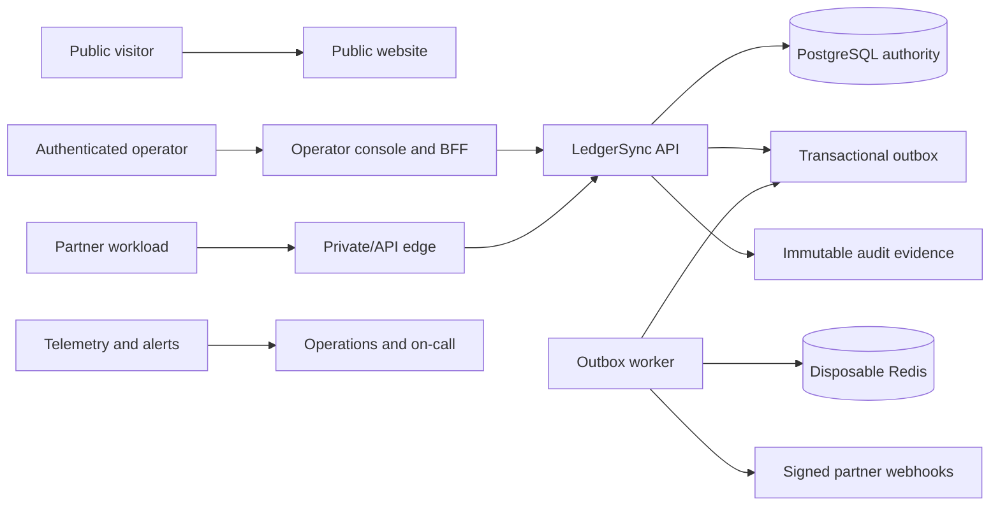

# LedgerSync Master Product, System, Website, and Production Completion Plan

**Planned file:** `D:\Work\Project\Plans\LedgerSync\ledgersync-master-product-system-and-website-completion-plan.md`

## 1. Purpose and authority

This document will become LedgerSync’s single authoritative implementation plan. Earlier plans remain historical references, but completion status, sequencing, acceptance criteria, and future decisions must be maintained here.

The plan takes LedgerSync through three explicit milestones:

1. **Local MVP ready:** dependable, understandable, fully usable on one computer.
2. **Design-partner pilot ready:** controlled multi-user deployment for 2–3 invited partners.
3. **Production ready:** secure, observable, recoverable, supportable, and commercially presentable.

The implementation must preserve the defining product promise:

> Every transfer is exact, explainable, and visible when it matters.

### Execution status — 2026-08-28

| Phase | Status | Evidence |
|---|---|---|
| 0 — canonical baseline | Complete | `docs/release-evidence/master-phase-0-baseline.md` |
| 1 — green quality gates | Complete | `docs/release-evidence/master-phase-1-quality.md` |
| 2 — deterministic local runtime | Complete | `docs/release-evidence/master-phase-2-local-runtime.md` |
| 3 — truthful dependency-aware UI | Complete | `docs/release-evidence/master-phase-3-ui-truthfulness.md` |
| 4 — guided first-run journey | Complete | `docs/release-evidence/master-phase-4-onboarding-foundation.md` |
| 5 — controlled funding journals | Complete | `docs/release-evidence/master-phase-5-controlled-funding.md` |
| 6 — correction and approval controls | Complete | `docs/release-evidence/master-phase-6-correction-controls.md` |
| 7 — API-first developer product | Active | Implementation follows Phase 6 exact-commit qualification. |

Later phases remain pending in the dependency order below. A phase is marked complete only when its repository-supported exit gate has durable evidence; provider, legal, partner, and production approvals remain explicit manual gates.

## 2. Current verified position

LedgerSync already contains substantial working foundations:

- Go financial core using exact integer money.
- PostgreSQL-backed immutable double-entry ledger.
- Transactional idempotency, audit, outbox, and balance updates.
- Redis treated as a rebuildable read cache.
- Account lifecycle, transfers, transaction history, reconciliation, event investigation, recovery evidence, exports, and operator tooling.
- Next.js operator console with desktop, tablet, and mobile structures.
- OIDC/BFF security foundations.
- Local Docker Compose runtime and PowerShell lifecycle scripts.
- Contract, quality, security, container, browser, and release-evidence workflows.
- India/INR pilot profile using AWS Mumbai and Cognito.
- Local acceptance evidence from an earlier candidate.

The current branch requires reconvergence:

- Current HEAD: `f87245f85c09365973d66f64728b454be512197d`.
- Four uncommitted responsive-layout changes must be preserved and verified before new implementation:
  - `web/src/app/globals.css`
  - `web/src/app/layout.tsx`
  - `web/src/styles/tokens.css`
  - `web/tests/e2e/orientation-explainability.spec.ts`
- Current quality CI is not fully green because CLS exceeded the `0.1` budget.
- The current main commit has not yet received a complete local real-stack requalification.
- Documentation, API inventory, and gate status contain drift.
- The interface still confuses unavailable evidence with empty business data in some flows.
- The first-run experience does not consistently guide a new operator toward the next safe action.
- Production infrastructure and provider-backed recovery evidence do not yet exist.

## 3. Fixed product decisions

These decisions are authoritative unless the product owner explicitly changes them:

- LedgerSync is an **API-first, closed-loop ledger platform**.
- It is not initially a bank-transfer, card-payment, FX, settlement, or custody product.
- Initial production jurisdiction: India.
- Pilot currency: INR, stored as integer paise.
- Public JSON money values must never depend on JavaScript floating-point precision.
- PostgreSQL is the financial source of truth.
- Redis remains disposable and reconstructable.
- Pilot identity provider: Amazon Cognito.
- Primary production region: AWS Mumbai, `ap-south-1`.
- Initial buyer: fintech and vertical-SaaS product teams.
- Primary daily users:
  - engineers integrating the API;
  - finance and operations staff investigating financial activity.
- Operator console and public marketing website are separate surfaces.
- Public website CTA: **Request a pilot**.
- No public self-service customer onboarding during the initial pilot.
- Production tenancy follows a hybrid model:
  - strongly isolated shared pilot infrastructure for approved partners;
  - dedicated database/VPC deployment available for regulated or enterprise tiers.
- Real balances enter through controlled, immutable funding journals—not arbitrary balance editing.
- Corrections use compensating records. Posted financial records are never edited or deleted.

## 4. Internal design debate and final direction

### Option A: Continue adding features immediately

This would make the product look fuller, but it would build on a currently unqualified commit, unresolved degraded states, and incomplete user guidance.

**Rejected as the first step.**

### Option B: Rewrite the product and UI

This could remove accumulated complexity, but it would discard already-proven ledger, security, recovery, and browser behavior.

**Rejected.**

### Option C: Stabilize, clarify, then extend

This preserves the proven financial core, restores a green baseline, fixes misleading UI states, creates a guided local experience, and only then adds controlled funding, public-site, tenancy, and production infrastructure.

**Selected approach.**

## 5. Completion definitions

### Local MVP ready

The local MVP is complete when:

- one command starts all dependencies and services;
- startup failures identify the exact dependency and remedy;
- the browser opens directly into a usable operator workspace;
- a new user always sees a safe recommended next action;
- demo data can be loaded, inspected, reset, backed up, and restored;
- every enabled control performs a real action;
- unavailable data is never described as empty data;
- transfers remain exact, idempotent, balanced, auditable, and immediately explainable;
- all local quality, accessibility, security, recovery, and real-stack tests pass;
- the repository and documentation describe the exact current behavior.

### Pilot ready

The pilot is complete when:

- 2–3 invited design partners can be provisioned securely;
- real Cognito authentication and least-privilege authorization work;
- controlled funding journals establish balances without custody or bank rails;
- partner workloads have scoped credentials;
- webhooks and API retry guidance work;
- AWS networking, secrets, databases, backups, dashboards, and alerts are proven;
- provider-backed PITR restoration passes;
- finance, security, legal, and operational owners sign the launch register;
- at least 10,000 accounts and meaningful transfer traffic complete with zero unexplained reconciliation mismatches.

### Production ready

Production readiness additionally requires:

- documented SLOs and error budgets;
- on-call ownership and incident exercises;
- capacity and cost limits;
- compatibility and deprecation policy;
- customer support and escalation workflows;
- legal, privacy, security, and data-processing documentation;
- hybrid tenancy automation;
- release, rollback, recovery, and customer communication procedures;
- evidence that the exact released version satisfies every mandatory gate.

## 6. Target architecture

### Product surfaces

- `web/`: authenticated operator console and browser-facing BFF.
- `site/`: separate public marketing, trust, documentation-entry, and pilot-request website.
- `packages/design-system/`: shared tokens, typography, icons, accessible primitives, and brand assets.
- Go API and workers remain organized under `cmd/` and `internal/`.
- `contracts/`: authoritative OpenAPI and event contracts.
- `deploy/compose/`: supported local runtime.
- `deploy/infra/`: production Terraform modules.
- `docs/`: architecture, runbooks, API usage, security, product policies, and release evidence.

The existing `web/` directory will not be renamed during this work.

### Runtime data flow



### Financial invariants

Every financial command must preserve:

- exact integer minor units;
- one explicit ISO currency;
- same-currency movement only;
- equal debit and credit postings;
- immutable posted journal records;
- idempotency within an authenticated tenant and operation;
- tenant-scoped authorization in the database path;
- atomic transfer, posting, audit, outbox, and balance-version evidence;
- read-your-writes behavior after completion;
- no financial dependence on Redis availability;
- deterministic reconciliation from PostgreSQL evidence.

## 7. Public interfaces and data-model additions

### Controlled funding journal

Add a privileged funding command representing customer-authorized external value:

- `FundingEvent`
  - tenant identifier;
  - customer-supplied external reference;
  - idempotency key;
  - destination ledger account;
  - controlled system funding account;
  - exact amount and currency;
  - evidence/document reference;
  - requested, approved, posted, rejected, or compensated status;
  - requester and approver identities;
  - journal transaction identifier;
  - timestamps and correlation identifier.
- One system funding-clearing account per tenant and currency.
- System accounts are hidden from ordinary account pickers.
- Only the funding service can originate movements from a system account.
- Funding does not claim that LedgerSync moved or held external money.
- Funding records require dual approval in production.
- Local demo mode may use a clearly labeled single-operator test policy.

### Compensation records

Add immutable compensating operations:

- reference the original transfer or funding event;
- require a reason code and operator note;
- create a new balanced journal;
- never change the original record;
- reject duplicate compensation through idempotency;
- support policy-controlled approval thresholds.

### Approval workflow

Add reusable approval records for sensitive commands:

- command type and target;
- requester;
- independent approver;
- status;
- expiry;
- decision reason;
- immutable audit linkage;
- tenant policy version.

A requester cannot approve their own production funding or compensation command.

### Webhook delivery

Add:

- tenant webhook endpoint;
- allowlisted event subscriptions;
- signing-secret reference;
- signature version;
- delivery attempt;
- response status;
- retry schedule;
- dead-letter state;
- replay audit.

Webhook signatures include timestamp, delivery identifier, canonical payload digest, and version. Raw signing secrets are never displayed after creation.

### Compatibility

- Preserve existing public routes and response meanings.
- Additive OpenAPI changes are allowed.
- Breaking changes require a new API version and migration period.
- Exact money remains represented as a canonical string/integer-safe contract.
- Error codes remain machine-readable and stable.
- Pagination uses opaque cursors.
- List filters must be reproducible through URL query parameters.
- Every mutation accepts or generates a traceable idempotency identifier.

## 8. Cross-cutting minor-detail checklist

Every screen, route, command, and job must define:

- purpose and authorized audience;
- primary and secondary actions;
- loading, empty, partial, stale, offline, permission-denied, unavailable, error, and success states;
- retry behavior;
- idempotency behavior;
- timeout and cancellation behavior;
- date, time zone, currency, identifier, and amount formatting;
- pagination, filtering, sorting, and URL persistence;
- back-button, refresh, deep-link, and duplicate-tab behavior;
- mobile, tablet, desktop, zoom, reflow, and touch behavior;
- keyboard order, focus restoration, live-region announcements, labels, descriptions, and errors;
- audit and telemetry events;
- rate, size, row, and time limits;
- redaction and sensitive-data rules;
- support correlation identifiers;
- documentation and contract updates;
- unit, contract, integration, browser, security, fault, and acceptance coverage;
- owner, alert, runbook, and release gate.

No action may be presented as available when its required dependency, authorization, or prerequisite is unknown.

## 9. Phased implementation

### Phase 0 — Establish the canonical baseline

#### Work

- Preserve and inspect the four current uncommitted responsive-layout changes.
- Determine whether they belong to the active UI work; do not overwrite or discard them.
- Record current branch, commit, Docker state, tool versions, ports, environment, and test results.
- Compare current implementation against all earlier plans.
- Create a traceability register marking every previous phase as:
  - implemented and verified;
  - implemented but requiring requalification;
  - partially implemented;
  - superseded;
  - external/manual gate;
  - intentionally out of scope.
- Make this master plan the active source of truth.
- Mark older plans as historical without deleting them.
- Establish task IDs, dependencies, owners, evidence paths, and stop-ship rules.

#### Exit gate

- Existing work is preserved.
- No unexplained working-tree change remains.
- The new plan and status register agree with the repository.
- Every future task has one authoritative status.

#### Commit

```text
docs(planning) : establish the canonical LedgerSync completion plan

- consolidate local, pilot, website, and production work into one source of truth
- preserve prior decisions and map historical plans to current implementation status
- define phase gates, ownership, evidence, and stop-ship criteria
```

### Phase 1 — Reconverge current main and restore green quality gates

#### Work

- Validate the responsive canvas changes at phone, tablet, laptop, desktop, zoom, and reflow sizes.
- Fix CLS without hiding or loosening the `0.1` performance budget.
- Identify the actual shifting element through trace/screenshot evidence.
- Reserve space for delayed content and fonts.
- Prevent guide, banners, skeletons, tables, and navigation from changing layout unexpectedly.
- Run Go formatting, vet, race tests, unit tests, integration tests, contract lint, web lint, build, browser tests, accessibility, visual regression, performance, security, container builds, and real-stack tests.
- Run backup, isolated restore, Redis rebuild, worker restart, lost-response retry, and reconciliation checks.
- Update evidence for the exact final commit.
- Correct README, gate-register, route inventory, and roadmap drift.

#### Exit gate

- All required GitHub workflows pass for the exact commit.
- CLS is at or below `0.1`.
- Zero duplicate movement, unbalanced journals, tenant leaks, negative customer balances, or unexplained mismatches.
- Current main—not an older candidate—is fully qualified.

#### Commit

```text
fix(quality) : reconverge the current release candidate

- eliminate layout instability across supported viewport sizes
- requalify ledger, browser, recovery, security, and real-stack behavior
- synchronize product documentation and release evidence with the exact commit
```

### Phase 2 — Make local startup deterministic and understandable

#### Work

- Strengthen `start-local.ps1`, `status-local.ps1`, `logs-local.ps1`, `stop-local.ps1`, and `reset-local.ps1`.
- Add a non-destructive local doctor command.
- Validate Docker engine, Compose, ports, disk space, environment file, required binaries, and volume state.
- Distinguish:
  - Docker not installed;
  - Docker installed but engine stopped;
  - permissions failure;
  - port conflict;
  - migration failure;
  - unhealthy PostgreSQL;
  - unavailable Redis;
  - failed API;
  - failed worker;
  - failed web container.
- Print exact next actions in plain language.
- Wait for health/readiness rather than assuming a started container is usable.
- Bind public local access only to `127.0.0.1`.
- Keep PostgreSQL, Redis, API, worker, migration, and seed services off host ports.
- Support safe stop without data deletion.
- Require explicit confirmation for reset.
- Explain what reset deletes and whether backup exists.
- Add deterministic demo seed versioning and compatibility checks.
- Add graceful shutdown and actionable log correlation.

#### Exit gate

- A non-technical local user can start, diagnose, stop, restart, back up, restore, and reset the system using documented commands.
- Failed prerequisites never produce a misleading “ready” result.

#### Commit

```text
fix(local-runtime) : make LedgerSync startup deterministic and actionable

- add dependency-aware diagnostics and plain-language recovery guidance
- enforce loopback-only exposure and health-based readiness
- document safe stop, reset, backup, restore, and demo-data behavior
```

### Phase 3 — Correct UI truthfulness and dependency-aware states

#### Work

- Introduce explicit UI data states:
  - `loading`;
  - `ready-empty`;
  - `ready-populated`;
  - `partial`;
  - `stale`;
  - `unavailable`;
  - `forbidden`;
  - `offline`;
  - `unknown-after-submit`.
- Never infer “no account,” “no transfers,” or “no reconciliation evidence” from a failed request.
- Disable actions whose prerequisites are unavailable.
- Explain every disabled action next to the control or through accessible help text.
- Transfer form must receive account-loading and account-error state.
- Reconciliation actions must distinguish unavailable evidence from a completed zero-mismatch run.
- Local Status must provide the exact affected capability and recovery action.
- Preserve prior successful data during background refresh, while labeling freshness accurately.
- Add focused retry controls that retry only the failed dependency.
- Maintain request/correlation IDs in error details without exposing secrets.
- Define toast persistence, modal focus return, and unknown-response recovery.
- Prevent double submission from mouse, keyboard, touch, refresh, or repeated network retry.

#### Exit gate

- No screen presents unknown state as business truth.
- No active-looking placeholder or dead control remains.
- Every error tells the user what happened, what was preserved, and what can safely be tried next.

#### Commit

```text
fix(console) : make degraded and unknown states financially truthful

- distinguish unavailable dependencies from valid empty business data
- gate actions on verified prerequisites and permissions
- add safe retry, correlation, focus, and unknown-response recovery behavior
```

### Phase 4 — Build a guided first-run operator journey

#### Work

- Add a persistent, dismissible, reopenable setup checklist.
- Guide the operator through:
  1. confirm local system health;
  2. understand PostgreSQL authority and Redis disposability;
  3. inspect demo accounts;
  4. create a zero-balance account;
  5. fund through an approved ledger event;
  6. transfer an exact amount;
  7. retry the same request safely;
  8. inspect postings and balance version;
  9. run reconciliation;
  10. inspect events and delivery;
  11. export evidence;
  12. create and verify a backup.
- Add “Recommended next action” to Overview.
- Change the recommendation based on system and tenant state.
- Provide realistic empty states with one safe primary action.
- Explain local/demo limitations without dominating every viewport.
- Preserve checklist completion in server-owned operator preferences.
- Support reset/restart without silently losing onboarding state.
- Add contextual definitions for idempotency, double entry, reconciliation, projection, and response unknown.
- Add accessible keyboard shortcuts only where discoverable and non-conflicting.
- Preserve filters and return context when opening detail pages.

#### Exit gate

- A first-time user can complete the full product loop without external instructions.
- Every step can be resumed after refresh or restart.
- Guidance never encourages an unsafe or unavailable operation.

#### Commit

```text
feat(onboarding) : guide operators through the complete LedgerSync journey

- add persistent setup progress and context-aware next actions
- connect account, funding, transfer, reconciliation, event, export, and recovery flows
- provide plain-language explanations without obscuring operational evidence
```

### Phase 5 — Implement controlled funding journals

#### Work

- Add tenant system funding-clearing accounts.
- Add immutable funding event and approval records.
- Add production dual-control policy.
- Add local demo funding policy with an unmistakable demo label.
- Add funding request, review, approve, reject, post, inspect, and compensate flows.
- Require exact money, same currency, account eligibility, evidence reference, idempotency, and authorization.
- Commit funding journal, postings, account balance version, audit, and outbox atomically.
- Prevent arbitrary opening-balance and direct balance-edit APIs.
- Hide system accounts from ordinary transfer selectors.
- Show system accounts only to appropriately scoped finance/admin roles.
- Add per-command, per-operator, and per-tenant funding limits.
- Add funding reconciliation against customer-supplied external evidence.
- Define funding terminology as “recorded external value evidence,” never “bank deposit received.”
- Require finance approval of debit/credit semantics before production activation.

#### Exit gate

- A production tenant can establish balances without bank rails, custody claims, floating point, or manual database edits.
- Retries cannot duplicate funding.
- Corrections create compensating journals.
- Funding evidence reconciles to the customer-authorized reference.

#### Commit

```text
feat(funding) : add controlled non-custodial funding journals

- introduce exact idempotent funding events backed by balanced immutable postings
- require approval, evidence, limits, authorization, and auditable compensation
- prevent direct balance editing and hide system accounts from ordinary workflows
```

### Phase 6 — Complete financial correction and approval workflows

#### Work

- Add compensating transfer commands.
- Add reason-code taxonomy.
- Add approval expiry and cancellation.
- Add role separation between requester, approver, and auditor.
- Add step-up authentication for sensitive production operations.
- Display original and compensating journals together without rewriting history.
- Prevent partial and repeated compensation.
- Define how an already-compensated transaction is displayed and exported.
- Add freeze/reactivate/close safeguards around pending commands.
- Prevent account closure with unresolved operational obligations.
- Preserve historical access after closure.
- Add policy versioning so every decision can be explained using the rules active at that time.

#### Exit gate

- Every supported correction is additive, balanced, authorized, and explainable.
- No production workflow requires direct SQL or ledger mutation.

#### Commit

```text
feat(controls) : add immutable compensation and dual-control workflows

- preserve original financial evidence while enabling authorized corrections
- enforce requester-approver separation and policy-version auditability
- protect lifecycle changes from unresolved financial obligations
```

### Phase 7 — Complete the API-first developer product

#### Work

- Make OpenAPI the authoritative public contract.
- Document every route, scope, error, idempotency rule, timeout, retry, pagination cursor, and rate limit.
- Add copy-pastable examples for JavaScript/TypeScript, Go, curl, and Postman-compatible collections.
- Add a local API explorer that cannot expose raw production credentials.
- Add credential creation, rotation, revocation, expiry, and last-used metadata.
- Add sandbox/test-mode indicators to every response and screen.
- Add webhook endpoint registration, verification challenge, signature rotation, delivery history, retry, and replay.
- Add API changelog and deprecation headers.
- Define semantic versioning and supported-version windows.
- Add stable request IDs and correlation IDs to responses.
- Add bounded bulk account provisioning only after single-item invariants are proven.
- Generate SDKs only from reviewed OpenAPI; generated files are reproducible and versioned deliberately.
- Add integration recipes for wallet, credit, escrow-like, payout-accounting, and internal treasury use cases.
- Explicitly state that examples record ledger activity and do not move external funds.

#### Exit gate

- A partner engineer can authenticate, provision, fund, transfer, retry, inspect, reconcile, and consume webhooks using documentation alone.
- Contract and SDK checks fail CI when drift occurs.

#### Commit

```text
feat(developer-platform) : complete the API integration experience

- publish authoritative contracts, examples, credentials, webhooks, and retry guidance
- add compatibility, versioning, pagination, rate-limit, and deprecation rules
- enforce generated-contract and documentation convergence in CI
```

### Phase 8 — Complete the operator console information architecture

#### Work

Final navigation:

- Overview
- Accounts
- Transfers
- Funding
- Approvals
- Reconciliation
- Events and Webhooks
- Recovery
- Developer
- Local Status in local mode
- Administration for authorized production users

Each list screen must support:

- useful default sort;
- search;
- status filters;
- date range;
- clear-all;
- query-string persistence;
- pagination;
- result count;
- loading/empty/unavailable distinction;
- CSV export where appropriate;
- deep links;
- back-navigation context.

Each detail screen must show:

- human-readable summary;
- exact amount;
- immutable identifiers;
- current status and status history;
- actor;
- policy and authorization evidence;
- ledger/posting evidence;
- balance-version evidence;
- event/delivery evidence;
- timestamps with explicit time zone;
- correlation identifier;
- safe available actions;
- related records;
- support-copy action with redacted evidence.

#### Exit gate

- Finance, operations, support, and engineering users can answer “what happened, who did it, what changed, and what should happen next” without database access.

#### Commit

```text
feat(operator-console) : complete the financial operations workspace

- add funding, approvals, webhook, and administration navigation
- standardize investigation lists, details, filters, exports, and related evidence
- preserve exact status, time-zone, authorization, and ledger context throughout
```

### Phase 9 — Unify design, responsive behavior, and accessibility

#### Work

- Keep the selected LedgerSync visual direction in `DESIGN.md`.
- Extract shared design tokens and primitives.
- Preserve intentional dark navigation, restrained financial color, high information density, and clear status semantics.
- Use color only as supporting information.
- Standardize typography, spacing, borders, radii, shadows, icons, chart styling, and motion.
- Avoid decorative gradients, glass effects, crypto-dashboard aesthetics, oversized empty cards, and ambiguous icon-only actions.
- Define phone, tablet, laptop, desktop, ultrawide, 200% zoom, 400% reflow, landscape, and reduced-motion behavior.
- Use mobile drawers and stacked summaries without hiding essential evidence.
- Tables become prioritized cards or controlled horizontal regions on small screens.
- Maintain at least 44×44 CSS-pixel touch targets.
- Meet WCAG 2.2 AA contrast and interaction requirements.
- Add visible focus, skip links, semantic landmarks, correct heading order, dialog focus trapping, live regions, field errors, and accessible charts.
- Test forced colors, high contrast, screen readers, keyboard-only operation, and browser text scaling.
- Keep content widths intentional while allowing the application shell to fill the viewport.
- Add reviewed visual regression baselines for every critical state.

#### Exit gate

- Critical flows pass automated and manual accessibility checks.
- No horizontal page overflow exists at supported widths.
- Visual language is consistent across console and public site without making them functionally identical.

#### Commit

```text
feat(design-system) : unify LedgerSync visual and accessible behavior

- share intentional tokens and primitives across product surfaces
- complete mobile, tablet, desktop, zoom, reflow, keyboard, and screen-reader behavior
- enforce reviewed visual and accessibility regression gates
```

### Phase 10 — Build the separate public website

#### Pages

- Home
- Product
- Use cases
- API and developer overview
- Reliability and exactness
- Security and trust
- Architecture
- Documentation entry
- Pricing approach or “pilot pricing available on request”
- Request a pilot
- Company/about
- Contact
- Status
- Privacy
- Terms
- Security disclosure
- Accessibility statement
- 404 and service-error pages

#### Website behavior

- Lead with the exact promise and product boundary.
- Explain the difference between ledger infrastructure and external money movement.
- Use diagrams to explain double entry, idempotency, PostgreSQL authority, Redis rebuilding, reconciliation, and read-your-writes behavior.
- Include quantified claims only when backed by current release evidence.
- Link technical claims to evidence or documentation.
- Provide a qualified pilot-request form with:
  - company;
  - role;
  - use case;
  - projected accounts;
  - expected throughput;
  - jurisdiction;
  - currency;
  - integration timeline;
  - compliance constraints;
  - contact permission.
- Add spam protection, validation, consent, rate limits, retention, and deletion rules.
- Do not create a tenant or credential from the public form.
- Add metadata, canonical URLs, sitemap, robots policy, structured data, social cards, favicon, and error monitoring.
- Establish content ownership, review dates, and claim-approval workflow.
- Meet the same accessibility and performance standards as the operator console.

#### Exit gate

- A qualified visitor understands what LedgerSync does, what it does not do, why it is trustworthy, and how to request a pilot.
- No marketing statement exceeds demonstrated product evidence.

#### Commit

```text
feat(public-site) : launch the LedgerSync pilot marketing experience

- explain the exact non-custodial ledger promise with evidence-backed diagrams
- add product, use-case, trust, documentation, legal, and pilot-request pages
- enforce accessibility, performance, consent, validation, and claim-review controls
```

### Phase 11 — Production identity, tenancy, and provisioning

#### Work

- Deploy separate Cognito clients for browser PKCE and machine credentials.
- Require MFA for human operators.
- Validate issuer, signature, expiry, token use, client ID, resource audience, nonce, and scopes.
- Store subject/client-to-tenant grants in audited server-owned provisioning data.
- Add role templates for operator, finance approver, auditor, support-readonly, developer, and tenant admin.
- Add session expiry, renewal, sign-out, revocation, and privileged reauthentication.
- Add invite, disable, role-change, and access-review workflows.
- Provision shared-pilot tenants with strong database predicates and quotas.
- Provision enterprise tenants into dedicated infrastructure using the same versioned modules.
- Prevent cross-deployment financial transfers.
- Add tenant lifecycle states: requested, provisioning, active, suspended, offboarding, archived.
- Require two-person approval for production tenant mapping and credential changes.
- Produce complete access-review evidence.

#### Exit gate

- Real identities can access only approved tenant objects and operations.
- Tenant creation and role changes are repeatable, reviewed, and auditable.
- Cross-tenant and wrong-token tests pass against Cognito.

#### Commit

```text
feat(identity) : implement managed tenant and operator provisioning

- enforce Cognito PKCE, MFA, workload scopes, and server-owned tenant grants
- add audited tenant, role, session, credential, and access-review lifecycles
- support shared-pilot and dedicated-enterprise isolation without cross-deployment movement
```

### Phase 12 — Build production AWS infrastructure

#### Work

- Create versioned Terraform modules for:
  - DNS and certificates;
  - CDN/WAF/public edge;
  - private application subnets;
  - isolated database subnets;
  - ECS/EKS workload runtime selected consistently for all services;
  - RDS PostgreSQL Multi-AZ;
  - disposable Redis;
  - Cognito;
  - KMS;
  - Secrets Manager;
  - telemetry;
  - backup and PITR;
  - artifact registry;
  - deployment roles.
- Expose only the public website, operator BFF, and approved API edge.
- Never expose PostgreSQL, Redis, workers, migration jobs, or administration services publicly.
- Enforce TLS, encryption at rest, least-privilege security groups, egress restrictions, private endpoints, and workload-specific database roles.
- Separate development, staging, pilot, and production accounts/environments.
- Add budget alarms, cost allocation tags, log retention, and resource ownership tags.
- Add drift detection and policy checks.
- Define secrets rotation without downtime.
- Use forward-compatible database migrations and expand/migrate/contract deployment sequencing.
- Add health-based rolling deployment and rollback.

#### Exit gate

- IaC creates an isolated staging environment without manual console configuration.
- External scans find no unintended public service.
- Destroy/recreate is safe for non-production environments.
- Production data resources require explicit protected workflows.

#### Commit

```text
feat(infrastructure) : provision the isolated AWS pilot platform

- codify network, compute, identity, database, cache, secrets, edge, and telemetry resources
- enforce private service boundaries, encryption, least privilege, drift checks, and cost controls
- support repeatable shared-pilot and dedicated-enterprise environments
```

### Phase 13 — Observability, supportability, and incident operations

#### Work

- Define service-level indicators for transfer completion, balance visibility, API availability, worker lag, webhook delivery, reconciliation, and recovery.
- Initial healthy targets:
  - p95 transfer completion below 500 ms;
  - p95 immediate balance read below 200 ms;
  - 10–50 TPS pilot envelope;
  - zero unexplained reconciliation mismatch;
  - zero duplicate financial movement.
- Add structured redacted logs, metrics, traces, dashboards, alerts, and correlation.
- Add separate health, readiness, and dependency-status signals.
- Alert on:
  - reconciliation mismatch;
  - outbox backlog;
  - webhook dead letters;
  - Redis fallback rate;
  - database pool saturation;
  - lock wait;
  - elevated latency/error rate;
  - authorization anomalies;
  - backup age/failure;
  - certificate or secret expiry;
  - capacity and cost thresholds.
- Define incident severity, ownership, paging, escalation, communication, evidence capture, and postmortem templates.
- Create runbooks for database failure, Redis loss, worker loss, webhook outage, OIDC outage, bad deployment, secret compromise, suspected tenant leak, reconciliation mismatch, and region failure.
- Add a customer-facing status page without exposing sensitive architecture.

#### Exit gate

- Every stop-ship condition has an alert, owner, runbook, and tested response.
- Operators can investigate without raw database access.

#### Commit

```text
feat(operations) : establish observable and supportable financial operations

- define SLOs, dashboards, alerts, ownership, and customer-safe status reporting
- add redacted correlation across API, ledger, outbox, cache, and webhook paths
- exercise incident runbooks and evidence-preserving escalation procedures
```

### Phase 14 — Security, privacy, compliance, and legal readiness

#### Work

- Maintain an evidence-backed threat model.
- Perform authorization, session, CSRF, XSS, SSRF, injection, deserialization, rate-limit, denial-of-service, and supply-chain tests.
- Enforce CSP, HSTS, secure cookies, origin controls, input limits, timeouts, redaction, and safe error responses.
- Generate SBOM and build provenance.
- Pin and verify CI actions and images.
- Scan secrets, dependencies, containers, IaC, and licenses.
- Establish vulnerability intake, severity, remediation SLA, verification, and disclosure processes.
- Separate immutable financial records from mutable customer/identity metadata.
- Define data classification, retention, export, access, correction, and deletion policy.
- Pseudonymize or remove personal data where legally allowed without deleting ledger evidence.
- Complete privacy policy, terms, DPA, subprocessor list, security overview, acceptable-use policy, and accessibility statement.
- Obtain specialist confirmation that non-custodial positioning and controlled funding terminology are legally accurate.
- Conduct external penetration testing before production traffic.
- Record accepted risks with named owner and expiry; never silently waive critical/high findings.

#### Exit gate

- No open critical or high exploitable finding.
- Legal and privacy documents reflect actual data and product behavior.
- Production launch has signed security, finance, legal, and operational approval.

#### Commit

```text
feat(governance) : complete security privacy and launch controls

- harden application, supply-chain, infrastructure, and incident boundaries
- document data handling, vulnerability response, legal terms, and non-custodial positioning
- require evidence-backed approval with no silent critical or high-risk waivers
```

### Phase 15 — Scalability, resilience, backup, and disaster recovery

#### Work

- Test 10,000+ accounts and realistic transaction history.
- Test normal, burst, hot-account, hot-tenant, retry-storm, and webhook-backlog loads.
- Confirm lock ordering, connection-pool sizing, backpressure, queue leases, retry jitter, and bounded memory.
- Test Redis deletion and full reconstruction.
- Test worker death during lease ownership.
- Test database connection loss before, during, and after commit.
- Test lost HTTP responses and exact-key replay.
- Test duplicate, conflicting, expired, malformed, and cross-tenant idempotency attempts.
- Perform provider-backed RDS PITR into an isolated environment.
- Rebuild Redis, restart workers, reconcile every tenant, and require approval before reopening writes.
- Record achieved recovery point and recovery duration.
- Encrypt and copy backups according to approved regional policy.
- Test deployment rollback and forward-fix when migrations have already run.
- Establish capacity limits and automatic scaling without violating database safety.

#### Exit gate

- Provider recovery satisfies approved RPO/RTO.
- Load and fault tests meet targets with zero financial invariant breach.
- Recovery evidence belongs to the exact release candidate.

#### Commit

```text
test(resilience) : qualify LedgerSync capacity and disaster recovery

- prove retry, cache, worker, database, webhook, and deployment failure behavior
- validate provider-backed PITR, cache rebuild, reconciliation, and controlled reopening
- record exact performance, recovery, and invariant evidence for the release candidate
```

### Phase 16 — Design-partner pilot execution

#### Work

- Select 2–3 qualified partners.
- Complete use-case, data-flow, legal, security, volume, currency, and support discovery.
- Agree on source-of-value evidence and reconciliation responsibilities.
- Provision staging tenant and credentials.
- Complete API integration certification.
- Import or create controlled opening/funding evidence.
- Run scripted transfer, retry, failure, webhook, reconciliation, export, and support exercises.
- Establish escalation contacts and communication windows.
- Use staged traffic limits.
- Review daily reconciliation and weekly operational metrics.
- Track defects, user confusion, API friction, and support demand.
- Require written approval before raising limits.
- Define partner offboarding, credential revocation, data export, and retention handling.

#### Exit gate

- 2–3 partners complete meaningful real ledger traffic.
- Zero duplicate movement and unexplained mismatches.
- Support, recovery, and access procedures work with real users.
- Pilot findings are closed or explicitly accepted before production graduation.

#### Commit

```text
docs(pilot) : record design-partner graduation evidence

- capture onboarding, integration, traffic, reconciliation, support, and recovery outcomes
- map every pilot issue to an owner, resolution, or time-bound accepted risk
- approve production graduation only against exact release evidence
```

### Phase 17 — Production release and ongoing product operations

#### Work

- Create release checklist, migration plan, rollback plan, communication plan, and go/no-go register.
- Use immutable image digests and signed provenance.
- Deploy to staging, validate, then progressively release production.
- Freeze unrelated changes during launch.
- Monitor SLOs and financial invariants continuously.
- Define release version, changelog, compatibility notes, and customer action requirements.
- Publish status only after health and reconciliation pass.
- Perform post-release access, backup, security, capacity, and cost reviews.
- Run monthly restore exercises and periodic incident simulations.
- Review design-partner feedback and roadmap quarterly.
- Maintain a deprecation register.
- Audit documentation every release.
- Archive evidence using retention-controlled storage.

#### Exit gate

- The exact released version is traceable from source to image, infrastructure, migration, evidence, and approval.
- The organization can operate, recover, support, and improve LedgerSync continuously.

#### Commit

```text
feat(release) : graduate LedgerSync to controlled production service

- release signed and qualified artifacts through staged deployment gates
- verify identity, reconciliation, recovery, SLO, support, and customer communication readiness
- establish recurring operational, security, cost, and product reviews
```

## 10. Test matrix

Mandatory scenarios include:

### Financial correctness

- minimum, normal, maximum, and over-limit amounts;
- zero, negative, malformed, fractional, overflow, and wrong-currency amounts;
- same account, frozen account, closed account, missing account, and unauthorized account;
- concurrent transfers from the same source;
- lost response before and after commit;
- exact-key replay and conflicting-key reuse;
- balanced postings and immutable evidence;
- funding request approval/rejection/posting/replay;
- partial, duplicate, and conflicting compensation;
- reconciliation before and after cache rebuild.

### UI and browser

- first visit, returning visit, empty tenant, populated tenant, degraded dependencies, offline, expired session, forbidden role, stale data, and unknown submission result;
- browser refresh, back/forward, deep link, duplicate tab, interrupted modal, and double click;
- phone, tablet, laptop, desktop, ultrawide, zoom, reflow, landscape, reduced motion, and forced colors;
- keyboard-only, screen-reader, focus restoration, live announcements, and form-error navigation;
- visual regression for loading, empty, populated, error, offline, permission, approval, and success states.

### API and integrations

- token type, issuer, audience, client, scope, expiry, and tenant-mapping failures;
- cursor pagination and stable filters;
- webhook signature, replay prevention, retry, secret rotation, endpoint outage, and dead-letter recovery;
- credential creation, rotation, revocation, expiry, and least privilege;
- compatibility checks against supported API versions.

### Operations and resilience

- PostgreSQL unavailable;
- Redis empty or unavailable;
- worker crash;
- outbox lease expiry;
- network delay and partition;
- OIDC outage;
- webhook target outage;
- disk pressure;
- database pool exhaustion;
- bad deployment;
- failed migration;
- backup failure;
- PITR restoration;
- secret compromise;
- cross-tenant enumeration attempt.

## 11. Documentation inventory

The final repository must contain and maintain:

- concise README with exact status;
- local quickstart and troubleshooting;
- architecture overview and diagrams;
- domain and accounting glossary;
- OpenAPI and integration guide;
- idempotency and retry guide;
- webhook verification guide;
- funding and compensation semantics;
- operator handbook;
- support handbook;
- incident-response plan;
- backup and restore runbooks;
- security policy and threat model;
- privacy and retention policy;
- release and rollback guide;
- compatibility and deprecation policy;
- changelog;
- contribution guidance;
- coding/testing conventions;
- ADRs for important architecture decisions;
- release-evidence index;
- public product, trust, legal, and accessibility content.

Documentation examples must be executable or contract-tested where practical.

## 12. Ownership and manual gates

### Work that can be implemented automatically

- code and tests;
- local runtime scripts;
- UI and public website;
- database migrations;
- API contracts;
- CI/CD;
- Terraform;
- documentation drafts;
- security checks;
- load/fault/recovery automation;
- release evidence generation.

### Work requiring human or vendor authority

- AWS account, budget, DNS, and production credentials;
- Cognito production configuration approval;
- legal and regulatory advice;
- accounting-semantics approval;
- design-partner contracts and access;
- independent penetration test;
- production incident contacts;
- public pricing and commercial terms;
- production go/no-go decision.

These are hard gates, not code blockers for earlier phases.

## 13. Prioritized add-ons

### Add immediately

- context-aware next-action guidance;
- controlled funding journals;
- immutable compensation;
- approvals;
- signed webhooks;
- API compatibility policy;
- local doctor;
- support-safe evidence copy;
- status page;
- documentation convergence checks.

### Add after pilot demand is proven

- self-service sandbox tenants;
- webhook event simulator;
- API usage analytics;
- advanced reconciliation workspaces;
- configurable approval policies;
- tenant-specific velocity policies;
- dedicated deployment automation;
- SDK generation and package publishing;
- support impersonation only through tightly audited, read-only controls.

### Defer

- bank rails;
- cards;
- FX;
- custody;
- consumer wallet UI;
- public self-service production signup;
- cross-tenant transfers;
- AI-generated financial decisions;
- editable or deletable posted ledger records;
- active-active multi-region financial writes.

## 14. Repository hygiene and release protocol

For every phase:

1. Preserve unrelated working-tree changes.
2. Work on one bounded phase.
3. Run targeted tests during implementation.
4. Run the phase’s complete gate before commit.
5. Inspect the full diff and run whitespace checks.
6. Scan staged content for secrets, dumps, credentials, and generated noise.
7. Update status and evidence.
8. Commit using `feat/fix/test/docs(scope) : outcome`.
9. Include bullet points describing only truthful completed work.
10. Push only to the approved remote.
11. Wait for exact-commit CI.
12. Fix failures without suppressing genuine gates.
13. Verify local/remote alignment.
14. Leave the supported local runtime healthy.
15. Do not delete uncertain files; cleanup below 90% confidence requires explicit approval.

## 15. Final assumptions

- The local MVP remains the first delivery milestone even though this plan extends to production.
- Current uncommitted responsive changes are treated as valuable work until proven otherwise.
- AWS Mumbai, Cognito, INR, and non-custodial positioning remain authoritative.
- The operator console remains in `web/`.
- The public website is introduced separately in `site/`.
- The design system is shared without visually weakening the operator console.
- Shared pilot tenancy and dedicated enterprise tenancy use the same application contracts and financial invariants.
- Funding records external value evidence but does not perform settlement.
- Production funding and compensation require dual approval.
- Redis may improve latency but never determines financial truth.
- Posted journals, audits, and approvals are immutable.
- Legal, accounting, security, and production launch approvals cannot be fabricated or replaced by automated tests.
- No phase is complete merely because code exists; its acceptance evidence must pass on the exact commit.
