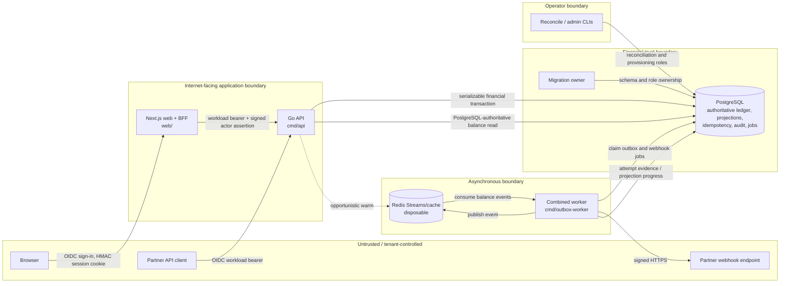
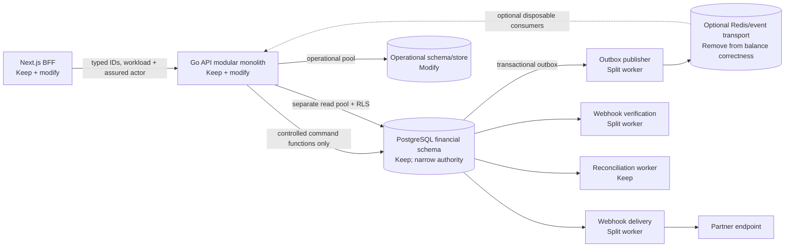

# LedgerSync Production-Hardening Implementation Plan

Review date: 2026-09-03
Repository reviewed: `https://github.com/painjanevivek/LedgerSync.git`
Branch and commit: `main` at `944a8f44d197728f14bf178f2aafcb32209363d5`
Decision: **NO-GO for a production or real-money pilot**

This document is an implementation plan, not an implementation. The architecture audit began at `7c6e6abd96204a20772960fae1fab88299ff99e1`; while the review was in progress, `main` advanced to the commit above. The complete three-file delta was inspected: it upgrades OpenTelemetry/module metadata and updates release evidence, without changing application/schema/role behavior or the findings below. Historical specifications were used only to understand intent and were not treated as proof of implemented behavior.

# 1. Executive Summary

LedgerSync is currently a modular, closed-loop financial ledger: a Go API and financial core, a Next.js browser/BFF tier, PostgreSQL as the authoritative book of record, and a Go worker that combines outbox publication, webhook delivery, webhook verification and a Redis-backed balance projection. The product proves useful internal book-transfer, controlled funding-evidence, correction and reconciliation behavior. It does **not** prove bank settlement, custody, safeguarded-funds reconciliation or production payout execution.

Production readiness is **4/10: capable pilot software with production-blocking authority, invariant and operational defects**. The release recommendation is **no-go** until all P0 gates and the closed-loop pilot subset of P1 gates are satisfied. A tightly controlled local demonstration remains reasonable; a staging deployment is reasonable only after PRs 001–009 in this plan and with synthetic value.

The five confirmed blockers are:

1. **Merge and release governance is not enforced.** GitHub reported no branch protection or rulesets for `main`; there is no `CODEOWNERS`; the only historical PR was a 100-file merge with no reviews. Repository workflows are broad, but checks that are not required do not prevent a merge.
2. **General workload credentials possess financial table authority.** `ledgersync_api` and `ledgersync_provisioning` can directly construct accounts, opening value, ownership, projections and ledger history outside the intended dual-control commands.
3. **PostgreSQL proves arithmetic balance, but not full semantic correctness.** A balanced journal can disagree with its transfer/funding/correction command, tenant, accounts or amount.
4. **Webhook key-cache saturation can permanently deadlock the combined worker.** One missing unlock can stop key resolution and, because responsibilities are sequentially coupled, delay unrelated outbox and balance-projection work.
5. **A successful financial commit can be reported as a 5xx.** Transfer consistency-token/header work and the BFF's header parsing happen after commit and can hide a durable success.

Do not build real payouts, multiple payment providers, FX, multi-region writes, or a microservice decomposition yet. First make the existing closed-loop claims true under credential compromise, cross-tenant bugs, post-commit failures and worker stalls.

# 2. Evidence Boundary

## 2.1 Repository state reviewed

| Item | Evidence and classification |
|---|---|
| Branch / SHA | `main` / `944a8f44d197728f14bf178f2aafcb32209363d5` — confirmed with Git. Architecture/schema/application evidence was reconstructed at parent review point `7c6e6ab…`; the intervening dependency/evidence-only delta was inspected in full. |
| Remote | `origin` is `https://github.com/painjanevivek/LedgerSync.git`; the older repository URL supplied with the review does not match the current remote — confirmed. |
| Latest migration | `000033_investigation_workspaces` — confirmed from `migrations/`. Existing migrations must not be edited. |
| Canonical backend | `cmd/*` plus `internal/*`; Go module currently uses the stale path `github.com/painjanevivek/Real-Time-Balance-Visibility-in-Microservice-Based-Money-Transfers` — confirmed. |
| Canonical frontend | `web/` — confirmed. No current `backend/`, `dashboard/` or `simulation/` tree exists. |
| Entry points | `cmd/api`, `cmd/migrate`, `cmd/outbox-worker`, `cmd/reconcile`, and bounded administrative/evidence CLIs under `cmd/` — confirmed. |
| CI | `.github/workflows/ci.yml`, `contract.yml`, `quality.yml`, `release-evidence.yml`, `security.yml` — confirmed. |
| Dirty state at review start | User-owned deletion of `.env.example`; modification of `.gitignore`; untracked `deploy/vercel/`, `docs/academic/`, and `web/.env.example`. These were preserved and were not treated as reviewed HEAD content. |

## 2.2 Commands and current evidence

| Check | Command/evidence | Result | Classification |
|---|---|---|---|
| Go format | `gofmt -l cmd internal tests` | No output | Passed locally. |
| Go static analysis | `go vet ./cmd/... ./internal/... ./tests/unit ./tests/contract` | Exit 0; local Go telemetry file produced an access warning | Passed; warning is environment-related. |
| Go unit/contract set | `go test ./cmd/... ./internal/... ./tests/unit ./tests/contract` | One contract failure because the dirty worktree deletes `.env.example`; other selected packages passed | Test-related to preserved user work, not a confirmed product regression. Base-SHA CI was green; current-SHA quality was still running. |
| Go race | `go test -race ...` | Could not start: local environment has `CGO_ENABLED=0` | Environment limitation. Base-SHA `go-quality` race job passed; current-SHA CI was still running at final observation. |
| Go integration/fault | Not rerun locally because the preserved environment lacked a disposable configured stack | Base-SHA `live-dependencies`, `real-stack` and fault/recovery jobs passed | Trustworthy repository-level evidence for `7c6e6ab…`; managed-cloud behavior remains unverified. |
| Exact-money fuzz/coverage | Not rerun as a separate local long-running suite | Base-SHA `go-quality` fuzz and coverage jobs passed | Trustworthy base evidence; current-SHA CI was still running and new adversarial corpora are required. |
| Frontend lint | `npm run lint` in `web/` | Exit 0 | Passed locally. |
| Frontend unit/security tests | `npm test` in `web/` | Initial sandbox process spawn returned `EPERM`; approved rerun passed 175 tests | Passed; initial failure environment-related. |
| Production web build | `npm run build` in `web/` | Next.js 16 production build passed | Passed locally. |
| Generated developer contracts | `npm run check:developer-artifacts` | Exit 0 | Passed locally. |
| OpenAPI | `npx --no-install redocly lint ../contracts/openapi.yaml` | Valid | Passed locally. |
| Browser/accessibility/performance | Not rerun locally | Base-SHA browser quality, real-stack and performance jobs passed | Trustworthy base evidence; no snapshot was changed. |
| Migration/role compatibility | Inspected current tests/workflows; not rerun locally against a fresh disposable stack | Base-SHA live dependency/contract evidence passed | Existing happy-path coverage was green; adversarial direct-role/semantic tests are missing. |
| Compose syntax | `docker compose config --quiet` | Stopped by required local secrets absent from the preserved dirty environment | Environment/configuration limitation; no secret was invented or printed. Base-SHA live-dependency CI passed. |
| Containers/security/supply chain | Inspected Dockerfiles and `.github/workflows/security.yml`; not rebuilt locally | Base-SHA scans, SBOM/provenance and security jobs passed | Trustworthy base evidence; deployment admission is externally unverified. |
| Backup/restore | Not executed locally | Base-SHA repository recovery/evidence jobs passed | Test evidence only; actual managed backup, PITR and restore status remains unverified. |
| Current CI | GitHub runs `33762087183` (production-path), `33762087494` (quality) and `33762087722` (security) for the reviewed SHA | Production-path completed successfully; quality and security were still `in_progress` at the final observation. Base SHA `7c6e6ab…` had green triggered quality/security evidence, while its code-path workflows were skipped because it was docs-only. | Current main is **pending**, not proven fully green or red. Recheck the two remaining run conclusions before treating `944a8f4…` as releasable. |
| Merge enforcement | GitHub branch protection endpoint returned 404 and repository rulesets returned `[]` | No enforcement | Confirmed external repository setting at review time. |
| Review history | `gh pr list/view`: PR #1, 100 changed files, +11,617/-1, no reviews | Large financial change merged without independent review | Confirmed. |

Not executed locally: disposable-stack integration/fault suites, Playwright browser/visual/performance suites, container builds/scans, backup/restore drills and managed-database failover. The exact reviewed commit has trustworthy CI evidence for most repository-defined versions of those checks, but not for an actual target cloud environment. No visual snapshot was updated.

External production controls remain unverified unless explicitly noted above: cloud networking, WAF, managed PostgreSQL HA/PITR, KMS and secret policies, IdP assurance policy, alert receivers, object lock, on-call response and legal/product approvals.

# 3. Current Architecture

## 3.1 End-to-end paths

- **Browser authentication — confirmed.** `web/src/app/api/auth/sign-in/route.ts` starts OIDC authorization with PKCE/state/nonce; `web/src/lib/oidc.ts` verifies the callback; `web/src/lib/session.ts` issues an HMAC-authenticated, HTTP-only, SameSite=Lax session cookie. BFF routes resolve that session before private calls.
- **Delegated API authentication — confirmed.** `web/src/lib/private-api.ts` combines a BFF workload credential with a short-lived signed actor assertion. `internal/platform/identity/oidc.go`, the actor-assertion middleware wired in `cmd/api/main.go`, scope checks and tenant matching authenticate and constrain the call. The actor assertion includes issuer, audience, key ID, JTI and replay protection, but does not carry strong `acr`/`amr` assurance.
- **Internal transfer — confirmed.** `internal/transport/http/handlers/transfers.go:79-168` parses the request and calls `internal/application/transfers.Service.Submit`; `internal/platform/db/transfer_repository.go:70-109` opens a serializable sequence, acquires a tenant advisory lock, resolves idempotency and policy, locks accounts, writes the transfer, journal, two postings, projections, audit and outbox in one transaction. This ACID boundary is a design strength and must remain intact.
- **Balance read — confirmed.** `internal/application/accounts/balance.go:77-105` returns PostgreSQL state and only warms Redis opportunistically. Consistency requirements do not select a Redis read. PostgreSQL is the actual source and response path.
- **Funding — confirmed, with scope limit.** Funding approval and posting use `internal/platform/db/funding_repository.go`; posting debits the controlled clearing account, credits a customer account, updates projections, and writes audit/outbox in one transaction. `migrations/000018_controlled_funding_journals.up.sql:1-3` explicitly says this is external-value evidence, not bank settlement or custody.
- **Correction — confirmed.** `internal/platform/db/transfer_correction_repository.go` requires request, approval and recent-authentication evidence, then posts an exact compensation transfer in a single transaction. “Recent” currently means authentication age only, not verified MFA/ACR/AMR.
- **Outbox/projection — confirmed.** The transaction inserts an outbox row. `cmd/outbox-worker/main.go:168-209` sequentially publishes to Redis, delivers webhooks, verifies endpoints, then consumes balance events to warm the cache. This cache is disposable and not the current balance authority.
- **Webhooks — confirmed.** API routes manage endpoints and keys; PostgreSQL jobs are claimed by `internal/application/webhookdelivery.Worker`; `CachedKeyResolver.Resolve` obtains signing material; the dispatcher uses a restricted HTTP client and persists attempt/retry/dead evidence. A cache lock leak and lease-duration mismatch are material failure paths.
- **Reconciliation — confirmed.** `internal/platform/db/reconciliation_repository.go:32-150` uses one repeatable-read snapshot to compare every tenant account's opening baseline plus immutable postings to its balance projection, records missing rows and incomplete transfers as mismatches, and atomically stores run, mismatch and audit evidence.
- **Release — partially verified.** Source is checked by Go, web, browser, contract, live-dependency, security, SBOM/provenance and evidence workflows. The workflows are substantial, but path filtering and absent branch enforcement mean the release control is advisory.

## 3.2 Trust boundaries

| Boundary | Credential / control | Current authority | Principal residual risk |
|---|---|---|---|
| Browser → Next.js | OIDC + signed session cookie | Tenant/role/scope mapping from environment JSON | Stolen session remains usable until expiry; entitlements are not centrally revocable. |
| Next.js → Go API | Workload bearer + 60-second actor assertion + JTI replay guard | Delegated user scopes in one tenant | No strong step-up claims; BFF assertion signing key compromise enables user impersonation within configured mappings. |
| Partner → Go API | OIDC bearer and configured client-to-tenant mapping | Token scopes in mapped tenant | Correct application predicates are a primary tenant control. |
| API → PostgreSQL | `ledgersync_api` role | Broad direct INSERT/UPDATE on financial tables | Credential compromise bypasses intended command/approval workflows. |
| Worker → PostgreSQL/Redis | `ledgersync_worker` role and Redis credential | Job/outbox mutations and disposable stream/cache | A stall couples unrelated queues; cache is not financial authority. |
| Provisioner → PostgreSQL | `ledgersync_provisioning` role | Tenant, account, opening balance, ownership and role creation | Non-zero explainable value and entitlements can be created without two-person import evidence. |
| Reconciliation/support | Dedicated roles | Reconcile writes; support broad reads | No RLS; support exposure and role misuse depend on network/credential controls. |
| Migration owner | Schema owner | Unbounded database authority | Compromise defeats all database-level controls; requires external PAM, separation and audit. |
| Worker → webhook endpoint | Signed HTTPS through restricted dialer | Sends tenant event payload | Slow/malicious endpoint can consume worker capacity; DNS/egress policy must also exist outside code. |

## 3.3 Source of truth

| Data | Authoritative source | Disposable derivative | Notes |
|---|---|---|---|
| Accounts, transfers, funding, corrections | PostgreSQL | UI views | Financial authority. |
| Journal/postings/opening balances | PostgreSQL | None | Book-of-record evidence; postings are immutable but semantic linkage is incomplete. |
| Available/ledger balance | PostgreSQL projection | Redis balance cache | PostgreSQL is the response path and reconciliation target. |
| Idempotent financial outcome | PostgreSQL | None | Must remain durable and transaction-local. |
| Velocity limits | PostgreSQL | None | Exact financial control; currently affected by noncanonical source dimension text and pre-lock time. |
| Outbox and webhook jobs | PostgreSQL | Redis stream for projection fan-out | Transactional outbox must be kept. |
| Audit/reconciliation evidence | PostgreSQL | Release bundles/checkpoints | External immutable checkpointing is not proven. |
| Browser session | Signed cookie | None | Stateless until expiry; no server-side revocation demonstrated. |
| Operator entitlement mapping | Next.js environment JSON | Session claims | Pilot-only lifecycle model. |

## 3.4 Deployment units

| Unit | Current code/image | Responsibilities | Target disposition |
|---|---|---|---|
| Web/BFF | `web/`, `deploy/docker/web.Dockerfile` | UI, OIDC session, actor assertions, private proxy | Keep; harden outcomes and entitlements. |
| API | `cmd/api`, `deploy/docker/api.Dockerfile` | Auth, commands, reads, investigations and operational controls | Keep modular monolith; split pools and database capabilities, not financial transactions. |
| Combined worker | `cmd/outbox-worker`, `deploy/docker/outbox-worker.Dockerfile` | Outbox, webhook delivery/verification, Redis projection | Split into independently deployable commands/images in the same repository. |
| Migration job | `cmd/migrate` | Forward schema and grants | Keep; add expand/validate/contract discipline. |
| Reconciliation job/CLI | `cmd/reconcile` and API operator routes | Projection comparison/evidence | Keep with dedicated role/pool/SLO. |
| PostgreSQL | Compose locally; target service unverified | Financial and operational authority | Keep; qualify managed HA/PITR externally. |
| Redis | Compose locally; target service unverified | Disposable stream/cache | Remove from balance correctness path; retain only for measured disposable controls if justified. |

# 4. Current Status Scorecard

| Dimension | Score | Evidence |
|---|---:|---|
| Financial correctness | 6/10 | Exact minor units, serializable posting, balanced immutable journals, durable idempotency and reconciliation are strong; command-aware semantic constraints and post-commit truth are incomplete. |
| Database integrity | 4/10 | Deferred balance and immutability triggers exist, but broad workload grants and tenant/command linkage gaps allow explainable unauthorized value. |
| Security | 5/10 | OIDC, actor assertions, replay checks, request limits and webhook egress code are meaningful; database capabilities and step-up assurance are insufficient. |
| Tenant isolation | 3/10 | Composite keys exist in selected paths, but there is no RLS and a cross-tenant SQL bug or broad role can bypass application predicates. |
| Resilience | 4/10 | Retry/dead-letter/reconciliation patterns exist; a deterministic deadlock, sequential worker and post-commit masking remain. |
| Scalability | 4/10 | Account locks and indexes are reasonable, but tenant-wide advisory locks are acquired after reserving one of four default connections and worker I/O is sequential. |
| Observability | 6/10 | OpenTelemetry, dashboards, alerts and evidence models exist; useful worker progress, lock/pool wait and unknown-outcome SLOs are missing or not qualified. |
| Frontend architecture | 7/10 | Clear BFF boundary, typed tests and production build; entitlement configuration and transfer post-commit proxy semantics need hardening, with some oversized controllers/styles. |
| Test maturity | 8/10 | Broad unit, contract, race, fuzz, browser, real-stack, fault, backup/restore and security workflow coverage; adversarial workload-role, cache-saturation and semantic-ledger tests are missing. |
| Release governance | 2/10 | Strong workflows exist, but no branch protection/rulesets/CODEOWNERS and historical review evidence is weak. |
| External-settlement readiness | 1/10 | Only a deterministic fake payout provider and specifications exist; funding explicitly disclaims settlement/custody. |
| Overall production readiness | 4/10 | Suitable foundation for hardening and synthetic staging; not safe for production or real money. |

# 5. Verified Findings Register

Counts used by this plan: **5 confirmed P0, 8 confirmed P1, and 6 confirmed P2 findings**. Partial, disproved and externally unverified hypotheses are recorded separately and are not included in those counts.

## 5.1 Confirmed P0 findings

### P0-01 — Merge and financial-review controls are not enforced

- **Status / severity / likelihood / confidence:** Confirmed / critical governance exposure / likely over time / high.
- **Evidence:** `.github/workflows/quality.yml`, `ci.yml`, `contract.yml`, `security.yml`, `release-evidence.yml`; missing `.github/CODEOWNERS`; GitHub returned no protection/rulesets. PR #1 changed 100 files with no review.
- **Current behavior and scenario:** Checks run, but GitHub does not require them. An administrator or ordinary committer with merge rights can merge a financial or migration change while relevant path-filtered checks are skipped or red.
- **Blast radius:** Entire ledger, authentication, migrations and release provenance.
- **Existing / missing controls:** Broad CI and pinned/scanning jobs exist. Required checks, two-person review, code ownership, PR-size discipline and a last-known-releasable marker are missing.
- **Recommendation / alternative / rationale:** Add CODEOWNERS and PR policy in-repo, then configure protected `main`, required exact checks, signed/linear history as appropriate, dismissal of stale approvals and at least one independent domain approval. A policy document alone was rejected because it is not enforcement.
- **Verification:** A deliberately failing PR cannot merge; financial paths require a non-author approval; a docs-only PR demonstrates the intended reduced check set; emergency bypass emits auditable evidence.

### P0-02 — API and provisioning roles can bypass financial command workflows

- **Status / severity / likelihood / confidence:** Confirmed / critical / medium after credential compromise / high.
- **Evidence:** `deploy/postgres/roles.sql:17-35,60-100`; `internal/platform/db/provisioning_repository.go:31-131`; funding/correction conditional grants in `migrations/000018_controlled_funding_journals.up.sql:209-214` and `000019_transfer_correction_controls.up.sql`; schema/triggers across `000001`–`000019`.
- **Current behavior and scenario:** `ledgersync_api` can directly insert accounts, projections, opening baselines, transfers, journals, postings, ownership, audit and outbox records. `ledgersync_provisioning` can create a tenant/account with a non-zero opening baseline and assign roles. A stolen database credential can construct balanced, internally explainable value without approved funding/import/correction flows.
- **Blast radius:** Every tenant reachable by the credential; audit evidence can be made self-consistent.
- **Existing / missing controls:** Workload roles, composite account keys, immutability triggers and reconciliation exist. Narrow command capabilities, direct-write denial, two-person opening import, immutable manifests and database-level tenant context are missing.
- **Recommendation / alternative / rationale:** Introduce migration-owned `SECURITY DEFINER` command functions with fixed search paths, explicit tenant/actor inputs, complete transaction-local validation and audit; switch repositories; then revoke direct writes. A network-only control was rejected because credential compromise is in scope. Splitting debit/credit services was rejected because it would weaken ACID correctness.
- **Verification:** Integration tests connect as every real workload role and prove allowed commands succeed while direct financial DML and cross-tenant calls fail; reconciliation matches before/after cutover.

### P0-03 — Balanced journals are not necessarily semantically valid

- **Status / severity / likelihood / confidence:** Confirmed / critical integrity exposure / medium under bug or credential abuse / high.
- **Evidence:** `migrations/000002_transfer_ledger.up.sql:10-89`; `000003_ledger_integrity.up.sql:17-73`; `000018_controlled_funding_journals.up.sql:75-132`; `000019_transfer_correction_controls.up.sql:91-138`.
- **Current behavior and scenario:** The deferred trigger proves at least two postings and debit/credit equality per currency. It does not prove exactly two transfer postings, one debit/one credit, transfer source/destination account match, command amount match, or tenant equality among command, journal, posting and account. `journal_transactions.transfer_id` and source references are not tenant-composite. A balanced but false journal can pass.
- **Blast radius:** Incorrect balances with plausible ledger evidence; cross-tenant contamination; reconciliation may still match because it compares projections to the same bad postings.
- **Existing / missing controls:** Application repositories normally create two correct postings, postings are immutable, funding has a one-source check, and reconciliation detects projection drift. Independent command-aware database proof is missing.
- **Recommendation / alternative / rationale:** Expand with tenant columns/composite keys and deferred command-specific semantic validators, backfill and validate, then make them mandatory before direct grants are revoked. Generic balance-only triggers were rejected as insufficient; per-row immediate checks alone cannot prove a complete two-row journal.
- **Verification:** Adversarial SQL attempts for every mismatched tenant/account/amount/currency/direction/source fail at commit; valid old/new application transactions and historical data validation pass.

### P0-04 — Signing-key cache saturation deadlocks the combined worker

- **Status / severity / likelihood / confidence:** Confirmed / critical availability exposure / medium / high.
- **Evidence:** `internal/application/webhookdelivery/dispatcher.go:81-115`, especially the capacity return at 108 after locking at 99; `cmd/outbox-worker/main.go:105-144,168-209`; no saturation regression test found.
- **Current behavior and scenario:** When the cache still has 128 live entries after expiry cleanup, `Resolve` returns without unlocking. Every later resolution blocks forever. Because the worker loop is sequential, webhook delivery/verification and later outbox/projection passes stop. HTTP timeouts cannot interrupt a mutex wait; stream-lag observation runs only if the loop advances.
- **Blast radius:** All tenants sharing the process, including balance visibility and event delivery.
- **Existing / missing controls:** Bounded intent, HTTP timeouts, retry jobs and stream lag metrics exist. Correct unlock discipline, deterministic eviction, lock-wait detection and process-independent progress heartbeats are missing.
- **Recommendation / alternative / rationale:** Fix with a short critical section and guaranteed unlock, deterministic LRU/TTL eviction, saturation metrics and race tests; add a durable worker progress heartbeat now, then split worker roles later. Merely raising the cap was rejected because the lock leak remains.
- **Verification:** A >128-key concurrent test under `-race` completes; forced saturation/expiry never blocks; an external probe alerts when progress stops although the process remains alive.

### P0-05 — Optional post-commit work can hide a successful financial outcome

- **Status / severity / likelihood / confidence:** Confirmed / critical correctness and operator-risk exposure / medium / high.
- **Evidence:** `internal/transport/http/handlers/transfers.go:123-168`; `web/src/app/api/transfers/route.ts:53-78`; comparison to `handlers/funding.go:280-291` and `handlers/corrections.go:246-257`.
- **Current behavior and scenario:** After the transfer transaction returns committed success, consistency-token creation can fail and call `WriteError`, returning 5xx. The BFF can replace a successful upstream response with 503 when the header is malformed or with 500 if post-success cookie/header work throws. A client retries, observes conflict or duplicate-looking state, and operators receive an “unknown” incident although the transfer is durable. Funding/correction cannot rewrite status after it is sent, but JSON write failure can truncate proof of success.
- **Blast radius:** Individual commands, client retry behavior, support load and customer trust; idempotency prevents double posting but not hidden success.
- **Existing / missing controls:** Transactional idempotency and durable outcomes exist. A frozen committed-response envelope, optional metadata status and post-commit fault tests are missing.
- **Recommendation / alternative / rationale:** Build the mandatory committed body from the repository result, make token/enrichment nullable with warnings, write status once, and have the BFF pass through success even if optional metadata is absent/invalid. “Return 5xx and rely on idempotency” was rejected because it violates truthful outcome semantics.
- **Verification:** Inject token, enrichment, marshal, header and downstream-write failures after commit; every retrievable committed outcome remains a 2xx with the same command ID/status and optional metadata marked unavailable.

## 5.2 Confirmed P1 findings

### P1-01 — Raw UUID text can split identity and policy dimensions

- **Status / severity / likelihood / confidence:** Confirmed / high / medium / high.
- **Evidence:** `internal/application/transfers/service.go:23-32`; `handlers/transfers.go:81-86,182-196`; `internal/platform/db/transfer_velocity_repository.go:84-94,167-197`.
- **Current behavior and scenario:** IDs remain raw strings. PostgreSQL returns canonical UUID text for the locked-account map while lookups use request text; uppercase UUIDs can produce incorrect application behavior. The velocity “ensure” path stores raw source text while update derives canonical `source_account_id::text`, allowing textual variants to split a source counter and potentially weaken the rolling limit.
- **Blast radius:** Per-source policy enforcement, error semantics and any lock/idempotency dimension built from text.
- **Existing / missing controls:** PostgreSQL UUID columns validate eventually and self-transfer variants are rejected by the two-row lock count. Earliest-boundary parsing and one canonical representation are missing.
- **Recommendation / alternative / rationale:** Add a shared typed UUID value at HTTP/claim boundaries and canonicalize all tenant/account/command dimensions. SQL-only casts were rejected because in-memory maps and pre-SQL dimensions remain vulnerable.
- **Verification:** Mixed-case/equivalent forms produce one ID, one lock and one velocity dimension; malformed IDs never reach PostgreSQL.

### P1-02 — Tenant-wide advisory-lock waits can exhaust the API pool

- **Status / severity / likelihood / confidence:** Confirmed / high availability / high for a hot tenant / high.
- **Evidence:** `internal/platform/db/postgres.go:14-45,89-118`; `internal/platform/db/transfer_repository.go:70-109`.
- **Current behavior and scenario:** The default API pool has four open connections. A connection is acquired before waiting indefinitely on the session advisory lock keyed by `transfer-policy|tenant`. A few queued requests for one tenant can occupy all connections and starve unrelated tenants and reads.
- **Blast radius:** Cross-tenant API availability.
- **Existing / missing controls:** Exact serialization protects tenant-wide rolling limits and contexts can eventually cancel. Lock timeouts, admission control, separate read/write pools and wait metrics are missing.
- **Recommendation / alternative / rationale:** Near term, keep exact serialization but add per-tenant admission, bounded lock/statement timeouts, dedicated write/read/operational pools and metrics. Reservation/bucketed/bounded-overrun alternatives require explicit product risk acceptance and measured trigger thresholds.
- **Verification:** Hot-tenant load cannot consume the reserved read/other-tenant capacity; timeouts return a documented retryable outcome without partial writes.

### P1-03 — Rolling financial windows use pre-lock application time

- **Status / severity / likelihood / confidence:** Confirmed / high policy correctness / medium under contention / high.
- **Evidence:** `transfer_repository.go:70-109`; `transfer_velocity_repository.go:167-197`; funding/correction services and repositories assign occurrence/action time before lock/commit.
- **Current behavior and scenario:** A command waits on an advisory lock but its 24-hour expiry is based on the earlier application timestamp. It can leave the rolling window less than 24 hours after actual commit; skew between API and database clocks compounds the error.
- **Blast radius:** Velocity/funding policy accuracy and evidence chronology.
- **Existing / missing controls:** UTC application clocks and immutable timestamps exist. Database-authoritative commit time and distinct requested/approved/provider/settled fields are missing.
- **Recommendation / alternative / rationale:** Use database `clock_timestamp()` at the transaction's successful posting point for `committed_at` and limit expiry; retain client/provider times as separately named evidence. Reusing `requested_at` was rejected because the meanings differ.
- **Verification:** A forced lock wait shows the full window begins at committed time; clock-skew tests cannot shorten it.

### P1-04 — Sequential worker responsibilities and short leases amplify failures

- **Status / severity / likelihood / confidence:** Confirmed / high / high with slow endpoints / high.
- **Evidence:** `cmd/outbox-worker/main.go:168-209`; `internal/application/webhookdelivery/worker.go:52-85`.
- **Current behavior and scenario:** One loop runs four workloads serially. A default delivery batch of 25 with a 10-second request timeout can occupy about 250 seconds, while job claims are leased for about 30 seconds and are not renewed. Other workers may reclaim jobs, causing duplicates, while outbox publication and projection wait.
- **Blast radius:** Cross-tenant webhook duplication, event delay and stale visibility.
- **Existing / missing controls:** Idempotent job state, attempt evidence, retries and dead states exist. Bulkheads, per-endpoint/global concurrency, lease renewal/fencing, queue-specific deployments and SLOs are missing.
- **Recommendation / alternative / rationale:** Split commands/images within the repository, then add bounded concurrency, endpoint circuit breaking, renewal/fencing and backpressure. New microservices/repositories were rejected as unnecessary.
- **Verification:** Slow and crashing webhook workers do not move outbox/projection SLOs; expired claims cannot double-finalize one attempt.

### P1-05 — Tenant isolation is primarily an application-query convention

- **Status / severity / likelihood / confidence:** Confirmed / high / medium / high.
- **Evidence:** no `ROW LEVEL SECURITY`, `CREATE POLICY` or `FORCE ROW LEVEL SECURITY` in current migrations; broad grants in `deploy/postgres/roles.sql`; only selected composite tenant keys.
- **Current behavior and scenario:** A query that omits or misbinds `tenant_id`, or a stolen direct-write role, can read/mutate another tenant. PostgreSQL has no transaction tenant context to deny it.
- **Blast radius:** Cross-tenant confidentiality and financial integrity.
- **Existing / missing controls:** Identity maps a token to one tenant and repositories usually predicate by tenant. RLS/controlled-only writes and mutation tests are missing.
- **Recommendation / alternative / rationale:** For the pilot, combine controlled financial procedures with `SET LOCAL ledgersync.tenant_id`, RLS on high-risk tenant tables, non-owner workload roles and FORCE RLS after compatibility validation. Separate databases are deferred for contractual high-isolation customers.
- **Verification:** Tests intentionally omit predicates and attempt foreign tenant IDs through API/support/worker roles; PostgreSQL denies or returns no rows.

### P1-06 — “Step-up” proves recency, not stronger authentication

- **Status / severity / likelihood / confidence:** Confirmed / high / medium / high.
- **Evidence:** `internal/platform/identity/oidc.go:27-33`; `internal/platform/identity/identity.go:15-23`; `web/src/lib/oidc.ts:310-320`; `transfer_correction_repository.go:485-486`.
- **Current behavior and scenario:** Correction authorization accepts an ordinary `auth_time` within ten minutes. No `acr`, `amr`, MFA/phishing-resistant factor or transaction binding is verified. A recently stolen ordinary session can satisfy the control.
- **Blast radius:** Corrections and future high-value approvals.
- **Existing / missing controls:** Approval separation and recency exist. Assurance level, step-up challenge time and immutable command-bound approval evidence are missing.
- **Recommendation / alternative / rationale:** Require configured ACR plus acceptable AMR, capture a separate step-up instant, bind evidence to command ID/amount/currency/accounts and store it immutably. A shorter recency window alone was rejected.
- **Verification:** Password-only/replayed/general-login claims fail; approved assurance for a different command cannot be reused.

### P1-07 — Operational abuse can consume the financial PostgreSQL pool

- **Status / severity / likelihood / confidence:** Confirmed / high availability / high under attack / high.
- **Evidence:** single pool construction in `cmd/api/main.go`; PostgreSQL request rate limiting in `internal/platform/db/rate_limit_repository.go:32-60`; assertion replay, investigations, audit, commands and reads share that database/pool.
- **Current behavior and scenario:** High-volume rejected requests still write rate-limit rows and replay evidence through the same pool needed for financial commands and balance reads. Housekeeping/investigation load can reduce financial availability.
- **Blast radius:** All tenants and operator recovery.
- **Existing / missing controls:** Bounded rate-limit logic and durable exact financial controls exist. Pool budgets, workload schemas/pools and edge shedding are missing.
- **Recommendation / alternative / rationale:** Separate financial write, read and operational pools; move disposable abuse throttling to edge/Redis with fail-closed local capacity guard; keep financial idempotency and exact velocity in PostgreSQL. Moving financial limits to Redis was rejected.
- **Verification:** An abuse-load test saturates the operational limiter without breaching reserved financial/read latency or correctness.

### P1-08 — Funding posting ignores UUID-generation failures

- **Status / severity / likelihood / confidence:** Confirmed / high diagnostic/availability defect / very low natural occurrence, higher under injected entropy failure / high.
- **Evidence:** `internal/platform/db/funding_repository.go:266,274-275` assigns `journalID`, debit ID and credit ID while discarding `newUUID()` errors.
- **Current behavior and scenario:** Entropy failure substitutes empty IDs and lets a later SQL error obscure the root cause. The transaction should roll back, so value corruption is not demonstrated, but the failure is misclassified and difficult to operate safely.
- **Blast radius:** One funding posting attempt and incident diagnostics.
- **Existing / missing controls:** Database UUID constraints cause rollback. Immediate error propagation and fault tests are missing.
- **Recommendation / alternative / rationale:** Check every ID error before any dependent write and use one injectable ID source across financial repositories. Relying on database rejection was rejected because it loses causal evidence.
- **Verification:** Inject failure at every ID allocation; no SQL write occurs after the failed allocation and the public outcome remains safe/retryable.

## 5.3 Confirmed P2 findings

### P2-01 — Redis balance infrastructure is not used for authoritative reads

- **Status / severity / likelihood / confidence:** Confirmed / medium complexity and availability cost / continuous / high.
- **Evidence:** `internal/application/accounts/balance.go:1-3,77-105`; Redis is required in non-development startup in `cmd/api/main.go:77-123`; projector wiring in `cmd/outbox-worker/main.go`.
- **Current behavior and scenario:** Every customer balance response is read from PostgreSQL; Redis is warmed after the read and asynchronously projected but never selected by consistency requirements. Redis startup failure can block the API despite providing no authoritative balance response.
- **Blast radius:** Deployment complexity and avoidable dependency-related unavailability, not ledger correctness.
- **Existing / missing controls:** PostgreSQL authority is explicit and cache data is disposable. A measured architectural decision and dependency-degradation mode are missing.
- **Recommendation / alternative / rationale:** Choose PostgreSQL-first for the pilot: remove financial balance cache/stream coupling after measuring query latency and make Redis optional for disposable edge controls. Version-aware Redis reads remain a future alternative only if p95 read load/latency exceeds an agreed threshold.
- **Verification:** Redis outage leaves command and balance-read correctness available; PostgreSQL load and latency stay within qualified pilot budgets.

### P2-02 — Transfer outcome semantics contain contradictory branches

- **Status / severity / likelihood / confidence:** Confirmed / medium API ambiguity / high for clients / high.
- **Evidence:** `handlers/transfers.go:167,216-217`; `transfer_repository.go` returns a durable `rejected` result for insufficient funds; idempotency stores status 201 in the outcome path; `contracts/openapi.yaml` and BFF transfer route.
- **Current behavior and scenario:** Posted and durable rejected commands are both represented as created results, while an `ErrInsufficientFunds → 409` mapping remains effectively unreachable on the normal repository path. Clients cannot infer a stable command-state model by HTTP status alone.
- **Blast radius:** SDK behavior, retries, audit interpretation and frontend messaging.
- **Existing / missing controls:** Response bodies carry status and idempotency replays durable responses. A single documented taxonomy across HTTP/body/OpenAPI/UI/audit is missing.
- **Recommendation / alternative / rationale:** Treat creation of a durable command outcome as 201 with explicit `outcome=posted|rejected`; reserve 4xx for pre-commit request/auth/policy refusal and use `unknown` only when the caller truly cannot know. Returning 409 for a stored final rejection was rejected because replay semantics become contradictory.
- **Verification:** Contract tables and tests cover posted, durable rejected, pre-commit denied, conflict, in-progress and unknown identically across first call/replay/BFF/UI.

### P2-03 — Environment-JSON entitlements do not support operator lifecycle control

- **Status / severity / likelihood / confidence:** Confirmed / medium / high as pilot grows / high.
- **Evidence:** `web/src/lib/oidc.ts:78-125` reads `LEDGERSYNC_OIDC_SUBJECT_PERMISSIONS`; session lifetime in `web/src/lib/session.ts`.
- **Current behavior and scenario:** Subject-to-tenant/role/scope mappings are deployment configuration. Revocation generally requires configuration deployment and a new session; existing signed sessions can remain effective until expiry. Change audit, delegated administration and employee offboarding are weak.
- **Blast radius:** Operator access across configured tenants.
- **Existing / missing controls:** Explicit allow-listing and short sessions are suitable for a tiny design-partner pilot. Central lifecycle/audit and session invalidation are missing.
- **Recommendation / alternative / rationale:** First consume IdP groups with an audited mapping and deny-by-default; add a small entitlement/version store and session invalidation before scale; evaluate SCIM only when HR/partner lifecycle requires it. Building a full IAM product now was rejected.
- **Verification:** Group removal or entitlement-version change revokes new and active access within the target interval and emits audit evidence.

### P2-04 — Repository identity and module path have drifted

- **Status / severity / likelihood / confidence:** Confirmed / medium maintainability / continuous / high.
- **Evidence:** current remote is `painjanevivek/LedgerSync`; `go.mod` and Go imports use `github.com/painjanevivek/Real-Time-Balance-Visibility-in-Microservice-Based-Money-Transfers`; root `docker-compose.yml` is only a canonical include.
- **Current behavior and scenario:** Tooling, documentation and future consumers see different product/repository identities. Mechanical import changes are large and can collide with financial changes.
- **Blast radius:** Developer onboarding, package references and release provenance.
- **Existing / missing controls:** Canonical runtime trees are clear; legacy `backend/`, `dashboard/`, `simulation/` and Redis v8 do not exist. A coordinated module-rename decision is missing.
- **Recommendation / alternative / rationale:** Perform one isolated, mechanical module-path PR after P0/P1 stabilization, with no behavior changes, and update verified docs/metadata. Keeping the mismatch forever was rejected; mixing it into a financial PR was also rejected.
- **Verification:** clean clone build/test, generated artifacts and container labels refer to one repository identity.

### P2-05 — Several files combine too many change reasons

- **Status / severity / likelihood / confidence:** Confirmed / medium maintainability / high / high.
- **Evidence:** `internal/platform/db/funding_repository.go` (~629 lines), `transfer_repository.go` (~590), `transfer_correction_repository.go` (~542), `web/src/features/corrections/CorrectionsConsole.tsx` (~889), `TransferViews.tsx` (~571), `web/src/styles/layout/responsive-shell.css` (~1085), and API/worker composition entry points.
- **Current behavior and scenario:** Transaction orchestration, query construction, evidence and result mapping are hard to review independently; frontend state/controllers and global styling have broad blast radii.
- **Blast radius:** Review quality and regression probability, especially in financial changes.
- **Existing / missing controls:** Package boundaries and tests exist. Transaction-local collaborators, package-private semantic builders and UI controller/view splits are incomplete.
- **Recommendation / alternative / rationale:** Extract collaborators without moving them outside the transaction or creating services; split worker commands and frontend controller/view/style ownership. A service-per-repository model was rejected because it weakens the financial boundary.
- **Verification:** behavior and SQL transaction tests remain unchanged; no extracted financial step can commit independently.

### P2-06 — Product scope is closed-loop; payout/settlement is not implemented

- **Status / severity / likelihood / confidence:** Confirmed / critical product-claim risk but deferred engineering / certain / high.
- **Evidence:** `migrations/000018_controlled_funding_journals.up.sql:1-3`; `internal/application/payouts/provider.go` contains only an in-memory `FakeProvider`; `specs/002-provider-led-payouts/*` are specifications/tasks with no payout migration, production adapter or route.
- **Current behavior and scenario:** Funding records customer-authorized evidence and an internal clearing movement. The fake provider never moves money, rejects external webhooks and returns no settlement records. Presenting this as real-time external money transfer would overstate the system's proof.
- **Blast radius:** Customer, legal, regulatory and financial-liability exposure.
- **Existing / missing controls:** Internal journals, compensation and reconciliation are meaningful. Provider instruction, bank settlement, custody/safeguarding, returns and external-liability reconciliation are absent.
- **Recommendation / alternative / rationale:** Explicitly market and gate the current product as a closed-loop ledger. After Phases 0–5, add one provider sandbox with suspense/clearing/liability accounting and an unknown-safe state machine. Parallel multi-provider work was rejected.
- **Verification:** No production feature flag or documentation claims external movement until sandbox, settlement, duplicate callback, return and external reconciliation gates all pass.

## 5.4 Partial, disproved and externally unverified hypotheses

| ID | Priority | Status | Evidence, conclusion and required verification |
|---|---|---|---|
| H-01 | P0 | Partially verified | The reviewed SHA's triggered quality/security jobs are green. Production-path and contract workflows did not trigger on the docs-only commit because of path filters. Verify the exact required-check matrix with a representative code PR after protection is configured. |
| H-02 | P0 | Disproved in repository behavior | `quality.yml` makes release evidence depend on upstream quality jobs; it does not generate evidence after upstream failure. The separate manual `release-evidence.yml` accepts operator-supplied recovery values, so external release-policy enforcement remains unverified. |
| H-03 | P2 | Disproved | No Redis v8/v9 coexistence exists in `go.mod`; only `github.com/redis/go-redis/v9` is present. Do not create cleanup work for a nonexistent v8 dependency. |
| H-04 | P2 | Disproved | No runnable legacy `backend/`, `dashboard/` or `simulation/` path exists. Root Compose delegates to `deploy/compose/docker-compose.yml` and is not an independent legacy topology. |
| H-05 | P1 | Strongly inferred | Managed-cloud webhook DNS/egress enforcement, WAF behavior and database network isolation cannot be proven from code. The restricted dialer is a useful code control; qualify DNS rebinding and network egress in staging. |
| H-06 | P1 | Unverified externally | Backup policy and repository restore/fault tests exist, but actual managed PITR, retention, object lock and restore drill evidence were not available. Production qualification must supply it. |
| H-07 | P1 | Partially verified | Financial evidence tables contain many immutability controls, but migration-owner/database-owner compromise can bypass them. External privileged-access management and immutable off-database checkpoints are required. |

# 6. Financial Invariant Catalogue

| Invariant | Business meaning | Application enforcement | Database enforcement | Tests / reconciliation | Gap | Required target enforcement |
|---|---|---|---|---|---|---|
| Balanced journals | Value is neither created nor destroyed inside a journal | Repositories create paired postings | Deferred trigger checks >=2 postings and debit=credit per currency | Ledger/integration tests; reconciliation compares totals | Not command-semantic; >2 postings allowed | Deferred command-specific validators plus balance trigger |
| Same-tenant command, journal, posting and account | No cross-tenant value/evidence link | Tenant predicates in repositories | Some composite account FKs; source/journal/posting links are not fully tenant-composite | Happy-path integration tests | Balanced cross-tenant combinations can be constructed with broad roles | Tenant columns, composite unique/FKs, RLS/context and controlled functions |
| Exact transfer posting shape | One source debit and one destination credit | Transfer repository writes two | No exact two/one-debit/one-credit proof | Repository tests | Extra/reversed/wrong-account postings can balance | Deferred transfer semantic validator at commit |
| Exact amount matching | Journal reflects authorized command amount | Repository reuses amount | Balance only, no command amount equality | Unit/integration tests | Equal but wrong amount can pass | Command-specific database equality checks |
| Exact currency matching | No unintended currency/FX | Service validates and accounts are locked | Posting currency matches account; journal grouping balances | Money/contract tests | Command/journal/account tenant-source relationship incomplete | Composite semantic check; no FX until separately designed |
| Normal account starts at zero | No unexplained customer value | Normal provisioning supplies zero by convention | Opening baseline can be inserted by privileged workload roles | Reconciliation uses opening baseline | Provisioner may create non-zero opening value | Controlled zero-account command; non-zero only through approved import |
| Non-zero value enters through controlled funding/import | External liability has approved provenance | Funding approval flow | Funding triggers exist, but broad direct grants/opening insert bypass | Funding tests; reconciliation cannot prove real bank funds | Explainable unauthorized value and no two-person import manifest | Dual-control import/funding functions, immutable hash/manifests, revoke DML |
| Immutable financial intent | Posted command facts cannot be rewritten | State machines avoid mutation | Posting immutability and selected intent-protection triggers | State-transition tests | Owner/migration roles remain ultimate authority; some evidence tables need systematic review | Append-only command evidence, restricted owner use, off-DB checkpoint |
| Durable idempotent outcome | Retry never posts twice and returns same final truth | Idempotency service/repositories | Unique keys and outcome stored transactionally | Idempotency/fault tests | Post-commit response can hide the stored truth | Frozen committed response envelope and retrieval by command/idempotency key |
| One command → one semantic journal | Every posting has one authorized business cause | Repository creates one journal | Unique source and one-source check are partial | Happy-path tests | Source reference and journal may not be mutually/semantically consistent | Composite source keys and deferred per-command validator |
| No hidden successful commit | Client never sees a failure that overwrites known success | Not consistently enforced | Commit is durable but HTTP is outside DB | Missing post-commit fault matrix | Optional token/BFF work can return 5xx | 2xx committed envelope; optional metadata availability marker |
| Correction by compensation only | History is reversed, never erased | Correction workflow posts compensation | Posting immutability and correction links | Correction tests | Step-up assurance weak; exact reversal semantics not independently proven | Command-bound strong approval plus exact semantic compensation validator |
| Dual control | One person cannot request and approve sensitive value changes | Funding/correction checks actors | Approval constraints/triggers for current flows | Workflow tests | Opening imports/provisioning bypass; assurance not strong | Two distinct authenticated actors, ACR/AMR, immutable command binding |
| Projection equals opening + postings | Fast balance remains explainable | Transaction updates projection | No general generated projection; reconciliation recomputes | Repeatable-read reconciliation with mismatch evidence | Reconciliation accepts semantically bad postings and is detection, not prevention | Semantic ledger proof first; scheduled reconciliation and alerting |
| External liabilities equal real safeguarded funds | Customer book value is backed externally | Not implemented | Not implemented | Not implemented | Funding is evidence only; no bank/provider settlement proof | Provider/bank/suspense/returns accounts and independent settlement reconciliation after Phase 5 |

# 7. Target Architecture

The target remains a **modular monolith around one PostgreSQL financial transaction**, not a distributed debit/credit system.

| Disposition | Decision |
|---|---|
| **Keep** | PostgreSQL ACID posting, exact integer minor units, transactional outbox, modular Go core, Next.js BFF, OpenAPI, immutable postings, durable idempotency and reconciliation. |
| **Modify** | Database writes become controlled command capabilities; tenant context/RLS protect reads and mutations; response envelopes become commit-safe; timestamps become explicit and database-authoritative; pools are budgeted by workload. |
| **Split into independent workers** | Outbox publisher, webhook delivery, webhook verification and optional projection consumer become separate commands/images/deployments in this repository. |
| **Remove** | Redis from the financial balance response/consistency contract and from API startup criticality, subject to measured PostgreSQL pilot qualification. Remove stale module/repository naming in an isolated PR. |
| **Defer** | Real payout/provider settlement, multiple providers, FX, high-isolation separate databases, version-aware Redis balance reads and alternate velocity-limit models until stated triggers are met. |

Database command functions must be owned by a non-login migration owner, revoke `PUBLIC`, pin `search_path` (`pg_catalog` plus explicitly qualified application schema), reject unset/mismatched tenant context, avoid dynamic SQL, validate all business facts, write command/journal/postings/projection/audit/outbox/idempotency in one transaction and return the durable command outcome. Workload roles receive only `EXECUTE` and narrowly required reads.

# 8. Phased Implementation Roadmap

## Phase 0 — Establish a trustworthy baseline

**Goal:** make “releasable” enforceable rather than advisory. Add CODEOWNERS/PR policy, configure `main` protection, require representative quality/contract/security checks, record a last-known-releasable SHA and separate dirty-worktree/local limitations from HEAD failures. Preserve path filters only with an explicit check matrix. Gate: a failing financial PR cannot merge and requires an independent ledger/database reviewer.

## Phase 1 — Close P0 financial and security risks

**Goal:** remove deterministic availability/outcome defects and make PostgreSQL reject unauthorized or semantically false value. First fix cache unlock/heartbeat and post-commit responses. Then add role-denial tests, expand tenant/semantic keys, introduce controlled transfer/funding/correction/provisioning/import procedures, migrate application calls, validate constraints and only then revoke direct financial DML. Gate: all P0 adversarial tests pass using actual workload roles; pre/post reconciliation matches; no committed command can be hidden.

## Phase 2 — Strengthen tenant isolation and financial consistency

**Goal:** remove textual identity ambiguity and make database tenant/time/assurance controls explicit. Parse typed IDs at the edge, add transaction-scoped tenant context plus RLS, move rolling-window authority to database commit time, require ACR/AMR and command-bound approvals, and split operational control pools/stores. Gate: predicate-omission mutation tests fail closed and hot operational traffic cannot consume reserved financial capacity.

## Phase 3 — Improve resilience and scalability

**Goal:** turn asynchronous responsibilities into bulkheads without creating new services. Add separate worker commands/deployments, bounded per-endpoint/global concurrency, claim fencing/renewal, circuit breakers, backpressure, progress heartbeats and workload SLOs. Qualify exact tenant serialization under skew; retain it until measured thresholds justify reservation/bucket alternatives. Gate: a slow/malicious endpoint and hot tenant do not breach unrelated transfer/read/projection SLOs.

## Phase 4 — Remove ambiguity and improve maintainability

**Goal:** reduce change blast radius after correctness stabilizes. Rename the Go module/repository identity mechanically, establish a current-documentation hierarchy, remove Redis balance infrastructure if the PostgreSQL-first gate passes, unify command outcomes, stage entitlement lifecycle improvements, and split oversized repository/UI/style modules along transaction-local or controller/view boundaries. Gate: clean-clone build/test and architecture documentation match executable paths.

## Phase 5 — Production environment qualification

**Goal:** prove the target environment, not just code. Deploy managed PostgreSQL with HA/PITR, perform restore and failover drills, use KMS/Secrets Manager with rotation, enforce private DB/Redis networks, WAF/edge budgets, egress allow policy, alert delivery/on-call, external immutable audit checkpoints and independent security review. Gate: every item in Section 14 has owner, evidence, expiry and approval; closed-loop pilot load/recovery/SLO gates pass.

## Phase 6 — External value and provider integration

**Goal:** only after Phases 0–5, implement one provider sandbox and explicitly model external truth. Required states include funding `initiated → provider_accepted → pending_settlement → settled → credited` and payout `reserved → submitted → provider_pending → settled | failed | returned | reversed | unknown`. Required account concepts are customer liability, provider clearing, bank settlement, fees, suspense and returns. Provider callbacks must be authenticated, deduplicated and order-tolerant; unknown results must reconcile rather than guess. Gate: sandbox duplicate/late/forged/timeout/return tests and independent settlement reconciliation pass before any real-money proposal.

# 9. Pull-Request-Level Work Breakdown

PRs are intentionally cohesive. “Existing files” are the expected review surface, not permission to make opportunistic changes. New migration names are proposed; the implementer must allocate the next unused number at merge time and never renumber an already merged migration.

## PR-001 — Enforce a green, independently reviewed baseline

- **Purpose / findings / dependencies:** Resolve P0-01 and establish the baseline for every later PR. No code dependency; GitHub-setting changes are a separately evidenced companion action.
- **Existing files / new files:** Update `.github/workflows/{ci,contract,quality,security,release-evidence}.yml` only if the required-check matrix exposes ambiguous/skipped status. Add `.github/CODEOWNERS`, `.github/pull_request_template.md`, `docs/operations/release-governance.md`, and a machine-readable PR-size/financial-path policy if workflow enforcement needs it.
- **Migration / API / event impact:** None / none / none.
- **Compatibility and implementation:** Name stable required jobs that always report a conclusion; classify docs-only paths explicitly; require owners for `internal/platform/db/`, `migrations/`, `deploy/postgres/`, identity, funding, corrections, contracts and workflows; document maximum reviewable scope and exceptional split rationale. Configure protected `main`, required checks, stale-approval dismissal, no self-approval, and controlled emergency bypass.
- **Tests first / tests to run:** First add workflow-policy tests for missing owner and oversized financial PR metadata. Run action syntax/pinning checks plus the complete quality/contract/security matrix on a representative no-op code PR and a docs-only PR.
- **Observability / security validation:** Export branch/ruleset configuration evidence and bypass audit to release evidence. Have release engineering and security independently verify least-privilege merge rights.
- **Rollout / rollback:** Add repository files, then settings in audit mode where possible, then enforce after one successful representative run. Roll back only an incorrectly named required job, never to an unprotected branch; use a documented time-bounded bypass for emergencies.
- **Acceptance / risk / effort / reviewers:** A red financial PR and unapproved migration cannot merge; current releasable SHA is recorded. Risk M (locking the team out through wrong job names), effort S. Reviewers: release engineering, ledger owner, security.

## PR-002 — Fix webhook key-cache deadlock and expose useful progress

- **Purpose / findings / dependencies:** Resolve P0-04 immediately; depends only on PR-001 governance.
- **Existing files / new files:** Modify `internal/application/webhookdelivery/dispatcher.go`, its tests, `cmd/outbox-worker/main.go`, `internal/platform/observability/*`, `deploy/observability/{alerts.yml,dashboards/ledgersync-operations.json}`. Add a focused cache saturation/race test and a worker-heartbeat store/probe module; if durable heartbeat schema is chosen, add the next migration.
- **Migration / API / event impact:** Optional operational heartbeat table only; no public API or financial event change.
- **Compatibility and implementation:** Refactor `Resolve` to copy/evict under a guaranteed short lock and fetch outside it; implement deterministic bounded LRU+TTL semantics; never hold the lock across network/KMS work. Emit capacity/eviction/resolve latency. Persist or emit queue-specific `last_started`, `last_completed`, item ID and failure time from outside the stuck critical path.
- **Tests first / tests to run:** Write >128 live-key saturation, concurrent resolve, expiry, resolver-error and cancellation tests before the fix. Run unit, `-race`, fault injection and a liveness test that deliberately blocks key resolution while the external monitor alarms.
- **Observability / security validation:** Metrics must not contain endpoint secrets or raw keys. Alert on heartbeat age, resolve-lock latency and repeated saturation; verify key zeroization/rotation behavior is unchanged.
- **Rollout / rollback:** Deploy as a separately versioned worker image, canary with synthetic endpoints and observe cache/heartbeat for one lease horizon. Roll back the binary if resolve errors rise; heartbeat schema is additive and remains safe.
- **Acceptance / risk / effort / reviewers:** No execution path returns with the lock held; concurrent saturation completes under race testing; stalled progress alerts independently. Risk M, effort S. Reviewers: Go concurrency, webhook/security, SRE.

## PR-003 — Make committed HTTP outcomes impossible to downgrade

- **Purpose / findings / dependencies:** Resolve P0-05; depends on PR-001 and should precede outcome taxonomy cleanup.
- **Existing files / new files:** Modify `internal/transport/http/handlers/{transfers,funding,corrections}.go`, response/error helpers, `web/src/app/api/transfers/route.ts`, related BFF/session helpers, `contracts/openapi.yaml`, and focused Go/web tests. Add a reusable committed-response envelope/helper and fault-injection tests.
- **Migration / API / event impact:** No migration/event change. Additive API fields such as `metadata_status`, nullable `consistency_requirement`, and warnings; preserve existing success fields/statuses.
- **Compatibility and implementation:** Freeze mandatory outcome from the repository result; compute optional metadata best-effort; write headers/status once; if body streaming fails, log/metric the command ID without attempting a new status. BFF must pass through known 2xx and drop/flag malformed optional headers rather than synthesize 5xx. Provide GET/replay recovery guidance.
- **Tests first / tests to run:** Inject token issuer, enrichment read, JSON/header generation, session re-sign and response-writer failures after a successful commit. Run handler, BFF, OpenAPI, idempotency and real-stack tests.
- **Observability / security validation:** Count `committed_response_metadata_unavailable` and `committed_response_write_failure` by command kind, never amount/account. Verify logs reveal no token/body data.
- **Rollout / rollback:** Add fields first, deploy API then BFF; old clients ignore additions. Roll back BFF independently; API rollback is safe because schema is unchanged, but do not restore known 5xx masking after the gate is declared.
- **Acceptance / risk / effort / reviewers:** Every injected post-commit optional failure retains the durable 2xx outcome when the server can still write; replay returns identical final status. Risk M, effort M. Reviewers: payments API, Go HTTP, Next.js security.

## PR-004 — Parse and canonicalize typed identifiers at trust boundaries

- **Purpose / findings / dependencies:** Resolve P1-01 and remove ambiguity before new procedure/RLS keys are designed. Depends on PR-003 only for stable response errors.
- **Existing files / new files:** Modify identifier-bearing handlers/services/repositories under `internal/{transport,http,application,platform/db}`, actor claims as needed, and relevant `web/src/app/api/*` validation. Add `internal/domain/identifier` (or equivalent) typed UUIDs and migration-free canonicalization tests.
- **Migration / API / event impact:** None. API continues accepting valid UUID text but normalizes it; malformed ID errors become consistent 400s. Event payload UUIDs remain canonical strings.
- **Compatibility and implementation:** Parse tenant, account, transfer, funding, correction, webhook and investigation IDs at the earliest authenticated boundary; preserve typed values until SQL serialization; use canonical values for maps, advisory keys, idempotency and velocity dimensions. Backfill/merge any existing duplicate textual operational dimensions only after a read-only audit.
- **Tests first / tests to run:** Table/fuzz tests for case, braces/whitespace rejection, malformed IDs, same UUID source/destination and canonical map keys; database test proves one velocity row for textual variants. Run Go unit/contract/integration/fuzz and web route tests.
- **Observability / security validation:** Count invalid IDs without logging raw attacker input. Review every text-built lock/counter key for tenant confusion.
- **Rollout / rollback:** Deploy strict parsing in report-only telemetry if existing client formats are uncertain, then enforce. Rollback binary only; no schema change. Communicate any previously accepted noncanonical syntax.
- **Acceptance / risk / effort / reviewers:** Equivalent UUID text cannot split a map, lock, counter or idempotency dimension; malformed UUIDs never reach SQL. Risk M, effort M. Reviewers: Go domain modeling, API compatibility, database.

## PR-005 — Add an adversarial workload-role capability harness

- **Purpose / findings / dependencies:** Start P0-02 safely by proving current exposure and desired denial before procedures or grants change. Depends on PR-001 and PR-004.
- **Existing files / new files:** Modify `deploy/postgres/roles.sql` only if deterministic test-role creation needs a non-production helper; extend `tests/integration/*`, migration test tooling and CI live-dependency jobs. Add `tests/integration/database_role_capabilities_test.go`, fixtures for every workload role, and `docs/security/database-capability-matrix.md`.
- **Migration / API / event impact:** None; tests use disposable PostgreSQL and real role grants.
- **Compatibility and implementation:** Encode allow/deny matrices for API, worker, reconciliation, provisioning, support and break-glass. Include direct account/opening/projection/journal/posting/ownership/audit DML, cross-tenant reads, procedure execution and schema creation. Mark current unsafe cases as expected failures only on a short-lived branch; merge the test harness with explicit failing-control assertions that subsequent PRs flip, or gate via versioned target matrix.
- **Tests first / tests to run:** The harness itself is first. Run fresh install, upgrade from supported previous schema, roles under actual login/session settings, and owner/break-glass negative controls.
- **Observability / security validation:** CI publishes a redacted privilege diff and fails on newly granted capabilities. Ensure no test password appears in output.
- **Rollout / rollback:** Test-only rollout; require it for every migration/grant PR. Rollback is removal from required checks only if the harness itself is demonstrably broken, with security approval.
- **Acceptance / risk / effort / reviewers:** The current attack paths reproduce in a disposable DB and the target deny matrix is executable. Risk S, effort M. Reviewers: PostgreSQL security, test infrastructure, ledger.

## PR-006 — Expand tenant-aware and command-aware ledger structure

- **Purpose / findings / dependencies:** Begin P0-03 with additive schema only. Depends on PR-005; no grants are revoked.
- **Existing files / new files:** Add `migrations/000034_ledger_semantic_keys_expand.{up,down}.sql`; update SQL queries/models in `internal/platform/db/{transfer,funding,transfer_correction,reconciliation}_repository.go`, schema tests and migration compatibility fixtures.
- **Migration / API / event impact:** Migration required. No public API/event shape change.
- **Compatibility and implementation:** Add/backfill tenant/source facts needed on journals/postings, composite unique keys and composite FKs as `NOT VALID` where PostgreSQL permits. Add read-only validation queries for orphan/mismatch/duplicate shapes. Keep old columns and old write paths working; dual-populate via defaults/trigger or updated app. Avoid table rewrites by nullable expand/backfill batches, then `NOT NULL` later.
- **Tests first / tests to run:** Historical-shape fixtures and adversarial mismatches first; fresh/upgrade/downgrade-contract tests, lock-duration rehearsal on production-sized synthetic data, old-app/new-schema and new-app/expanded-schema matrices.
- **Observability / security validation:** Migration reports row counts and mismatches, not financial payloads. Security reviews composite keys for tenant substitution.
- **Rollout / rollback:** Backup and reconciliation before migration; expand, bounded backfill, compare counts, run reconciliation. Rollback app remains compatible; schema down is allowed only before new writers depend on it and must not discard evidence.
- **Acceptance / risk / effort / reviewers:** Zero unexplained mismatches, old and new binaries work, and validation queries can prove tenant linkage. Risk H, effort L. Reviewers: PostgreSQL migrations, ledger, SRE.

## PR-007 — Enforce semantic journal invariants at commit

- **Purpose / findings / dependencies:** Complete P0-03 prevention on expanded data. Depends on PR-006 validation success.
- **Existing files / new files:** Add `migrations/000035_ledger_semantic_validation.{up,down}.sql`; update financial repositories only where required to supply explicit facts; extend ledger, funding, correction and migration tests.
- **Migration / API / event impact:** Migration required; no public/event change.
- **Compatibility and implementation:** Add deferred constraint triggers/functions proving: one source kind; command/journal tenant equality; posting/journal/account tenant equality; transfer exactly two postings with one source debit and destination credit for exact amount/currency; funding exact clearing/customer pair; correction exact inverse of original; mutual command↔journal reference. Validate existing composite constraints separately, then enable semantic trigger for all new transactions.
- **Tests first / tests to run:** One adversarial transaction per invariant, including balanced false journals, extra postings, swapped direction, wrong tenant/account/amount/currency and forged compensation. Run property-based journal generation, integration, migration compatibility and reconciliation.
- **Observability / security validation:** Map constraint violations to internal safe diagnostics/metrics, not raw SQL. Review trigger owner/search path and denial to workloads.
- **Rollout / rollback:** Enable in staging with shadow validation query, then deploy during low write rate; monitor constraint failures. Roll back application if it emits bad shapes; disabling the trigger requires incident commander + ledger owner and must retain an audit marker, not silently remove constraints.
- **Acceptance / risk / effort / reviewers:** No balanced semantically invalid financial journal can commit; valid paths show no material latency regression. Risk H, effort L. Reviewers: ledger accounting, PostgreSQL constraints, application repository owner.

## PR-008 — Introduce controlled financial and opening-import procedures

- **Purpose / findings / dependencies:** Provide replacement capabilities for P0-02 before revocation. Depends on PR-005–007.
- **Existing files / new files:** Add `migrations/000036_controlled_financial_commands.{up,down}.sql` and `000037_controlled_opening_imports.{up,down}.sql`; modify financial/provisioning repositories and `deploy/postgres/roles.sql`; add import manifest command/CLI under `cmd/` and tests.
- **Migration / API / event impact:** Migrations required. Public API stays compatible; internal SQL call contract changes. Existing event versions remain unchanged because business outcomes do not change.
- **Compatibility and implementation:** Create migration-owned, fixed-search-path SECURITY DEFINER functions for transfer post/reject, funding post, correction compensation and account provisioning. Add immutable import batch/row/approval/execution tables with content hash, distinct requester/approver, currency/total/count reconciliation and one-shot execution. Normal account provisioning forces zero opening value. Grant EXECUTE while temporarily retaining old DML.
- **Tests first / tests to run:** Procedure contract tests first, including caller/tenant/actor spoofing, search-path poisoning, duplicate calls, partial failure, two-person rule, manifest alteration and reconciliation. Run real-role integration and old/new application compatibility.
- **Observability / security validation:** Audit function name, tenant, command/import ID, actor pair and outcome; never manifest personal data/credentials. Static review every definer function for dynamic SQL and ownership.
- **Rollout / rollback:** Expand functions/tables, deploy app calling functions, compare outcomes and reconciliation through at least one full operational window. Rollback app to direct path is permitted only while temporary grants remain; import execution is irreversible financial history and is corrected by compensation, never deletion.
- **Acceptance / risk / effort / reviewers:** All application financial paths use controlled functions; non-zero opening requires immutable approved manifest and distinct strong actors. Risk H, effort XL split into two sequential commits/PRs if review exceeds limits. Reviewers: PostgreSQL security, ledger, finance operations, application security.

## PR-009 — Revoke general financial DML and lock the capability boundary

- **Purpose / findings / dependencies:** Complete P0-02. Depends on successful PR-008 production-like soak and reconciliation.
- **Existing files / new files:** Add `migrations/000038_revoke_direct_financial_dml.{up,down}.sql`; update `deploy/postgres/roles.sql`, capability matrix, runbooks and tests. Application code should change only if the soak found a missed command.
- **Migration / API / event impact:** Grant migration required; no public/event change.
- **Compatibility and implementation:** Revoke API/provisioning INSERT/UPDATE/DELETE on accounts, opening balances, projections, command/journal/posting/ownership and protected evidence tables; reduce worker/reconciliation/support rights to enumerated needs; revoke PUBLIC; ensure workload roles do not own tables/functions or bypass RLS. Define break-glass as NOLOGIN with no standing grant and an external time-bound assumption process.
- **Tests first / tests to run:** Flip PR-005 target assertions before migration; run every supported command and every forbidden direct/cross-tenant DML as actual roles, plus fresh/upgrade grants and restore tests.
- **Observability / security validation:** Alert on permission-denied spikes and break-glass role assumption; diff `information_schema`/`pg_catalog` privileges in CI.
- **Rollout / rollback:** Confirm all instances run procedure-capable app, backup, reconcile, revoke, smoke and reconcile again. A down migration that broadly re-grants authority is not an ordinary rollback: temporary least-specific grants require security/incident approval and expiry, followed by a forward repair migration.
- **Acceptance / risk / effort / reviewers:** Stolen API/provisioning credentials cannot directly create value/evidence/ownership; supported commands remain available. Risk H, effort M. Reviewers: PostgreSQL security, SRE, ledger, incident response.

## PR-010 — Add transaction tenant context and pilot RLS

- **Purpose / findings / dependencies:** Resolve P1-05 beneath application SQL. Depends on controlled writes and revocation in PR-009.
- **Existing files / new files:** Add `migrations/000039_tenant_rls_expand.{up,down}.sql` and later `000040_tenant_rls_force.{up,down}.sql`; modify transaction helpers in `internal/platform/db`, all tenant repository entry points, role definitions and isolation tests.
- **Migration / API / event impact:** Migrations required; no API/event change.
- **Compatibility and implementation:** At transaction start use `SET LOCAL ledgersync.tenant_id` from typed authenticated identity. Add policies to highest-risk tenant tables in audit/compatible mode; ensure definer functions explicitly validate context; use non-owner NO-BYPASSRLS roles. Validate support/reconciliation cross-tenant workflows through separate controlled functions/roles, then FORCE RLS.
- **Tests first / tests to run:** Predicate-omission/misbound-tenant tests first; pool-reuse leakage, nested transaction, support and reconciliation tests; old-app/new-schema compatibility before FORCE.
- **Observability / security validation:** Count missing-context denials and cross-tenant policy failures without logging IDs. Pen-test SQL paths and connection context reset.
- **Rollout / rollback:** Expand policies, deploy context-setting app, observe, then force in a separate migration. Roll back FORCE first if a legitimate path was missed; do not remove policies while broad DML is absent. Fix forward.
- **Acceptance / risk / effort / reviewers:** Omitting `tenant_id` cannot expose/mutate another tenant and pooled connections never inherit tenant context. Risk H, effort L. Reviewers: PostgreSQL RLS, identity, repository owners.

## PR-011 — Make financial time semantics explicit and database-authoritative

- **Purpose / findings / dependencies:** Resolve P1-03 after stable controlled commands. Depends on PR-008/009 and typed IDs.
- **Existing files / new files:** Add `migrations/000041_financial_timestamps_expand.{up,down}.sql`; modify transfer/funding/correction services, controlled functions/repositories, OpenAPI models and tests.
- **Migration / API / event impact:** Add `requested_at`, `approved_at`, `committed_at`, optional `provider_at`, `settled_at` as appropriate. API/event additions are nullable/version-compatible; do not reinterpret old `occurred_at` silently.
- **Compatibility and implementation:** Backfill only where semantics are known and record provenance; database assigns committed time inside the posting transaction. Exact rolling windows use committed time; approval expiry uses database evaluation; client/provider clocks remain evidence with source and validation.
- **Tests first / tests to run:** Forced lock-wait and application-clock-skew tests, old record serialization, migration compatibility and 24-hour boundary properties.
- **Observability / security validation:** Measure queue/request-to-commit delay and clock skew; do not expose internal timing precision unnecessarily.
- **Rollout / rollback:** Expand nullable fields and dual-read, deploy writers, backfill known facts, switch rule reads, then constrain. Rollback uses old fields only before the rule switch; never delete captured time evidence.
- **Acceptance / risk / effort / reviewers:** No rolling limit expires before 24 hours from commit; every timestamp has one documented authority. Risk H, effort L. Reviewers: ledger/product policy, PostgreSQL, API contracts.

## PR-012 — Require assured, command-bound step-up evidence

- **Purpose / findings / dependencies:** Resolve P1-06. Depends on stable typed command identities and entitlement owners (PR-004, PR-011).
- **Existing files / new files:** Modify `web/src/lib/{oidc,session,private-api}.ts`, sign-in/callback and approval routes, Go identity/principal/assertion code, correction/funding approval handlers/repositories, OpenAPI and audit models. Add assurance policy configuration and focused security tests; add a migration if immutable approval evidence needs new columns.
- **Migration / API / event impact:** Additive assurance fields (`acr`, approved `amr`, step-up instant, command digest) in private assertion/audit contracts; version actor assertion if payload compatibility requires it. No financial event change.
- **Compatibility and implementation:** Configure acceptable ACR/AMR by environment; initiate OIDC step-up with appropriate `max_age`/ACR; distinguish login from step-up; hash-bind tenant, command ID, amount, currency and accounts; require distinct actors where dual control applies; local dev may use an explicit non-production assurance provider that cannot start in production.
- **Tests first / tests to run:** Password-only, missing/forged ACR, stale AMR, replay and different-command binding tests first. Run OIDC/session/assertion/approval integration and browser security tests.
- **Observability / security validation:** Metrics by assurance result and reason, not claims/tokens. Independent IdP configuration review and session fixation/replay test.
- **Rollout / rollback:** Add claim parsing and audit capture, configure IdP, run optional challenge, then enforce per action. Rollback enforcement only with product/security approval; keep evidence fields.
- **Acceptance / risk / effort / reviewers:** Sensitive commands require recent accepted assurance bound to their immutable facts; ordinary recent login is insufficient. Risk H, effort L. Reviewers: identity/OIDC, application security, finance operations.

## PR-013 — Isolate financial, read and operational database capacity

- **Purpose / findings / dependencies:** Resolve P1-02 and P1-07 near-term without weakening exact limits. Depends on typed tenant IDs and trustworthy metrics baseline.
- **Existing files / new files:** Modify `internal/platform/db/postgres.go`, `cmd/api/main.go`, repository constructors/config, rate-limit/replay stores, telemetry, deployment environment examples and dashboards. Add pool/admission/load tests and possibly an operational schema migration.
- **Migration / API / event impact:** Optional operational schema grants; no public/event change. Retryable capacity errors must be documented in OpenAPI.
- **Compatibility and implementation:** Configure separate financial-write, read and operational pools with reserved budgets; add per-tenant in-process/distributed admission before acquiring a DB connection; bound advisory/statement waits; keep exact financial idempotency/velocity in PostgreSQL. Move abuse rate limiting to edge/Redis only with fail-closed local concurrency limits; assertion replay may use a separate operational pool/store with fail-closed behavior.
- **Tests first / tests to run:** Hot-tenant queue, abuse-rate, lock timeout, pool exhaustion and other-tenant read/transfer tests first. Run integration/load/fault tests with proposed pilot pool sizes.
- **Observability / security validation:** Pool in-use/idle/wait duration, lock wait, admission rejection and serialization retries by workload/tenant hash. Ensure metrics do not become a tenant side channel.
- **Rollout / rollback:** Deploy pool metrics, then budgets, then admission, then optional store move. Roll back one layer at a time; keep a minimum reserved financial/read pool.
- **Acceptance / risk / effort / reviewers:** A hot tenant/abuse workload cannot exhaust all financial/read connections; timeouts leave no partial writes. Risk H, effort L. Reviewers: Go/database performance, SRE, security.

## PR-014 — Split asynchronous responsibilities into independent commands

- **Purpose / findings / dependencies:** Resolve the deployment-coupling portion of P1-04. Depends on PR-002 heartbeat contracts and PR-013 capacity budgets.
- **Existing files / new files:** Refactor `cmd/outbox-worker/main.go`, worker application packages, `deploy/docker/outbox-worker.Dockerfile`, Compose/workflow/deployment docs. Add `cmd/outbox-publisher`, `cmd/webhook-delivery-worker`, `cmd/webhook-verification-worker`, and optional `cmd/balance-projector`; add separate image or command targets.
- **Migration / API / event impact:** No financial migration/API change. Existing event contracts unchanged.
- **Compatibility and implementation:** Extract shared wiring/config but give each command its own loop, pool budget, heartbeat and shutdown. Preserve job tables and transactional outbox; allow old combined worker during transition with ownership flags so only one consumer class claims each queue.
- **Tests first / tests to run:** Responsibility ownership, dual-deploy, shutdown and one-worker-stall isolation tests first. Run unit, integration, Compose real-stack and deploy smoke tests.
- **Observability / security validation:** Worker-specific service names, queue age, progress and credentials. Give each deployment only the DB/Redis/network privileges it needs.
- **Rollout / rollback:** Deploy new commands paused, stop corresponding combined responsibility via flags, start one queue at a time, then remove combined mode after soak. Roll back by reversing ownership without overlapping claimers.
- **Acceptance / risk / effort / reviewers:** Stopping/locking a webhook worker does not stop outbox publication or projection; credentials are narrower. Risk M, effort L. Reviewers: Go architecture, SRE, database roles.

## PR-015 — Add lease fencing, renewal, concurrency and webhook backpressure

- **Purpose / findings / dependencies:** Complete P1-04 resilience. Depends on PR-014 bulkheads.
- **Existing files / new files:** Modify webhook delivery/verification worker/store/dispatcher packages, job migrations/tables, endpoint telemetry and alerts. Add a forward migration for claim generation/fencing token and renewal fields if current lease columns are insufficient.
- **Migration / API / event impact:** Operational migration; no public API/event semantic change except additive attempt diagnostics.
- **Compatibility and implementation:** Use claim tokens/generations in every finalize/reschedule, renew leases below a safe fraction of duration, bound global/per-tenant/per-endpoint concurrency, isolate endpoint circuit breakers, honor queue/backpressure, and size batch duration below lease or renew it. Delivery remains at-least-once; consumers still need event IDs.
- **Tests first / tests to run:** Crash after send/before finalize, lease expiry/reclaim, stale finalizer, 10-second slow endpoint, retry storm, endpoint isolation and duplicate evidence tests first. Run race, integration and fault/load tests.
- **Observability / security validation:** Lease renewal failure, stale-token rejection, queue age, per-endpoint breaker state and duplicate rate using hashed endpoint labels. Revalidate SSRF/DNS and redirect policy.
- **Rollout / rollback:** Expand schema/read compatibility, deploy token-aware workers, enable renewal, then concurrency. Roll back concurrency first; old workers must be prevented from claiming tokenized rows before contract migration.
- **Acceptance / risk / effort / reviewers:** Stale owners cannot finalize; slow endpoints cannot monopolize global capacity; duplicates are bounded/evidenced. Risk H, effort L. Reviewers: distributed systems, webhook security, PostgreSQL concurrency.

## PR-016 — Adopt PostgreSQL-first pilot balance architecture

- **Purpose / findings / dependencies:** Resolve P2-01 after load evidence. Depends on PR-013 load qualification and PR-014 worker separation.
- **Existing files / new files:** Modify `internal/application/accounts/balance.go`, `cmd/api/main.go`, projection/Redis adapters, worker/Compose/Docker config, contracts/docs/telemetry and tests. Remove code only in a separate final commit after deprecation.
- **Migration / API / event impact:** No financial migration. Deprecate internal balance-stream/cache contracts; public balance API remains PostgreSQL-authoritative.
- **Compatibility and implementation:** First measure PostgreSQL p95/p99, QPS, replica/read strategy and cache hit usefulness. Make Redis optional for API startup; stop warming cache; stop projector; then remove financial cache keys/stream after one release. Retain transactional outbox for webhook/event evidence. Keep Redis only for explicitly disposable edge controls if selected.
- **Tests first / tests to run:** Redis-unavailable startup/transfer/balance tests, consistency requirement tests and PG load tests first. Run real-stack with and without Redis, recovery and contract suites.
- **Observability / security validation:** PG balance latency/load and Redis dependency errors. Verify removing cache cannot expose stale or cross-tenant values.
- **Rollout / rollback:** Feature flag cache writes/projector off, observe one peak window, remove runtime requirement, then code cleanup. Rollback by re-enabling disposable projection; no financial data migration.
- **Acceptance / risk / effort / reviewers:** Redis outage cannot block API/balance correctness; PG meets proposed pilot budgets with headroom. Risk M, effort M. Reviewers: database performance, application architecture, SRE.

## PR-017 — Unify command outcome semantics across API, replay and UI

- **Purpose / findings / dependencies:** Resolve P2-02. Depends on PR-003 commit-safe envelope and PR-011 time semantics.
- **Existing files / new files:** Modify transfer/funding/correction handlers/services/idempotency stores, `contracts/openapi.yaml`, generated developer artifacts, BFF routes and UI state components/tests. Add an ADR for command outcome taxonomy.
- **Migration / API / event impact:** Prefer additive response fields/versioned media behavior; if stored response status/body changes, add a migration/version field without rewriting historical outcomes. Events keep business status and schema version.
- **Compatibility and implementation:** Define `posted`, durable `rejected`, pre-commit `denied/invalid`, `in_progress`, `conflict` and `unknown`; specify HTTP status, retry rule, idempotency replay, audit and UI for each. Remove unreachable mappings only after coverage proves them unreachable.
- **Tests first / tests to run:** A cross-layer truth table test first, including first call/replay and provider timeout. Run OpenAPI generation/lint, Go contracts, web unit/browser and idempotency fault tests.
- **Observability / security validation:** Outcome and unknown counters without sensitive reasons. Review errors for account/policy information leakage.
- **Rollout / rollback:** Add fields and client support, then switch semantics behind version/compatibility header if status changes. Roll back presentation while preserving stored final outcomes.
- **Acceptance / risk / effort / reviewers:** One documented outcome yields identical API/replay/BFF/UI/audit behavior; no dead mapping remains. Risk M, effort M. Reviewers: API/product, ledger, frontend.

## PR-018 — Replace static operator mappings with auditable lifecycle controls

- **Purpose / findings / dependencies:** Resolve P2-03. Depends on PR-012 assurance and an IdP ownership decision.
- **Existing files / new files:** Modify `web/src/lib/oidc.ts`, session/private API logic, operator admin/audit paths and deployment config. Add entitlement adapter/store, migration if local versions are stored, and runbook/tests.
- **Migration / API / event impact:** Optional operational entitlement/version tables; private session contract changes. No financial event change.
- **Compatibility and implementation:** Stage 1 maps approved IdP groups to roles/scopes; Stage 2 stores tenant assignment/version and checks version on sensitive requests; Stage 3 evaluates SCIM when lifecycle volume requires it. Default deny, no wildcard tenant, emergency access separate.
- **Tests first / tests to run:** Offboarding, group removal, active-session invalidation, tenant reassignment and stale entitlement tests first. Run OIDC/browser/actor assertion/audit tests.
- **Observability / security validation:** Entitlement grant/revoke/version audit and failed stale-session checks. Independent least-privilege review.
- **Rollout / rollback:** Dual-evaluate environment and new mapping, compare, then enforce new source. Retain a narrowly scoped recovery mapping with expiry; never fall back silently.
- **Acceptance / risk / effort / reviewers:** Access changes are attributable and active sessions revoke within the proposed interval. Risk H, effort L. Reviewers: IAM, application security, operations/product.

## PR-019 — Normalize repository identity and current documentation

- **Purpose / findings / dependencies:** Resolve P2-04 only after financial behavior is stable. Depends on Phases 0–3 gates.
- **Existing files / new files:** Mechanically update `go.mod`, all Go imports, build/container metadata, README/current architecture references and generated links. Add a documentation index that marks current vs historical/speculative material.
- **Migration / API / event impact:** None.
- **Compatibility and implementation:** Decide canonical module path from repository ownership; perform one mechanical rename with no logic edits; verify no nonexistent legacy paths or Redis v8 cleanup is included. Preserve root Compose include as the canonical convenience entry unless a measured conflict exists.
- **Tests first / tests to run:** Clean-clone import scan and generated-link test first. Run full Go/web/build/container/contract matrix.
- **Observability / security validation:** Verify SBOM/provenance repository identity. Check no dependency substitution or private fork is introduced.
- **Rollout / rollback:** Merge alone, after downstream consumers are identified. Revert mechanically if consumers break; no schema effect.
- **Acceptance / risk / effort / reviewers:** One repository/module identity remains and current docs point to executable architecture. Risk M, effort M. Reviewers: Go tooling, release engineering, documentation owner.

## PR-020 — Split oversized modules without moving transaction boundaries

- **Purpose / findings / dependencies:** Resolve P2-05 incrementally. Depends on invariant/role tests so refactors are behavior-locked.
- **Existing files / new files:** Refactor one area per PR: financial repositories into package-private validators/query/evidence collaborators; `CorrectionsConsole.tsx`/`TransferViews.tsx` into controller/view/hooks; `responsive-shell.css` into ownership-scoped style modules; API wiring into bounded constructors.
- **Migration / API / event impact:** None; any behavior/schema change is out of scope.
- **Compatibility and implementation:** Keep one repository transaction owner and pass `*sql.Tx` to collaborators; no collaborator opens/commits transactions. Frontend splits preserve route/data contracts. Use file-size as a review signal, not a target.
- **Tests first / tests to run:** Existing behavior/invariant snapshots and transaction-atomicity tests first. Run all area-specific unit/integration/browser/visual tests; do not update visual snapshots without explaining intended UI change.
- **Observability / security validation:** No signal change. Diff audit/log/redaction behavior.
- **Rollout / rollback:** One subsystem per PR, pure refactor, straightforward revert.
- **Acceptance / risk / effort / reviewers:** Each file has one change reason and no extracted financial step can commit independently. Risk M, effort M per subsystem. Reviewers: ledger repository or frontend architecture as applicable.

## PR-021 — Qualify the managed production environment

- **Purpose / findings / dependencies:** Implement Phase 5 evidence, not claim it from local Compose. Depends on all closed-loop code gates.
- **Existing files / new files:** Update deployment IaC location selected by infrastructure owners, `deploy/backup/*`, observability alerts/dashboards, security/recovery runbooks and release-evidence workflow. Add redacted environment evidence manifests and drill scripts/tests.
- **Migration / API / event impact:** No business migration/API/event change; infrastructure parameter changes only.
- **Compatibility and implementation:** Provision private managed PostgreSQL HA/PITR, managed secrets/KMS rotation, network egress/WAF, immutable evidence storage, alert receivers/on-call and capacity budgets; exercise failover/restore and key rotation.
- **Tests first / tests to run:** Define binary drill pass conditions first. Run restore into isolated account/project, point-in-time verification + reconciliation, failover unknown-outcome tests, secret/key rotation and alert delivery.
- **Observability / security validation:** All Section 12 signals route to owned alerts. Independent cloud/security and penetration review.
- **Rollout / rollback:** Synthetic staging, then closed-loop pilot canary. Infrastructure rollback follows provider runbooks; financial schema never rolls back by destructive restore over newer accepted writes.
- **Acceptance / risk / effort / reviewers:** Section 14 technical controls have dated evidence and owners; recovery objectives are demonstrated, not asserted. Risk H, effort XL. Reviewers: platform/SRE, cloud security, DBA, incident response.

## PR-022 — Build one provider sandbox and external-value accounting foundation

- **Purpose / findings / dependencies:** Address P2-06 only after PR-021 and all real-money prerequisites. It is not part of closed-loop pilot readiness.
- **Existing files / new files:** Extend `internal/application/payouts/provider.go`, add provider adapter/domain/repository/handlers, new migrations after the then-current head, OpenAPI/event contracts, reconciliation, worker command and sandbox tests. Update `specs/002-provider-led-payouts/*` only to reflect approved implementation decisions.
- **Migration / API / event impact:** New payout/settlement commands, append-only provider event inbox, state machine, account types and versioned events; all additive and feature-gated.
- **Compatibility and implementation:** Model liability, provider clearing, bank settlement, fees, suspense and returns. Reserve funds atomically before submission; use provider idempotency; record accepted/pending/settled/failed/returned/reversed/unknown without guessing; authenticate/deduplicate/order callbacks; reconcile provider and bank records independently before releasing suspense.
- **Tests first / tests to run:** State-machine/property tests, timeout-after-provider-accept, duplicate/late/out-of-order/forged callback, partial settlement, return and external reconciliation tests first. Run sandbox contract/fault/recovery/security suites.
- **Observability / security validation:** Provider instruction/unknown/settlement-age/return/reconciliation signals; callback signature/nonce/IP evidence; independent threat model and legal/compliance review.
- **Rollout / rollback:** Dark-read sandbox, internal synthetic amounts, feature flag by tenant, no real money. Rollback disables new submissions but continues callback/reconciliation for existing instructions; never delete external state.
- **Acceptance / risk / effort / reviewers:** Sandbox ledger and external records reconcile through every terminal/unknown path; no production flag exists without real-money gate approval. Risk H, effort XL. Reviewers: payments/ledger, provider integration, security, legal/compliance, SRE.

# 10. Database Migration Strategy

## 10.1 Rules and proposed sequence

The current latest migration is `000033_investigation_workspaces`. All work is forward-only from the next unused number; no existing migration is edited.

| Proposed migration | Purpose | Compatibility state |
|---|---|---|
| `000034_ledger_semantic_keys_expand` | Add nullable tenant/source facts, composite candidate keys/FKs and validation queries; backfill in bounded batches | Old app + new schema must work |
| `000035_ledger_semantic_validation` | Validate structural keys and add deferred command-specific semantic enforcement for new writes | Old app supported only after fixture proof |
| `000036_controlled_financial_commands` | Add transfer/funding/correction SECURITY DEFINER functions with EXECUTE grants | Direct and function paths temporarily coexist |
| `000037_controlled_opening_imports` | Add immutable manifest/row/approval/execution evidence and zero-only normal provisioning | Old provisioner retained only for zero accounts during cutover |
| `000038_revoke_direct_financial_dml` | Contract grants after every instance uses controlled functions | Old app no longer compatible; deployment gate required |
| `000039_tenant_rls_expand` | Add tenant context policies without immediately forcing all paths | Context-aware and exception paths observed |
| `000040_tenant_rls_force` | FORCE RLS for workload access and remove temporary policy exceptions | Only context-aware app supported |
| `000041_financial_timestamps_expand` | Add distinct requested/approved/committed/provider/settled facts and dual-populate | Additive/dual-read |
| Later operational migration | Claim token/generation, lease renewal and worker heartbeat if required | Old/new workers separated by queue ownership |

The sequence is conceptual: if another feature consumes a number first, allocate new numbers without renaming merged files. Each migration must include a down file only where reversal is honest. A “down” that re-grants broad DML, deletes financial evidence, removes accepted tenant keys or rewrites history is not an automatic rollback and must instead explain that recovery is a forward repair.

## 10.2 Expand-and-contract procedure

1. **Inventory and backup.** Capture schema/grant hashes, row counts, current reconciliation run/watermark and managed PITR status. Stop if backup/restore evidence is stale.
2. **Expand nullable facts.** Add columns without volatile defaults/table rewrites. Add supporting indexes with `CREATE INDEX CONCURRENTLY` where deployment tooling supports nontransactional migrations; otherwise isolate and rehearse lock time. A unique constraint cannot simply be `NOT VALID`: build/verify a unique index first, then attach it in the shortest reviewed lock window.
3. **Backfill bounded batches.** Derive tenant/source facts through existing command/account links, record progress and quarantine mismatches. Never invent a tenant or command link to make validation pass.
4. **Add unvalidated constraints.** Composite foreign keys and CHECK constraints use `NOT VALID` where PostgreSQL supports it, so new rows are constrained while historic validation runs separately. Create the referenced composite unique/primary key first.
5. **Validate data.** Run explicit mismatch queries, `VALIDATE CONSTRAINT`, semantic shadow queries and full reconciliation. Any mismatch blocks the next step and becomes an investigated correction/migration incident, not a direct data edit.
6. **Enable semantic commit checks.** Deploy compatible application writers, then deferred command-aware triggers. Measure commit latency and violation rate.
7. **Add command procedures.** Functions are owned by a non-login migration owner, schema-qualified, fixed-search-path, `PUBLIC`-revoked and covered by actual-role tests. Grant EXECUTE while legacy DML remains temporarily.
8. **Cut application over.** Deploy function-calling repositories to all instances/workers. Prove no legacy DML for a full operational window using database audit/metrics and reconcile again.
9. **Contract grants.** Revoke direct financial DML in a separate migration. Never bundle replacement procedures and privilege revocation in one unrehearsed cutover.
10. **Expand then force RLS.** Set transaction tenant context in the application, observe policies, validate special roles, then FORCE RLS separately.
11. **Constrain final columns.** Only after all writers/backfills are stable, make required facts non-null and remove temporary compatibility triggers/views in another cleanup migration.

## 10.3 Lock and failure risk

- Adding nullable columns is low lock-duration but still requires an `ACCESS EXCLUSIVE` metadata lock; use lock timeout and a quiet window.
- Backfills create WAL, replica lag and autovacuum pressure; throttle by rows/time and monitor replicas/storage.
- Foreign-key validation scans tables and referenced indexes; rehearse with production-scale synthetic data.
- Concurrent indexes cannot run inside the current transaction wrapper if it always wraps migrations. Either extend the migration runner with a reviewed nontransactional marker or create indexes during a controlled maintenance operation with evidence; do not silently use blocking index creation.
- Deferred semantic triggers add commit-time queries and can increase contention. Benchmark valid and invalid transactions before enforcing.
- Grant revocation has an immediate outage blast radius if any old binary remains. Deployment inventory and database statement telemetry are hard prerequisites.
- RLS can fail closed on missing context, which is desirable but operationally disruptive. Pool context must use `SET LOCAL` in a transaction so it cannot leak to the next borrower.

## 10.4 Rollback and reconciliation requirements

- **Before every structural/privilege migration:** successful tenant-wide reconciliation, backup/PITR evidence, schema/grant snapshot and old/new compatibility result.
- **After every migration:** schema/grant diff, supported command smoke tests as actual roles, invariant adversarial tests and reconciliation at a later watermark.
- **Application rollback:** permitted while expanded schema and compatibility paths exist. After direct grants are revoked, roll back only to a procedure-capable binary.
- **Schema rollback:** additive unused columns/functions may remain rather than risking destructive down migrations. Accepted ledger/evidence rows are never deleted or rewritten to roll back software.
- **Privilege rollback:** temporary narrow grants may be issued only by incident procedure, with explicit table/action, expiry, actor and audit. Never run a generic down migration that silently restores the original broad capability set.
- **Bad financial data:** stop writes if necessary, preserve evidence, investigate and correct through compensation/import correction. Do not edit postings or opening history in place.

## 10.5 Pass-3 plan validation

| Challenge | Resolution in this plan |
|---|---|
| Does a task split the financial ACID boundary? | No. Procedures and package-private collaborators still post command, journal, postings, projection, audit, outbox and idempotent outcome in one PostgreSQL transaction. Worker splitting occurs after commit. |
| Are old/new versions safe? | Additive keys/functions and dual paths precede constraint/grant contracts; compatibility matrices are explicit. |
| Are grants revoked before replacement paths? | No. PR-005 proves capabilities, PR-008 supplies/soaks replacements, PR-009 revokes. |
| Could rollback re-enable unsafe authority? | Broad privilege rollback is prohibited; emergency grants are narrow, time-bounded and audited. |
| Are tests before risky changes? | Every P0 PR starts with an adversarial regression; role and migration harnesses precede DDL/privilege contracts. |
| Are worker changes independently deployable? | Yes. Commands and queue ownership flags permit one-responsibility cutover and rollback. |
| Are idempotency/history preserved? | Stored outcomes and append-only ledger/evidence are never rewritten; schema is expanded and corrections use compensation. |
| Does a recommendation assume business risk? | Exact tenant serialization remains until product explicitly accepts reservation/bucket overrun. ACR/AMR, retention, currency and provider choices are external decision gates. |
| Is external value gated? | PR-022 is after Phases 0–5 and cannot enable real money without Section 17 gates. |
| Are early PRs reviewable? | The first five isolate governance, one concurrency defect, response semantics, typed IDs and a test harness. No early PR mixes financial DDL, UI redesign and worker topology. |

# 11. Test and Verification Matrix

| Test | Layer / setup | Failure injected | Expected invariant | Pass condition |
|---|---|---|---|---|
| Exact-money unit/property | Go domain; generated bounded `int64` amounts | Boundary add/subtract, zero/negative, overflow | No overflow, implicit FX or precision loss | Safe error or exact result for all generated cases |
| Financial repository integration | Disposable PostgreSQL with migrations | Error after each command/journal/posting/projection/audit/outbox step | Atomic posting | Zero partial rows; retry gives one final outcome |
| Database-role capability | Disposable PostgreSQL; connect as API/worker/reconcile/provision/support/break-glass | Direct financial DML and unauthorized procedure calls | Least database authority | Target allow list succeeds; every other action denied |
| Migration compatibility | Previous supported schema/data + old/new binaries | Apply each expand/validate/contract migration | Rolling compatibility until declared contract | Matrix matches Section 10; no evidence loss |
| Semantic ledger adversarial | Direct SQL inside transaction as permitted test owner/function caller | Wrong tenant/account/amount/currency/direction/source, extra posting | One command → exact valid journal | Commit rejected for every false but balanced shape |
| Tenant isolation mutation | Actual workload roles/RLS; generated repositories with missing predicates | Omit or misbind tenant; reuse pooled connection | Tenant confinement | No foreign row returned/mutated; missing context fails closed |
| Idempotency concurrency | Many same/different keys and payloads | Concurrent calls, crash before/after commit | At-most-one financial outcome per key | One posted/rejected record; identical replay; conflict for payload change |
| Unknown outcome | API/proxy with network fault | Drop connection at commit boundary | Never guess success/failure | Client receives unknown only when truth unavailable; GET/replay resolves durable outcome |
| Post-commit response | Fault-injecting token/enrichment/writer/BFF | Fail each optional action after commit | No hidden successful commit | Known committed result remains 2xx/replayable with metadata unavailable |
| Advisory-lock contention | Tiny configured pools, hot and cold tenants | Hold tenant lock; queue hot requests | Hot tenant cannot starve cold tenant/read reserve | Bounded retryable hot failures; cold SLO remains within proposed limit |
| Time authority | App clock skew + forced lock wait | Advance/retard app clock and delay commit | Full rolling window from DB commit | Expiry equals DB committed time + policy window |
| Worker crash after publish | Disposable PG/Redis, two publishers | Kill after publish before mark | At-least-once without lost outbox | Event eventually marked/published; duplicate has stable event ID |
| Worker lease expiry | Two webhook workers | Pause owner beyond lease, then stale finalize | Fenced ownership | Only current claim token finalizes; duplicate attempt is evidenced |
| Slow/malicious webhook | Many tenants/endpoints | Timeout, 429/5xx, hanging TLS/body, redirect/DNS change | Bulkhead and egress safety | Other endpoints/queues progress; restricted destinations remain blocked |
| Key-cache saturation/race | >128 distinct live keys, concurrent goroutines | Full cache, expiry, resolver cancellation/error | No deadlock; bounded memory | Test finishes under `-race`; deterministic eviction and metrics |
| Redis outage | API and separated workers with Redis unavailable | Startup and mid-request disconnect | PostgreSQL financial/read correctness | Transfers/balance reads continue under PG-first design; disposable work recovers |
| PostgreSQL failover | Managed staging with fault injection | Primary loss during pre/post commit | Atomicity and honest unknown | Reconciliation clean; idempotent retry resolves; RTO/RPO evidence captured |
| Hot-tenant load | Production-scale synthetic tenants | Skewed concurrent commands/webhooks | Cross-tenant availability | Cold-tenant and reserved reads meet proposed SLO; no invariant violation |
| Reconciliation blind spot | Seed semantic false journal using pre-hardening fixture and projection drift separately | Balanced false semantics vs projection mismatch | Prevention plus detection are distinct | New constraints prevent false journal; reconciliation detects projection drift/missing rows |
| Frontend/browser security | Playwright + test IdP/BFF | CSRF/state/nonce/session tamper, stale assertion, open redirect input | Auth/session boundary | Denied safely; cookies/redirects/headers meet policy |
| Accessibility/visual | Playwright + axe at supported viewports | Keyboard-only, zoom, error/loading states | Operator can safely perceive/act | No critical axe violations; intended visual diffs independently reviewed, not blindly updated |
| CSV/export safety | Unit/browser with hostile cells | Formula prefixes, CRLF, huge field | Export cannot execute formula or break rows | Dangerous cells escaped; auth/tenant and body/row limits enforced |
| Backup/restore | Isolated managed restore target | Point-in-time restore and selected corruption | Recoverable ledger and evidence | Schema/grants/outcomes restored; reconciliation matches; measured RTO/RPO recorded |
| External duplicate events | Provider sandbox + append-only inbox | Duplicate, late, out-of-order, forged and partial events | One monotonic evidence-driven state | Dedupe/auth/order rules hold; unknown/suspense reconciles; no double credit/debit |
| Funding UUID failure | Injectable ID generator | Fail each journal/posting ID allocation | No ambiguous partial command | Immediate causal error; zero dependent SQL writes; safe retry |
| Supply-chain/release | PR workflow and provenance verifier | Vulnerable dependency, unpinned action, red required job, bypass | Only reviewed reproducible release | Merge blocked or explicit audited emergency evidence; SBOM/provenance verifies |

The exact-money fuzz corpus, migration fixtures and adversarial SQL corpus become release artifacts. Flaky tests are quarantined only with an owner, issue, expiry and non-bypass substitute; no financial invariant test may be “retried until green.”

# 12. Observability and SLO Plan

All numeric targets below are **proposed pilot objectives, not proven capacity or contractual SLOs**. Establish a two-week synthetic/staging baseline, revise with product/SRE approval, and record both target and measured distribution. Tenant labels must be bounded hashes or controlled tiers; never emit account IDs, tokens, webhook secrets, payloads or amounts as metric labels.

| Signal | Instrumentation and proposed pilot objective | Alert / operator action |
|---|---|---|
| Transfer outcome | Counter by `posted`, durable `rejected`, pre-commit denied, conflict, in-progress, unknown; known final outcome ≥99.99% of completed attempts | Page on unknown >0.01% over 5 minutes or any sustained increase; query idempotent outcome before advising retry |
| Database transaction latency | Histogram by command; proposed p95 <250 ms, p99 <750 ms excluding admitted queue time | Warn on p95 breach 10 min; page if p99 >2 s or timeout rate rises |
| Advisory-lock wait | Histogram and queued contenders by tenant hash; proposed p95 <100 ms, p99 <500 ms, bounded at 2 s | Warn on p99/queue; shed hot tenant before pool saturation |
| Connection-pool wait | Per pool in-use/idle/max/wait count/duration; proposed p99 wait <50 ms and zero exhausted-reserve intervals | Page if financial/read reserve reaches max with wait >250 ms |
| Serialization retries | Count by command, proposed <1% sustained | Investigate contention/query changes; never blind infinite retry |
| Outbox age | Oldest unpublished age and publish rate; proposed p99 <5 s, max <30 s | Page at oldest >30 s for 5 min or no publisher heartbeat |
| Balance projection lag | If retained, stream/consumer lag and last applied version; proposed p99 <10 s, max <60 s | Warn only for disposable visibility; PostgreSQL read remains truth |
| Webhook queue age | Ready/in-flight/dead counts and oldest age; proposed p95 <30 s, p99 <2 min excluding endpoint backoff contract | Page on global age; tenant/endpoint circuit alerts route separately |
| Webhook duplicate/retry | Attempts per event, retry and stale-fence rejection rate; no fixed target until partner baseline | Alert on step change or duplicate finalization attempt; preserve evidence |
| Dead jobs | Count/age/reason; proposed zero platform-caused dead jobs and alert on every new dead job | Ticket/page based on age/tenant impact; replay requires approved identity |
| Reconciliation | Run age/duration/accounts/postings/mismatch count; proposed zero unexplained mismatches and daily run for active pilot tenant | Page on any mismatch or missed run; freeze affected financial operations as runbook dictates |
| Authentication/replay | Failed OIDC/assertion/ACR/AMR/JTI and entitlement-version checks | Alert on rate anomaly, repeated subject/client pattern or key-ID mismatch |
| Worker progress | Per queue `last_started`, `last_completed`, item ID hash, loop duration and heartbeat; proposed heartbeat age <30 s or <2× expected loop | Page when process is alive but no useful progress; include queue and last safe item |
| Key cache | Entries, evictions, saturation, resolve latency/error and lock wait | Page on nonzero prolonged lock wait/no progress; warn on saturation churn |
| Backup age | Managed continuous PITR plus last verified backup/checkpoint; proposed recovery point ≤5 min for financial DB | Page if PITR stream/backup age breaches approved RPO |
| Restore-drill age | Last successful isolated restore + reconciliation; proposed ≤90 days and before first/each material pilot expansion | Block release/tenant expansion when stale |
| Release evidence | SHA, checks, schema/grant hashes, SBOM/provenance, recovery evidence age | Block deployment on missing/mismatched/expired evidence |

Dashboards need three views: (1) financial truth/outcomes/reconciliation, (2) database capacity/contention, and (3) asynchronous queue progress/partner behavior. Alerts must link to a versioned runbook, name an owner and define when to stop writes, when to retry, and how to resolve unknown outcomes. Validate alert delivery quarterly; a configured alert with no tested receiver is not a control.

# 13. Security Hardening Plan

## 13.1 Target database capability matrix

| Role | Target financial authority | Tenant/read authority | Operational authority |
|---|---|---|---|
| API | EXECUTE enumerated account/transfer/funding/correction functions; no direct financial table DML | RLS-scoped reads with transaction tenant context | Narrow API audit/investigation functions; separate operational pool |
| Worker | No account/journal/posting/projection DML except a dedicated projection function if projection remains | Read only fields needed for payload; endpoint/job tenant scope | Claim/finalize enumerated outbox/webhook functions; no arbitrary audit mutation |
| Reconciliation | No financial history mutation | Controlled tenant-wide snapshot reads, explicit scope | Insert reconciliation run/mismatch/audit through function |
| Provisioning | Zero-opening account/tenant function; approved non-zero import function only | Tenant being provisioned | Immutable manifest/approval/audit execution |
| Support | No writes and no raw sensitive financial access by default | RLS/masked, ticket-bound views; elevation separately approved | Read-only operational evidence necessary for case |
| Break-glass | NOLOGIN/no standing grants | None until time-bound external assumption | Narrow incident grant, reason/approvers/expiry/session recording |
| Migration owner | Own schema/functions; no routine login | Unbounded by necessity | External PAM/two-person use, isolated network and immutable audit |

## 13.2 Tenant, identity and session model

- OIDC client/subject maps to one explicit tenant context; workload token and actor assertion tenant must match.
- Every database transaction sets typed tenant context with `SET LOCAL`; RLS and controlled functions fail closed when absent/mismatched.
- BFF actor assertions remain short-lived, audience/issuer/key-ID/JTI bound and replay-protected. Rotate current/previous signing keys with overlap shorter than maximum assertion lifetime and alert on unknown key ID.
- Sensitive actions require configured ACR/AMR and separate step-up time; immutable approval evidence binds tenant, command ID, amount, currency, source/destination and actor. Ordinary login recency is not step-up.
- Sessions gain entitlement version/server-side revocation for operators. Cookie remains Secure/HttpOnly/SameSite and environment refuses insecure production flags.

## 13.3 Secrets, egress, audit and privileged operations

- Store DB, OIDC, actor-assertion and webhook signing keys in managed secret/KMS systems; define owner, rotation period, overlap, rollback and compromise procedure. No secret belongs in Compose, release evidence, logs or metrics.
- Preserve the webhook restricted dialer; deny private/link-local/metadata destinations, validate every redirect, resolve/connect under one policy and enforce cloud egress firewall/proxy. Re-test DNS rebinding and IPv4/IPv6 forms.
- Apply WAF/edge body/rate/concurrency limits before the BFF/API. Keep application fail-closed admission; keep exact financial limits in PostgreSQL.
- Financial and approval evidence is append-only to workloads. Periodically hash/checkpoint schema, grants, journal/outbox/audit ranges to object-locked external storage with verification tooling.
- Support access is ticket-bound, masked, least privilege and time limited. Break-glass needs two approvers where available, short expiry, dedicated identity, session recording and post-incident review.
- Migration owner use requires a reviewed artifact, checksum, two-person deployment and private administrative path. Database-owner compromise remains a residual risk mitigated by off-database evidence and operational separation.

## 13.4 CI/supply chain and independent review

- Require pinned actions, Go/npm vulnerability scans, secret scanning, container scanning, SBOM and provenance verification already represented in workflows; make their conclusions enforceable under PR-001.
- Protect workflow, migration, role, identity, funding/correction and contract changes with CODEOWNERS. Financial author cannot be sole approver.
- Penetration-test scope: tenant breakout through API/RLS/procedures; BFF workload/assertion/session compromise; ID canonicalization; approval/step-up replay; SSRF/DNS rebinding/redirects; webhook signature/rotation/replay; rate/pool starvation; support/break-glass; export injection; secrets/logs; CI/release bypass. The test must include actual workload database credentials in an isolated environment.

# 14. External Configuration Checklist

Repository code cannot establish these controls. Each item needs an accountable owner, dated evidence, expiry/retest date and approval attached to the release record.

| External item | Required evidence / binary condition | Suggested owner | Review status |
|---|---|---|---|
| GitHub branch protection/rulesets | Export shows protected `main`, required stable jobs, review/stale-approval/bypass policy | Release engineering | **Confirmed absent at review; P0** |
| CODEOWNERS enforcement | Required review from ledger/DB/identity/security owners on test PR | Engineering leadership | Repository file absent; enforcement absent |
| Cloud network boundaries | Diagram + tested rules: DB/Redis private, only workload identities, admin path controlled | Cloud security | Unverified |
| WAF/edge limits | Active rules, body/rate/concurrency tests and emergency tuning runbook | AppSec/SRE | Unverified |
| Managed PostgreSQL HA/PITR | Service config, RPO/RTO, failover and isolated point-in-time restore evidence | DBA/SRE | Unverified |
| KMS | Key ownership, policies, rotation/disable/recovery test and separation | Security | Unverified |
| Secrets Manager | Workload identity policies, no shared static operator access, rotation test | Security/SRE | Unverified |
| OIDC MFA/ACR/AMR | IdP policy and test tokens proving accepted/rejected assurance; phishing-resistant requirement for sensitive roles | IAM/security | Unverified; code currently does not enforce |
| Alert receivers | Synthetic page reaches primary/secondary on-call and is acknowledged within approved time | SRE | Unverified |
| Backup retention | Approved retention/RPO, deletion protection and expiry evidence | DBA/legal | Unverified |
| Object lock | Immutable audit/release checkpoint bucket mode, retention and read-back verification | Security/compliance | Unverified |
| On-call ownership | Named rotations, escalation, unknown-outcome and write-freeze authority, drill record | Engineering leadership | Unverified |
| Break-glass/PAM | NOLOGIN assumption workflow, two-person approval, expiry/session evidence | Security/DBA | Unverified |
| Legal jurisdiction | Entity, customer/data/payment jurisdiction and applicable licensing opinion | Legal | Unverified |
| Currency approval | Explicit closed-loop INR (or selected currency) product/legal/accounting approval; no implied FX | Product/legal/finance | Unverified |
| Retention schedule | Table/event/log/export retention and legal-hold/deletion policy | Legal/privacy/security | Unverified |
| Design-partner contracts | Product scope says closed-loop/no settlement; SLA, loss allocation, support and data terms approved | Product/legal | Unverified |
| Independent security review | Report covers Section 13.4; all critical/high issues closed or formally risk-accepted | Security leadership | Unverified |
| Capacity/cost approval | Measured pilot tenants/QPS/hot-key/DB headroom and scale triggers approved | Product/SRE/finance | Unverified |

# 15. Deferred and Rejected Changes

| Change | Decision and reason |
|---|---|
| Kafka | Reject now. Transactional outbox plus current pilot volume has no measured need for another durable log. Redis can be removed from balance correctness first. |
| Kubernetes | Reject now. Independent worker commands need independent deployment, not necessarily a cluster. Choose the simplest managed runtime that meets health/secret/network requirements. |
| Service mesh | Reject. It does not solve database authority, semantic invariants or post-commit truth and adds operational failure modes. |
| GraphQL/federation | Reject. OpenAPI/BFF contracts are adequate; outcome correctness matters more than another API layer. |
| Debit and credit microservices | Explicitly reject. They would split the single ACID posting invariant and add distributed failure states. |
| Active-active multi-region financial writes | Reject. No requirement justifies conflict resolution for money; use one write region with tested recovery/read strategy. |
| Multi-currency FX | Defer. Current exact per-currency journals do not implement rate sourcing, rounding, spread, gain/loss or regulatory evidence. |
| Multiple payment providers | Defer until one provider sandbox and settlement/return reconciliation is proven. |
| Machine-learning fraud | Defer. First establish reliable features, rule outcomes, labels, operator governance and false-positive budgets. |
| Global deployment | Defer pending legal jurisdiction, data residency, currency and operational ownership decisions. |
| Separate DB per tenant | Defer for the small pilot. Controlled procedures + RLS are proportionate; revisit for contractual high-isolation tiers. |
| Reservation/bucketed velocity limits | Defer until lock/pool metrics breach triggers and product accepts bounded overrun/complexity. Keep exact serialization with admission in the near term. |
| Version-aware Redis balance reads | Defer unless measured PostgreSQL balance p95/load exceeds approved thresholds despite indexing/pooling. PostgreSQL-first is simpler and currently truthful. |
| Full SCIM/entitlement product | Defer until operator lifecycle volume exceeds IdP-group + small audited entitlement-store capability. |
| Real payouts before hardening | Reject. Provider state, callbacks and settlement cannot compensate for P0 ledger authority/invariant/governance defects. |

# 16. First Five Pull Requests

Implement these in this exact order. PR-001's repository change and external GitHub settings should be completed together; PR-002 and PR-003 may be developed in parallel only after the required-review rules are active, but merge order remains as shown.

1. **PR-001 — Enforce a green, independently reviewed baseline.** Add CODEOWNERS/PR policy, stable required-job conclusions, branch/ruleset enforcement, independent financial review and a last-known-releasable SHA.
2. **PR-002 — Fix webhook key-cache deadlock and expose useful progress.** Guarantee unlock, add bounded eviction/saturation/race tests and a process-independent worker progress heartbeat.
3. **PR-003 — Make committed HTTP outcomes impossible to downgrade.** Freeze the committed response, mark optional metadata unavailable, and prevent the BFF from replacing upstream success with 5xx.
4. **PR-004 — Parse and canonicalize typed identifiers at trust boundaries.** Use one typed/canonical UUID representation for maps, counters, locks, idempotency and SQL.
5. **PR-005 — Add an adversarial workload-role capability harness.** Reproduce direct-value attack paths using actual roles and encode the target deny matrix before any procedure/grant migration.

Why this order matters: governance makes every subsequent high-risk fix independently reviewable; the deterministic deadlock and hidden-success defect are small, immediately exploitable production blockers; typed IDs stabilize procedure keys and tenant context; the role harness then makes the most invasive database hardening measurable before schema or grants change.

# 17. Final Go/No-Go Gates

A gate is **GO only if every row in that gate is satisfied with dated evidence for the exact release SHA/environment**. Any missing, expired, flaky, waived-without-owner or “not applicable” item without written rationale makes the gate NO-GO.

## 17.1 Local development readiness

**Current classification: CONDITIONAL GO for development, not a release claim.**

- [ ] A clean clone at the candidate SHA bootstraps with documented generated local-only secrets and no production credential.
- [ ] Go format/vet/unit/contract, frontend lint/unit/build and OpenAPI checks pass without relying on the review's dirty `.env.example` state.
- [ ] Disposable Compose starts, migrations apply, seed/smoke transfer/balance/reconciliation pass, and shutdown leaves no persistent external dependency.
- [ ] Developer mode is visibly non-production and refuses to enable its identity/assurance shortcuts under production configuration.
- [ ] No unrelated tracked/untracked artifact is required to make the baseline pass.

GO means engineers can safely develop and test locally. It does not authorize shared staging or customer data.

## 17.2 Synthetic staging readiness

**Current classification: NO-GO.**

- [ ] PRs 001–010 are merged; all five P0 adversarial tests and tenant-context/RLS tests pass.
- [ ] Required checks/reviews are enforced and the release SHA has SBOM/provenance/schema/grant evidence.
- [ ] Managed staging uses private database/network, managed secrets, tested alert receivers and synthetic data only.
- [ ] Old/new migration compatibility, post-migration reconciliation, Redis outage, worker deadlock/stall and unknown-outcome tests pass.
- [ ] No general workload role can direct-write protected financial tables.

GO authorizes synthetic, non-customer staging only.

## 17.3 Closed-loop design-partner pilot readiness

**Current classification: NO-GO.**

- [ ] All confirmed P0 and P1 findings are closed with regression evidence; PRs 001–015 are complete or an equivalent reviewed control exists.
- [ ] Managed PostgreSQL HA/PITR restore and failover drills meet approved RPO/RTO; pre/post reconciliation is clean.
- [ ] Exact tenant serialization, pool admission and hot-tenant tests meet measured pilot capacity with agreed headroom.
- [ ] Strong command-bound step-up and dual control protect funding, correction and opening imports.
- [ ] Worker queues have independent deployments, fencing/renewal, progress alerts and owned runbooks.
- [ ] Support/break-glass, audit checkpoint, retention, on-call and independent security-review controls are evidenced.
- [ ] Design-partner contract and product UI/docs explicitly state closed-loop book transfers and funding evidence, not bank settlement/custody/payout.
- [ ] Currency, tenant count, value/velocity caps and manual incident stop authority are approved.

GO authorizes only the capped, closed-loop scope in the signed pilot decision. It does not authorize an external provider.

## 17.4 External-provider sandbox readiness

**Current classification: NO-GO.**

- [ ] Closed-loop pilot gate is GO and Phase 5 qualification remains current.
- [ ] PR-022 (or its reviewed successor) implements one sandbox adapter, immutable provider-event inbox, authenticated/deduplicated/order-tolerant callbacks and explicit unknown state.
- [ ] Liability, provider clearing, bank settlement, fee, suspense and returns accounts have approved accounting treatment.
- [ ] Timeout-after-accept, duplicate/late/forged callback, partial settlement, failed/returned/reversed and reconciliation tests pass.
- [ ] New submissions can be disabled while callbacks/reconciliation continue for in-flight instructions.
- [ ] Feature flags and credentials are sandbox-only; code/config mechanically prevents production endpoints/real value.

GO authorizes synthetic provider sandbox instructions only.

## 17.5 Real-money pilot readiness

**Current classification: NO-GO and outside the current implementation.**

- [ ] Every earlier gate is GO for the exact production environment and evidence is unexpired.
- [ ] Legal/regulatory/custody/safeguarding, jurisdiction, privacy, retention, customer terms and loss-allocation decisions are signed by accountable owners.
- [ ] Production provider contract, credentials, webhook keys/endpoints, idempotency, limits and operational escalation are independently verified.
- [ ] Bank/provider settlement files or APIs reconcile customer liabilities to safeguarded real funds, including fees, suspense, returns and timing differences.
- [ ] Production-like failover, restore, key rotation, provider outage, unknown outcome, return and reconciliation drills pass within approved RPO/RTO/SLO.
- [ ] Independent penetration test has no open critical/high finding; threat model and database capability matrix are approved.
- [ ] A capped canary plan defines tenants, currency, per-command/daily value, manual approval, stop conditions, rollback-without-abandoning-in-flight instructions and executive risk acceptance.
- [ ] External immutable checkpoints, on-call, incident command, customer support and finance operations are staffed and tested.

Only a written, evidence-linked approval from engineering, security, SRE/DBA, finance/accounting, product and legal can change this gate to GO. Passing repository tests alone can never authorize real money.

---

## Review conclusion

The repository's strongest choice is the single PostgreSQL transaction that keeps command, journal, postings, projection, audit, outbox and idempotent outcome together. Hardening should reinforce that boundary with narrow database capabilities and semantic constraints, not distribute it. The shortest credible path is: enforce review, eliminate deterministic liveness/truth defects, canonicalize identity, prove role attacks, expand semantic keys/procedures, revoke direct authority, add tenant context, then qualify capacity and operations. External settlement remains a separate product and accounting program after the closed-loop ledger earns a production gate.
