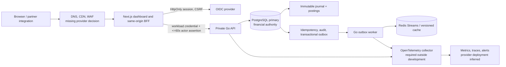

# LedgerSync architecture assessment and target design

**Date:** 2026-08-24  
**Decision:** incrementally improve; do not re-architect into Nike-scale microservices.  
**Scope:** repository evidence as of this review. Nike is used only as a pattern
library for large global digital platforms; no claim is made about Nike's
internal implementation because no source reference was supplied.

## Evidence, assumptions, and limits

| Classification | Basis |
|---|---|
| **Confirmed** | Go API and outbox worker, Next.js BFF, PostgreSQL migrations, Redis Streams/cache adapters, OIDC/BFF assertion code, OpenAPI, Compose, CI, tests, runbooks, and release evidence in this repository. |
| **Reasonable inference** | Initial market is a small design-partner pilot for closed-loop, same-currency ledger transfers; a single region and managed cloud services are the right launch shape. |
| **Missing** | Real traffic distribution, cloud account/provider, legal jurisdiction, approved currency/limits, data-retention schedule, target RPO/RTO, integration partners, budget, and actual production telemetry. |
| **Not asserted** | Nike technology choices, Nike service boundaries, or Nike performance characteristics. |

### Working business assumptions

The target buyer is a fintech or vertical-SaaS team embedding internal account
balances. The initial team is small, launch is one jurisdiction/currency, and
the MVP does not move money over bank/payment rails. These assumptions must be
revalidated before changing the architecture.

## 1. Executive verdict

### Health and strategy

LedgerSync is unusually strong for a pre-pilot financial foundation. Its best
choices are exact minor-unit money, immutable double-entry postings, a single
PostgreSQL commit boundary, transactional outbox delivery, and a private
Next.js BFF boundary. This is appropriate for the expected pilot scale and can
grow materially before a service split is justified.

The system is **not yet a production launch**. The remaining risk is primarily
operational and organizational: target-environment controls, partner/legal
approval, measured capacity, real restore evidence, and an explicit process for
releasing or stopping a pilot.

**Recommended strategy: incrementally improve.** Retain the modular Go
financial core and worker. Do not add Kubernetes, Kafka, GraphQL federation,
service mesh, active-active multi-region writes, or a public microservice estate
until evidence creates a specific need.

| Assessment | Current | Expected near-term future |
|---|---|---|
| Suitable for pilot | Yes, after target-environment gates pass | Yes |
| Suitable for 10x ordinary load | Likely, after measured capacity and DB tuning | Yes; scale API/worker horizontally |
| Suitable for 100x campaign spike | Not proven | Add edge/rate controls and measured read scaling first |
| Suitable for payment rails/FX/custody | No; separately specified program | Not a safe incremental extension |

### Strongest decisions

1. PostgreSQL—not Redis or an event stream—is financial authority.
2. Transfer, postings, balance version, idempotency result, audit, and outbox
   are committed atomically.
3. Browser traffic terminates at a same-origin BFF with HttpOnly session,
   CSRF protection, short-lived actor assertion, and private API routing.

### Most important problems

1. **Target-environment evidence is incomplete.** Configuration demands OIDC,
   telemetry, and secrets outside development, but provider-backed backup,
   restore, alert delivery, and pilot measurements are not repository facts.
2. **Legacy demo artifacts remain beside the production path.** Separate
   `backend/`, `dashboard/`, root Compose, and simulation assets create a
   realistic risk of operators starting the wrong topology.
3. **Scalability is designed but unmeasured.** The design has sound mechanisms
   but no observed capacity, DB query plans, cache hit/fallback objectives, or
   traffic-based architecture trigger.

## 2. Current architecture reconstruction

**Confirmed path:** BFF → private API → PostgreSQL, then outbox worker → Redis.
**Missing/inferred path:** DNS/CDN/WAF, managed secret store, production OIDC
tenant, hosted telemetry, backups, deployment control plane, and external
integration endpoints.

## 3. Nike-scale pattern comparison

| Capability | Current LedgerSync | Large digital-platform pattern | Relevant now? | Drawback / action | Priority | Confidence |
|---|---|---|---|---|---|---|
| Edge/CDN/WAF | Not provider-defined | Global edge, WAF, bot controls | Yes, before public access | Select managed edge/WAF; protect BFF, never private API | High | High |
| Frontend composition | One Next.js BFF/dashboard | Many independent experiences/shared components | No federation now | Keep one web app and shared feature modules | Keep | High |
| API design | Private REST JSON/OpenAPI | Gateway/BFF and differentiated APIs | Yes | Keep BFF/private REST split; no GraphQL by default | High | High |
| Identity | OIDC/PKCE, BFF session, actor assertion | Central identity isolated from domains | Yes | Complete real IdP claim mapping and workload identity | High | High |
| Domain boundaries | Modular Go monolith + worker | Domain microservices | Not yet | Enforce package boundaries; split only on independent scaling/ownership | Keep | High |
| Data ownership | PostgreSQL owns ledger/projections | Service-owned data and contracts | Yes | Keep one financial DB transaction; prohibit shared DB by future services | High | High |
| Caching | Redis, version-aware, rebuildable | Aggressive read caching | Yes, bounded | Measure cache effectiveness; cache must never override truth | Medium | High |
| Events | Transactional outbox + Redis Streams | Durable event platform | Yes | Keep Redis Streams until retention/fan-out needs prove otherwise | Medium | High |
| Localization | No implementation evidence | Region/language/catalog localization | No | Defer until market/language requirements exist | Later | High |
| Observability | OTel code, alerts, dashboards, runbooks | Full SLO/incident operation | Yes | Deploy collector, alert receiver, traces, SLO dashboards | High | High |
| Deployment | Docker/Compose/CI | IaC, progressive regional deployment | Yes | Add cloud IaC and immutable deployment promotion | High | Medium |
| Disaster recovery | PITR policy/runbooks | Regionally resilient recovery | Yes | Perform and retain real restore drills before pilot | Critical | High |
| Security | Good app controls/private Compose topology | Edge defense, least privilege | Yes | Add managed secret store, WAF, egress policy, security review | High | High |
| Cost control | Simple architecture | High-scale autonomous estate | Yes | Preserve simplicity; introduce managed services only for pilot controls | High | High |

**Conclusion:** the useful benchmark is disciplined boundaries, identity,
observability, edge protection, and measured scaling—not service count.

## 4. Findings register

| ID | Finding and evidence | Impact/failure scenario | Severity / likelihood | Correction and verification |
|---|---|---|---|---|
| F-01 | Production cloud, secret manager, IdP tenant, alert receiver, and backup provider are not defined in code. Config correctly refuses incomplete non-development setup. | A “production-like” environment may lack a real recovery or incident response path. | High / Medium | Select managed services; prove restore, alerts, and OIDC in target environment. Verify release-evidence workflow plus drill artifacts. |
| F-02 | Legacy demo services, root Compose, simulation, and dashboard coexist with the production layout. | A developer/operator can deploy insecure/demo topology or confuse it for production. | High / Medium | Archive and label legacy assets; make production entry points unmistakable; CI deny legacy deployment. Verify clean onboarding command. |
| F-03 | Capacity figures are targets, not measured production results. | Lock contention, DB pools, outbox lag, or BFF saturation surface during a partner spike. | High / Medium | Establish load baselines, query plans, pool limits, SLOs, and shedding thresholds. Verify 10/25/50 TPS scenarios. |
| F-04 | Redis Streams is appropriate for current cache projection but limited for independent long-retention consumers. | Future consumers compete for one stream or replay/retention becomes operationally unsafe. | Medium / Low | Keep current model; define a Kafka/NATS decision trigger. Verify only after requirement exists. |
| F-05 | Actor-assertion replay guard is in memory in the API bootstrap. | A horizontally scaled API may not share replay prevention across instances. Short lifetime limits risk, but replay detection is not fleet-wide. | Medium / Low | Either document accepted bounded risk for trusted BFF/private network or use Redis/shared replay storage when horizontally scaling. Verify cross-instance replay test. |
| F-06 | Public edge/DDoS/bot posture is not evidenced. | Credential abuse or request floods consume BFF/API capacity. | Medium / Medium | Configure CDN/WAF, identity/IP rate limits, request budgets, and egress restrictions. Verify edge rules in staging. |
| F-07 | Pilot legal jurisdiction, currency, retention, and customer ownership remain decisions, not implementation facts. | Product could exceed approved financial or privacy scope. | High / Medium | Complete decision register and legal review before partner access. Verify signed go/no-go record. |
| F-08 | Financial truth includes mutable balance projections alongside immutable postings. | A bad migration or operator repair could make displayed balances inconsistent. | Medium / Low | Preserve DB protections, reconciliation, compensating entries, and restore checks. Verify zero mismatch and no direct DML privilege. |

All corrections are incremental. None require a financial data rewrite. Rollback is
feature/config rollback plus migration-compatible application deployment; ledger
corrections always use new compensating entries.

## 5. Target architecture

| Component | Responsibility / data | Interfaces and events | Scale/failure/security/deployment |
|---|---|---|---|
| Edge | DNS, TLS, CDN for static web, WAF/bot and request controls | HTTPS to BFF only | Managed multi-AZ; deny direct origin; provider IaC; rate/geo policy |
| Next.js BFF | UI rendering, OIDC callback/session, CSRF, request validation, private API proxy | Same-origin REST to browser; actor assertion upstream | Horizontally scale; 8s upstream timeout; no financial authority; deploy stateless containers |
| Go Transfer Core | Authorization, transfer command, balance/history, reconciliation queries | Private REST/OpenAPI; emits outbox rows | Horizontally scale against primary; short DB transactions; private network/workload identity |
| PostgreSQL | Accounts, owners, transfer outcome, immutable ledger, projection, idempotency, audit, outbox | SQL only through repositories | Managed HA/PITR; encrypted; least-privilege roles; primary is authoritative |
| Outbox worker | Lease/publish/retry committed events; rebuildable projection delivery | Consumes outbox; publishes Redis Streams/cache | Independently scale by lag; retry/backoff/dead-event alarms; no browser ingress |
| Redis | Stream transport and versioned cache | At-least-once events, cache reads | Disposable; loss falls back to PostgreSQL; private/authenticated/encrypted |
| OTel/metrics | Correlated traces, SLO metrics, alert signals | OTLP to collector; alert receiver | Managed/isolated; redact financial/PII fields; retention policy |
| Operator controls | Authorized reconciliation and evidence views | BFF/API routes | Separate scopes/audit; no direct DB/Redis access |

**Retain:** Go modular monolith, worker, Postgres, Redis, Next.js BFF, OIDC.
**Modify:** deploy to a defined managed-cloud landing zone; make legacy/demo
paths non-deployable; use shared replay defense when replicas require it.
**Do not add yet:** microservices, GraphQL federation, Kafka, Kubernetes, mesh,
multi-region writes, bank rail adapters, or a read replica.

## 6. API and identity design

Keep REST because LedgerSync has a narrow, command-oriented contract with
financially meaningful error semantics. GraphQL adds caching/authorization and
query-cost complexity without an evidenced client need.

| Route family | Rules |
|---|---|
| `GET /api/me/accounts` | caller-owned accounts only; cursor/page limit; no cache marked current without version proof |
| `GET /api/accounts/{id}/balance` | object authorization; optional signed minimum-version requirement; truthful `503` when unmet |
| `GET /api/accounts/{id}/transactions` | cursor pagination, immutable history, bounded filters |
| `POST /api/transfers` | `Idempotency-Key`, CSRF at BFF, exact decimal string input, canonical fingerprint, 201 final outcome/replay |
| `GET /api/transfers/{id}` and reconciliation routes | authorized investigation only; sanitized evidence; no cross-tenant discovery |

Use authorization-code-with-PKCE for users, HttpOnly secure sessions, managed
workload identity BFF→API, 60-second signed actor assertions, scope checks and
database-level tenant/subject predicates. Maintain stable JSON error envelopes,
bounded request bodies, 8-second BFF upstream timeout, limited retries only for
known safe internal DB errors, and signed webhooks if/when integrations exist.

## 7. Data and event design

| Domain | System of record / consistency / cache | Event and recovery |
|---|---|---|
| Ledger and transfer | PostgreSQL; atomic, strong consistency; encrypted backups; high-sensitivity financial data | Outbox written in same transaction; duplicate delivery harmless by event/version id |
| Balance projection | PostgreSQL projection updated atomically; Redis versioned cache only | Cache accepts monotonic versions; primary fallback/rebuild after Redis loss |
| Idempotency | PostgreSQL keyed by tenant/actor/operation/key and request hash | Saves final response; duplicate key mismatch is conflict; never TTL away before business/support policy allows |
| Audit | PostgreSQL append-only sanitized metadata | No raw balances/tokens/PII; retention decided by legal/privacy owner |
| Reconciliation evidence | PostgreSQL durable run/result data | Alert and investigation reference on mismatch; no automatic ledger mutation |

Never allow a new service to write the ledger database directly. A future
independent domain consumes explicit events or uses a private contract. Avoid
dual writes: create a DB record and outbox event in one transaction, then retry
delivery idempotently with a dead-event investigation path.

## 8. Performance and resilience model

| Scenario | Expected behavior | Controls required |
|---|---|---|
| Normal load | Short primary transactions; cache reads when version sufficient | connection pools, indexed ownership/transfer queries, telemetry |
| 10x load | API/worker replicas increase; Postgres becomes constraining resource | load test, pool caps, queue-lag alert, rate limits |
| 100x campaign spike | Reject/defer nonessential reads before DB overload; no integrity bypass | edge WAF/rate limits, load shedding, static CDN, pre-scale, partner quotas |
| Partial regional failure | Single-region launch favors restore/failover over active-active writes | managed regional HA, RPO/RTO drill, status communications |
| Cache failure | Primary reads remain correct; cache rebuilds | bounded fallback, cache circuit metrics, no cache-as-truth |
| DB throttling | Shed noncritical investigations; commands return truthful temporary errors | pool/timeout limits, backpressure, retry only safe serialization failures |
| Worker backlog | Financial commits continue; visibility may use primary fallback | lease/retry, backlog threshold, worker scaling, dead-event review |
| IdP/third-party outage | New sessions/integration calls fail closed; existing bounded session behavior follows policy | clear UX, circuit timeout, no fake success |

Define observed SLOs only after baseline: proposed pilot targets are transfer p95
<500 ms, balance p95 <200 ms, RPO <=5 minutes, RTO <=60 minutes, zero RYEW
violations, and zero unexplained reconciliation mismatches.

## 9. Security and privacy review

The main trust boundaries are Browser→BFF, BFF→private API, API/worker→data,
and operator→evidence. Existing controls are good; the deployment controls
below close the remaining gap:

- Place only edge/BFF on public ingress; private API, worker, Postgres, Redis,
  collector, and diagnostics have no public route.
- Use managed KMS/secret manager, workload identity, short rotation overlap,
  egress allowlists, non-root/read-only containers where compatible, image
  pinning, SBOM/provenance, secret/SCA/IaC/container gates.
- Classify account identifiers, transfer IDs and balances as sensitive business
  data; treat subject identifiers as personal data where applicable. Encrypt in
  transit/at rest, redact logs/traces, set a legal retention schedule, and
  document delete/export behavior without deleting immutable financial evidence
  illegally.
- Keep admin/break-glass operations scope-gated, audited, time-bounded and
  reviewed. Add WAF/bot rules before public partner access.

## 10. Migration plan

| Phase | Changes / acceptance / rollback / benefit |
|---|---|
| 0: measure and safety | Inventory live topology; choose cloud/IdP/secrets/edge; block legacy deployment; baseline load/DB plans. **Accept:** target architecture and owners approved. **Rollback:** no financial data change. **Benefit:** prevents wrong-environment launch. |
| 1: high-impact corrections | Managed secrets, OIDC claim mapping, private networking, WAF/rate limits, alert receiver, restore drill. **Accept:** security, restore, reconciliation and RYEW evidence. **Rollback:** config/version rollback, revoke credentials. **Benefit:** pilot safety. |
| 2: structural improvements | IaC, deployment promotion, environment isolation, shared actor-assertion replay guard if replicas need it, operational dashboards. **Accept:** reproducible staging and incident drill. **Rollback:** blue/green app deploy; compatible migrations. **Benefit:** repeatable delivery. |
| 3: scale/resilience | Measured API/worker scaling, quotas, query tuning, selective read replica or durable event platform only if triggers met. **Accept:** agreed load SLOs. **Rollback:** remove consumer/replica from read path; primary remains authority. **Benefit:** predictable growth. |
| 4: legacy removal | Archive/delete deployable demo paths after migration guide and CI guard are proven. **Accept:** no production pipeline references legacy paths. **Rollback:** archived reference, never an alternate production route. **Benefit:** lower operator error and maintenance cost. |

## 11. Implementation backlog

| Horizon | Objective / done / verification | Effort / risk / prerequisite |
|---|---|---|
| Now | Select target cloud, managed Postgres PITR, secret manager, IdP, edge/WAF, alert receiver, jurisdiction/currency; record owners | M / High / business decisions |
| Now | Make legacy demo entry points non-deployable and label them archived | S / Medium / onboarding review |
| Now | Run target-environment OIDC, restore, reconciliation, RYEW, alert-delivery and access-control drills | M / High / cloud environment |
| Next | Codify cloud resources and environment promotion in IaC | M / Medium / platform choice |
| Next | Run 10/25/50 TPS load tests, inspect query plans, set pools/quotas and capacity dashboard | M / Medium / realistic fixtures |
| Next | Add shared actor-assertion replay store if API replicas are enabled | S / Low / scaling decision |
| Later | Add read replica for measured read pressure; retain primary RYEW fallback | M / Medium / metrics threshold |
| Later | Add NATS/Kafka only for multiple durable consumers/retention/replay need | L / High / explicit consumer requirements |
| Do not yet | Kubernetes, mesh, active-active writes, GraphQL federation, FX, rail movement, bank/custody integration | L+ / High / new product/compliance program |

## 12. ADR summaries

1. **Modular monolith over microservices:** retain one financial commit boundary;
   reconsider when teams/domains scale independently with proven isolation needs.
2. **REST over GraphQL:** narrow command/read API, OpenAPI and BFF fit current
   clients; reconsider for multiple diverse read clients with a governed query layer.
3. **Containers over serverless for core/worker:** long-lived pools, controlled
   worker leasing and predictable runtime; serverless remains suitable for
   non-financial scheduled/report jobs if required.
4. **PostgreSQL plus Redis:** Postgres owns money, Redis accelerates/replays
   projections; reconsider event platform only for retention/fan-out evidence.
5. **OIDC/PKCE and BFF sessions:** retain external identity and server-held
   browser session; reconsider only for mandated enterprise SSO/SCIM additions.
6. **Single-region recovery over active-active:** lower consistency risk and
   cost; reconsider after measured availability requirements justify a separately
   designed multi-region ledger program.
7. **Single Next.js experience:** retain shared components and progressive
   rendering; reconsider frontend micro-composition when separately owned
   products block deployment cadence.

## 13. Final prioritization and scoring

### Top five by business value

1. Complete design-partner/legality/currency decisions.
2. Deploy managed Postgres PITR, secret management, IdP, edge and alerting.
3. Complete measured pilot rehearsal and restore/reconciliation evidence.
4. Establish capacity/SLO baseline and partner quotas.
5. Remove/lock down legacy deployment ambiguity.

### Top five by risk reduction

1. Real restore drill and zero-mismatch reconciliation evidence.
2. Private network, managed secrets, workload identity, and WAF.
3. OIDC role/claim mapping and audit review.
4. Load/backpressure tests before partner onboarding.
5. Legacy deployment retirement and runbook-controlled operations.

### Scorecard (1–10)

| Dimension | Current | Target | Why target improves concretely |
|---|---:|---:|---|
| Simplicity | 8 | 8 | Retains modular monolith; cloud controls do not add service sprawl. |
| Reliability | 7 | 9 | Real drills, alerting, IaC, capacity controls close operational gap. |
| Scalability | 6 | 8 | Measured horizontal API/worker scaling, edge limits, DB tuning before new platforms. |
| Security | 7 | 9 | Managed secrets, private ingress, WAF, real IdP and audited operations. |
| Performance | 6 | 8 | Measured budgets/queries/pools and load shedding replace estimates. |
| Maintainability | 7 | 9 | Legacy retirement and reproducible environments reduce ambiguity. |
| Developer experience | 7 | 8 | IaC/promotion and clear single entry point improve repeatability. |
| Observability | 7 | 9 | Hosted telemetry, alert delivery and SLOs make evidence operational. |
| Cost efficiency | 8 | 8 | Managed essentials add cost but avoid premature distributed complexity. |
| Migration feasibility | 8 | 8 | Incremental/configuration-led migration preserves live financial path. |

### 30/90/180-day outcome

- **30 days:** target environment, legal/pilot decision record, secret/IdP/edge,
  restore and rehearsal evidence.
- **90 days:** controlled partner pilot, measured SLO/capacity, IaC and clear
  release controls.
- **180 days:** scaling decisions based on actual demand; read replica/event
  platform only where data proves the need.

### Remaining questions

Which jurisdiction/legal entity and currency are approved? What are peak TPS,
availability/RPO/RTO, retention and privacy obligations? Which cloud/provider
and budget apply? Who owns 24/7 incident response? What external payment or
partner integration is planned, if any?

**Plain-language recommendation:** LedgerSync should become excellent at a
small, safe internal-transfer pilot before it becomes more distributed. The
core financial design is worth preserving. Invest next in real environment
controls, proof, and measured capacity—not in copying the complexity of a
global commerce platform.
