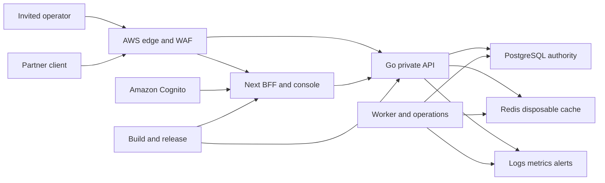

# LedgerSync threat model

## Executive summary

LedgerSync's highest-risk themes are cross-tenant authorization, token confusion at the Cognito/BFF/private-API boundary, corruption or unauthorized mutation of financial truth, public exposure of internal services, and recovery that restores data without restoring provable correctness. The repository has strong controls for exact money, transactional idempotency, append-only double entry, server-side object authorization, rate limiting, truthful cache fallback, and audit evidence. Residual high risk remains in the not-yet-created AWS environment: network policy, Cognito configuration, managed secrets, provider PITR, WAF, and operating response must be proven before partner traffic.

## Scope and assumptions

In scope are the supported root Go API and worker, Next.js BFF/operator console, PostgreSQL schema and repositories, Redis cache/stream adapters, migration/provisioning/reconciliation commands, supported Compose topology, contracts, and CI/release controls. Primary evidence paths include `cmd/`, `internal/`, `web/src/`, `migrations/`, `deploy/`, `contracts/`, and `.github/workflows/`.

The retired predecessor services, dashboard, simulation, setup SQL, legacy Compose topology, and placeholder tests have been removed. Current boundary tests require those paths to remain absent. Historical cleanup reviews remain evidence of the decision; they are not runtime identity or data sources.

Validated context:

- India-only, non-custodial, internal-ledger transfers in INR; no rails, cards, FX, custody, public signup, or consumer wallet.
- Two or three sequential design partners; approximately 30,000 accounts, 10 TPS sustained, 50 TPS burst, and a 100 TPS stress target.
- Internet-facing invite-only console and partner API; all internal workloads and data stores private.
- Amazon Cognito in `ap-south-1`; operator authorization code with PKCE/MFA and partner/BFF client credentials with custom scopes.
- PostgreSQL Multi-AZ authority, disposable Redis, RPO 0/RTO 15 minutes for AZ failure and RPO 5/RTO 60 minutes for corruption/PITR.

Open questions that can still change risk ranking are the final AWS account/organization structure, production DNS names, partner IP stability, named incident/control owners, final counsel opinion, and whether a partner contract flows down additional RBI or sectoral requirements.

## System model

### Primary components

- **Internet edge:** future AWS WAF/CDN/load balancer accepting console and partner HTTPS traffic.
- **Next.js BFF/operator console:** OIDC authorization, HttpOnly session, CSRF/origin enforcement, progressive operator UI, and private-API proxy (`web/src/lib/oidc.ts`, `web/src/lib/session.ts`, `web/src/lib/security.ts`, `web/src/lib/private-api.ts`).
- **Go private API:** bounded HTTP server and authenticated account, balance, history, transfer, and investigation handlers (`cmd/api/main.go`, `internal/transport/http/handlers/`).
- **Financial application/domain:** exact money, transfer authorization, idempotency, ledger posting, RYEW balance reads, reconciliation, and outbox processing (`internal/application/`, `internal/domain/`).
- **PostgreSQL:** authoritative financial, policy, identity mapping, rate-limit, audit, delivery, and reconciliation state (`migrations/`, `internal/platform/db/`).
- **Redis:** disposable versioned balance cache and at-least-once stream transport (`internal/platform/cache/`, `internal/platform/events/`).
- **Operational commands/workers:** migration, outbox delivery, reconciliation, retention, replay, audit, and partner provisioning (`cmd/`).
- **Build/release system:** GitHub Actions for contracts, quality, security, provenance, and release evidence (`.github/workflows/`).

### Data flows and trust boundaries

- Internet operator → edge/BFF: authorization code, PKCE values, session cookie, CSRF token, transfer intent, and investigation queries over HTTPS; OIDC state/nonce, same-origin validation, bounded JSON, security headers, and identity/IP quotas apply.
- Cognito → BFF: signed ID token and discovery/JWKS metadata over HTTPS; issuer, signature, audience, expiry, nonce, and `token_use=id` are validated; subject-to-tenant/roles/scopes comes from server configuration.
- Partner/BFF workload → Go API: OAuth access token over private or edge-routed HTTPS; issuer, signature, expiry, `token_use=access`, `client_id`, resource audience, server client-to-tenant mapping, and route scopes apply.
- BFF → Go API delegated actor: short-lived HMAC actor assertion alongside the BFF access token; issuer, audience, key ID, unique ID, expiry, scope allowlist, and replay guard apply (`internal/platform/identity/bff_assertion.go`).
- Go API → PostgreSQL: exact commands, tenant predicates, locks, posting rows, audit/outbox/evidence, and shared limits over a private encrypted database channel; parameterized SQL, role separation, constraints, and append-only triggers apply.
- API/worker → Redis: versioned balance projections and stream events over a private encrypted channel; Redis is non-authoritative, stale versions are rejected, and reads fall back to PostgreSQL.
- Worker/reconciliation/provisioning → PostgreSQL: privileged operational commands through distinct database roles; immutable evidence, explicit authorization, dry-run/approval, and audit requirements apply.
- Runtime → observability/security operations: bounded redacted metrics, traces, logs, and alerts; tokens, raw balances, unrestricted payloads, and consistency capabilities are prohibited.
- Future privileged administrator → managed identity/tenancy control plane: exact tenant, operator, grant, suspension, revocation, and recovery intents; this boundary is designed in `docs/security/administration-boundary.md` but no browser/private administration API is released.
- CI maintainer/dependency source → release artifact: source, dependencies, containers, SBOM, attestations, and deployment definitions; protected review and security gates are expected.

#### Diagram

## Assets and security objectives

| Asset | Why it matters | Security objective (C/I/A) |
|---|---|---|
| Ledger postings and journals | Permanent proof of every movement | I, A |
| Balance projections and versions | Customer-visible exact balances and RYEW guarantees | I, A |
| Idempotency outcomes | Prevent duplicate movement after retries/lost responses | I, A |
| Tenant/account authorization | Prevent cross-tenant disclosure or movement | C, I |
| Cognito sessions, app clients, and assertion keys | Establish human/workload identity and delegation | C, I, A |
| Transfer policy and velocity state | Bound fraud, mistakes, and compromised clients | I, A |
| Audit, delivery, and reconciliation evidence | Support investigation, compliance, and truthful status | I, A |
| PostgreSQL backups and recovery evidence | Restore financial truth after failure or operator error | C, I, A |
| Personal/support metadata | DPDP and contractual privacy exposure | C, I |
| Tenant, operator, grant, revocation, and recovery administration evidence | A compromised control plane can expose tenants or create durable privilege | C, I, A |
| Release artifacts and migrations | A compromised build/schema can subvert every runtime control | I, A |

## Attacker model

### Capabilities

- Remote unauthenticated callers can reach the public edge, send malformed or high-rate HTTP requests, and attempt OAuth/OIDC protocol abuse.
- A legitimate partner client or operator may be malicious, compromised, over-scoped, or attempt cross-tenant/object access.
- An attacker may steal a session, app-client secret, workload token, assertion key, database credential, or CI credential.
- A malicious or mistaken operator may change policy, provision incorrect access, corrupt data, or restore the wrong point in time.
- Attackers may exploit dependency, image, build, logging, cache, or availability weaknesses.

### Non-capabilities

- The model does not assume direct access to AWS control-plane credentials, database-owner credentials, source-control administration, or physical infrastructure unless one of those credentials is compromised.
- External settlement, cardholder data, bank credentials, FX, and custody attacks are out of scope because those capabilities are explicitly excluded from the pilot.
- Redis compromise alone cannot authoritatively change financial truth, although it can affect availability and attempt to mislead readers.

## Entry points and attack surfaces

| Surface | How reached | Trust boundary | Notes | Evidence (repo path / symbol) |
|---|---|---|---|---|
| OIDC authorize/callback | Internet browser | Operator → Cognito/BFF | PKCE, state, nonce, issuer/audience and server subject mapping | `web/src/lib/oidc.ts` |
| Same-origin BFF routes | Session-authenticated browser | Browser → BFF | CSRF/origin, bounded JSON, no-store responses | `web/src/lib/security.ts`, `web/src/app/api/` |
| Partner/private API routes | Bearer access token | Partner/BFF → Go API | Cognito access-token purpose, resource audience, tenant mapping and route scopes | `internal/platform/identity/oidc.go`, `cmd/api/main.go` |
| Actor assertion | BFF header | BFF → private API | Short lifetime, audience, key rotation and replay protection | `internal/platform/identity/bff_assertion.go` |
| Transfer command | `POST /api/transfers` | Authenticated caller → financial transaction | Exact money, object authorization, policy, idempotency and deterministic locks | `internal/platform/db/transfer_repository.go` |
| Account/investigation reads | Protected GET routes | Caller → tenant evidence | Object predicates, safe denial, RYEW and evidence truth | `internal/transport/http/handlers/`, `internal/platform/db/investigation_repository.go` |
| Database roles/schema | Private PostgreSQL | Workload → authority | Parameterized queries, role separation, constraints, append-only triggers | `deploy/postgres/roles.sql`, `migrations/` |
| Redis stream/cache | Private Redis | API/worker → disposable state | Version checks, bounded lifecycle, primary fallback | `internal/platform/cache/`, `internal/platform/events/` |
| Operational commands | Private operator workflow | Privileged operator → authority | Provisioning, replay, retention, reconcile, restore | `cmd/`, `docs/runbooks/` |
| CI and dependencies | Pull request or package/image source | Developer/supplier → artifact | Security scans, SBOM/provenance, contract gates | `.github/workflows/security.yml`, `.github/workflows/quality.yml` |

## Top abuse paths

1. An attacker obtains a valid Cognito token for another app or token type, presents it to LedgerSync, and attempts tenant access. Purpose, `client_id`, resource audience, signature, expiry, server mapping, and route scopes must all agree before access.
2. A compromised BFF workload token calls the private API without a user assertion. The `bff:act-as-user` scope now requires a valid, short-lived, unreplayed actor assertion; otherwise the request fails closed.
3. A compromised operator changes a browser/body tenant or account identifier to debit another tenant. Handlers derive tenant/actor from verified identity and repositories apply tenant/account predicates and destination authorization.
4. A network timeout occurs after PostgreSQL commits and a client retries with a new idempotency key. The UI/BFF must preserve the original key and report unknown outcome until the saved result is replayed.
5. A stolen API database credential attempts to edit postings, final transfers, audit, or reconciliation evidence. Database grants and triggers deny runtime mutation; break-glass use remains exceptional and audited.
6. An attacker floods transfer requests to exhaust PostgreSQL locks or exploit rolling-limit races. Edge quotas and shared route limits reduce load; policy and velocity checks serialize inside the financial transaction.
7. An attacker poisons Redis with an old or fabricated balance. Version-aware cache logic rejects older values and requirement-bearing reads use bounded primary fallback or truthful unavailability.
8. An operator restores an apparently healthy database to the wrong time and reopens writes. The recovery gate requires isolated PITR, Redis rebuild, reconciliation, and explicit approval before reopening.
9. A token, raw balance, or personal identifier leaks through logs/support exports. Redacted structured telemetry and data-minimizing audit metadata reduce exposure; managed-environment sink policies and retention still require proof.
10. A compromised dependency or CI identity publishes a malicious API/web image or migration. Review, scans, SBOM/provenance and protected artifact promotion must prevent unverified deployment.
11. An ordinary or compromised operator probes `/admin`, search, errors, timing, counts, or exports to enumerate other tenants or hidden identity records. Until the managed boundary is accepted, `/admin` remains equivalent to a missing route; the future boundary requires exact lookup, tenant predicates, shared limits, and indistinguishable denial.
12. A tenant administrator grants themselves or a collaborator privileged scopes, reactivates a tenant, or combines approval and execution. The proposed policy requires exact before/after grants, recent MFA step-up, independent approval, a different executor, immutable audit, and fail-closed concurrency.
13. An attacker abuses a recovery account or break-glass workflow to obtain standing access or bypass revocation. Recovery identities must be disabled by default, case- and time-bound, two-person activated, monitored, automatically expired, and invalidated after use.

## Threat model table

| Threat ID | Threat source | Prerequisites | Threat action | Impact | Impacted assets | Existing controls (evidence) | Gaps | Recommended mitigations | Detection ideas | Likelihood | Impact severity | Priority |
|---|---|---|---|---|---|---|---|---|---|---|---|---|
| TM-001 | Compromised/malicious identity | Valid token/session or mapping mistake | Cross tenant/account access or transfer | Unauthorized disclosure or movement | Authorization, ledger, personal data | Server subject/client mapping; actor assertion; tenant predicates; negative tests (`web/src/lib/oidc.ts`, `internal/platform/identity/`, `tests/integration/account_authorization_test.go`) | Managed Cognito and mapping-change approval unproven | Store mappings in audited provisioning data, enforce two-person approval, test every client/subject/tenant combination | Cross-tenant denials, mapping changes, unusual account enumeration | Medium | High | High |
| TM-002 | Remote token attacker | Token issued for wrong client/resource/type | Token substitution/confusion | Authentication bypass | Identity, tenant data | Issuer/signature/expiry plus token-use, client ID, resource audience and scope validation (`internal/platform/identity/oidc.go`) | Real Cognito conformance test pending | Deploy separate app clients; require resource binding; run real-token allow/deny matrix; revoke unused clients | Invalid token-use/audience/client metrics without raw tokens | Low | High | Medium |
| TM-003 | Client/network failure | Response lost after commit | Retry creates duplicate intent | Duplicate financial movement | Ledger, balances, idempotency | Atomic idempotency reservation/outcome; same-key UI retry; unknown-outcome response (`internal/application/transfers/`, `web/src/app/api/transfers/route.ts`) | Partner SDK guidance/evidence pending | Provide generated examples; require 30-day retention; alert changed-intent conflicts | Duplicate-key replay rate, conflict rate, invariant alarms | Low | High | Medium |
| TM-004 | Stolen DB/workload credential | Access to private database path | Mutate/delete financial evidence | Undetectable corruption | Ledger, audit, reconciliation | Least-privilege roles, constraints and append-only triggers (`deploy/postgres/roles.sql`, `migrations/000009_pilot_security_controls.up.sql`) | AWS IAM/secrets/network proof pending | TLS verification, IAM/short-lived auth where supported, rotation, private SGs, audited break-glass, periodic privilege test | Denied DML, role grants, break-glass use, invariant failures | Low | High | High |
| TM-005 | Internet attacker | Internal service accidentally public | Reach API/DB/Redis/admin directly | Data theft, corruption, DoS | All runtime assets | Supported Compose has internal network and only loopback web port (`deploy/compose/docker-compose.yml`) | Production IaC does not yet exist | Phase 2 IaC with WAF, private subnets, SG assertions, no public IPs, reachability tests and external scan | AWS Config/Security Hub, VPC flow anomalies, public-resource alerts | Medium | High | High |
| TM-006 | High-rate or compromised tenant | Public API access | Exhaust pools/locks or bypass velocity | Availability loss or excessive movement | API, PostgreSQL, policy | Shared PostgreSQL rate windows, request bounds, tenant/actor/source velocity in transaction (`internal/platform/db/rate_limit_repository.go`, `internal/platform/db/transfer_repository.go`) | Edge quotas and 100 TPS evidence pending | WAF quotas, per-client budgets, pool/lock dashboards, load/fault tests with hot tenants | 429s, lock waits, pool saturation, policy denials, latency burn | Medium | Medium | Medium |
| TM-007 | Cache/event attacker or fault | Redis access or delayed worker | Serve stale/fabricated current balance | Misleading financial display | Balance projections, customer trust | PostgreSQL authority, signed requirements, version compare and primary fallback (`internal/application/accounts/balance.go`, `internal/platform/cache/`) | Managed Redis TLS/auth/failure evidence pending | Private encrypted Redis, credential rotation, stale/fallback SLOs, regular rebuild drill | RYEW violations, fallback rate, rejected old versions, cache rebuild result | Low | High | Medium |
| TM-008 | Operator/backup failure | Wrong PITR point or corrupt backup | Reopen writes on incomplete state | Missing/duplicated obligations and bad balances | All financial/evidence assets | Restore/reconciliation runbooks and release gates (`docs/runbooks/restore.md`, `.github/workflows/release-evidence.yml`) | No provider-backed restore yet | Isolated RDS PITR drill, achieved RPO/RTO capture, Redis rebuild, reconciliation and dual approval | Backup age, restore job result, mismatch count, reopen-write audit | Medium | High | High |
| TM-009 | Insider/support/log sink | Access to telemetry or exports | Exfiltrate token, PII or raw balances | Privacy and credential compromise | Personal data, identity, balances | Redacted logger/audit policies and tests (`internal/platform/observability/logging.go`, `docs/runbooks/audit-events.md`) | Production sinks/retention/DPDP workflow pending | Field allowlists, India-region sinks, 180-day-or-approved retention policy, access review, DLP sampling | Secret scanners, sensitive-field canaries, unusual log export/access | Medium | Medium | Medium |
| TM-010 | Browser attacker | XSS, CSRF or stolen session | Perform/read operator actions | Tenant disclosure or transfer abuse | Session, tenant data, ledger | HttpOnly/Secure/SameSite cookies, origin/CSRF checks, nonce CSP, PKCE (`web/src/lib/session.ts`, `web/src/lib/security.ts`, `web/src/lib/oidc.ts`) | Real Cognito MFA/browser penetration test pending | Enforce MFA, short sessions, reauthentication for privileged changes, CSP reporting, external test | CSP reports, CSRF failures, impossible session reuse, MFA events | Medium | High | High |
| TM-011 | Supply-chain attacker | Dependency/CI/reviewer compromise | Publish malicious code, image or migration | System-wide compromise | Release artifacts, data, credentials | SCA/secret/container/IaC scans, SBOM/provenance workflows (`.github/workflows/security.yml`) | Branch protection and production promotion not evidenced | Protected environments, pinned actions/images, signed artifacts, two-person migration review, keyless attestations | Unverified artifact denial, dependency drift, workflow/config changes | Low | High | Medium |
| TM-012 | Ordinary, compromised, or cross-tenant operator | Can probe routes, filters, errors, timing, or exports | Enumerate hidden tenants, operators, invitations, grants, or administrator ownership | Privacy breach and targeted privilege attack | Tenant/operator administration evidence | `/admin` is non-disclosing and navigation capability is hard-disabled (`web/src/app/admin/page.tsx`, `web/src/features/console/capabilities.ts`) | Managed administration APIs, shared limits, and timing/error review do not exist | Preserve missing-route behavior until M11/M12; require exact lookup, tenant predicates, indistinguishable denial, bounded exports, and external testing | Repeated denied exact lookups, cross-tenant predicates, export probes, source-risk anomalies | Medium | High | High |
| TM-013 | Malicious or compromised administrator | Privileged managed identity or mapping authority | Self-grant, collusive grant, stale approval reuse, or unauthorized tenant reactivation | Durable privilege escalation and possible tenant/financial compromise | Authorization, tenant lifecycle, audit evidence | Proposed four-eyes and state-machine contract (`docs/security/administration-boundary.md`) | No managed schema, API, MFA proof, or external acceptance | Different requester/approver/executor, recent MFA, exact grant digest, approval expiry, serializable transitions, atomic append-only audit | Self-targeting requests, grant deltas, repeated conflicts, privileged reactivation, unusual scope combinations | Medium | High | High |
| TM-014 | Insider or stolen recovery identity | Recovery/break-glass activation path | Convert temporary recovery into standing access, bypass revocation, or suppress evidence | Broad tenant/control-plane compromise | Identity, administration evidence, financial availability | NOLOGIN/time-bound break-glass policy and proposed recovery separation (`docs/security/tenant-role-and-limit-policy.md`, `docs/security/administration-boundary.md`) | Production owner, KMS/secrets, alerts, automatic expiry, and drills are unproven | Case-bound two-person activation, narrow expiry, live paging, automatic revocation, post-use invalidation and review | Recovery activation, expiry failure, after-hours use, access after revocation, missing retrospective | Low | High | High |

## Criticality calibration

- **Critical:** credible path to unauthenticated or broad cross-tenant financial mutation, systemic ledger corruption without reliable detection, or compromise of signing/database-owner/production-control credentials. Examples: public unauthenticated transfer route; ability to delete postings; malicious production image with database-owner access.
- **High:** realistic path to one-tenant unauthorized movement/disclosure, prolonged inability to prove balances, or recovery that breaches the approved RPO/RTO. Examples: client-to-tenant mapping bypass; public database security group; reopening after an unreconciled restore.
- **Medium:** bounded denial of service, partial/redacted data exposure, stale-cache attempt caught by fallback, or a control gap requiring a valid low-privilege identity. Examples: hot-tenant pool exhaustion; unknown scopes correctly dropped; logging metadata beyond the approved allowlist.
- **Low:** noisy failures with no financial-authority impact and easy containment. Examples: unauthenticated health probing with no dependency detail; malformed cursor rejection; failed access to a diagnostics profile that is not deployed.

## Focus paths for security review

| Path | Why it matters | Related Threat IDs |
|---|---|---|
| `web/src/lib/oidc.ts` | Operator PKCE callback, token-purpose validation, and subject authorization mapping | TM-001, TM-002, TM-010 |
| `web/src/lib/session.ts` | Browser session integrity, expiry, and cookie controls | TM-010 |
| `web/src/lib/security.ts` | CSP, HSTS, origin/CSRF, and request bounding | TM-006, TM-010 |
| `web/src/lib/workload-credential.ts` | Production workload-token rotation and static-token refusal | TM-001, TM-002 |
| `internal/platform/identity/` | Cognito access tokens, scopes, client mapping, actor delegation, and replay | TM-001, TM-002 |
| `internal/platform/db/transfer_repository.go` | Atomic authorization, policy, idempotency, locks, ledger, and audit write path | TM-001, TM-003, TM-006 |
| `internal/platform/db/reconciliation_repository.go` | Positive evidence that projections and postings agree | TM-004, TM-008 |
| `migrations/` | Integrity constraints, append-only enforcement, indexes, and migration compatibility | TM-004, TM-008, TM-011 |
| `deploy/postgres/roles.sql` | Blast-radius boundary for compromised workloads | TM-004 |
| `deploy/compose/` and future `deploy/aws/` | Public/private network and service configuration boundary | TM-005, TM-007, TM-008 |
| `cmd/provision-partner/` | Privileged tenant, policy, account, permission, and credential-reference creation | TM-001, TM-004 |
| `web/src/app/admin/page.tsx` and future administration routes | Current non-disclosure gate and future privileged tenant/operator control plane | TM-012, TM-013, TM-014 |
| `docs/security/administration-boundary.md` | Proposed personas, lifecycles, four-eyes, audit, export, and unblock evidence | TM-012, TM-013, TM-014 |
| `.github/workflows/` | Security gates and artifact trust chain | TM-011 |
